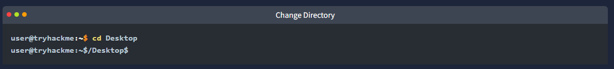
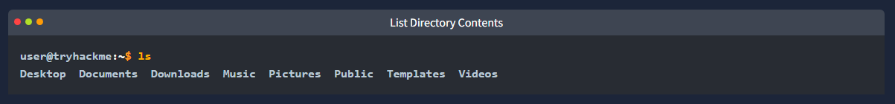
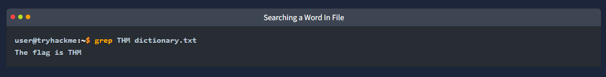
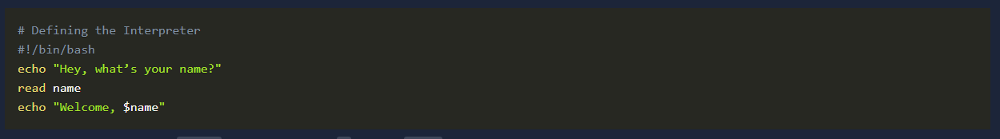
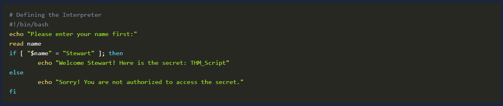
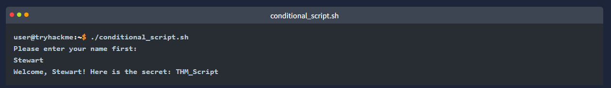
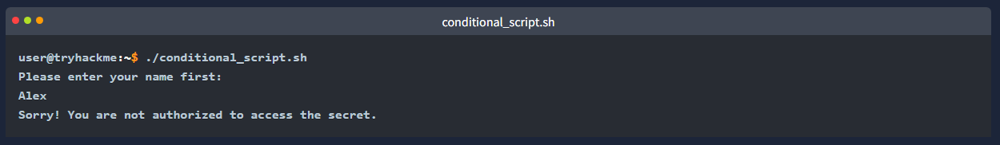
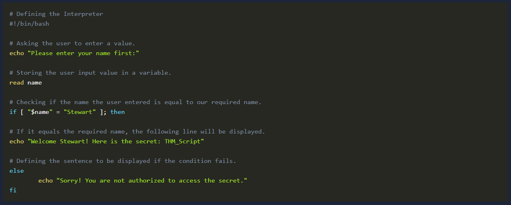
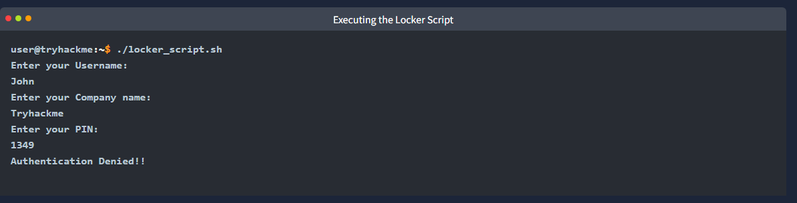

Introduction
- as regular users of os we all extensively use the GUI to carry out most operations
- it takes a few clicks on different options and your task is done
- however you can perform almost every task by writing commands in the CLI on your os rather than using the GUI
- the shells give you some great features for the commands you write in your CLI
- this way of interacting with the OS is more efficent and resource-friendly

- suppose you are in a restaurant and have two options for your food
- the first option is to order food from the menu, and the waiter will serve it
- the second option is to cook your desired dish yourself in the kitchen
- in terms of a Linux system, the kitchen here is the OS, and using the GUI of the OS is just like ordering the food from the menu, and the waiter will serve it for you
- however, using the CLI means you would have to go to the kitchen (OS) and cook your desired food
- in this example, Shell would help you cook your desired dish by giving you some recipe suggestions
- using CLI to perform operations in a Linux system gives you more power and control while carrying out the tasks

- you may have seen hacking scenes in movies that show cool terminals with many commands getting executed
- this is because most linux users prefer to perform operations by writing commands on the CLI using shells instead of using the GUI
- this room will teach us how to interact with a Linux shell
- we will also explore the different shells available in Linux and write some shell scripts in the end

Learning Objectives
- learn interaction with linux shell
- use basic shell commands
- explore the types of Linux shells available
- write some shell scripts

Who is the facilitator between the user and the OS?
- shell

How to Interact With a Shell?
- most linux distros use Bash (Bourne Again Shell) as their default shell
- however the default shell displayed when you open your terminal depends on your Linux distro

** note ** in the upcoming task we will discuss different types of shells

- you would have already explored the basic Linux commands in the Linux Fundamentals module 
- let's briefly discuss some of the most important ones we use in the shell

- when interacting with a shell, you must be in the directory where you want to perform operations
- by default when you open a shell in most linux distros you will be in your home directory
- to see your current working directory you can execute 'pwd' -> print working directory

- in the results of the above command you can see that your current working directory is /home/ubuntu

- however you can change your directory as well
- to do that you can use 'cd' -> change directory as shown below

- while using the GUI of an os you can see the contents of a directory on the screen
- however when using the shell to see the contents of a directory you must enter the following command
- 'ls' 

- if you want to read the contents of a file, you can type the following command in your shell
- 'cat filename.txt' 

- the grep command is very popular command amongs linux users
- this powerful command can search for any word or pattern inside a file
- suppose you want to search for specific entries in a huge file
- you can use grep command along with the pattern of those entries which will extract then for you
- it also helps you to search for a specific keyword in a big file

- the following terminal shows us how to use the grep command ton search for the word "THM" inside a big text file
- the output displays the specific line of that text file containing this word
- 'grep THM dictionary.txt'

What is the default shell in most Linux distributions?
- bash

Which command utility is used to list down the contents of a directory?
- ls

Which command utility can help you search for anything in a file?
- grep

Types of Linux Shells
- like the command prompt and PowerShell in windows OS
- linux has different types of shells available each with its own features and characteristics
- multiple shells are installed in different linux distros
- to see which shell you are using type the following command
- 'echo $SHELL'

- you can also list down the available shells in your Linux os
- the file /etc/shells contains all the installed shells on a Linux system
- you can list down the available shells in your Linux OS by typing 'cat /etc/shells'

- to switch between these shells you can type the shell name that is present on your os and it will open for you
- 'zsh'

- if you want to permanently change your default shell
- you can use the command 'chsh -s /usr/bin/zsh' 
- this will make this shell the default shell in your terminal

- there are many Linux shells
- we will discuss a few and their features

Bourne Again Shell
- bourne again shell (Bash) is the default shell for most linux distros
- when you open the terminal bash is present for you to enter commands
- before bash some shells like sh, ksh, and csh had different capabilities
- bash came as an enhanced replacement for these shells borrowing capabilites from all of them
- this mean that it has many of the features of these old shells and some of its unique abilities
- some of the key features provided by bash are listed below:

- bash is a widely used shell with scripting capabilities
- it offers a tab completion feature which means if you are in the middle of typing a command you can press the tab key
- it will automatically complete the command based on a possible match or give you multiple suggestions for completing it
- bash keeps a history file and logs all your commands 
- you can use the up and down arrow keys to use the previous commands without typing them again
- you can also type 'history' to display all your previous commands

Friendly Interactive Shell
- friendly interactive shell (Fish) is also not default in most linux distros
- as its name suggests, it focuses more on user-friendliness than other shells
- some of the key features provided by fish are

- it offers a very simple synta, which is feasible for beginner users
- unlike bash it has auto spell correction for the commands you write
- you can customise the command prompt with some cool themes using fish
- the syntax highlighting feature of fish colours different parts of a command based on their roles
- which can improve the readability of commands
- it can also help us to spot erros with their unique colours
- fish also provides scripting, tab completion and command history functionality like the shells mentioned in this task

Z Shell
- z shell (zsh) is not installed by default in most linux distros
- it is considered a modern shell that combines the functionalities of some prev shells
- some of the key features provided by zsh are

- zsh provides advanced tab completion and is also capable of writing scripts
- just like fish it also provides auto spell correction for the commands
- it offers extensive customisation that may make it slower than other shells
- it also provides tab completion, command history functionality and several other features

- selecting the best linux shell depends on your usage and its features
- the shells discussed in this task are some of the many different shells available in Linux
- you can compare the features of these different shells and choose the best one based on your tasks

Which shell comes with syntax highlighting as an out-of-the-box feature?
- fish

Which shell does not have auto spell correction?
- bash

Which command displays all the previously executed commands of the current session?
- history

Shell Scripting and Components
- a shell script is nothing but a set of commands
- suppose a repetitive task requires you to enter multiple commands using a shell
- instead of entering them one after one on every repetition of that task, which may take more of your time, you can combine them into a script
- to execute all of those commands, you will only execute the script, and all the commands will be executed
- all the shells mentioned in the previous taks have scripting capabilities
- scripting helps us to automate taks
- before learning how to write a script
- we need to know that even tho linux shells have scripting capabilities
- this does not mean that you can only make a script using shell
- scripting can be done in various programming languages as well
- however the scope of this room is to cover scripting using a shell

- the first step is to open the terminal and select a shell
- lets go with the bash shell, the default and widely used shell in most distros

- unlike the other commands we type in the shell
- we first need to create a file using any text editor for the script
- the file must be named with an extension '.sh' the default extension for bash scripts
- following terminal shows the script file creation
- 'nano first_script.sh'

- every script should start from shebang
- shebang is a combination of some characters that are added at the beginning of the script
- starting with '#!' followed by the name of the interpreter to use while executing the script
- as we are writing our script in bash lets define it as the interpreter in the shebang
- '#!/bin/bash'

- we are all set to write our first script now
- there are some fundamental building blocks of a script that together make an efficient script
- lets learn and utilise these script constructs to write on script ourselves

Variables
- a variable stores a value inside it
- suppose you need to use some complex values like a URL, a file path etc. several times in your script
- instead of memorising and writing them repeatedly you can store them in a variable and use the variable name wherever you need it

- the script below displays a string on the screen "Hey, whats your name?" 
- this is done by 'echo' command
- the second line of the script contains the code 'read name'
- 'read' is used to take input from the user
- and 'name' is the variable in which the input would be stored
- the last line uses 'echo' to display the welcome to the user, along with its name stored in the variable

- now save the script by pressing 'CTRL + X'
- confirm by pressing 'Y' and then enter
- to execute the script, first we need to make sure that the script has execution permisions
- to give these permissions to the script we can type the following command in our terminal
- 'chmod +x first_script.sh'

- now that the script has execution permissions use './' before the script name to execute it
- we use './' before the script to run rather than typing the script name directly
- because './' tells the shell to execute the file that is present in the current directory
- if you dont define './' before the script name the shell will search the script in the PATH environment variable
- (that contains all the directories except the current one)
- and will not find the defined script in any of those directories and generate an error
- the below terminal shows the script in which we utilised the variables

Loops
- loop as the name suggests is something that is repeating
- for example you have a list of many friends and you want to send them the same message
- instead of sending them individually you can make a loop in your script
- give your friend list list to the loop and the message, and it will send that message to all your friends

- for a general explanation of loops
- lets write a loop that displays all numbers starting from 1 to 10 on the screen
- first create a new file name 'loop_script.sh' then enter the code below
- save with 'CTRL + X' then confirm with 'y' then press enter

- the first line has the variable 'i' that will iterate from 1 to 10 and execute the below code every time
- 'do' indicates the start of the loop code 
- and 'done' indicates the end
- in between them, the code that we want to execute in the loop is to be written
- the for loop will take each number in the brackets and assign it to the variable 'i' in each iteration
- the 'echo $i' will display this variable's value at each iteration

- now lets execute the script after giving it the execution permission
- 'chmod +x loop_script.sh'
- './loop_script.sh'

- the output of the above terminal is cut to '3' numbers only for demonstartion
- however when executed according to the script's logic, it would display the numbers from 1 to 10

Conditional Statements
- conditional statements are an essential part of scripting
- they help you execute a specific code only when a condition is satisfied
- otherwise you can execute another code
- suppose you want to make a script that shows the user a secret 
- however you want it to be shown to only some users
- only to the high-authority user
- you will create a conditional statement that will first ask the user their name
- if the name matches the high authority user's name, it will display the secret

- first create a new file named 'conditional_script.sh' then enter the code below
- save by pressing 'CTRL + X' then confirm with 'y' and press enter

- the above script takes the user's name as input and stores it into a variable
- the conditional statement starts with if and comapres the value of that variable with the string Stewart
- if its a match it will display the secret to the user, or else it will not
- the 'fi' is used to end the condition

- following is the terminal showing the script execution when the user name matches the authorised one defined in the script

- however the following terminal shows the script execution when the user name does not match the authorised one defined in the script

Comments
- sometimes the code can be very lengthy
- in this scenario the code might confuse you when you lok at it after some time or share it with somebody
- an easy way to resolve this problem is to use comments in different parts of the code
- a comment is a sentence that we write in our code just for the sake of understanding
- it is written with a '#' sign followed by a space and the sentence you need to write
- for example lets rewrite te script we discussed in the conditional statement and add comments to it
- open the 'conditional_script.sh' with 'nano' and add these comments starting with a '#' sign
- save your file by 'CTRL + X' then confirm with 'y' and press enter

- see how easy a script looks with comments
- comments dont affect the working of any scripts
- a good script always has some comments
- the example shown above contains a comment for each line
- this is just a better explanation of its concept
- however the best way to include comments is to define them in the major and complex areas of the script

** Note ** other types of variables, loops, and conditional statements can also be used to achieve different taks. moreover multiple lines of comments can also be added within a single comment - however not in the scope of this room.

What is the shebang used in a Bash script?
- #!/bin/bash

Which command gives executable permissions to a script?
- chmod +x

Which scripting functionality helps us configure iterative tasks?
- loops

The Locker Script
- in the previous task we studied variables, loops, and conditional statements in shell scripting
- lets use that knowledege to create a shell script that utilises all these components

Requirement
- a user has a locker in a bank 
- to secure the locker we have to have a script in place that verifies the user before opening it
- when executed the script should ask the user for their name, company name, and PIN
- if the user enters the following details they should be allowed, else they should be denied
- Usernmae: John
- Company name: Tryhackme
- PIN: 7385

Script

Script Execution

What would be the correct PIN to authenticate in the locker script?
- 7385

Practical Exercice
- we have placed a script on the default user directory '/home/user' of the attached ubuntu machine
- this script searches for a specific keyword in all the files (with .log extension) in a specific directory

** note **  some changes are required inside thee script before you can execute it, when you open the machine, you will be able to gain the session as a normal user, however we recommend you to become the root user in order to search for the flag in all the files of the given director. to become one you only need to type the following command and enter the password of the user 

- you can make the changes in the script file by keeping in view the following details
- Flag: thm-flag01-script
- Directory: /var/log

** hint ** look for empty double quotes " " inside the script file and fill them, make sure not to leave any space between them

- then run it ./flag_hunt.sh

- check the authentication.log file 
- cat /var/log/authentication.log

Which file has the keyword?
- authentication.log

Where is the cat sleeping?
- under the table