Introduction
- everyone prefers a GUI until they maserter a CLI (command line interface)
- CLIs usually have a learning curve, once you master it -> find it faster and more efficient

Advantages of CLI
- lower resource usage: requires fewer system resources than graphics intensive GUIs, can run CLI on older hardware or systems with limited memory
- automation: while you can automate GUI tasks, creating a batch file or script with commands you need to repeat is much easier
- remote management: CLI makes it very convenient to use SSH to manage a remote system such as a server, router or an IoT decice. this approach works well on slow network speeds and systems with limited resources.

- purpose of this room is to teach how to use cmd.exe 
- we will learn to
- display basic system info
- check and troubleshoot network config
- manage files and folders
- check running processes

What is the default command line interpreter in the Windows environment?
- cmd.exe

Basic System Information
- before issuing commands..
- we should note that we can only issue the commands within the Windows Path
- you can issue the command 'set' to check your path from the command line
- the terminal output below shows the path where MS Windows will exectute commands as indicated by the line starting with Path=

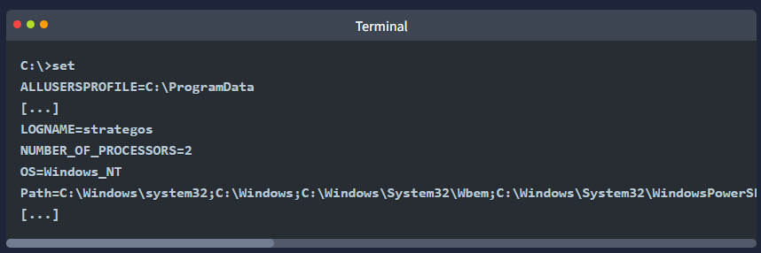

- let's use the 'ver' command to determine the Operating System version

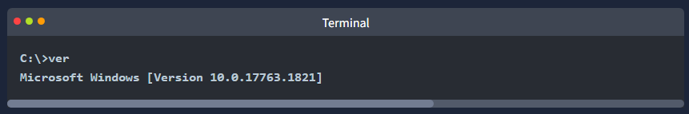

- enough warming up!
- lets disvoer more in-depth information about the systemm
- we can run the 'systemninfo' command to list various info bout the system such as
- OS info, system details, processor and memory

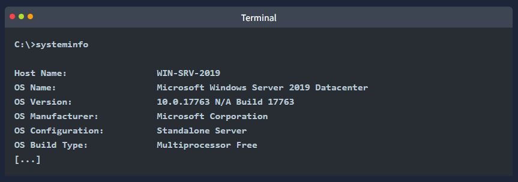

- before moving on its good to mention a couple of tricks
- first you can pipe 'more' if the output is too long
- then you can view it page after page by pressing the space bar 
- to demonstrate this try running 'driverquery' and compare it with running 'driverquery | more' 
- in the latter you can display the output page by page and you can exit it using 'CTRL + C'

- 'help' provides helpful info for a specific command
- 'cls' clears the command prompt screen

What is the OS version of the Windows VM?
- 10.0.20348.2655

What is the hostname of the Windows VM?
- run 'hostname'
- WINSRV2022-CORE

Network Configuration
- you can check your network information using 'ipconfig'
- the terminal output below shows our IP address, subnet mask, and default gateway

- you can also use 'ipconfig /all' for more information about your network config
- in the terminal below we can view our DNS servers and confirm that DHCP is enabled

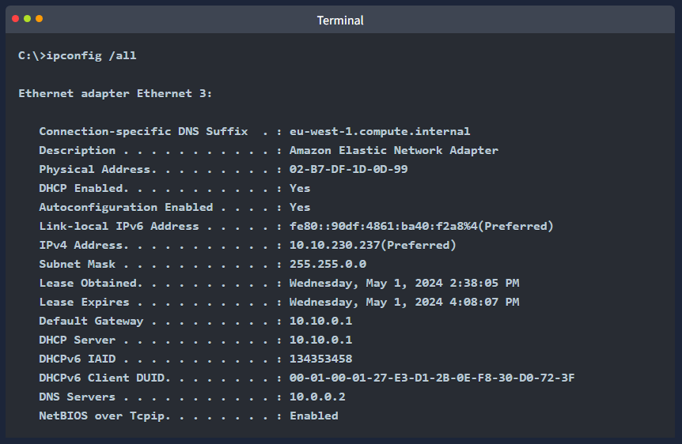

Network Troubleshooting
- one common troubleshooting task is checking if the server can access a particular server on the internet
- the command syntax is 'ping target_name'
- inspired by ping-pong we send a specific ICMP packet and listen for a response
- if a response is receieved we know that we can reach the target and that the target can reach us

- lets find out if we can reach example.com 
- in the terminal output below we can see
- we have successfully receieved four replies
- furthermore we got some statistics, for instance, the average round trip time is 78 milliseconds

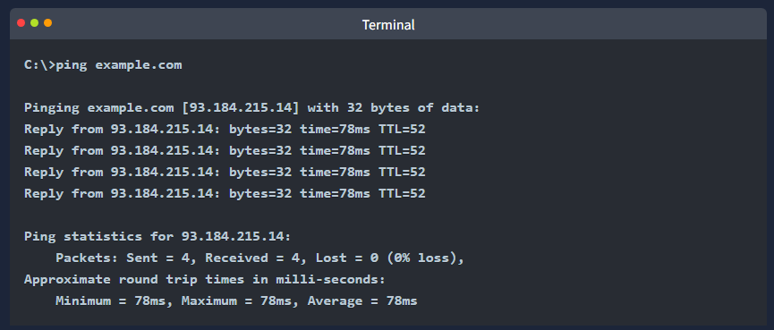

- another valuable tool is 'tracert' which stands for trace route
- the command 'tracert target_name' 
- traces the network route traversed to reach the target
- without getting into more details -> it expects the routers on the path to notify us if they drop a packet because
- its time-to-live (TTL) has reached zero
- the terminal output below shows that we passed through 15 routes before reaching our target

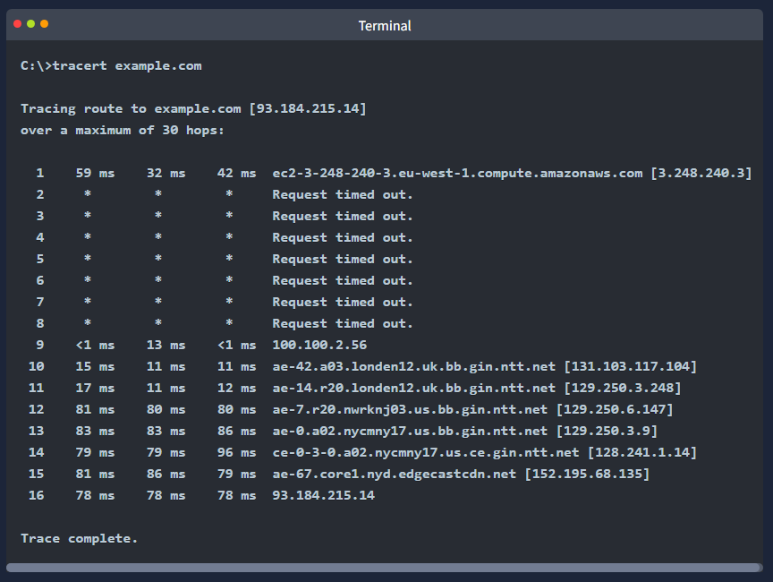

More Networking Commands
- one networking command worth knowing is 'nslookup'
- it looks up a host or domain and returns its IP addr
- the syntax 'nslookup example.com' will look up 'example.com' using the default name server
- however 'nslookup example.com 1.1.1.1' will use the name server one.one.one.one
- the terminal below shows the output of both commands
- the results are identical, however you can see that the answers retrieved were from different name servers

- the final command we will cover in this room is 'netstat'
- this command displays current network connections and listening ports
- a basic 'netstat' command with no args will show you established connections
- as shown below, in this case we only have one SSH connection; we figured out its SSH because its bound to port 22

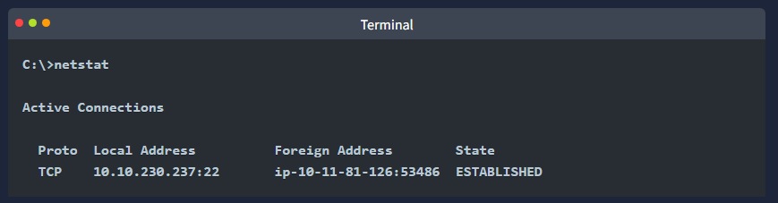

- if you are curious about the other options you can run 'netstat -h' where -h displays the help page
- we opted for the following options:
- '-a' displays all established connections and listening ports
- '-b' shows the program associated with each listening port and established connection
- '-o' reveals the proccess ID (PID) associated with the connection
- '-n' uses a numerical form of addresses and port numbers

- we combine these four options and execute the 'netstat -abon' command
- the result is quite long but we will display the first few lines in the terminal below
- it is clear now that the executable ssh.exe is responsible for listening for incoming connections on port 22
- as shown on the first line
- we can also see the process ID (PID) associated with each connection

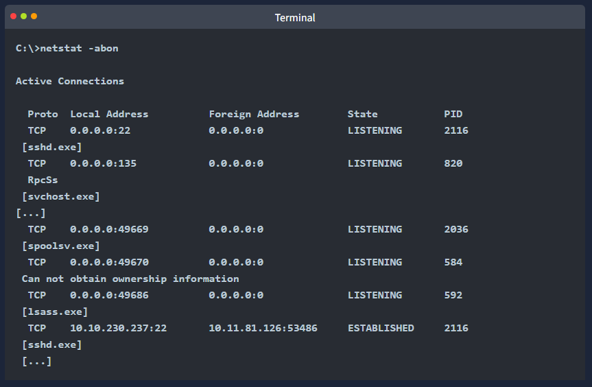

Which command can we use to look up the server’s physical address (MAC address)?
- ipconfig /all

What is the name of the service listening on port 135?
- RpcSs

What is the name of the service listening on port 3389?
- TermService

File and Disk Management
- we have now learned how to look up basic system inforamtion and check the network config
- nowe lets discuss how to browse the directories and move files around

Working with Directories
- you can use the 'cd' without params to display the current drive and directory
- it is equivalent of asking the system where am i?

- you can view the child directories using 'dir'

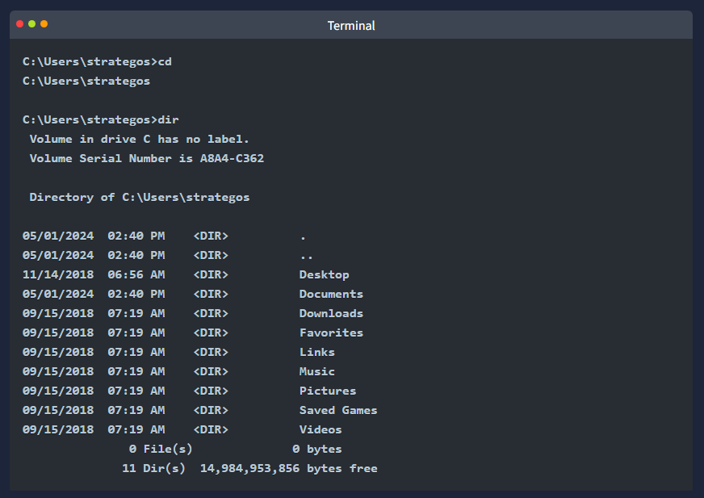 

- note that you can use the following options with 'dir'
- 'dir /a' - displays hidden and system files as well
- 'dir /s' - displays files in the current directory and all subdirectories

- you can type 'tree' to visually represent the child directories and subdirectories

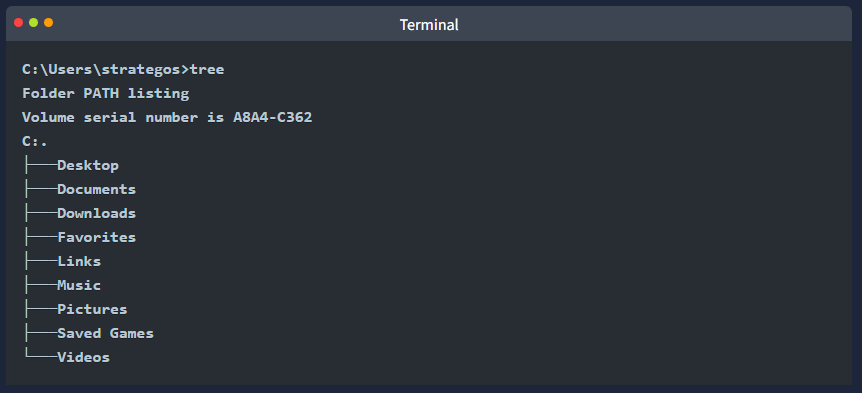

- you can change to any directory by using the command 'cd target_directory'
- this is equivalent to double-clicking target_directory on your Desktop
- furthermore you can use 'cd ..' to go up on level
- example shown below

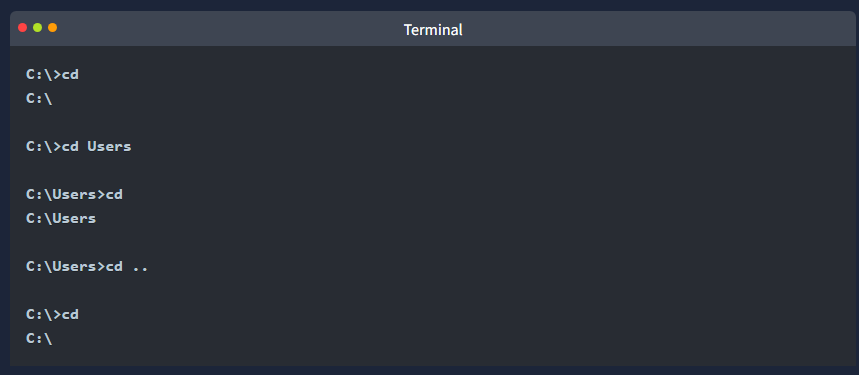

- to create a directory use 'mkdir directory_name'
- 'mkdir' stands for make directory
- to delete a directory use 'rmdir directory_name'
- 'rmdir' stands for remove directory
- the terminal output below shows creating and deleting a directory

Working with Files
- you are working with the command line
- you are curious about the contents of a particular text file
- you can easily view text files with the command 'type'
- this command will dump the contents of the text file on the screen
- this is convenient for files that fit within your terminal window
- you might want to consider 'more' for longer text files
- this command will display enough text file contents to fill your terminal window
- in other words for long text files 'more' will display a single page and wait for you to press spacebar to move by one page or Enter to move by one line
- the 'copy' command allows you to copy files from one location to another
- the following terminal provides an example

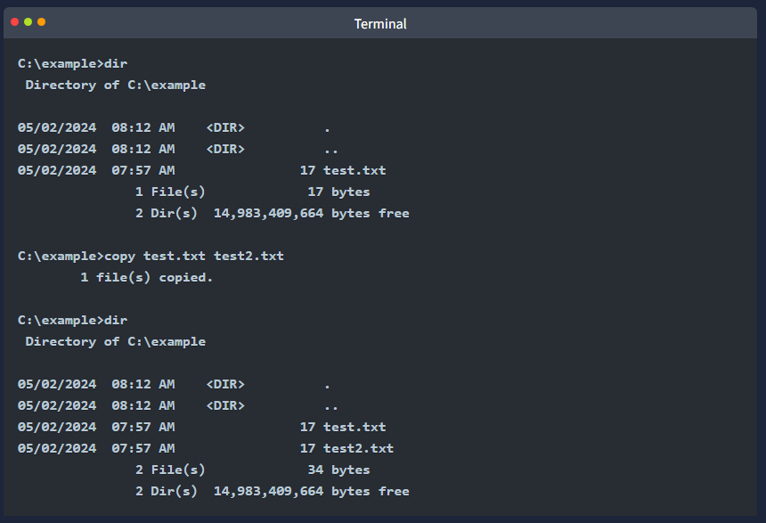

- similarily you can move files using the 'move' command
- an example is shwown in the terminal output below

- finally we can 'del' or 'erase'

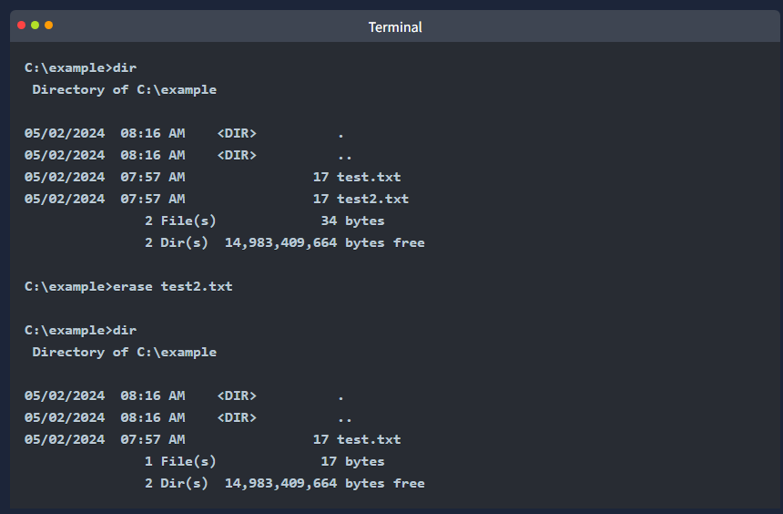

- we can use the wildcard character '*' to refer to multiple files
- for example 'copy *.md C:\Markdown" will copy all files with the extension 'md' into the director C:\Markdown

What are the file’s contents in C:\Treasure\Hunt?
- cd into that directory and 'type flag.txt'
- THM{CLI_POWER}

Task and Process Management
- you must be familiar with the MS Windows Task Manager and might be familiar with killing non-responsive processes
- let's discover how to achieve a similar functionality using the command line
- we can list the running processes 'tasklist'

- some filtering is helpful because the output is expected to be very long
- you can check all available filters by displaying the help page using 'tasklist /?' 
- let's say we want to search for tasks related to sshd.exe 
- we can do that with the command 'tasklist /FI "imagename eq sshd.exe"
- note that '/FI' is used to set the filter image name equal 'sshd.exe'

- with the process ID (PID) we can terminate any task using 'taskkill /PID target_pid'
- for example if we want to kill the process with PID 4567 we would use command 'taskkill /PID 4567'

What command would you use to find the running processes related to notepad.exe?
- tasklist /FI "imagename eq notepad.exe"

What command can you use to kill the process with PID 1516?
- taskkill /PID 1516

Conclusion
- in this room we focused on the most practical commands for accesing a networked system over the command line
- we intentionally omitted a few common commands as we didnt see a real value including them in a beginner room
- we mention some below so that you know the command line can be used for other tasks...
- 'chdsk' - checks the file system and disk volumes for errors and bad sectors
- 'driverquery' - displays a list of installed device drivers
- 'sfc /scannow' - scans system files for corruption and repairs them if possible

- it is important to remember all the commands covered in prev takss 
- moreover it is equally important to know that '/?' can be used with most commands to display a help page

- in this room we used the command 'more' in two ways
- display text files 'more file.txt'
- pipe long output to view it page by page 'some_command | more'

- eqiuipped with this knowledge we now know how to display thr help page of a new command
- and how to display long output one page at a time

The command shutdown /s can shut down a system. What is the command you can use to restart a system?
- shutdown /r

What command can you use to abort a scheduled system shutdown?
- shutdown /a

- i used 'shutdown /?' to find out