Introduction 
- learning objectives
- this is the second room in the Command Line module
- it is an introductory room to PowerSHell the second -- only historically -- command-line utlity built for the Windows operating system
- learn what PowerShell is and its capabilities
- understand the basic structure of PowerShell's language
- learn and run some basic PowerShell commands
- understand PowerShell's many applications in the cyber security industry

What is PowerShell?
- from the ms page: “PowerShell is a cross-platform task automation solution made up of a command-line shell, a scripting language, and a configuration management framework.”

- PowerShell is a powerful tool from ms designed for task automation and config management
- it combines a command-line interface and a scripting language built on the .NET framework
- unlike older text-base command line tools..
- PowerShell is object-oriented which means it can handle complex data types and interact with system components more effectively
- initially exclusive to windows, PowerShell has lately expanded to support macOS and Linux
- making it a versatile option for IT professionals across different operating systems

A Brief History of PowerShell
- developed to overcome the limitations of existing command-line tools and scripting environments in windows
- in the early 200s as windows was increasingly used in complex enterprise environments
- traditional tools like cmd.exe and batch files fell short in automating and managing these systems
- ms needed a tool that could hanld more sophisticated administrative tasks and interact with Windows' modern APIs

- Jeffery Snover a ms engineer, realised that Windows and Unix handled systems operations differently
- Windows used structure data and APIs
- while UNIX treated everything as text files
- this difference made porting Unix tools to Windows impractical
- Snover's solution was to develop an object-oriented approach
- combining scripting simplicity with the power of the .NET framework
- released in 2006 PowerShell allowed admins to automate tasks more effectively by manipulating objects, offering deeper integration with Windows systems

- as IT environments evolved to include various operating systems, the need for a versatile automation tool grew
- in 2016 ms responded by releasing PowerShell Core, an open-source and cross-platform version that runs on Windows, macOS and Linux

The Power in PowerShell
- to fully grasp the power of PowerShell
- we first need to understand what an object is in this context

- in programming an object represents an item with properties (characteristics) and methods (actions) 
- e.g. a 'car' object might have properties like 'Color', 'Mode' and 'FuelLevel' and methods like Drive(), HonkHorn(), and Refuel()

- similarly in PowerShell objects are fundamental units that encapsulate data and functionality
- making it easier to manage and manipulate info
- an object in PowerShell can contain file names, usernames or sizes as data (properties) and carry functions (methods) such as copying a file or stopping a process

- the traditional command shell's basic commands are text-based
- meaning they process and output data as plain text
- instead when a cmdlet (command-let) is run in PowerShell
- it returns objects that retain their properties and methods
- this allows for more powerful and flexible data manipulation since these objects do not require additional parsing of text

- we will explore more about the PowerShells cmdlets and their capabilities in the upcoming sections

What do we call the advanced approach used to develop PowerShell?
- object-oriented

PowerShell Basics
- before continuing on our PowerShell journey
- let's connect to the lab environment

Launching PowerShell
- can be launched in several ways, depending on your needs and environment
- if you are working on a Windows system from the GUI thse are some possible ways to launch it
- 'Start Menu' - type powershell into the start menu search bar then click on Windows Powersgell or PowerShell from the results
- 'Run Dialog' - press Win + R to open the Run dialog, type powershell and hit enter
- 'File Explorer' - navigate to any folder then type powershell in the serarch bar and press Enter, opens PowerShell in that specific directory
- 'Task Manager' - Open the Task Manager go to File > Run new task, type powershell and press enter

- alternatively PowerShell can be launched from a comamnd prompt (cmd.exe) by typing powershell and pressing enter

- in our case we only have access to the target VM's command prompt, this is the method we will use

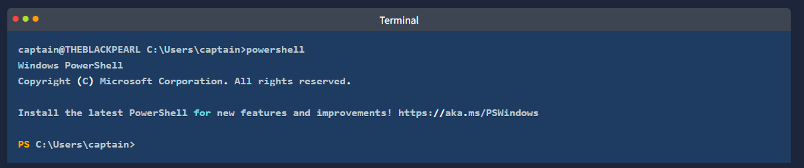

- after PowerShell has launched we're presented with a 'PS' (which stands for PowerShell) prompt in the current working directory

Basic Syntax: Verb-Noun
- as previously mentioned PowerShell commands are known as cmdlets 
- they are much more powerful than the traditional Windows commands and allow for more advanced data manipulation

- cmdlets follow a consistent verb-noun naming convention
- this structure makes it easy to understand what each cmdlets does
- the 'verb' describes the action
- the 'noun' specifies the object on which action is performed
- for example
- 'Get-Content' - retrieves (gets) the content of a file and displays it in the console
- 'Set-Location' - changes (sets) the current working directory

Basic Cmdlets
- to list all available cmdlets, functions, aliases, and scripts that can be executed in the current PowerShell session, we can use 'Get-Command'
- its an essential tool for discovering what commands one can use

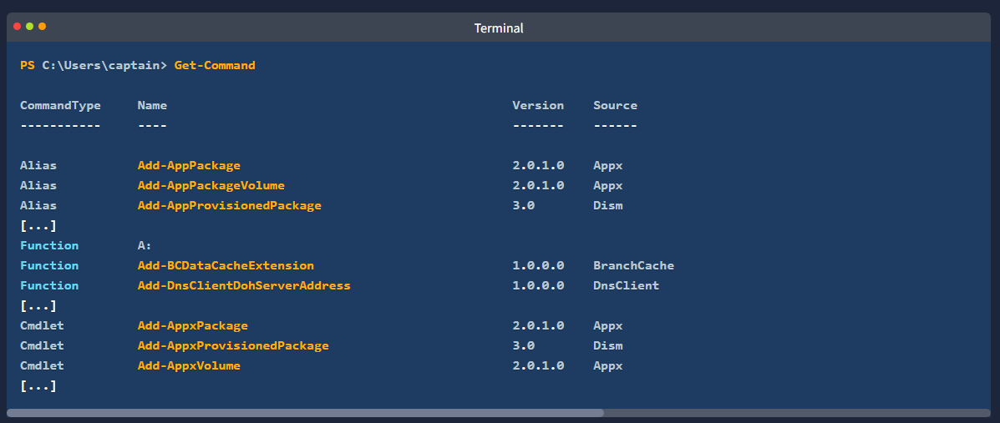

- for each 'CommandInfo' object retrieved by the cmdlet some essential information (properties) is displayed on the console
- it's possible to filter the list of commands based on displayed property values
- for example if we want to display only the available commands of type "function" we can use '-CommandType "Function"' as shown below

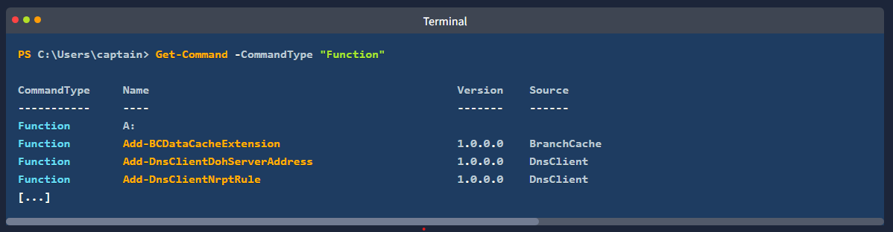

- we will learn more efficent ways to filter output from cmdlets in the upcoming tasks
- another essential cmdlet to keep in our tool-belt is 'Get-Help' 
- it provides detailed information about cmdlets, including usage, parameters, and examples
- it is the go-to cmdlet for learning how to use PowerShell commands

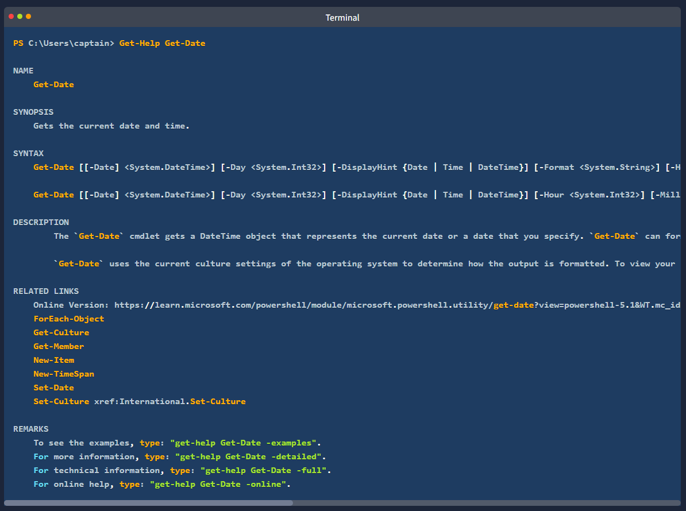

- as shown in the results above
- 'Get-Help' informs us that we can retrieve other useful information about a cmdlet by appending some options to the basic syntax
- for example by appending '-examples' to the command displayed above
- we will be shown a list of common ways in which the chosen cmdlet can be used

- to make the transitioon easier for IT professionals 
- PowerShell includes aliases - which are shortcuts or alternative names for cmdlets for many traditional Windows commands
- indispensable for users already familiar with other command-line tools
- 'Get-Alias' lists all aliases available 
- for example 'dir' is an alias for 'Get-ChildItem' 
- and 'cd' an alias for 'Set-Location'

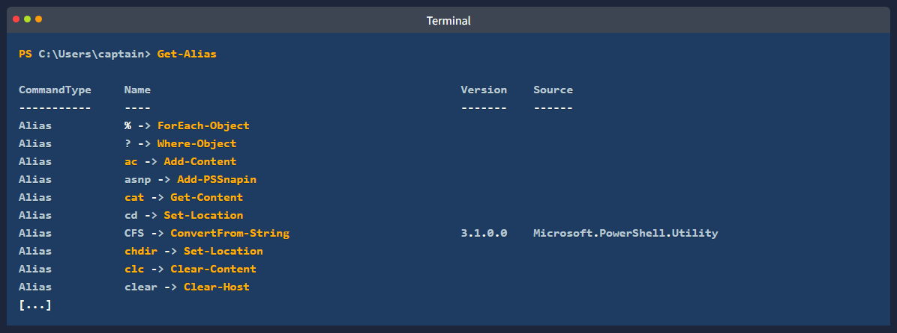

Where to find and Download cmdlets
- another powerful feature of PowerShell is the possibility of extending its functionality by downloading additional cmdlets from online repos

** NOTE ** please note that the cmdlets listed in this section require a working internet connection to query online repos. the attached machine does not have access to the internet, therefore these commands will not work in this environment

- to search for modules (collections of cmdlets) in online repos like the PowerShell Gallery
- we can use 'Find-Module' 
- sometimes if we dont know the exact name of he module, it can be useful to search for modules with a similar name
- we can achieve this by filtering the 'Name' property and appending a wildcard '*' to the module's partial name
- using the following standard PowerShell syntax 'Cmdlet -Property "pattern*"'

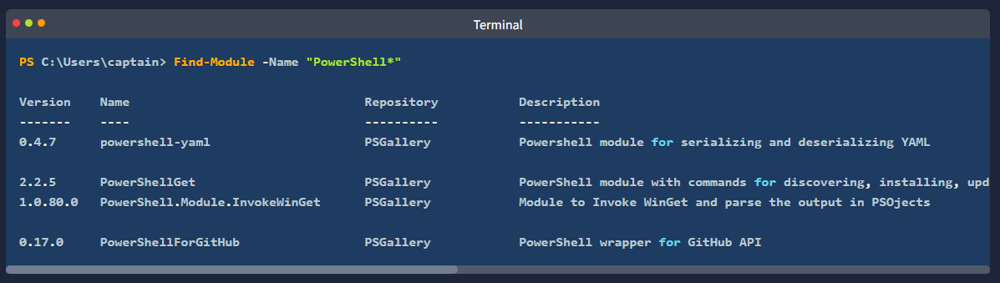

- once identified the modules can be downloaded and installed from the repo with 'Install-Module' making new cmldets contained in the module available for use

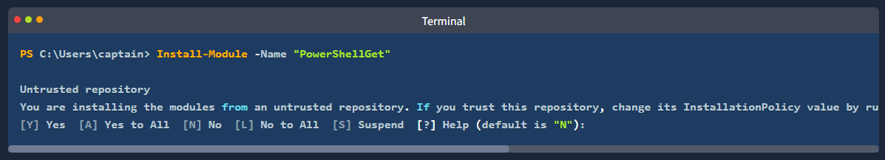

- with these essential tools in our belt, we can now start exploring PowerShell's capabilities

How would you retrieve a list of commands that start with the verb Remove? [for the sake of this question, avoid the use of quotes (" or ') in your answer]
- Get-command -name remove*

What cmdlet has its traditional counterpart echo as an alias?
- 'Get-Alias echo'
- Write-Output

What is the command to retrieve some example usage for the cmdlet New-LocalUser?
- get-help new-localuser -examples

Navigating the File System and Working with Files
- PowerShell provides a range of cmdlets for navgiating the file system and managing files, many of which have counterparts in the traditional windows CLI
- similar to 'dir' command in command prompt (or 'ls' in Unix-like systems) 
- 'Get-ChildItem' lists the files and directories in a location specified with the '-Path' param
- it can be used to explore directories and view their contents
- if no 'Path' is specified the cmdlet will display the content of the current working directory

- to navigate to a different directory, we can use the 'Set-Location' cmdlet
- it changes the current directory, bringing us to a specified path
- akin to the 'cd' command in command prompt

- while the traditional Windows CLI uses seperate commands to create and manage different items like directories and files
- PowerShell simplifies this process by providing a single set of cmdlets to handle the creation and management of both files and directories

- to create an item in PowerShell we can use 'New-Item' 
- we will need to specify the path of the item and its type (file or directory)

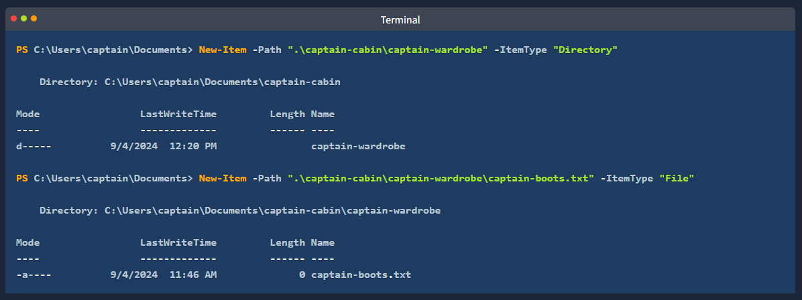

- similarly the 'Remove-Item' cmdlet removes both directories and files
- whereas in windows CLI we have seperate commands 'rmdir' and 'del'

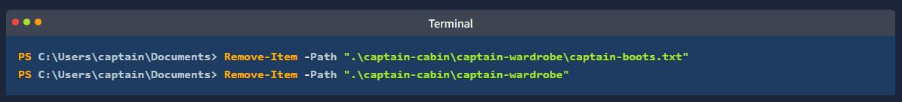

- we can copy or move files and directories alike using respectively 'Copy-Item' (equivalent to 'copy') 
- and 'Move-Item' (equivalent)

- finally to read and display the contents of a file
- we can use the 'Get-Content' cmdlet 
- similarly works like the 'type' command in command prompt (or 'cat' in Unix-like systems)

What cmdlet can you use instead of the traditional Windows command type?
- Get-Content

What PowerShell command would you use to display the content of the "C:\Users" directory? [for the sake of this question, avoid the use of quotes (" or ') in your answer]
-  get-childitem -path c:\users

How many items are displayed by the command described in the previous question?

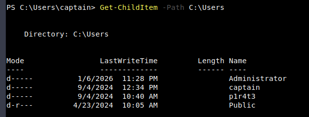

- 4

Piping, Filtering and Sorting Data
- Piping is a technique used in command-line environments that allows the output of one commad to be used as the input for another
- this creates a sequence of operations where the data flows from one command to the next
- represented by the '|' symbol 
- piping is widely used in the windows CLI as introduced in earlier in this module as well as in Unix-based shells

- in PowerShell piping is even more powerful because it passes objects rather than just text
- these objects carry not only data but also the properties and methods that describe and interact with the data

- for example if you want to get a list of files in a directory and then sort them by size you could use the following command in PowerShell

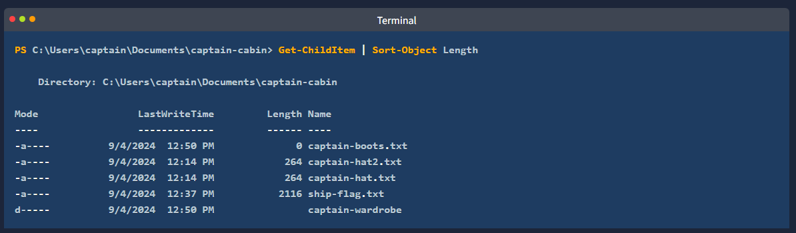

- here 'Get-ChildItem' retrieves the files (as objects) and the pipe '|' sends those file objects to 'Sort-Objects'
- which then sorts them by their Legnth (size) property
- this object-based approach allows for more detailed and flexible command sequences

- in the example above, we have leveraged the 'Sort-Object' cmdlet to sort objecs based on specified properties
- beyond sorting, PowerShell provides a set of cmdlets that when combined with piping allow for advanced data manipulation

- to filter objects based on specified conditions, returning only those that meet the criteria, we can use the 'Where-Object' cmdlet
- for instance to list only '.txc' files in a directory we can use

- here 'Where-Object' filters the files by their 'Extension' property ensuring that only files with extension equal (-eq) to .txt are listed

- the operator '-eq' (equal to) is part of a set of comparison operators that are shared with other scripting languages (e.g. bash, python) 
- to show the potentiality of the PowerShell's filtering, we have selected some of the most useful operators from that list
- '-ne' - "not equal" this operator can be used to exclude objects from the results based on specified criteria
- '-gt' "greather than" this operator will filter only objects which exceed a specified value. it is important to note that this is a strict comparison, meaning that objects that are equal to the specified value will be excluded from the results
- '-ge' "greater than or equal to" this is the non-strict version of the previous operator a combination of '-gt' or '-eq'
- '-lt' "less than" like its counterpart "greater than" this is a strict operator it will include only objects which are strictly below a certain value
- '-le' "less than or equal to" just like its counterpart -ge this is the non strict version of the previous operator a combination of '-lt' and '-eq'

- below another example shows that objects can also be filtered by selecting properties that match (-like) a specified pattern

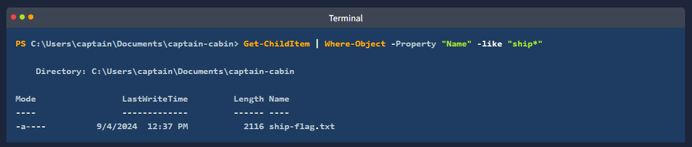

- the next filtering cmdlet 'Select-Object' is used to select specific properties from objects or limit the number of objects returned
- it is useful for refining the output to show only the details one needs

- the cmdlets pipeline can be extended by adding more commands
- as the feature isn't limited to just piping between two cmdlets
- as an exercise try to build a pipleline of cmdlets to sort and filter the output with the goald of displaying the largest file in the C:\Users\captain\Documents\captain-cabin directory

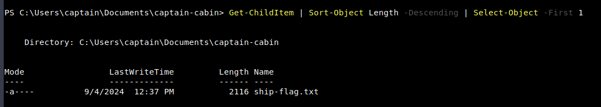

- the last in this set of filtering cmdlets is 'Select-String' 
- this cmdlet searches for text patterns within files similar to 'grep' in Unix-based systems or 'findstr' in Windows command prompt
- it's commonly used for finding specific content within log files or documents

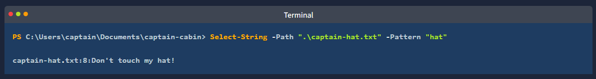

- the 'Select-String' cmdlet fully supports the use of regular expressions (regex) 
- this advanced feature allows for complex pattern matching within files
- making it a powerful tool for searching and analysing text data

How would you retrieve the items in the current directory with size greater than 100? [for the sake of this question, avoid the use of quotes (" or ') in your answer]
- Get-ChildItem | Where-Object -Property Length -gt 100

System and Network Information
- PowerShell was created to address a growing need for a powerful automation and management tool to help system adminstrators and IT professionals
- as such it offers a range of cmdlets that allow the retrieval of detailed information about system configuration and network settings

- the 'Get-ComputerInfo' cmdlet retrieves comprehensive system information
- including operating system info, hardware specifications, BIOS details and more
- it provides a snapshot of the entire system config in a single command
- its traditional counterpart 'systeminfo' retrieves only a small set of the same details

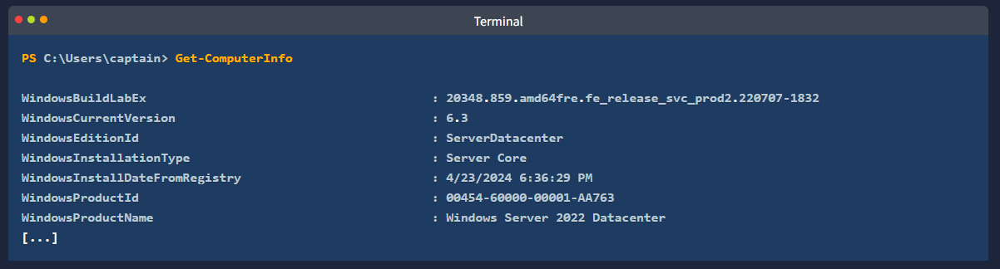

- essential for managing user accounts and understanding the machine's security config
- 'Get-LocalUser' lists all the local user accounts on the system
- the default output displays, for each user, username, account status and description

- similar to the traditional 'ipconfig' command the following two cmdlets can be used to retrieve detailed information about the system's network configuration
- 'Get-NetIPConfiguration' provides detailed information about the network interfaces on the system including IP addr, DNS servers, and gateway configs

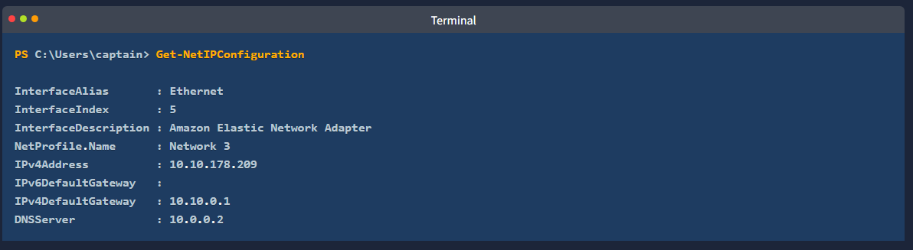

- in case we need specific details about the IP addresses assigned the network interfaces
- the 'Get-NetIpAddress' cmdlet will show details for all IP addresses configured on the system, including those that are not currently active

- these cmdlets give IT professionals the ability to quickly access crucial system and network information directly from the command line
- making it easier to monitor and manage both local and remote machines

Other than your current user and the default "Administrator" account, what other user is enabled on the target machine?
- 'Get-LocalUser'
- p1r4t3

This lad has hidden his account among the others with no regard for our beloved captain! What is the motto he has so bluntly put as his account's description?
- a merry life and a short one.

Now a small challenge to put it all together. This shady lad that we just found hidden among the local users has his own home folder in the "C:\Users" directory. 
Can you navigate the filesystem and find the hidden treasure inside this pirate's home?
- THM{p34rlInAsh3ll}

Real-Time System Analysis
- to gather more advanced system information, especially concerning dynamic aspects like running processes, services, and active network connections
- we can leverage a set of cmdlets that go beyond static machine details
- 'GetProcess' provides a detailed view of all currently running processes, including CPU and memory usage, making it a powerful tool for monitoring and troubleshooting

- similarly 'Get-Service' allows the retrieval of info about the status of services on the machine, such as which services are running, stopped or paused
- it is used extensively in troubleshooting by system admins, but also by forensiv analysts hunting for anomalous services installed on the system

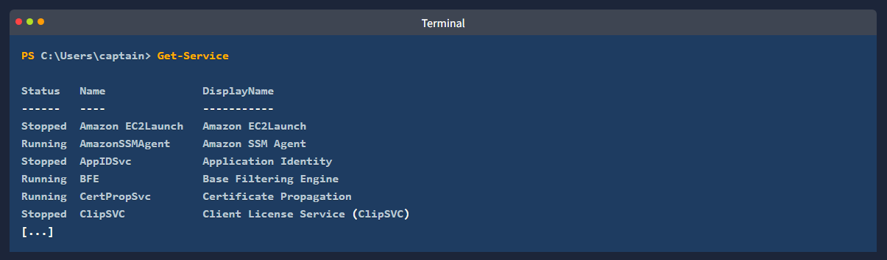

- to monitor active network connections 'Get-NetTCPConnection' displays current TCP connections, giving insights into both local and remote endpoints
- this cmdlet is particularly handy during an incident response or malware analysis task, as it can uncover hidden backdoors or established connections towards an attacker-controller server

- additionally we are going to mention 'Get-FileHash' as a useful cmdlet for generating file hashes
- particularly valuable in incident response, threat hunting, and malware analysis, as it helps verify file integrity and detect potential tampering

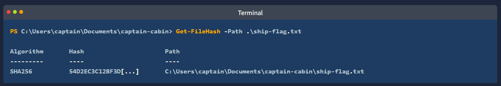

- you can also view the Alternate Data Stream (ADS) attached to a file through PowerShell as shown below

- in the output above you can see 2 streams that are attached to the file C:\House\house_flag.txt

1. ':$DATA' is the default data stream of every NTFS file. it contains the normal file contents and is not an ADS
2. 'housinginfo' is the Alternate Data Stream (ADS) added to this file. It appears as 'house_log.txt:housinginfo' which means an extra hidden stream named housinginfo is attached to this file

** Note ** the ADS example shown above is from a file of a different machine and will not be available in the attached VM

- these cmdlets collectively provide a comprehensive set of tools for a real-time system monitoring and analysis, proving especially useful to incident responders and threat hunters

In the previous task, you found a marvellous treasure carefully hidden in the target machine. What is the hash of the file that contains it?
- Get-FileHash .\big-treasure.txt
- 71FC5EC11C2497A32F8F08E61399687D90ABE6E204D2964DF589543A613F3E08

What property retrieved by default by Get-NetTCPConnection contains information about the process that has started the connection?
- OwningProcess

It's time for another small challenge. Some vital service has been installed on this pirate ship to guarantee that the captain can always navigate safely. But something isn't working as expected, and the captain wonders why. Investigating, they find out the truth, at last: the service has been tampered with! The shady lad from before has modified the service DisplayName to reflect his very own motto, the same that he put in his user description.

With this information and the PowerShell knowledge you have built so far, can you find the service name?
- 'Get-Service'
- p1r4t3-s-compass

Scripting
- scripting is the process of writing and executing a series of commands contained in a text file, known as a script
- to automate tasks that one would generally perform manuall in a shell like PowerShell

- simply speaking, scripting is like giving a computer a to-do list
- where each line in the script is a task that the computer will carry out autoamtically
- this saves time, reduces the chances of errors, and allows to perform tasks that are too complex or tedious to do manually
- as you leearn more about shells and scripting, you'll discover that scripts can be powerful tools for managing systems, processing data and much more

- learning scripting with PowerShell goes beyond the scope of this room, nonetheless we must understand that its power makes it a crucial skill across all cyber security roles

- for BLUE TEAM professionals such as incident responders, malware analysts and threat hunters PowerShell scripts can automate many different tasks
- including log analysis, detecting anomalies, and extracting indicators of compromise (IOCs)
- these scripts can also be used to reverse-engineer malicious code (malware) or automate the scanning of systems for signs of intrusion

- for the RED TEAM including pen testers and ethical hackers, PowerShell scripts can automate tasks like system enumeration, executing remote command, and crafting obfuscated scripts to bypass defenses
- its deep integration with all types of systems makes it a powerful tool for simulating attacks and testing systems' resilience against real-world threats

- staying in the context of cyber security, system admins benefit from PowerShell scripting for automating integrity checks, managing system configs, securing networks
- especially in remote or large-scale environments 
- PowerShell scripts can be designed to enforce security policies, monitor system health, and respond automatically to security incidents thus enhancing the overall security posture

- whether used defensively or offensively, PowerShell scripting is an essential capability in the cyber security toolkit

- before concluding this task about scripting, we cant go without mentioning the 'Invoke-Command' cmdlet

- 'Invoke-Command' is essential for executing commands on remote systems
- making it a fundamental for system admins, security engineers, and pen testers
- 'Invoke-Command' enabled efficient remote management and - combining it with scripting - automation of tasks across multiple machines
- it can also be used to execute payloads or commands on target systems during an engagement by pen testers, or attackers alike

- let us discover some example usage for this powerful cmdlet by consulting the 'Get-Help' "examples" page:

- the first 2 examples provided by the 'Get-Help' "examples" page and reported above are enough to grasp the simplicity and power of the 'Invoke-Command' cmdlet

- the first example shows how the cmdlet can be very easily combined with any custom script to automate tasks on remote computers

- the second example demonstrates that we dont need to know how to script to benefit from the power of 'Invoke-Command' in fact by appending the '-ScriptBlock { ... }' param to the cmdlet's syntax
- we can execute any command (or sequence of commands) on the remove computer
- the result would be the same as if we were typing the commands in a local PowerShell session on the remote computer itself

What is the syntax to execute the command Get-Service on a remote computer named "RoyalFortune"? Assume you don't need to provide credentials to establish the connection. [for the sake of this question, avoid the use of quotes (" or ') in your answer]

- Invoke-Command -ComputerName RoyalFortune -ScriptBlock { Get-Service }
