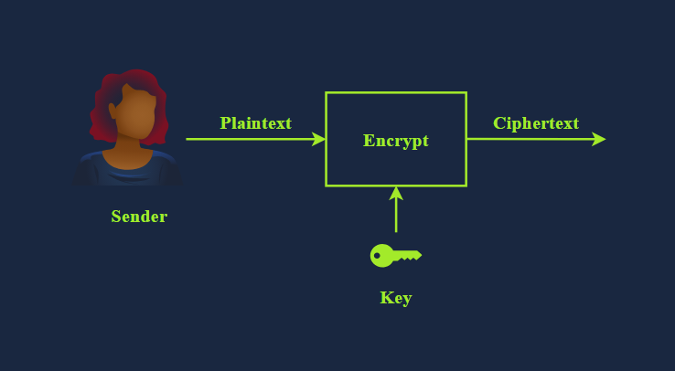
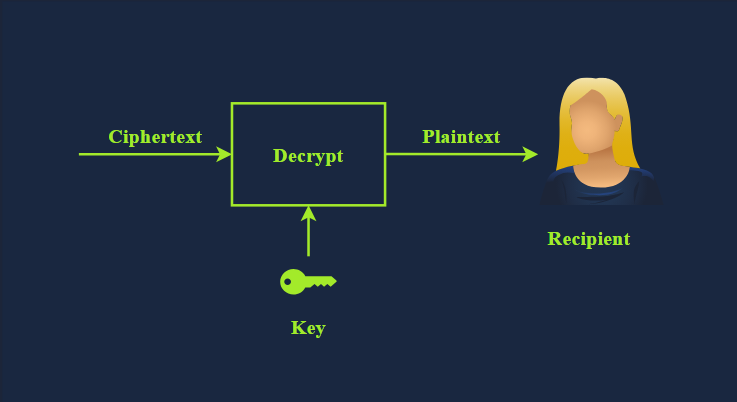
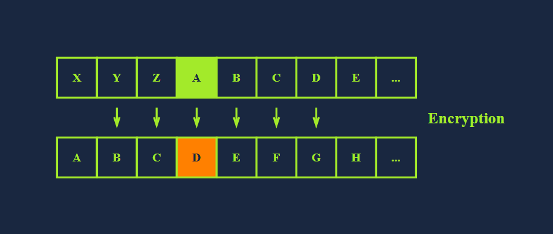
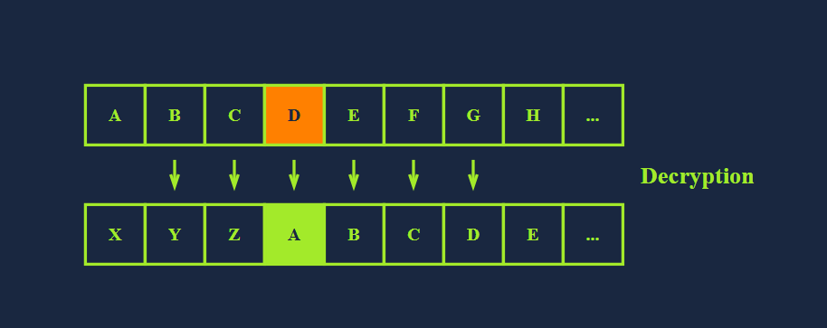
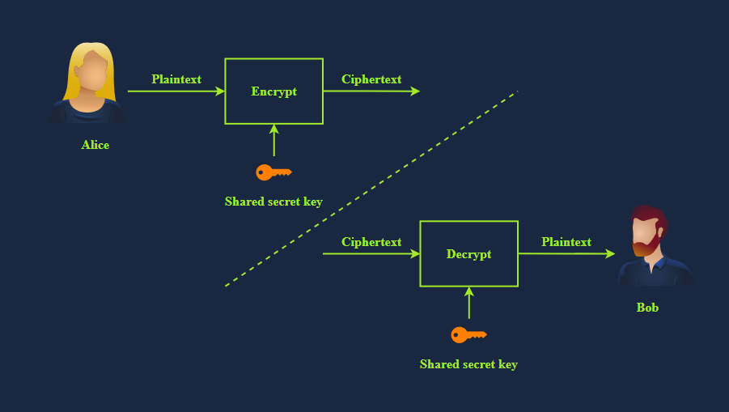
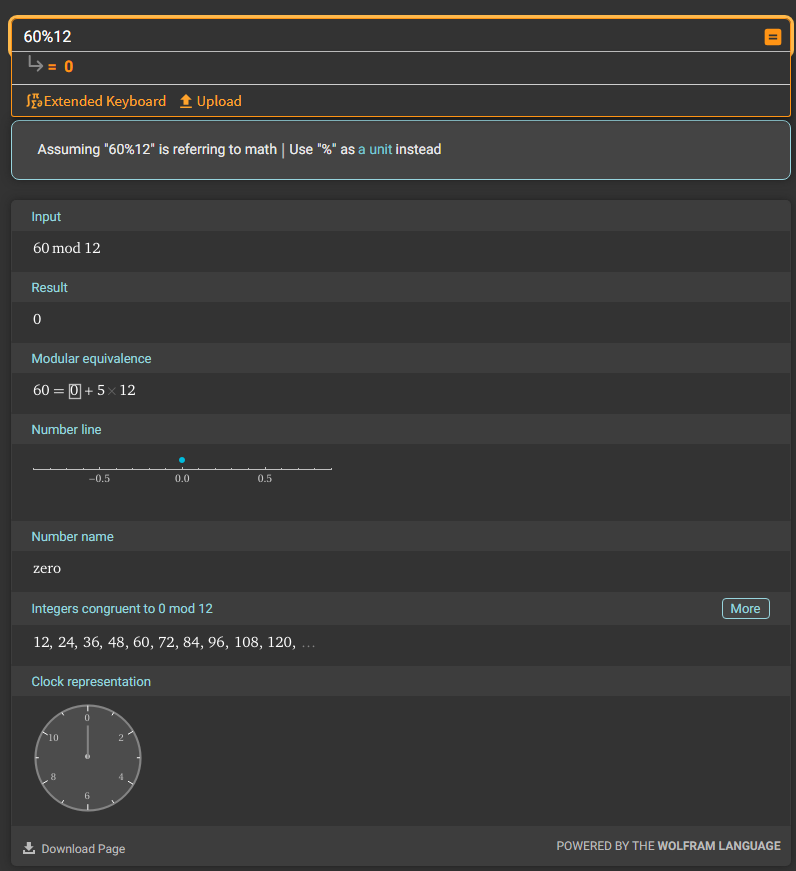

Introduction
- have you ever wondered how to prevent 3rd parties from reading your messages?
- how can your app or web browser build a secure channel with a remote server?
- by secure we mean that no one can read or alter the exchanged data; furthermore, we can be confident that we are connecting with the real server
- thanks to cryptography these requirements are satsified

- cryptography lays the foundation for our digital world
- while networking protocols have made it possible for devices spread across the globe to communicate 
- cryptography has made it possible to trust this communication

- this room is the first of 3 introductory rooms about cryptography

Learning Objectives
- upon completing this room you will learn the following
- Cryptography key terms
- importance of cryptography
- caesar cipher
- standard symmetric ciphers
- common asymmetric ciphers
- basic mathematics commonly used in cryptography

Importance of Cryptography
- cryptographys ultimate purpose is to ensure secure comminication in the presence of adversaries
- the term secure includes confidentiality and integrity of the communicated data
- cryptography can be defined as the practice and study of techniques for secure communication and data protection where we expect the presence of adversaries and 3rd parties
- in other words these adversaries should not be able to disclose or alter the contents of the messages

- cryptography is used to protect confidentiality, integrity and authenticity
- in this age you use cryptography daily and youre almost certainly reading this over an encrypted connection
- consider the following scenarios where you would use cryptography:

- when you log in to TryHackMe, your credentials are encrypted and sent to the server so that no one can retrieve them by snooping on your connection
- when you connect over SSH, your SSH client and the server establish an ecnrypted tunnel so no one can eavesdrop on your session
- when you conduct online banking, your browser checks the remote servers certificate to confirm that you are communicating with your banks server and not an attackers
- when you download a file, how do you check if it was downloaded correctly? cryptography provides a solution through hash functions to confirm that your file is identical to the original one

- as you can see you rarely have to interact directly with cryptography but its solutions and implications are everywhere in the digital world
- consider the case where a company wants to handle credit card information and process related transactions
- when handling credit cards the company must follow and enforce the Payment Card Industry Data Security Standard (PCI DSS)
- in this case PCI DSS ensures a minimum level of security to store, process and transmit data related to card credits
- if you check the PCI DSS for Large Organisations you will learn that the data should be encrypted both while being stored (a rest) and while being transmitted (in motion)
- https://listings.pcisecuritystandards.org/documents/PCI_DSS_for_Large_Organizations_v1.pdf

- in the same way that handling a payment card details requires complying with the PCI DSS handling medical records requires complying with their respective standard
- unlike credit cards the standards for handling medical records vary from one country to another
- example laws and regulations that should be considered when handling medical records include HIPAA (Health Insurance Portability and Accountability Act) in the EU
- DPA (Data Protection Act) in the UK
- although this list is not exhaustive, it gives an idea about the legal requirements that healthcare providers should consider depending on their country
- these laws and regulations show that cryptography is a necessity that should be present yet usually hidden from direct user access

What is the standard required for handling credit card information?
- PCI DSS

Plaintext to Ciphertext
- let's start with an illustration before introducing key terms
- we begin with the plaintext that we want to encrypt
- the plaintext is the readable data; it can be anything from a simple "hello", a cat photo, credit card info, or medical health records
- from a cryptography perspective these are all "plaintext" messages waiting to be encrypted
- the plaintext is passed through the encryption function along with a proper key; the encryption function returns a ciphertext
- the encryption function is part of the cipher; a cipher is an algorithm to convert a plaintext into a ciphertext and vice versa

- to recover the plaintext we must pass the ciphertext along with the proper key via the decryption function, which would give us the original plaintext
- this is shown in the illustration below

- we have just introduced several new terms and we need to learn them to understand any text about cryptography
- the terms are listed below:

- 'Plaintext' is the original, readable message or data before its encrypted. it can be a document, image, multimedia file or any other binary data
- 'Ciphertext' is the scrambled, unreadable version of the message after encryption. ideally we cannot get any information about the original plaintext except its approx size
- 'Cipher' is an algorithm or method to convert plaintext into ciphertext and back again. a cipher is usually developed by a mathematician
- 'Key' is a string of bits the cipher uses to encrypt or decrypt data. in general the used cipher is public knowledge, however the key must remain secret unless it is the public key in asymmetric encryption -> we will visit asymmetric encryption later
- 'Encryption' is the process of converting plaintext into ciphertext using a cipher and a key. unlike the key the choice of the cipher is disclosed
- 'Decryption' is the reverse process of encryption, converting ciphertext back into plaintext using a cipher and a key. although the cipher would be public knowledge, recovering the plaintext without knowledege of the key should be impossible (infeasible)

What do you call the encrypted plaintext?
- Ciphertext

What do you call the process that returns the plaintext?
- Decryption

Historical Ciphers
- cryptographys history is long and dates back to ancient Egypt in 1900 BCE 
- however one of the simpleest historical ciphers is the Caesar Cipher from the first century BCE
- the idea is simple, shift each letter by a certain number to encrypt the message

- consider the following example:
- plaintext: TRYHACKME
- Key: 3 (assume its a right shift of 3)
- Cipher: Caesar Cipher

- we can easily figure out that T becomes W, R becomes U, Y becomes B and so on.
- as you noticed once we reach Z we start all over, as shown in the figure below
- consequently we get the ciphertext of WUBKDFNPH

- to decrypt we need the following information
- ciphertext: WUBKDFNPH
- Key: 3
- Cipher: Caesar Cipher

- for encryption we shift to the right by three
- for decryption we shift to the left by three and recover the original plaintext as illustrated by the img aboe
- however if someone gives you a ciphertext and tells you that it was encrypted by using Caesar Cipher...
- recovering the original text would be a trivial task as there are only 25 possible keys
- the english alphabet is 26 letters and shifting by 26 will keep the letter unchanged; hence 25 valid keys for encryption with Caesar Cipher
- the figure below shows how decryption will succeed by attempting all the possible keys
- in this case we recovered the original message with key = 5
- consequently by todays standards where the cipher is publicly known, Caesar Cipher is consideered insecure

- you would come across many more historical ciphers in movies and cryptography books
- examples include:
- the Vigenere cipher from the 16th century
- the Enigma Machine from WW2
- the one-time pad from the Cold War

- you can experiment with Caesar cipher shifts using the interactive tool at the website below
- https://cryptii.com/pipes/caesar-cipher
- it lets you tweak the rotation and instantly see how the text transforms

Knowing that XRPCTCRGNEI was encrypted using Caesar Cipher, what is the original plaintext?
- ICANENCRYPT

Types of Encryption
- the two main categories of encryption are symmetric and asymmetric

Symmetric Encryption
- also known as symmetric cryptography uses the same key to encrypt and decrypt the data as shown in the figure below
- keeping the key secret is a must; it is also called private key cryptography
- furthermore communicating the key to the intended parties can be challenging as it requires a secure communication channel
- maintaining the secrecy of the key can be a significant challenge, especially if there are many recipients 
- the problem becomes more severe in the presence of a powerful adversary; consider the threat of industrial espionage for instance

- consider the simple case where you created a password-protected document to share it with your colleague
- you can easily email the encrypted document to your colleague but most likely you cannot email them the password
- the reason is that anyone with access to their mailbox would access both the password-protected document and its password
- therefore you need to think of a different way i.e. channel, to share the password
- unless you think of a secure, accessible channel, one solution would be to meet in person and communicate the password to them

- exmaples of symmetric encryption are DES (Data Encryption Standard), 3DES (Triples DES), and AES (Advanced Encryption Standard)
- DES was adopted as a standard in 1977 and uses a 56-bit key. With the advancment in computing power in 1999 a DES key was successfuly broken in less than 24 hours motivating the shift to 3DES.
- 3DES is DES applied three times; consequently the key size is 168 bit, though the effective security is 112 bits. 3DES was more of an ad-hoc solution when DES was no longer considered secure. 3DES was deprecated in 2019 and should be replaced by AES; however it may still be found in some legacy systems
- AES  was adopted as a standard in 2011. its key size can be 128, 192 or 256 bits

- there are many more symmetric encryption ciphers used in various applications; however, they have not been adopted as standards

Asymmetric Encryption
- unlike symmetric encryption which uses the same key for encryption and decryption,
- asymmetric encryption uses a pair of keys, one to encrypt and the other to decrypt as shown in the illustration below
- to protect confidentiality asymmetric encryption/cryptography encrypts the data using the public key; hence it is also called public key cryptography

- examples are RSA, Diffie-Hellman, and Elliptic Curve cryptography (ECC)
- the two keys involved in the process are referred to as a public key and a private key
- data encrypted with the public key can be decrypted with the private key
- your private key needs to be kept private; hence the name

- asymmetric encryption tends to be slower, and many asymmetric encryption ciphers use larger keys than symmetric encryption
- for example RSA uses 2048-bit, 3072-bit and 4096-bit keys
- 2048-bit is the recommended minimum key size
- Diffie-Hellman also has a recommended min key size of 2048-bit but uses 3072-bit and 4096-bit keys for enhanced security
- on the other hand ECC can achieve equivalent security with shorter keys
- for example with a 256-bit key ECC provides a level of security comparable to a 3072-bit RSA key

- asymmetric encryption is based on a particular group of mathematical problems that are easy to compute in one direction but extremely difficult to reverse
- in this context extremely difficult means practically infeasible
- for example we can rely on a mathematical problem that would take a very long time, for example a million years to solve using todays technology

- we will visit various asymmetric encryption ciphers in the next room
- for now the important thing to note is that asymmetric encryption provides you with a public key that you share with everyone and a private key that you keep guarded and a secret

Summary of New Terms
- Alice and Bob are fictional characters commonly used in cryptography examples to represent two parties trying to communicate securely
- Symmetric encryption is a method in which the same key is used for both encryption and decryption
- consequently this key must remain secure and never be disclosed to anyone except the intended party
- Asymmetric encryption is a method that uses two different keys; a public key for encryption and a private key for decryption

Should you trust DES? (Yea/Nay)
- nay

When was AES adopted as an encryption standard?
- 2001

Basic Math
- the building blocks of modern cryptography lie in mathematics
- to demonstrate some basic algorithms, we will cover two mathematical operations that are used in various algorithms:
- XOR Operation
- Modulo Operation

XOR Operation
- short for "exclusive OR" is a logical operation in binary arithmetic that plays a crucial role in various computing and cryptographic applications
- in binary XOR compares two bits and returns 1 if the bits are different and 0 if they are the same as shown in the truth table below
- this operation is often represented by the simple ⊕ or ^

- if this is the first time you work with a truth table, it is a table that shows all possible outcomes
- the XOR truth table above states all four cases:
- 0 ⊕ 0 = 0
- 0 ⊕ 1 = 1
- 1 ⊕ 0 = 1
- 1 ⊕ 1 = 0

- lets consider an example where we want to apply XOR to the binary numbers 1010 and 1100
- in this case we perform the operation bit by bit
- 1 ⊕ 1 = 0
- 0 ⊕ 1 = 1
- 1 ⊕ 0 = 1
- 0 ⊕ 0 = 0
- resulting in 0110

- you may be wondering how XOR can play any role in cryptography...
- XOR has several interesting properties that make it useful in cryptography and error detection
- one key property is that applying XOR to a vlaue with itself results in 0
- and applying XOR to any value with 0 leaves it unchanged
- this means that 
- A ⊕ A = 0
- A ⊕ 0 = A for any binary value A
- additionally XOR is commutative i.e. A ⊕ B = B ⊕ A
- and it is associative i.e. (A ⊕ B) ⊕ C = A ⊕ (B ⊕ C)

- lets see how we can make use of the above in cryptography
- we will demonstrate how XOR can be used as a basic symmetric encryption algorithm
- consider the binary values P and K
- P = plaintext
- K = secret key
- the ciphertext is C = P ⊕ K

- now if we know C and K we can recover P
- we start with C ⊕ K = (P ⊕ K)
- but we know that (P ⊕ K) ⊕ K = P ⊕ (K ⊕ K) because XOR is associative
- furthermore we know that K ⊕ K = 0; consequently (P ⊕ K) ⊕ K = P ⊕ (K ⊕ K)
- in otherwords XOR served as a simple asymmetric encryption algorithm
- in practice it is more complicated as we need a secret key as long as the plaintext

Modulo Operation
- another mathematical operation we often encounter in cryptography is the modulo operator commonly written as % or as mod
- the modulo operator X%Y is the remainder when X is dividede by Y
- in our daily life calculations we focus more on the result of division than on the remainder
- the remainder plays a significant role in cryptography

- you need to work with large numbers when solving some cryptography exercises
- if your calculator fails we suggest using a programming language such as Python
- Python has a built-in int type that can handle integers of arbitrary size and would automatically switch to larger types as needed
- many other programming languages have a dedicated library for big integers
- if you prefer to do the math online consider using WolframAlpha
- https://www.wolframalpha.com/

- lets consider a few examples:
- 25%5 = 0 because 25 divided by 5 is 5, with a remainder of 0 i.e. 25 = 5 * 5 + 0
- 23%6 = 5 because 23 divided by 6 is 3 with a remainder of 5 i.e. 23 = 3 * 6 + 5
- 23%7 = 2 because 23 divided by 7 is 3 with a remainder of 2 i.e. 23 = 3 * 7 + 2

- an important thing to remember about modulo is that its not reversible
- if we are given the equation x%5 = 4 infinite values of x would satisfy this equation

- the modulo operation always returns a non-negative result less than the divisor
- this means that for any integer a and positive integer n the result of a%n will always be in the range 0 to n - 1

What’s 1001 ⊕ 1010?
- 0011

working out:
- 1 ⊕ 1 = 0
- 0 ⊕ 0 = 0
- 0 ⊕ 1 = 1
- 1 ⊕ 0 = 1
- 0011

What’s 118613842%9091?
- 3565

What’s 60%12?
- 0

Summary
- in this room we learned about the importance of cryptography and some of the problems that it solves
- we also introduced symmetric and asymmetric encryption ciphers
- finally we explained XOR and the modulo operations
