Introduction
- consider the scenario where you just downloaded a 6 GB file and want to know whether the copy you downloaded is identical to the original file, bit for bit
- how would you do that?
- or if a good samaritan handed you this 6 GB file on a USB memory drive, how can you be sure its identical to the file you want to download?

- the answer to both of the above questions lies in comparing the hash values to the two files
- if two hash values are equal you can say with very high certainty that the two files are identical
- but what is a hash value?

- a hash value is a fixed-size string or characters that is computed by a hash function
- a hash function takes an input of an arbitrary size and returns an output of fixed length i.e. a hash value
- we will cover various exciting and clever uses of hash functions and values in this room

- note about terminology: we favoured the term hash function and hash value
- however we occasionally use the word hash as a verb to mean calculate the hash value; moreover we occasionally use the word hash by iself as a noun to refer to the hash value

Learning Objectives
- upon completion of this room you will learn about:
- Hash functions and collisions
- The role of hashing in authentication systems
- Recognising stored hash values
- Cracking hash values
- the use of hashing for integrity protection

Hash Functions

What is a Hash Function?
- hash functions are different from encryption 
- there is no key and its meant to be impossible (or computationally impractical) to go from the ouput back to the input

- a hash function takes some input data of any size and creates a summary or digest of that data
- the output has a fixed size
- its hard to predict the output for any input and vice versa
- good hashing algorithms will be relatively fast to compute and prohibitievly slow to reverse i.e. go from the output and determine the input
- any slight change in the input data, even a single bit, should cause a significant change in the output

- lets check an example
- in the terminal below we can see two files...
- the first file contains the letter T while the second contains the letter U
- if you check T and U in an ASCII table or using 'hexdump' you will notice that the two letters differ by a single bit
- The letter T is 54 in hexadecimal i.e. 01010100 in binary
- The letter U is 55 in hexadecimal i.e. 01010101 in binary

- consequently the following two files differ by a single bit
- however if we compare their MD5 (Message-Digest Algorithm 5) hashes, their SHA1 (Secure Hash Algorithm 1) hashes, or their SHA-256 (Secure Hash Algorithm 256) hashes...
- we will notice that they are entirely different
- we recommend that you try the commands below yourself
- the files are located in '~/Hashing-Basics/Task-2/#'

- the output of a hash function is typically raw bytes which are then encoded
- common encodings are base64 or hexadecimal
- 'md5sum', 'sha1sum', 'sha256sum' and 'sha512sum' produce their outputs in hexadecimal format
- remember that hexadecimal format prints each raw byte as two hexadecimal digits

Why is Hashing Important?
- hashing plays a vital role in our daily use of the internet
- like other cryptographic functions, hashing remains hidden from the user
- hashing helps protect datas integrity and ensure password confidentiality

- consider this example of hashing being used to protect your cyber security
- when you log in to TryHackMe the server uses hashing to verify your password
- in fact, as per good security practises a server does not record your password; it records the hash value of your password
- whenever you want to log in, it will calculate the hash value of the password you submitted with the recorded hash value
- similarly when you log into your computer, hashing plays a role in verifying your password
- you interact more indirectly with hashing than you would think, and almost daily in the context of passwords

What's a Hash Collision?
- a hash collision is when two different types of inputs give the same output
- hash functions are designed to avoid collisions as best as possible
- furthermore hash functions are designed to prevent an attacker from being able to create i.e. engineer, a collision intentionally
- however because the number of inputs is practically unlimited and the number of possible outputs is limited this leads to a pigeonhole effect

- as a numeric example if a hash function produces a 4-bit hash value, we only have 16 different hash values
- the total number of possible hash values is 2^number_of_bits = 2^4 = 16
- the probability of a collision is relatively very high

- the pigeonhole effect states that the number of items (pigeons) is more than the number of containers (pigeonholes) 
- some containers must hold more than one item
- in other words, in this context, there are a fixed number of different outputs values for the hash function, but you can give it any size input
- as there are more inputs than outputs, some inputs must inevitable give the same output
- if you have 21 pigeons and 16 pigeonholes, some of the pigeons are going to share pigeonholes
- consequently collisions are unavoidable
- however a good hash function ensures that the probability of a collision is negligible

- MD5 and SHA1 have been attacked and are now considered insecure due to the ability to engineer hash collisions
- however no attack yet has given a collision in both algorithms simultaneously so if you compare the MD5 hash and SHA1 hash you will see they are different
- you can view the MD5 collision example on the MD5 Collision Demo page (https://www.mscs.dal.ca/~selinger/md5collision/)
- furthermore you can read the details of the SHA1 collision attack at Shattered (https://shattered.io/)
- due to these you shouldnt trust either algorithm for hashing passwords or data

What is the SHA256 hash of the passport.jpg file in ~/Hashing-Basics/Task-2?
- 77148c6f605a8df855f2b764bcc3be749d7db814f5f79134d2aa539a64b61f02

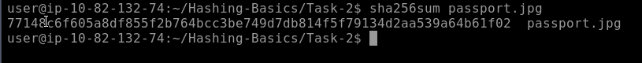

What is the output size in bytes of the MD5 hash function?
- 16 (count the number of hexadecimal digits and divide by two)

If you have an 8-bit hash output, how many possible hash values are there?
- 256

working out:
- 2^number_of_bits
- 2^8 = 256

Insecure Password Storage for Authentication
- hashing has many uses in cyber security
- in this room we will focus on 2 uses: password storage and data integrity
- we refer to password storage when used for authentication

- it is important to note that this does not apply to password managers, where you must retrieve your password in cleartext
- on the other hand authentication mechanisms only need to confirm that the user knows the password so they can be granted access to the resource...
- therefore this problem differs from password managers

Stories of Insecure Password Storage for Authentication
- most web applications need to verify a users password at some point
- storing these passwords in plaintext is a very insecure security practice
- youve probably seen news stories about companies that have had their databas leaked
- knowing that many people use the same password on their various accounts, including their online banking...
- leaking the password from one account jeopardises the securty of all other accounts

- we will visit three insecure practices when it comes to passwords:
- Storing passwords in plaintext
- Storing passwords using a deprecated encryption
- Storing passwords using an insecure hashing algorithm

Storing Passwords in Plaintext
- quite a few data breaches have leaked plaintext passwords
- youre probably familiar with the "rockyou.txt" password list on Kali Linux, among many other offensive security distros
- this password list came from RockYou, a company that developed social media applications and widgets
- they stored their passwords in plaintext, and the company had a data breach
- the text file contains over 14 million passwords
- you can find 'rockyou.txt' in the '/usr/share/wordlists' directory

Using an Insecure Encryption Algorithm
- adobe's notable data breach was slightly different
- instead of using a secure hashing function to store the hash values of the passwords
- the company used a deprecated encryption format
- furthermore password hints were stored in plaintext, sometimes containing the password itself
- consequently the plaintext password could be retrieved relatively quickly

Using an Insecure Hash Function
- LinkedIn also suffered a data breach in 2012
- LinkedIn used an insecure hashing algorithm, the SHA-1 to store user passwords
- furthermore no password salting was used
- password salting refers to adding a salt i.e. a random value, the the password before its hashed

What is the 20th password in rockyou.txt?
- qwerty

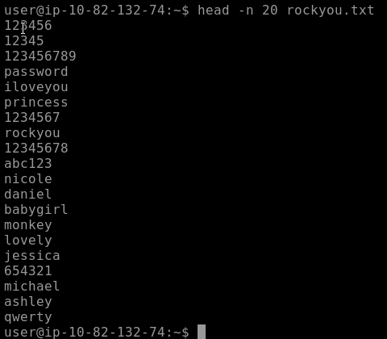

Using Hashing to Store Passwords
- this is where hashing comes in
- what if instead of storing the password, you just stored its hash value using a secure hashing function?
- this process means you never have to store the users password and if your db is leaked an attacker will have to crack each password to find out what the pwd was

- theres just one problem with this
- what if 2 users have the same password?
- as a hash function will always turn the same input into the same output
- you will store the same password hash for each user
- that means if someone cracks the hash they gain access to more than one account
- it also means someone can create a rainbow table to break the hashes

- a rainbow table is a lookup table of hashes to plaintexts
- so you can quickly find out what password a user had just from the hash
- a rainbow table trades the time to crack a hash for hard disk space, but it takes time to create
- heres a quick example to get an idea of what a rainbow table looks like 

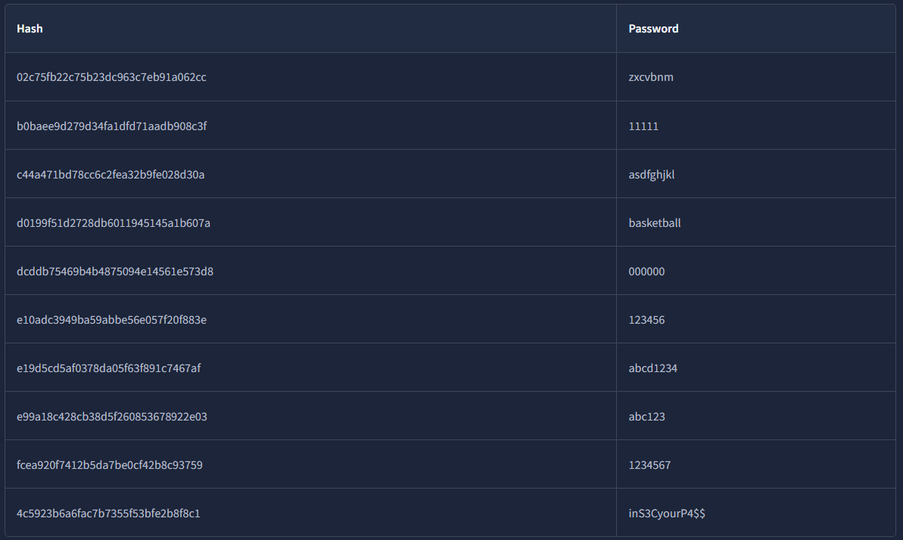

- websites like CrackStation (https://crackstation.net/) and Hashes.com (https://hashes.com/en/decrypt/hash) 
- internally use massive rainbow tables to provide fast password cracking for hashes without salts
- doing a lookup in a sorted list of hashes is quicker than trying to crack the hash

Protecting Against Rainbow Tables
- to protect against rainbow tables we add a salt to the passwords
- the salt is a randomly generated value stored in the db and should be unique to each user
- in theory you could use the same salt for all users, but duplicate passwords would still have the same hash and a rainbow table could still be created for passwords with that salt

- the salt is added either to the start or the end of the password before its hashed
- and this means that every user will have a different password hash even if they have the same password
- hash functions like Bcrypt or Scrypt handle this automatically
- salts dont need to be kept private

Examples of Securely Storing Passwords
- you can find many good guides online that promote the best security practices when storing passwords
- please check if there are any standards you need to follow when storing passwords before adopting one
- consider this example following good security practices when storing user passwords:

1. We select a secure hashing function such as Argon2, Scrypt, Bcrypt or PBKDF2

2. We add a unique salt to the password such as 'Y4UV*^(=go_!'

3. Concatenate the password with the unique salt e.g. if the password is 'AL4RMc10k' the result string would be 'Al4RMc10kY4UV*^(=go_!'

4. Calculate the hash value of the combined password and salt, in this example using the chosen algorithm you need to calculate the hash value of 'Al4RMc10kY4UV*^(=go_!'

5. Store the hash value and the unique salt used ('Y4UV*^(=go_!')

Using Encryption to Store Passwords
- considering the problem of saving passwords for authentication
- why dont we encrypt passwords instead of all these cumbersome steps?
- the reason is that even if we select a secure hashing algorithm to encrypt the passwords before storing them, we still need to store the used key
- consequently if someone gets the key, they can easily decrypt all the passwords

Manually check the hash “4c5923b6a6fac7b7355f53bfe2b8f8c1” using the rainbow table above.
- inS3CyourP4$$

Crack the hash “5b31f93c09ad1d065c0491b764d04933” using an online tool.
- tryhackme

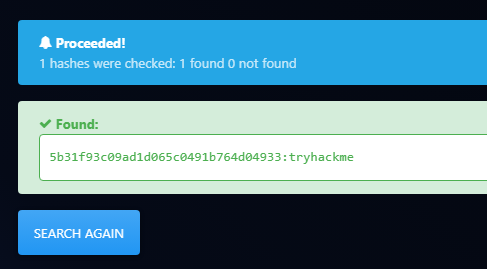

Should you encrypt passwords in password-verification systems? Yea/Nay
- nay

Recognising Password Hashes
- from the cyber defensive security perspective 
- we covered how to store passwords securely for authentication systems
- lets tackle this from the offensive security perspective...
- if we start with a hash how can we recognise its type, eventually crack it and recover the original password?

- automated hash recognition tools such as hashID (https://pypi.org/project/hashID/) exist but are unreliable for many formats
- for hashes that have a prefix, the tools are reliable
- use a healthy combination of context and tools
- if you find the hash in a web application database, its more likely to be MD5 than NTLM (NT LAN Manager)
- automated hash recognition tools often get these hash types mixed up, highlighting the importance of learning yourself

Linux Passwords
- on Linux password hashes are stored in '/etc/shadow' which normally is only readable by root
- they used to be stored in '/etc/passwd' which was readable by everyone

- the shadow file contains the password information
- each line contains nine fields, seperated by colons
- the first two fields are the login name and the encrypted password
- more information about the other fields can be found by executing 'man 5 shadow' on a Linux system

- the encrypted password field contains the hashed passphrase with four components:
- prefix (algorithm id)
- options (parameters)
- salt
- hash
- it is saved in the format '$prefix$options$salt$hash' 
- the prefix makes it easy to recognise Unix and Linux-style passwords; it specifies the hashing algorithm used to generate the hash

- heres a quick table with some of the most common Unix-style password prefixes you might encounter
- they are listed in the order of decreasing strength
- you can read more about them by checking the man page 'man 5 crypt'

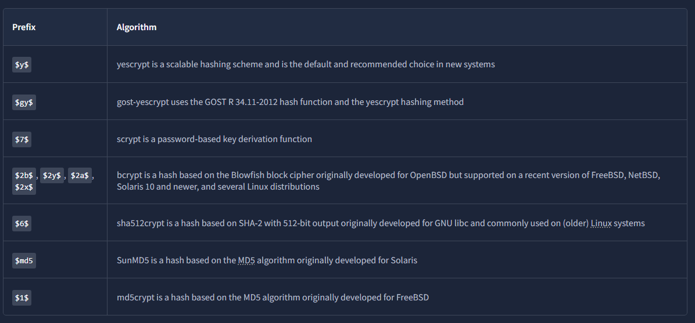

Modern Linux Example
- consider the following line from a modernLinux systems shadow password file

- the fields are seperated by colons
- the important ones are the username and the hash algorithm, salt and hash value
- the second field has the format $prefix$options$salt$hash

- in the example above we have four parts seperated by $
- y indicates the hash algorithm used, yescrypt
- j9T is a parameter passed to the algorithm
- 76UzfgEM5PnymhQ7TlJey1 is the salt used
- /OOSg64dhfF.TigVPdzqiFang6uZA4QA1pzzegKdVm4 is the hash value

MS Windows Passwords
- MS windows passwords are hashed using NTLM, a variant of MD4
- theyre visually identical to MD4 and MD5 hashes...
- so its very important to use context to determine the hash type

- on MS Windows password hashes are stored in the SAM (Security Accounts Manager)
- MS Windows tries to prevent normal users from dumping them, but tools like mimikatz exist to circumvent MS windows security
- notably the hashes found there are split into NT hashes and LM hashes

- a great place to find more hash formats and password prefixes is the Hashcat Example Hashes (https://hashcat.net/wiki/doku.php?id=example_hashes) page
- for other hash types youll typically need to check the length or encoding or even conduct some research into the application that generated them
- never underestimate the power of research

What is the hash size in yescrypt?
- 256 bits

What’s the Hash-Mode listed for Cisco-ASA MD5?
- 2410

What hashing algorithm is used in Cisco-IOS if it starts with $9$?
- scrypt

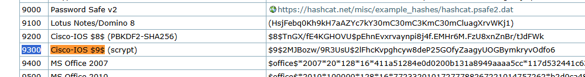

Password Cracking
- weve already mentioned rainbow tables as a method to crack hashes that dont use a salt but what if there is a a salt involved?

- you cant "decrypt" password hashes 
- theyre not encrypted
- you have to crack the hashes by hashing many different inputs (such as rockyou.txt as it covers many possible passwords)
- potentially adding the salt if there is one and comparing it to the target hash
- once it matches you know what the password was
- tools like Hashcat (https://hashcat.net/hashcat/) and John the Ripper (https://www.openwall.com/john/) are commonly used for these purposes

Cracking Passwords with GPUs
- modern GPUs (Graphics Processing Unit) have thousands of cores
- they are specialised in digital image processing and accelerating computer graphics
- although they cant do the same sort of work that a CPU can
- they are very good at mathematical calculations involved in hash functions
- you can use a graphics card to crack many hash types quickly
- some hashing algorithms such as Bcrypt are designed so that hashing on a GPU does not provide any speed improvment over using a CPU
- this helps them resist cracking

Cracking on VMs?
- its worth mentioning that VMs (Virtual Machines) normally dont have access to the hosts graphics card(s) 
- depending on the virtualisation software that you are using you can set this up but its cumbersome
- furthermore performance degradation occurs as you use the CPU from a virtualised OS and when your purpose is to crack a hash, you need every extra CPU cycle

- if you want to run Hashcat its best to run it on your host to make the most of your GPU if available
- if you prefer MS windows you are in luck; MS builds are available on their website and you can run it from PowerShell
- you can get Hashcat to work with OpenCL in a VM but the speeds will likely be worse than cracking on your host

- John the Ripper uses CPU by default and works in a VM out the box
- although you may get better speeds running it on the OS to avoid any virtualisation overhead and make the most of your CPU cores and threads

Time to Crack Some Hashes
- ill provide the hashes
- crack them
- you can choose how
- youll need to use online tools, Hashcat or John the Ripper
- although you can use online rainbow tables to solve the following
- we strongly advise against this as this will restrict your learning experience
- for the first three questions using hashcat along with rockyou.txt is enough to find the answers

- hashcat uses the following basic syntax 'hashcat -m `<hash_type>` -a `<attack_mode>` hashfile wordlist' where
- '-m `<hash_type>`' specifies the hash-type in numeric format e.g. '-m 1000' is for NTLM. check the official documentation (man hashcat) and example page (https://hashcat.net/wiki/doku.php?id=example_hashes) to find the hash type code to use 
- '-a `<attack_mode>`' specifies the attack-mode e.g. '-a 0' is for straight i.e. trying one password from the wordlist after the other
- 'hashfile' is the file containing the hash you want to crack
- 'wordlist' is the security word list you want to use in your attack

- for example 'hashcat -m 3200 -a 0 hash.txt /usr/share/wordlists/rockyou.txt' will treat the hash as Bcrypt and try the passwords in the rockyou.txt file

Use hashcat to crack the hash, $2a$06$7yoU3Ng8dHTXphAg913cyO6Bjs3K5lBnwq5FJyA6d01pMSrddr1ZG, saved in ~/Hashing-Basics/Task-6/hash1.txt.
- 85208520

working out:
- $2a$ suggests that it is a Bcrypt hash so we will use that in the hashcat command
- hashcat examples page shows that for Bcrypt we use code 3200
- https://hashcat.net/wiki/ 
- dictionary attack "straight mode" -a 0 
- so we run 'hashcat -m 3200 -a 0 ~/Hashing-Basics/Task-6/hash1.txt /usr/share/wordlists/rockyou.txt

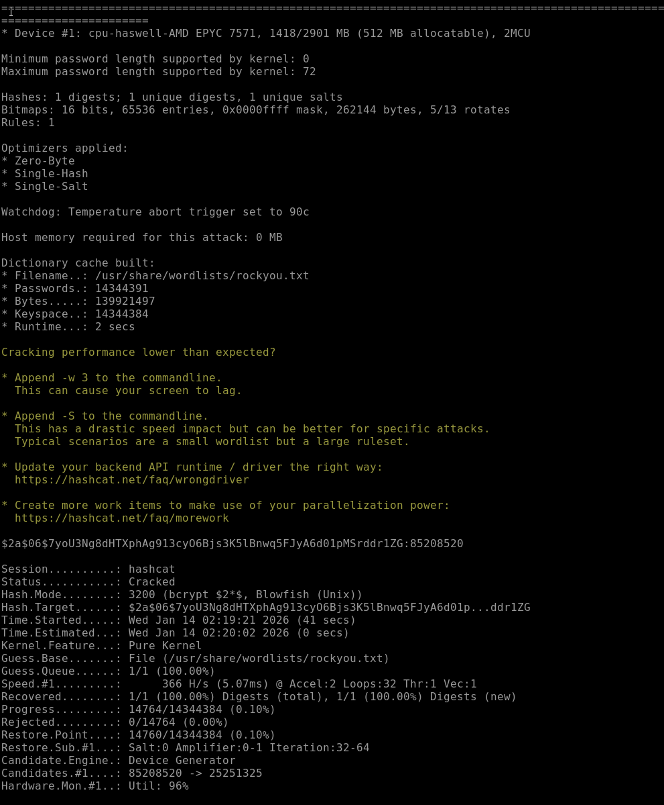

Use hashcat to crack the SHA2-256 hash, 9eb7ee7f551d2f0ac684981bd1f1e2fa4a37590199636753efe614d4db30e8e1, saved in saved in ~/Hashing-Basics/Task-6/hash2.txt.
- halloween

working out:
- hashcat examples page says hash-mode 1400 for SHA2-256 

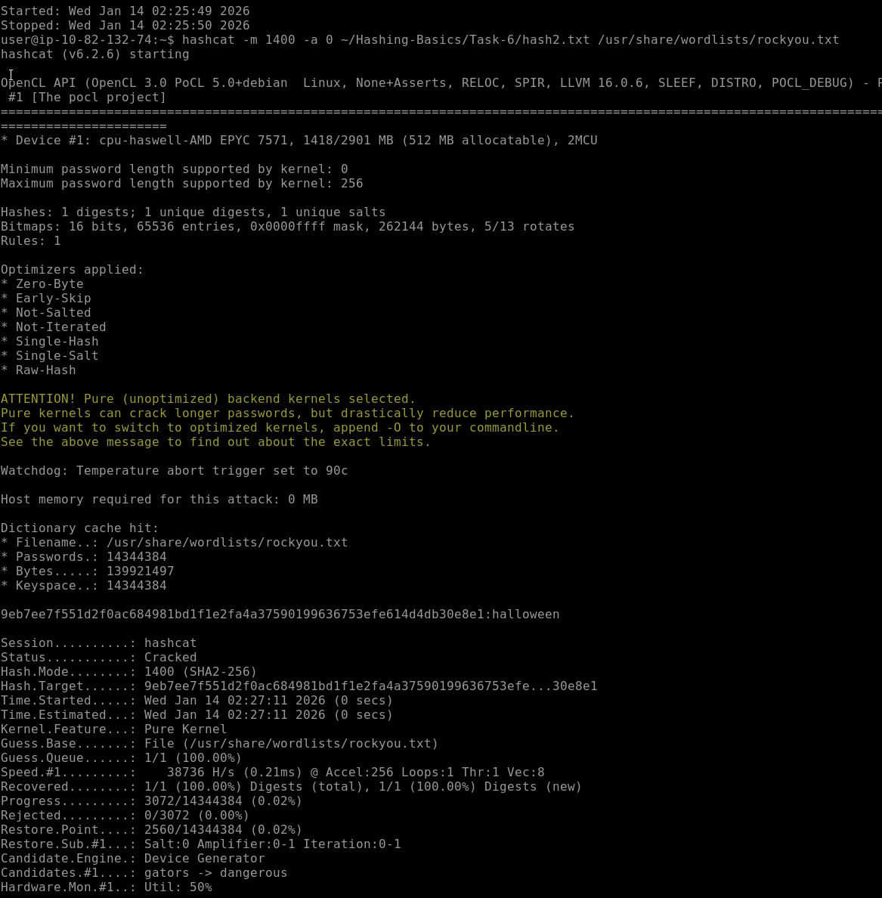

Use hashcat to crack the hash, $6$GQXVvW4EuM$ehD6jWiMsfNorxy5SINsgdlxmAEl3.yif0/c3NqzGLa0P.S7KRDYjycw5bnYkF5ZtB8wQy8KnskuWQS3Yr1wQ0, saved in ~/Hashing-Basics/Task-6/hash3.txt.
- spaceman

working out: 
- $6$ suggests its sha512crypt
- examples page says 1800 hash-mode for sha512crypt

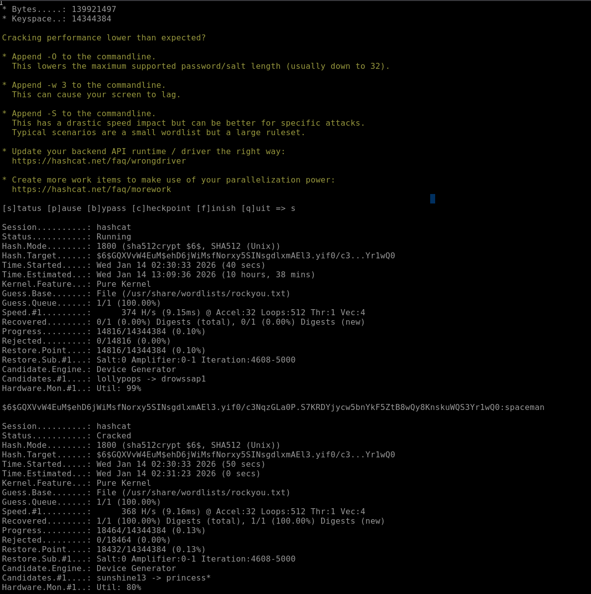

Crack the hash, b6b0d451bbf6fed658659a9e7e5598fe, saved in ~/Hashing-Basics/Task-6/hash4.txt.
- funforyou

working out:
- the hint suggested to use an online tool

Hashing for Integrity Checking
- in task 3 we mentioned that we would focus on 2 types of hashing: password storage and data integrity
- we have extensively discussed how hashing secures passwords in authentication systems
- in this task we will discuss how we can use hash functions to check the integrity of files

Integrity Checking
- hashing can be used to check that files havent been changed
- if you put the same data in you always get the same data out
- even if a single bit changes the hash will change significantly as demonstrated in task 2
- this means you can use it to check that files havent been modified or to ensure that the file you downloaded is identical to the file on the web server
- the text file listed below shows the SHA256 hash of two Fedora Workstation ISO files
- if running 'sha256sum' on the file you downloaded returned the same hash listed in this signed file...
- you can be confident that your file is identical to the official one

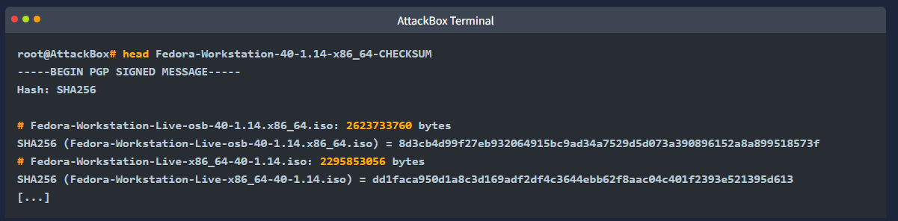

- you can also use hashing to find duplicate files
- if 2 documents have the same hash they are the same document
- this is very convenient for finding and deleting duplicate files

HMACs
- HMAC (Keyed-Hash Message Authentication Code) is a type of message authentication code (MAC) 
- that uses a cryptographic hash function in combination with a secret key to verify the authenticity and integrity of data

- an HMAC can be used to ensure that the person who created the HMAC is who they say they are i.e. aithenticity is confirmed...
- moreover it proves that the message hasnt been modified or corrupted i.e. integrity is maintained
- this is achieved through the use of a secret key to prove authenticity and a hashing algoirthm to produce a hash and prove integrity

- the following steps give you a fair idea of how HMAC works:

1. The secret key is padded to the block size of the hash function

2. The padded key is XORed with a constant (usually a block of 0s or 1s)

3. The message is hashed using the hash function with the XORed key

4. The result from step 3 is then hashed again with the same hash function but using the padded key XORed with another constant

5. The final output is the HMAC value, typically a fixed-size string

- the illustration below should clarify the steps

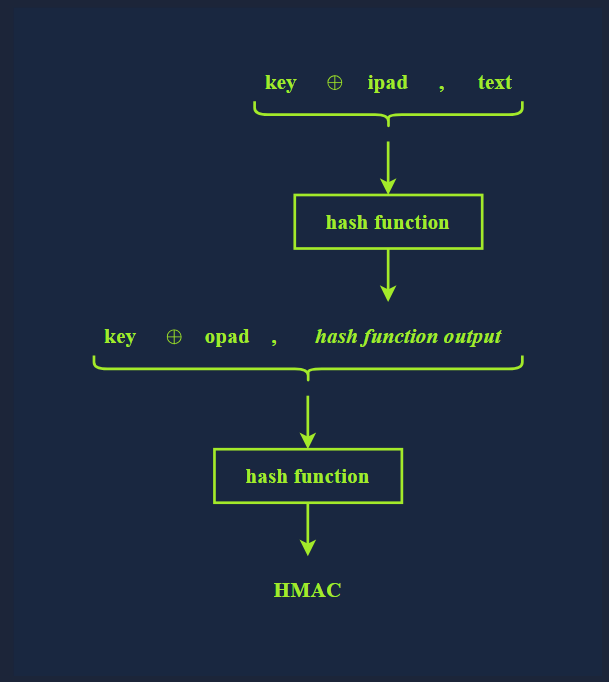

- technically speaking the HMAC function is calculated using the following expression:
- HMAC(K,M) = H((K⊕opad)||H((K⊕ipad)||M))

- note that M and K represent the message and the key, respectively

What is SHA256 hash of libgcrypt-1.11.0.tar.bz2 found in ~/Hashing-Basics/Task-7?
- 09120c9867ce7f2081d6aaa1775386b98c2f2f246135761aae47d81f58685b9c

What’s the hashcat mode number for HMAC-SHA512 (key = $pass)?
- 1750

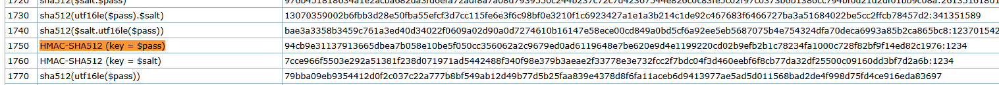

Conclusion
- this room covered hashing functions and their uses from various perspectives
- before moving on we should distinguish between hashing, encoding and encryption

Hashing
- as already stated is a process that takes input data and produces a hash value, a fixed-size string of characters also referred to as a digest
- this hash value uniquely represents the data, and any change in the data, no matter how small, should lead to a change in the hash value
- hashing should not be confused with encryption or encoding; hashing is one-way and you cant reverse the process to get the original data

Encoding
- converts data from one form to another to make it compatible with a specific system
- ASCII, UTF-8, UTF-16, UFT-32, ISO-8859-1 and Windows-1252 are valid encoding methods for the English language
- note that UTF-8, UTF-16, and UTF-32 are Unicode encodings and they can represent characters from other languages such as Arabic and Japanese

- another type of encoding commonly used when sending or saving data is not for any specifiic language
- examples include Base32 and Base64 encoding
- consider the following example of using base64 to encode and decode

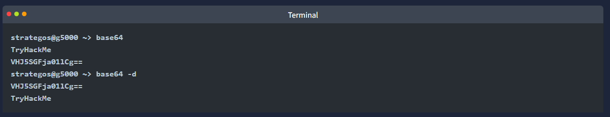

- encoding shuld not be confused with encryption, as using specific encoding does not protect the confidentiality of the message
- encoding is reversible; anyone can change the data encoding with the right tools

Encryption
- only encryption which we covered in the previous rooms, protects data confidentiality using a cryptographic cipher and a key
- encryption is reversible, provided we know the cipher and can access the key

- to continue with this module join the John the Ripper room
- if you would like to gain more in-depth info about cryptography at this stage consider this room (https://tryhackme.com/room/cryptographyintro)
- that dives into more concepts and showcases more tools related to cryptography

Use base64 to decode RU5jb2RlREVjb2RlCg==, saved as decode-this.txt in ~/Hashing-Basics/Task-8. What is the original word?
- ENcodeDEcode

