Introduction
- John the Ripper is a well-known, well-loved and versatile hash-cracking tools
- it combines a fast cracking speed with an extraordinary range of compatible hash types

Learning Objectives
- upon the completion of this room youll learn about using John for:
- Cracking Windows authentication hashes
- Crack /etc/shadow hashes
- Cracking password-protected Zip files
- Cracking password-protected RAR files
- Cracking SSH Keys

Basic Terms
- this room requires basic knowledge of various cryptography terms
- for your convenience we review the most relevant terms and concepts before we move into proactical hash cracking

What are Hashes?
- a hash is a way of taking a piece of data of any length and representing it an another fixed-length form
- this process masks the original value of the data
- the hash value is obtained by running the original data through a hashing algorithm
- many popular hashing algorithms exist such as MD4, MD5, SHA1 and NTLM

- if we wake "polo" as a string of four characters and run it through an MD5 hashing algorithm we end up with an output of 'b53759f3ce692de7aff1b5779d3964da'
- a standard 32-character MD5 hash

- likewise if we take "polomints" a string of 9 characters and run it through the same MD5 hashing algorithm we end up with an output of 584b6e4f4586e136bc280f27f9c64f3b'
- another standard 32-character MD5 hash

What Makes Hashes Secure?
- hashing functions are designed as one-way functions 
- in other words it is easy to caclculate the hash value of a given input
- however it is a hard problem to find the original input given the hash value
- in simple terms a hard problem quickly becomes computationally infeasible in computer science
- the computational problem has its roots in mathematics as P vs NP

- P (Polynomial Time): Class P covers the problems whose solution can be found in polynomial time. Consider sorting a list in increasing order. The longer the list, the longer it would take to sort; however, the increase in time is not exponential

- NP (Non-deterministic Polynomial Time): Problems in the class NP are those for which a given solution can be checked quickly, even though finding the situation itself might be hard. In fact, we dont know if there is a fast algorithm to find the solution in the first place

- while this is a fascinating mathematical concept that proves fundamental to computing and cryptography, it is entirely outside the scope of this room
- but abstractly, the algorithm to hash the value will be "P" and can, therefore, be calculated reasonably
- however "un-hashing" an algorithm would be "NP" and intractable to solve, meaning that it cannot be computed in a reasonable time using standard computers

Where John Comes in
- even though the algorithm is not feasibly reversible, that doesnt mean that cracking the hashes is impossible
- if you have the hashed version of a password, for example, and you know the hashing algorithm...
- you can use that hashing algorithm to hash a large number of words, called a dictionary
- you can then compare these hashes to the one youre trying to crack to see if they match
- if they do, you know what word corresponds to that hash - youve cracked it

- this process is called a dictionary attack, and John the Ripper or John as its commonly shortened
- is a tool for conducting fast brute force attacks on various hash types

- this room focuses on the most popular extended version of John the Ripper, Jumbo John

What is the most popular extended version of John the Ripper?
- Jumbo Jonh

Setting Up Your System
- throughout this room we will use the following
- Jumbo John version of John the Ripper
- the RockYou password list

- if using the attached virtual machine or the attackbox you dont need to install John the Ripper on your system
- consequently can skip this section
- if you prefer to use your system to follow along, read along to learn how to proceed with the installation
- using a version of John the Ripper other than Jumbo John, you might not have some of the required tools zip2john and rar2john

Installation
- John the Ripper is supported on many OS, not just linux
- there are multiple versions of John, the standard "core" distro, and multiple community editions
- which extend the feature set of the original John distro
- the most popular of these distros is the Jumbo John which we will use specific features of later

AttackBox and Kali
- Jumbo John is already installed on the attached VM and on the AttackBox
- offensive Linux distros like Kali are shipped with Jumbo John installed
- you can double check by typing 'john' into the terminal
- you should be met with a user guide for John with the 1st line reading "John the Ripper 1.9.0-jumbo-1" or something similar with different version number

Other Linux Distros
- many Linux distros have John the Ripper available for installation from their official repos
- for instance on Fedora you can install John the Ripper with 'sudo dnf install john'
- while on Ubuntu you can install it with 'sudo apt install john'
- unfortunately at the time of writing these versions provided core functionality and missed some of the tools available through Jumbo John
- consequently you need to consider building from source to access all the tools available via Jumbo John
- the official installation guide provides detailed installation and build config instructions
- https://github.com/openwall/john/blob/bleeding-jumbo/doc/INSTALL

Installing on Windows
- to install Jumbo John the Ripper on Windows, you need to download and installed the zipped binary for either
- 64-bit systems (https://www.openwall.com/john/k/john-1.9.0-jumbo-1-win64.zip)
- or 32-bit systems (https://www.openwall.com/john/k/john-1.9.0-jumbo-1-win32.zip)

Wordlists
- now that we have John ready we must consider another indispensable component: wordlists

- as we mentioned earlier to use a dictionary attack against hashes you need a list of words to hash and compare; unsuprisingly this is called a wordlist
- there are many different wordlists out there, and a good collection can be found in the SecLists repo (https://github.com/danielmiessler/SecLists)
- there are a few places you can look for wordlists for attacking the system of choice; we will quickly run through where you can find them

- on the attackbox and kali linxu distros the /usr/share/wordlists directory contains a series of great wordlists

RockYou
- for all of the tasks in this room we will use the infamous rockyou.txt wordlist
- a very large common password wordlist obtained from a databreach on a website called rockyou.com in 2009
- if you are not using the above distros you can get the rockyou.txt wordlist from the SecLists repo under the /Passwords/Leaked-Databases subsection
- you may need to extract it from the .tar.gz format using 'tar xvzf rockyou.txt.tar.gz'

Which website’s breach was the rockyou.txt wordlist created from?
- rockyou.com

Cracking Basic Hashes
- there are mutliple ways to use John the Ripper to crack simple hashes
- we will walk through a few before moving on to cracking some ourselves

John Basic Syntax
- the basic syntax of John the Ripper commands is as follows
- we will cover the specific options and modifiers used as we use them
- 'john [options] [file path]'
- john -> invokes the John the Ripper program
- [options] -> specifies the options you want to use
- [file path] -> the file containing the hash youre trying to crack; if its in the same directory you wont need to name a path, just the file

Automatic Cracking
- John has built-in features to detect what type of hash its being given and to select appropriate rules and formats to crack it for you
- this isnt always the best idea as it can be unreliable, but if you cant identify what hash your working with and want to try cracking it, it can be a good option
- to do this we use the following syntax:

- 'john --wordlist=[path to wordlist] [path to file]'
- --wordlist= -> specifies using wordlist mode, reading from the file that you supply in the provided path
- [path to wordlist] -> the path to the wordlist youre using as described in the prev task

Example Usage
- john --wordlist=/usr/share/wordlists/rockyou.txt hash_to_crack.txt

Identifying Hashes
- sometimes John wont play nicely with automatically recognising the and loading hashes but thats okay
- we can use other tools to identify the hash and then set John to a specific format
- there are multiple ways to do this such as using an online hash identifier like this site (https://hashes.com/en/tools/hash_identifier)
- a tool that is liked is called hash-identifier (https://gitlab.com/kalilinux/packages/hash-identifier/-/tree/kali/master)
- its a Python tool that is super easy to use and will tell you what different types of hashes the one you enter is likely to be, giving you more options if the first one fails

- to use hash-identifier you can use 'wget' or 'curl' to download the Python file 'hash-id.py' from its GitLab page (https://gitlab.com/kalilinux/packages/hash-identifier/-/raw/kali/master/hash-id.py)
- then launch it with 'python3 hash-id.py' and enter the hash you're trying to identify
- it will give you a list of the most probable formats 
- these two steps are shown in the terminal below

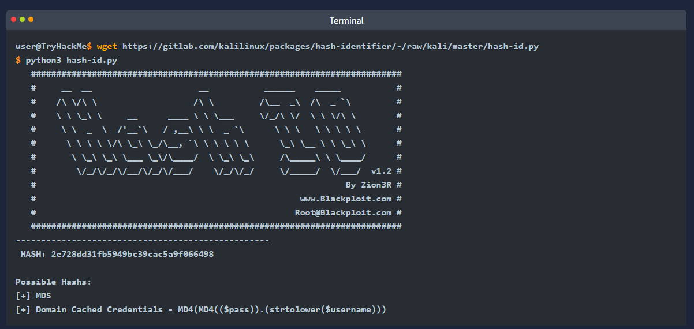

Format-Specific Cracking
- once you have identified the hash that youre dealing with yo ucan tell John to use it while cracking the provided hash using the following syntax:
- 'john --forma=[format] --wordlist=[path to wordlist] [path to file]'
- '--format-' -> this is the flag to tell John that youre giving it a hash of a specific format and to use the following format to crack it
- '[format]' -> the format that the has is in

Example Usage
- john --format=raw-md5 --wordlist=/usr/share/wordlists/rockyou.txt hash_to_crack.txt

A Note on Formats
- when you tell John to use formats, if youre dealing with a standard hash type e.g. md5 as in the example above...
- you have to prefix it with 'raw-' to tell John youre just dealing with a standard hash type, though this doesnt always apply
- to check if you need to add the prefix or not you can list all of John's formats using 'john --list=fornats' and either check manuall or grep for your hash type using something like 'john --list=formats | grep -iF "md5"'

Practical
- now that you know the syntax, modifiers and methods for cracking basic hashes try it yourself
- the files are located in '~/John-the-Ripper-The-Basics/Task04/' on the attached VM

What type of hash is hash1.txt?
- md5

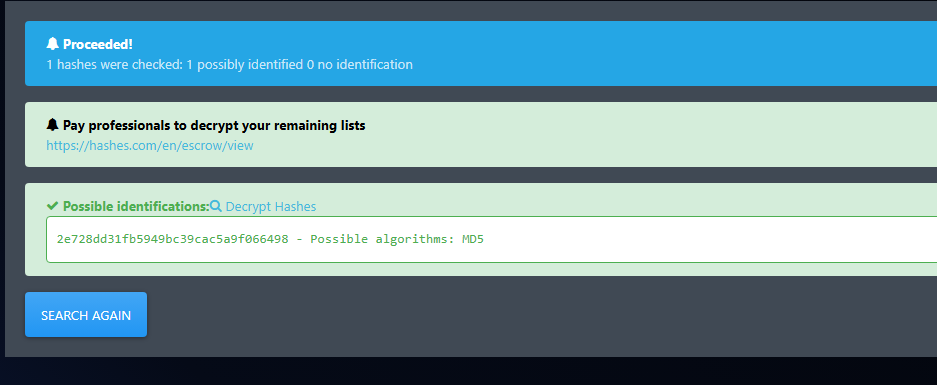

What is the cracked value of hash1.txt?
- biscuit

What type of hash is hash2.txt?
- SHA1

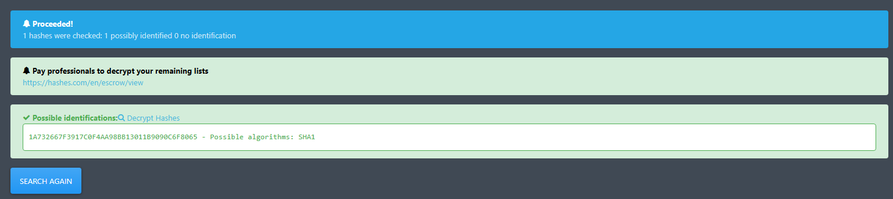

What is the cracked value of hash2.txt?
- kangeroo

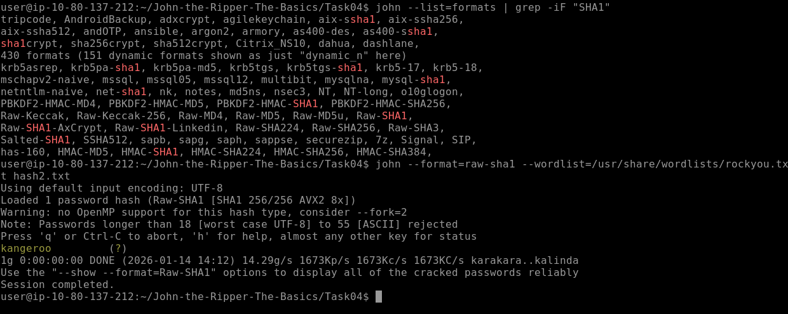

What type of hash is hash3.txt?
- SHA256

What is the cracked value of hash3.txt?
- microphone

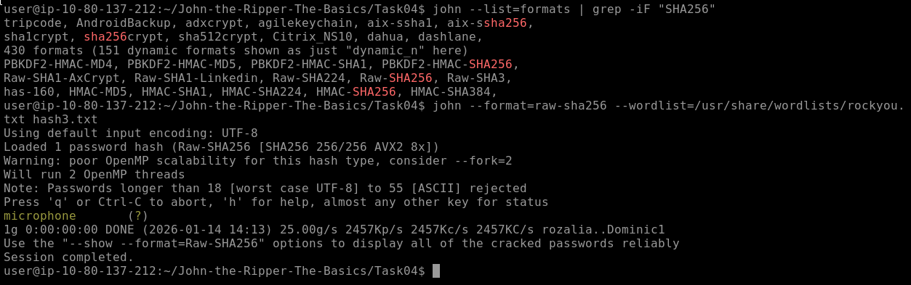

What type of hash is hash4.txt?
- Whirlpool

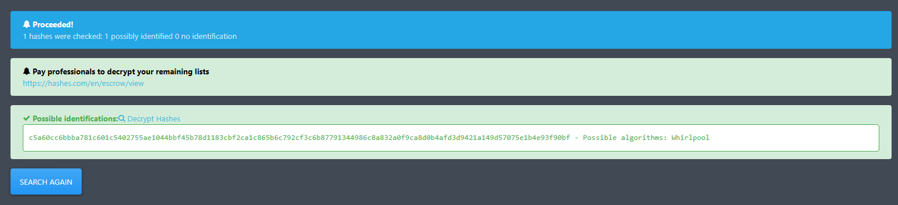

What is the cracked value of hash4.txt?
- colossal

Cracking Windows Authentication Hashes
- now that we understand the basic syntax and usage of John the Ripper
- lets move on to cracking something more complicated
- something that you may even want to attempt if you are on an actual Pen Test team or Read Team engagement
- authentication hashes are the hashed versions of passwords stored by operating systems
- it is sometimes possible to crack them using our brute-force methods
- to get your hands on these hashes you must often already be a privileged user
- so we will explain some of the hashes we plan on cracking as we attempt them

NTHash / NTLM
- NTHash is the hash format modern Windows OS machines use to store user and service passwords
- its also commonly referred to as NTLM which references previous version of Windows format for hashing passwords known as LM, thus NT/LM

- a bit of history:
- the NT designation for Windows products originally meant New Technology
- it was used starting with Windows NT to denote products not build from the MS-DOS operating system
- eventually the "NT" line became the standard OS type to be released by Microsoft
- and the name was dropped but it still lives on in the names of some Microsoft technologies

- in Windows SAM (Security Account Manager) is used to store user account info, including usernames and hashed passwords
- you can aquire the NThash/NTLM hashes by dumping the SAM database on a windows machine
- using a tool like Mimikatz or using the Active Directory database 'NTDS.dit'
- you may not have to crack the hash to continue privilege escalation 
- as you often conduct a "pass the hash" attack instead
- but sometimes, hash cracking is a viable option if there is a weak password policy

Practical
- now that you know the hisotry behind it
- see if you can use the techniques we practised in the last task and the knowledge of what type of hash this is to crack the ntlm.txt file
- the file is located in '~/John-the-Ripper-The-Basics/Task05/'

What do we need to set the --format flag to in order to crack this hash?
- NT

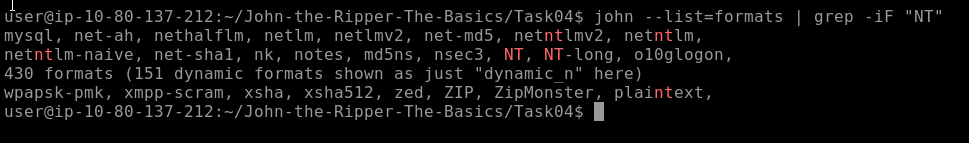

What is the cracked value of this password?
- mushroom

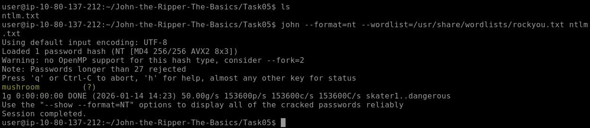

Cracking /etc/shadow Hashes
- the /etc/shadow file is the file on Linux machines where password hashes are stored
- it also stores other information such as the data of last password change and password expiration info
- it contains one entry per line for each user or user account of the system
- the file is usually only accessible by the root user
- so you must have sufficient privileges to access the hashes
- however if you do, there is a chance that you will be able to crack some of the hashes

Unshadowing
- John can be very particular about the formats it needs data in to be able work with it
- for this reason to crack /etc/shadow passwords...
- you must combine it with the /etc/passwd file for John to understand the data its being given
- to do this we use a tool built into the John suite of tools called 'unshadow'
- the basic syntax of 'unshadow' is as follows:

- 'unshadow [path to passwd] [path to shadow]'

- 'unshadow' -> invoked the unshadow tool
- '[path to passwd]' -> the file that contains the copy of the /etc/passwd file youve taken from the target machine
- '[path to shadow]' -> the file that contains the copy of the /etc/shadow file youve taken from the target machine

Example Usage:
- unshadow local_passwd local_shadow > unshadowed.txt

Note on the files
- when using 'unshadow' you can either use the entire /etc/passwd and /etc/shadow files
- assuming you have them available 
- or you can use the relevant line from each, for example...

File 1 - local_passwd
- contains the /etc/passwd line for the root user:
- root:x:0:0::/root/bin/bash

File 2 - local_shadow
- contains the /etc/shadow line for the root user:
- root:$6$2nwjN454g.dv4HN/$m9Z/r2xVfweYVkrr.v5Ft8Ws3/YYksfNwq96UL1FX0OJjY1L6l.DS3KEVsZ9rOVLB/ldTeEL/OIhJZ4GMFMGA0:18576::::::

Cracking
- we can then feed the output from 'unshadow' 
- in our example use case we called 'unshadowed.txt' directly into John
- we should not need to specify a mode here as we have made the input specifically for John
- however in some cases, you will need to specify the format as we have done previously using: '--format=sha512crypt'

- john --wordlist=/usr/share/wordlists/rockyou.txt --format=sha512crypt unshadowed.txt

Practical
- now see if you can follow the process to crack the password hawsh of the root user provided in the 'etchashes.txt' file
- good luck the files are located in '~/John-the-Ripper-The-Basics/Task06/'

What is the root password?
- 1234

Single Crack Mode
- so far weve been using Johns wordlist mode to brute-force simple and not-so-simple hashes
- but John also has another mode called the Single Crack mode
- in this mode John only uses the information provided in the username to try and work out possible passwords heuristically by slightly changing the letters and numbers contained in within the username

Word Mangling
- the best way to explain Single Crack mode and word mangling is to go through an example...
- consider the username "Markus"
- some possible password could be:
- Markus1, Markus2, Markus3 (etc)
- MArkus, MARkus, MARKus (etc)
- Markus!, Markus$, Markus* (etc)

- this technique is called word mangling
- John is building its dictionary based on the info it has been fed and uses a set of rules called "mangling rules"
- which define how it can mutate the word it started with to generate a wordlist based on relevant factors for the target youre trying to crack
- this exploits how poor passwords can be based on info about the username or the service theyre logging into

GECOS
- Johns implementation of word mangling also features compatibility with the GECOS field of the UNIX OS
- as well as other UNIX-like OS such as Linux
- GECOS stands for General Electric Comprehensive Operating System
- in the last task we looked at the entries for both /etc/shadow and /etc/passwd
- looking closely you will notice that the fields are seperated by a colon
- the fifth field in the user account record is the GECOS fiel
- it stores general information about the user...
- such as the users full name, office number, and telephone number, among other things
- John can take information stored in those records such as full name and home directory name to add to the wordlist it generates when cracking /etc/shadow hashes with Single Crack mode

Using Single Crack Mode
- to use Single Crack mode we use roughly the same syntax that weve used so far
- for example if we wanted to crack the password of the user name "Mike" using the Single mode wed use:
- john --single --format=[format] [path to file]
- '--single' -> this flag lets John know you want to use the Single hash-cracking mode
- '--format=[format]' -> as always it is vital to identify the proper format

Example Usage
- john --single --format=raw-sha256 hashes.txt

A Note on File Formats in Single Crack mode
- if you are cracking hashes in single crack mode...
- you need to change the file format that youre feeding John for it to understand what data to create a wordlist from
- you do this by prepending the hash with the username that the hash belongs to
- so according to the above example we would change the file 'hashes.txt'

- From 1efee03cdcb96d90ad48ccc7b8666033
- To mike:1efee03cdcb96d90ad48ccc7b8666033

Practical
- now that youre familiar with the syntax for Johns single crack mode
- access the hash and crack it
- assuming that the user it belongs to is called "Joker"
- the file is located in '~/John-the-Ripper-The-Basics/Task07/'

What is Joker’s password?
- Jok3r

working out:
- first nano the file hash07.txt and append joker: to the start
- work out what type of hash it is using online tool -> md5

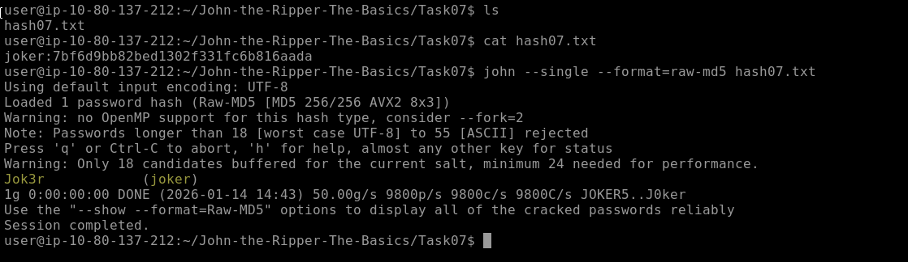

Custom Rules
- as we explored what John can do in Single Crack Mode
- you may have some ideas about some good mangling patterns or what patterns your passwords often use that could be replicated with a particular mangling pattern
- the good news is that you can define your rules...
- which John will use to create passwords dynamically
- the ability to define such rules is beneficial when you know more information about the password structure of whatever your target it

Common Custom Rules
- many orgs will require a certain level of password complexity to try and combat dictionary attacks
- in other words when creating a new acc or changing your password...
- if you attempt a password like 'polopassword' it will most likely not work
- the reason would be the enforced password complexity
- as a result you may receive a prompt telling you that passwords have to contain at least one character from each of the following:

- Lowercase letter
- Uppercase letter
- Number
- Symbol

- password complexity is good
- however we can exploit the fact that most users will be predictable in the location of these symbols
- for the above criteria many users will use something like the following:
- 'Polopassword1!' 

- consider the password with a capital letter first and a number followed by a symbol at the end
- this familiar pattern of the password, appended and prepended by modifiers (such as capital letters or symbols)
- is a memorable pattern that people use and reuse when creating passwords
- this pattern can let us exploit password complexity preditability

- now this does meet the password complexity requirements...
- however, as attackers, we can exploit the fact that we know the likely position of these added elements to create dynamic passwords from our wordlists

How to create Custom Rules
- custom rules are defined in the 'john.conf' file
- this file can be found in '/opt/john/john.conf' on the TryHackMe attackbox
- it is usually located in '/etc/john/john.conf' if you have installed John using a pkg manager or built from source with 'make'

- lets go over the syntax of these cutom rules
- using the example above as our target pattern
- note that you can define a massive level of granular control in these rules
- i suggest looking at the wiki (https://www.openwall.com/john/doc/RULES.shtml)
- to get a full view of the modifiers you can use and more examples of rule implementation

- the first line
- '[List.Rules:THMRules]' is used to define the name of your rule; this is what you will use to call your custom rule a John argument

- we then use regex style pattern match to define where the word will be modified
- again, we will only cover the primary and most common modifiers here:

- 'Az' -> takes the word and appends it with the characters you define
- 'A0' -> takes the word and prepends it with the characters you define
- 'c' -> capitalises the character positionally

- these can be used in combination to define where and what in the word you want to modify

- lastly we must define what characters should be appended, prepended or otherwise included
- we do this by adding character sets in the square bracket [ ]
- where they should be used
- these follow the modifier patterns inside the double quotes " " 
- here are some common examples:

- '[0-9]' -> will include numbers 0-9
- '[0]' -> will include only the number 0
- '[A-z]' -> will include both upper and lowercase
- '[A-Z]' -> will include only uppercase letters
- '[a-z]' -> will include only lowercase letters

- please note that:

- '[a]' -> will only include 'a'
- '[!£$%@]' -> will include the symbols '!', '£', '$', '%', and '@'

- putting this all together to generate a wordlist from the rules that would match the example password 'Polopassword1!'
- (assuming the word 'polopassword' was in our wordlist)
- we could create a rule entry that looks like this:

- [List.Rules:PoloPassword]
- cAz"[0-9] [!£$%@]"

- utilises the following:

- 'c' -> capitalises the first letter
- 'Az' -> appends to the end of the word
- '[0-9]' -> a number in the range 0-9
- '[!£$%@]' -> the password is followed by one of these symbols

Using Custom Rules
- we could then call this custom rule a John argument using the '--rule=PoloPassword' flag

- as a full command:
- john --wordlist=[path to wordlist] --rule=PoloPassword [path to file]

- as a note i find it helpful to talk out patterns if youre writing a rule
- as shown above, the same applies to writing RegEx patterns

- Jumbo John already has an extensive list of custom rules containing modifiers for use in almost all cases
- if you get stuck try looking at those rules (around line 678)
- if your syntax isnt working correctly

- now its time for us to try!

What do custom rules allow us to exploit?
- Password Complexity Predictibility

What rule would we use to add all capital letters to the end of the word?
- Az"[A-Z]"

What flag would we use to call a custom rule called THMRules?
- --rule=THMRules

Cracking Password Protected Zip Files
- yes! you read that right
- we can use John to crack the password on password-protected ZIP files
- again well use a seperate part of the John suite of tools to conver the ZIP file into a format that John will understand
- but well use the syntax youre already familiar with for all intents and purposes

Zip2John
- similarly to the 'unshadow' tool we used previously...
- we will use the 'zip2john' tool to convert the ZIP file into a hash format that John can understand and hopefully crack
- the primary usage is like this:

- zip2john [options] [zip file] > [output file]

- '[options]' -> allows you to pass specific checksum options to 'zip2john'; this shouldnt often be necessary
- '[zip file]' -> the path the the ZIP file you wish to get the hash of
- '>' -> this redirects the output from this command to another file
- '[output file]' -> this is the file that will store the output

Example Usage:
- zip2john zipfile.zip -> zip_hash.txt

Cracking
- were then able to take the file we output from 'zip2john' in our example use case 'zip_hash.txt'
- and, as we did with 'unshadow', feed it directly into John as we have made the input specifically for it

- john --wordlist=/usr/share/wordlists/rockyou.txt zip_hash.txt

Practical
- now have a go at cracking a "secure" ZIP file
- the file is located in '~/John-the-Ripper-The-Basics/Task09/'

What is the password for the secure.zip file?
- pass123

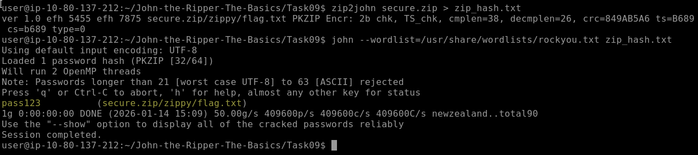

What is the contents of the flag inside the zip file?
- THM{w3ll_d0n3_h4sh_r0y4l}

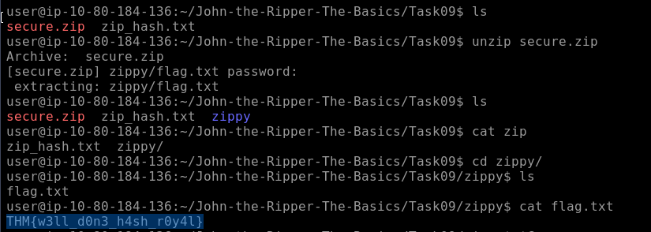

Cracking a Password-Protected RAR Archive
- we can use a similar process to the one we used in the last task to obtain the password for RAR archives
- if you arent familiar RAR archives are compressed files created by the WinRAR archive manager
- like ZIP files they compress folders and files

Rar2John
- almost identical to the 'zip2john' tool
- we will use the 'rar2john' tool to conver the RAR file into a hash format that John can understand
- the basic syntax is as follows:

- rar2john [rar file] > [output file]

- 'rar2john' -> invokes the rar2john tool
- '[rar file]' -> the path to the RAR file you wish to get the hash of
- '>' -> this redirects the output of this command to another file
- '[output file]' -> this is the file that will store the output from the command

Example Usage:
- /opt/john/rar2john rarfile.rar > rar_hash.txt

Cracking
- once again we can take this file we output from 'rar2john' in our example case, 'rar_hash.txt'
- and feed it directly into John as we did with 'zip2john'

- john --wordlist=/usr/share/wordlists/rockyou.txt rar_hash.txt

Practical
- now have a go at cracking a "secure" RAR file
- the file is located in '~/John-the-Ripper-The-Basics/Task10/;

What is the password for the secure.rar file?
- password

What are the contents of the flag inside the rar file?
- THM{r4r_4rch1ve5_th15_t1m3}

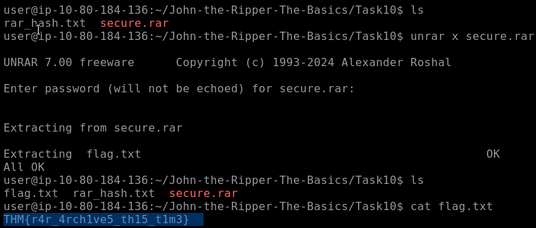

Cracking SSH Key Passwords
- lets explore one more use of John that comes up semi-frequently in CTF challenges
- using John to crack the SSH private key passwords of 'id_rsa' files
- unless configured otherwise you authenticate your SSH login using a password
- however you can configure key-based authentication...
- which lets you use your private key 'id_rsa' as an authentication key to log into a remote machine over SSH
- however doing so will often require a password to access the private key
- here, we will be using John to crack this password to allow authentication over SSH using the key

SSH2John
- who couldve guessed it! another conversion tool...
- as the name suggests 'ssh2john' converts the 'id_rsa' private key, which is used to log in to the SSH session
- into a hash format that John can work with
- the syntax is is about what youd expect
- note that if you dont have 'ssh2john' installed you can use 'ssh2john.py' located in the '/opt/john/ssh2john.py'
- if you are doing this on the attackbox replace the 'ssh2john' command with 'python3 /opt/john/ssh2john.py'
- or on Kali 'python /usr/share/john/ssh2john.py'

- ssh2john [id_rsa private key file] > [output file]

- 'ssh2john' -> invokes the 'ssh2john' tool
- '[id_rsa private key file]' -> the path to the id_rsa file you wish to get the hash of
- '>' -> this is the output director, were using it to redirect the output from this command to another file
- '[output file]' ->  this is the file that will store the output from

Example Usage
- /opt/john/ssh2john.py id_rsa > id_rsa_hash.txt

Cracking
- for the final time, were feeding the file we output from ssh2john, which in our example use case is called id_rsa_hash.txt
- and as we did with rar2john we can use this seamlessly with John

- john --wordlist=/usr/share/wordlists/rockyou.txt id_rsa_hash.txt

Practical
- now id like you to crack the hash of the id_rsa file relevant to this task
- the file is located in '~/John-the-Ripper-The-Basics/Task11/'

What is the SSH private key password?
- mango

Further Reading
- its recommended to check out the Openwall Wiki (https://www.openwall.com/john/)
- for more information about using John and advice, updates or news about the tool