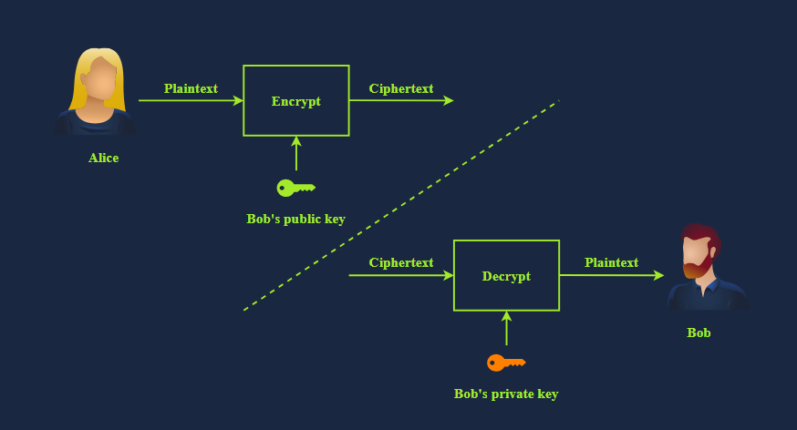
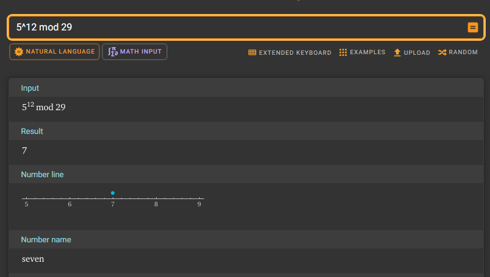
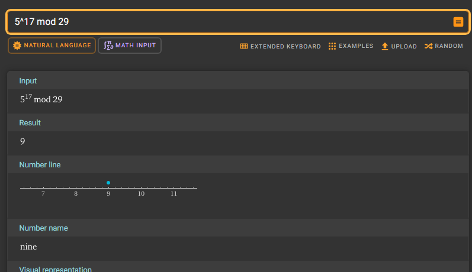
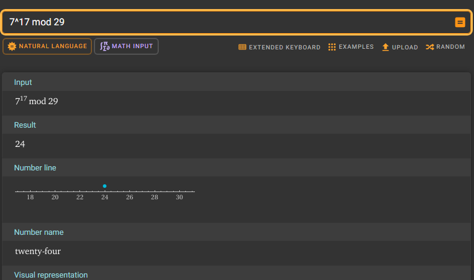
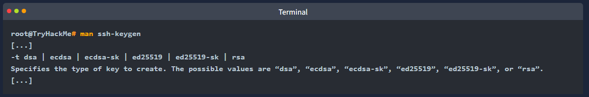
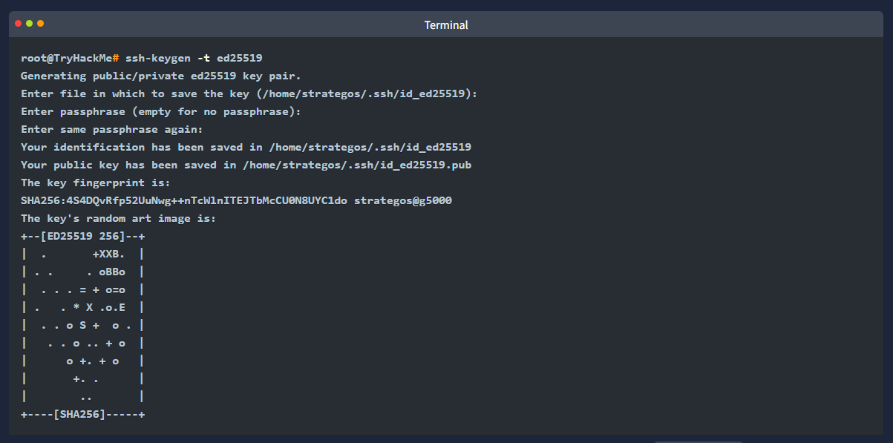
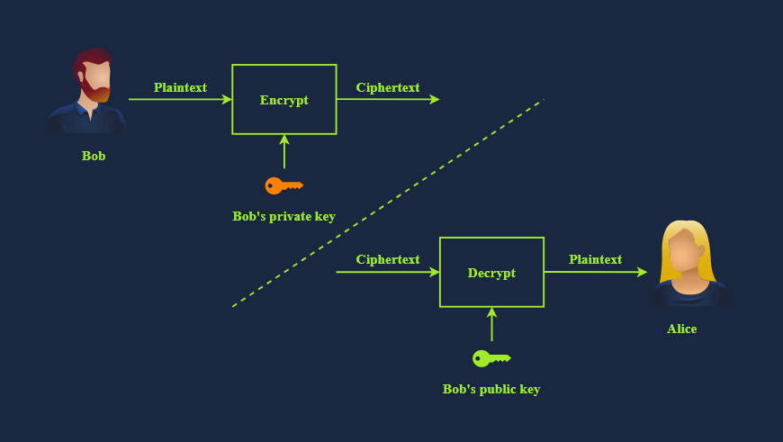

Introduction
- consider the following scenario from everyday life
- lets say you are meeting a business partner over coffee and discusssing somewhat confidential business plans
- lets break down the meeting from the security perspective

- you can see and hear the other person; consequently it is easy to be sure of their identity. thats authentication i.e. you are confirming the identity of the person of who you are talking with
- you can also confirm that what you are "hearing" is coming from your business partner. you can tell what words and sentences are coming from your business partner and what is coming from others. that is authenticity i.e. you verifying that the message genuinely comes from a specific sender. moreover you know that whay they are saying is reaching you, and there is no chance of anything changing the other partys words across the table. thats integrity i.e. ensuring that the data has not been altered or tampered with
- finally you can pick a seat away from other customers and keep your voice low so that only your business partner can hear you. thats confidentiality i.e. only the authorised parties can access the data

- lets quickly compare this with the correspondence in the cyber realm
- when someone sends you a text message how can you be sure they are who they claim to be?
- how can you be sure that nothing changed the text as it travelled across various network links?
- when you are communicating with your business partner over an online messaging platform you need be sure of the following:

- Authentication: You want to be sure you communicate with the right person, not someone else pretending
- Authenticity: You can verify that the information comes from the claimed source
- Integrity: You must ensure that no one can change the data you exchange
- Confidentiality: You want to prevent an unathorised part from eavesdropping on your conversations

- cryptography can provide solutions to satisfy the above requirements among many others
- private key cryptography i.e. symmetric encryption mainly protects confidentiality
- however public key cryptography i.e. asymmetric encryption plays a significant role in authentication, authenticity and integrity
- this room will show various examples of how public key cryptography achieves that

Learning Objectives
- in this room we will cover various asymmetric cryptosystems and applications that use them such as:
- RSA
- Diffie-Hellman
- SSH
- SSL/TLS Certificates
- PGP and GPG

Common Uses if Asymmetric Encryption
- exchanging keys for symmetric encryption is a widespread use of asymmetric cryptography
- asymmetric encryption is relatively slow compared to symmetric encryption
- therefore we rely on asymmetric encryption to negotiate and agree on symmetric encryption ciphers and keys
- but the question is...
- how do you agree on a key with the server without transmitting the key for people snooping to see?

Analogy
- imagine you have a secret code for communicating and instructions for using the secret code
- the question is how can you send these instructions to your friend without anyone else being able to read them?
- the answer is more straightforward than it seems...
- you could ask your friend for a lock
- only your friend has the key for this lock, and well assume you have an indestructible box you can lock with it

- if you send the instructions in a locked box to your friend, they can unlock it once it reaches them and read the instructions
- after that you can communicate using the secret code without the risk of people snooping

- in this metaphor the secret code represents a symmertric encryption cipher and key
- the lock represents the servers public key
- and the key represents the servers private key

- consequently you would only need to use asymmetric encryption once so that it wont affect the speed
- and then you can communicate privately using symmetric encryption

The Real World
- in reality you need more cryptography to veriify that the person youre talking to is who they say they are
- this is achieved using digital signatures and certificates which we will visit later in this room

In the analogy presented, what real object is analogous to the public key?
- lock

RSA
- RSA is a public-key encryption algorithm that enables secure data transmission over insecure channels
- with an insecure channel we expect adversaries to eavesdrop on it

The Math That Makes RSA Secure
- RSA is based on the mathematically difficult problem of factoring a large number
- multiplying two large prime numbers is a straightforward operation
- however finding the factors of a huge number takes much more computing power

- its simple to multiply two prime numbers together even on paper say 113 * 127 = 14351
- even for larger prime numbers it would still be a feasible job even by hand
- consider the following numeric example:
- Prime Number 1: 982451653031
- Prime Number 2: 169743212279
- Their product: 982451653031 × 169743212279 = 166764499494295486767649

- on the other hand its pretty difficult to determine what two prime numbers multiply together to make 14351 abd even more challenging to find the factors of 166764499494295486767649

- in real-world examples the prime numbers would be much bigger than the ones in this example
- a computer can easily factorise 166764499494295486767649
- however it cannot factorise a number with more than 600 digits
- and you would agree that the multiplication of two huge prime numbers each around 300 digits would be easier than the factorisation of their product

Numerical Example
- lets revisit encryption, decryption and key usage in asymmetric encryption
- the public key is known to all correspondents and is used for encryption while the private key is protected and used for decryption as shown in the figure below

- in the cryptography basics room we explained the modulo operation and said it plays a significant role in cryptography
- in the following simplified numerical example we see the RSA algorithm in action

1. Bob chooses two prime numbers, p = 157 and q = 199. He calculates n = p * q = 31243
2. With ϕ(n) = n - p - q + 1 = 31243 - 157 - 199 + 1 = 30888, Bob selects e = 163 such that e is relatively prime to ϕ(n); moreover he selects d = 379 where e * d = 1 mod ϕ(n) i.e. e * d = 163 * 379 = 61777 and 61777 mod 30888 = 1. The public key is (n,e) i.e. (31243,163) and the private key is $(n,d) i.e. (31243,379)
3. Let's say that the value they want to decrypt is x = 13, then Alice would calculate and send y = x^e mod n = 13163 mod 31243 = 16341
4. Bob will decrypt the received value by calulating x = y^d mod n = 16341^379 mod 31243 = 13. This way Bob recovers the value that Alice sent.

- the proof that the above algorithm works can be found in modular arithmetic and is beyond the scope of this module
- https://www.britannica.com/science/modular-arithmetic
- it is worth repeating in this example, we picked a three-digit prime number while in actual application p and q would be at least a 300-digit prime number each

RSA in CTFs
- the math behind RSA comes up relatively often in CTFs, requiring you to calculate variables or break some encryption based on them
- many good articles online explain RSA and they will give you almost all of the information you need to complete the challenged 
- one good example of an RSA CTF challenge is the Breaking RSA room (https://tryhackme.com/room/breakrsa)

- there are some excellent tools for defeating RSA challenges in CTFs
- a favourite tool is RsaCtfTool (https://github.com/RsaCtfTool/RsaCtfTool) as well as rsatool (https://github.com/ius/rsatool)

- you need to know the main variables for RSA in CTFs: p, q, m, n, e, d and c. As per our numerical example:
- p and q are large prime numbers
- n is the product of p and q
- The public key is n and e
- The private key is n and d
- m is used to represent the original message i.e. plaintext
- c represents the encrypted text i.e. ciphertext

- Crypto CTF challenges often present you with a set of these values and you need to break the encryption and decrypt a message to retrieve the flag

Knowing that p = 4391 and q = 6659. What is n?
- 29239669

working out:
- n = product of p and q so
- n = 4391 * 6659 = 29239669

Knowing that p = 4391 and q = 6659. What is ϕ(n)?
- 29228620

Diffie-Hellman Key Exchange
- one of the challenges of using asymmetric encryption is sharing the secret key
- lets say you want to send a password-protected document to your business partner to discuss confidential business strategies
- how would you share the password with them?
- it would be best if you had a secure channel to send the password, knowing that adversaries cannot read or alter it

Diffie-Hellman Key Exchange
- Key exchange aims to establish a shared secret between two parties
- it is a method that allows two parties to establish a shared secret over an insecure communication channel without requiring a pre-existing shared secret and without an observer being able to get this key
- consequently this shared key can be used for symmetric encryption in subsequent communications

- consider the following scenario...
- Alice and Box want to talk securely
- they want to establish a shared key for symmetric cryptography but dont want to use asymmetric cryptography for the key exchange
- this is where the Diffie-Hellman Key Exchange comes in

- Alice and Bob generate secrets independently; let's call these secrets A and B
- they also have some public common material; let's call this C

- we need to make some assumptions
- firstly whenever we combine secrets they're practically impossible to seperate
- secondly in order in which they're combined doesnt matter
- Alice and Bob will combine their secrets with the common material to form AC and BC
- they will then send to each other and combine the receieved part with their secret to create two identical keys both ABC 
- now they can use this key to communicate

- if you found the previous paragprah too abstract lets investigate the process

1. Alice and Bob agree on the public variables; a large prime number p and a generator g, where 0 < g < p. These values will be disclosed publicly over the communication channel. Although insecurely small we will choose p = 29 and g = 3 to simplify our calculations

2. Each party chooses a private integer. As a numerical example Alice chooses a = 13 and Bob chooses b = 15. Each of these values represents a private key and must not be disclosed

3. It is time for each party to calculate their public key using their private key from step 2 and the agreed-upon public variables from step 1. Alice calulcates A = g^a mod p = 3^13 mod 29 = 19. And Bob calculates B = g^b mod p = 3^15 mod 29 = 26. These are the public keys

4. Alice and Bob send the keys to each other. Bob receives A = g^a mod p = 19 i.e. Alice's public key. And Alice receives B = g^b mod p = 26 i.e. Bob's public key. This step is called the key exchange

5. Alice and Bob can finally calculate the shared secret using the received public key and their own private key. Alice calculates B&a mod p = 26^13 mod 29 = 10 and Bob calculates A^b mod p = 19^15 mod 29 = 10. Both calculations yield the same result, g^ab mod p  = 10, the shared secret key

- the chosen numbers are too small to provide any security and in real-life applications we would consider much bigger numbers

- Diffie-Hellman Key Exchange is often used alongside RSA public key cryptography
- Diffie-Hellman is used for key agreement, while RSA is used for digital signatures, key transportation and authentication, among others
- For instance RSA helps prove the identity of the person youre talking to via digital signing as you can confirm based on their public key
- This would prevent someone from attacking the connection with a man-in-the-middle attack against Alice by pretending to be Bob
- in brief Diffie-Hellman and RSA are incorporated into many security protocols and standards to provide a comprehensive security solution

Consider p = 29, g = 5, a = 12. What is A?
- 7

working out:
- A = g^a mod p
- A = 5^12 mod 29 = 7

Consider p = 29, g = 5, b = 17. What is B?
- 9

working out :
- B = g^b mod p
- B = 5^17 mod 29 = 9

Knowing that p = 29, a = 12, and you have B from the second question, what is the key calculated by Bob? (key = Ba mod p)
- 24

working out:
- key = B^a mod p
- key = 9^12 mod 29 = 24

Knowing that p = 29, b = 17, and you have A from the first question, what is the key calculated by Alice? (key = Ab mod p)
- 24

working out:
- key = A^b mod p
- key = 7^17 mod 29 = 24

SSH
Authenticating the Server
- if you have used an SSH client before you would know the confirmation prompt in the terminal output below

- in the above interaction...
- the SSH client confirms whether we recognise the servers public key fingerprint
- ED25519 is the public-key algorithm used for digital signature generation and verification in this example
- our SSH client didnt recognise this key and is asking us to confirm whether we want to continue with the connection
- this warning is because a man-in-the-middle attack is probable; a malicious server might have intercepted the connection and replied, pretending to be the target server

- in this case the user must authenticate the server i.e. confirm the servers identity by checking the public key signature
- once you answer with "yes" the SSH client will record this public key signature for this host
- in the future it will connect you silently unless this host replies with a different public key

Authenticating the Client
- now that we have confirmed we are talking with the correct server...
- we need to identify ourself and get authenticated
- in many cases SSH users are authenticated using usernames and passwords like you would log in to a physical machine
- however considering the inherent issues with passwords this does not fall within the best security practices

- at some point one will surely hit a machine with SSH configured with key authentication instead
- this authentication uses public and private keys to prove the client is a valid and authorised user on the server
- by default SSH keys are RSA keys
- you can choose which algorithm to generate and add a passphrase to encrypt the SSH key

- 'ssh-keygen' is the program usually used to generate key pairs
- it supports various algorithms as shown on its manual page below

- the following is just for your information
- at this stage we recommend that you recognise their names only

- DSA (Digital Signature Algorithm) is a public-key cryptography algorithm specifically designed for digital signatures
- ECDSA (Elliptic Curve Digital Signature Aglorithm) is a variant of DSA that uses elliptic curve cryptography to provide smaller key sizes for equivalent security
- ECDSA-SK (ECDSA with Security Key) is an extension of ECDSA. It incorporates hardware-based security keys for enhanced private key protection
- Ed25519 is a public-key signature system using EdDSA (Edwards-curve Digital Signature Algorithm) with Curve25519
- Ed25519-SK (Ed25519 with Security Key) is a variant of Ed25519. Similar to ECDSA-SK it uses a hardware-based security key for improved private key protection

- lets generate a key pair with the default options

- in the above example we didnt use a passphrase to show you the content of the private key
- let's look at the generated public key 'id_ed25519.pub' and the generated private key 'id_ed25519'

- note that the private key is shared above for demonstration purposes and was purged afterwards
- sharing a private key would be the most insecure act anyone can commit against their security
- on another note had we used '-t rsa' the resulting keys would have been much longer

SSH Private Keys
- as just mentioned you should treat your private SSH keys like passwords
- never share them under any circumstances; theyre called private keys for a reason
- someone with your private key can log in to server that accept it i.e. include it among the authorised keys, unless the key is encrypted with a passphrase

- its very important to mention that the passphrase used to decrypt the private key doesnt identiy you to the server at all...
- it only decrypts the SSH private key
- the passphrase is never transmitted and never leaves your system

- using tools like John the Ripper you can attack an encrypted SSH key to attempt to find the passphrase...
- highlighting the importance of using a complex passphrase and keeping your private key private

- when generating an SSH key to log in to a remote machine you should generate keys on your machine and then copy the public key over as this means the private key never exists on the target machine using 'ssh-copy-id' 
- however this doesnt matter as much for temp keys generated to access CTF boxes

- the permissions must be setup correctly to use a private SSH key; otherwise your SSH client will ignore the file with a warning
- only the owner should be able to read or write to the private key (600 or stricter)
- 'ssh -i privateKeyFilename user@host' is how you specify a key for the standard Linux OpenSSH client

Keys Trusted by the Remote Host
- the '~/.ssh' folder is the default place to store these keys for OpenSSH
- the 'authorized_keys' (note the US spelling) file in this directory holds public keys that are allowed to access the server if key authentication is enabled
- by default on many Linux distros, key auth is enabled as its more secure than using a password to authenticate
- only key auth should be acepted if you want to allow SSH access for the root user

Using SSH Keys to Get a "Better Shell"
- during CTFs, pen testing, and red teaming exercises SSH keys are an excellent way to "upgrade" a reverse shell, assuming the user has login enabled
- note that www-data usually doesnt allow this, but regular users and root will work
- leaving an SSH key in the 'authorized_keys' file on a machine can be a useful bnackdoor, and you dont need to deal with any of the issues of unstabilised reverse shells like Control-C or lack of tab completion

Check the SSH Private Key in ~/Public-Crypto-Basics/Task-5. What algorithm does the key use?
- RSA

Digital Signatures and Certificates
- in the "analogue" world you are asked to sign a piece of paper now and then
- when you visit the bank to open a savings account you are most likely asked to sign several documents
- when you want to create an account at the local library you will be asked to fill out and sign the application
- the purpose can vary depending on the situation
- for example it can confirm that you agree to the terms and conditions, authorise a transaction or acknowledege receiving an item
- in the "digital" world you cannot use your signature, stamp or fingerprint, you need a digital signature

What's a Digital Signature?
- digital signatures provide a way to verify the authenticity and integrity of a digital message or document
- proving the authenticity of files means we know who created or modified them
- using asymmetric cryptography you produce a signature with your private key, which can be verified using your public key
- only you should have access to your private key, which proves you signed a file
- in many modern countries digital and physical signatures have the same legal value

- the simplest form of digital signature is encrypting the document with your private key
- if someone wants to verify this signature they would decrypt it with your public key and check if the file matches
- this process is shown in the image below

- some articles use terms such as electronic signature and digital signature interchangeably
- they refer to pasting an image of a signature on top of a document
- this approach does not prove the documents integrity, as anyone can copy and paste an image

- in this task we use the term digital signature to refer to signing a document using a private key or certificate
- this process is similar to the image shown above where Bob encrypts a hash of his document and shares it with Alice, along with the original document
- Alice can decrypt the encrypted hash and compare it with the hash of the file she received
- this approach proves the documents integrity unlike pasting a fancy image of a signature, we will cover hashing in the Hashing Basics room

Certificates: Prove Who You Are!
- certificates are an essential application of public key cryptography and they are also linked to digital signatures
- a common place where theyre used is for HTTPS
- how does your web browser know that the server you are talking to is the real tryhackme.com?

- the answer lies in certificates
- the web server has a certificate that says its the real tryhackme.com
- the certificates have a chain of trust, starting with a root CA (Certificate Authority)
- from install time, your device, os, and web browser automatically trust various root CAs
- certificates are trusted only when the Root CAs say they trust the organisation that signed them
- in a way its a chain; for example, the cert is signed by an org, the org is trusted by a CA, and the CA is trusted by your browser
- therefore your browser trusts the certificate
- in general there are long chains of trust
- you can take a look at the certificate authorities trusted by Mozilla Firefox (https://wiki.mozilla.org/CA/Included_Certificates) and Google Chrome (https://chromium.googlesource.com/chromium/src/+/main/net/data/ssl/chrome_root_store/root_store.md)

- lets say you have a website and you want to use HTTPS
- this step requires having a TLS certificate
- you can get one from the various certificate authorities for an annual fee
- furthermore you can get your own TLS certificates for domains you own using Let's Encrypt for free (https://letsencrypt.org/)
- if you run a website its worth setting up and switching to HTTPS as any modern website would do.

What does a remote web server use to prove itself to the client?
- Certificate

What would you use to get a free TLS certificate for your website?
- Let's Encrypt

PGP and GPG
- PGP stands for Pretty Good Privacy
- its software that implements encryption for encrypting files, performing digital signing and more
- GnuPG or GPG (https://gnupg.org/) is an open-source implementation of the OpenPGP standard

- GPG is commonly used in email to protect the confidentiality of the email messages
- furthermore it can be used to sign an email message and confirm its integrity

- below is an example of generating GPG
- you are asked about the purpose of using 'gpg' wether signing only or signing and encrypting
- besides selecting the crypotgraphic algorithm we need to choose an expiry data for the generated key
- finally we provided some information about us: our name, emnail addr, and a comment usually about the purpose of the key#

- you may need to use GPG to decrypt files in CTFs
- with PGP/GPG private keys can be protected with a passphrase in a similar way that we protect SSH private keys
- if the key is passphrase protected you can attempt to crack it using John the Ripper and 'gpg2john'
- the key provided in this task is not protected with a passphrase
- the man page for GPG can be found online...
- https://www.gnupg.org/gph/de/manual/r1023.html

Practical Example
- now that you have your GPG key pair, you can share the public key with your contacts
- whenever your contacts want to communicate securely, they encrypt their messages to you using your public key
- to decrypt the message you will have to use your private key
- due to the importance of the GPG keys it is vital that you keep a backup copy in a secure location

- let's say you got a new computer
- all you need to do is import your key, and you can start decrypting your received messages again:
- you would use 'gpg --import backup.key' to import your key from backup.key
- to decrypt messages you need to issue 'gpg --decrypt confidential_message.gpg'

Use GPG to decrypt the message in ~/Public-Crypto-Basics/Task-7. What secret word does the message hold?
- Pineapple

Conclusion
- we have defined cryptography as the science of securing communication in the presence of adversaries
- another important science that studies how to break or bypass cryptographic systems is cryptanalysis
- as for trying every possible password combination we call that a brute-force attack
- however when we know that the password is most likely a dictionary word...
- it will make more sense to try words from a dictionary instead of every possible password combination, this is called a dictionary attack

- Cryptography: The science of securing communication and data using codes and ciphers
- Cryptanalysis: The study of methods to break or bypass cryptographic security systems without knowing the key
- Brute-Force Attack: An attack method that involves trying every possible key or password to decrypt a message
- Dictionary Attack: An attack method where the attacker tries dictionary words or combinations of them

- this room focuses on public key cryptography, asymmetric cryptography and key exchange
- it gave you an essential understanding of RSA, Diffie-Hellman, SSH key pairs, digital signatures and certificates and OpenPGP
- now time to learn about hashing