Introduction to Metasploit
- Metasploit is the most widely used exploitation framework
- Metasploit is a powerful tool that can support all phases of pen testing engagement
- from information gathering to post-exploitation

- Metasploit has two main versions:
- Metasploit Pro: The commercial version that facilitates the automation and management of tasks. this version has a GUI
- Metasploit Framework: The open-source version that works from the command line. This room will focus on this version, installed on the AttackBox and most commonly used pen testing Linux distros

- the Metasploit Framework is a set of tools that allow information gathering, scanning, exploitation, exploit development, post-exploitation and more
- while the primary usage of the Metasploit Framework focuses on the pen testing domain, its also useful for vuln research and exploit development

- the main components of the Metasploit Frameowkr can be summarsied as follows:

- msfconsole : the main command line interface
- modules : supporting models such as exploits, scanners, payloads etc
- tools : stand-alone tools that will help vuln research, vuln assessment or pen testing. some of these tools are msfvenom, pattern_create and pattern_offset. we will cover msfvenom within this module but pattern_create and pattern_offset are tools useful in exploit development which is beyond the scope of this module

- this room will cover the main components of Metasploit while providing you with a solid foundation on how to find releveant exploits, set parameters and exploit vulnerable services on the target system
- once you have completed this room you will be able to navigate and use the Metasploit command line comfortably

Main Components of Metasploit
- while using the Metasploit Framework...
- you will primarily interact with the Metasploit console
- you can launch it from the AttackBox terminal using the 'msfconsole' command
- the console will be your main interface to interact with the different modules of the Metasploit Framework
- modules are small components within the Metasploit Framework that are built to perform a specific task...
- such as exploiting a vuln, scanning a target or performing a brute-force attack

- before diving into modules
- it would be helpful to clarify a few recurring concepts:
- vulnerability, exploit and payload

Exploit
- a piece of code that uses a vulnerability present on the target system

Vulnerability
- a design, coding or logic flaw affecting the target system.
- the exploitation of a vulnerability can result in disclosing confidential information...
- or allowing the attacker to execute code on the target system

Payload
- an exploit will take advantage of a vulnerability
- however if we want the exploit to have the result we want (gaining access to the target system, read confidential info etc)
- we need to use a payload
- payloads are the code that will run on the target system

- modules and categories under each one are listed below
- these are given for reference purposes but you will interact with them through the Metasploit console (msfconsole)

Auxiliary
- any supporting module, such as scanners, crawlers and fuzzers, can be found here

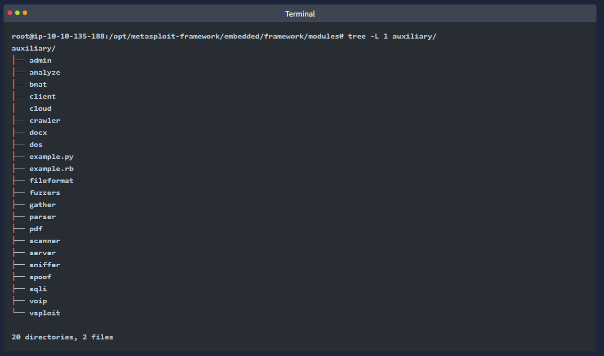

Encoders
- encoders will allow you to encode the exploit and payload in the hope that a signature based antivirus solution may miss them

- signature-based antivirus and security solutions have a database of known threats
- they detect threats by comparing supsicious files to this database and raise an alert if there is a match
- thus encoders can have a limited succcess rate as antivirus solutions can perform additional checks

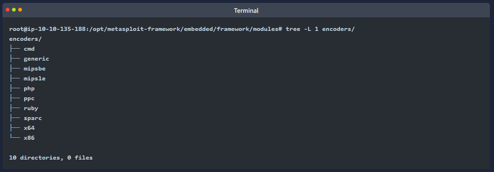

Evasion
- while encoders will encode the payload
- they should not be considered a direct attempt to evade antivirus software
- on the other hand "evasion" modules will try that, with more or less success

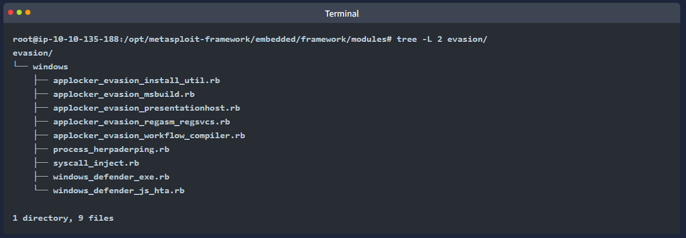

Exploits
- exploits, neatly organised by target system

NOPs
- NOPs (No OPeration) do nothing, literally
- they are represented in the intel x86 CPU family with 0x90, following which the CPU will do nothing for one cycle
- they are often used as a buffer to achieve consistent payload sizes

Payloads
- payloads are codes that will run on the target system

- exploits will leverage a vulnerability on the target system, but to achieve the desired result...
- we will need a payload
- examples could be; getting a shell, loading a malware or backdoor to the target system, running a command or launching calc.exe as a proof of concept to add to the pen test report
- starting the calculator on the target system remotely by launching the calc.exe application is a benign way to show that we can run commands on the target system

- running command on the target system is already an important step but having an interactive connection that allows you to type commands that will be executed on the target system is better
- such an interactive command line is called a "shell" 
- Metasploit offers the ability to send different payloads that can open shells on the target system

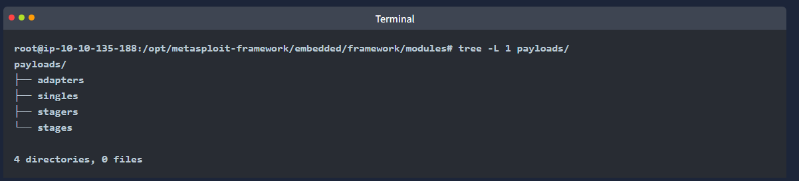

- you will see four different directories under payloads:
- adapters, singles, stagers and stages

Adapters:
- an adapter wraps single payloads to conver them into different formats
- for example a normal single payload can be wrapped inside a Powershell adapter
- which will make a single powershell command that will execute the payload

Singles:
- self-contained payloads (add user, launch notepad.exe etc)
- that do not need to download an additional component to run

Stagers:
- responsible for setting up a connection channel between Metasploit and the target system
- useful when working with staged payloads 
- "staged payloads" will first upload a stager on the target system and then downloade the rest of the payload (stage)
- this provides some advantages as the initial size of the payload will be relatively small compared to the full payload sent at once

Stages: 
- downloaded by the stager
- this will allow you to use larger sized payloads

- Metasploit has a subtle way to help you identify single (also called "inline") payloads and staged payloads:
- generic/shell_reverse_tcp
- windows/x64/shell/reverse_tcp
- both are reverse windows shells
- the former is an inline (or single) payload as indicated by the "_" between "shell" and "reverse"
- while the latter is a staged payload, as indicated by the "/" between "shell" and "reverse"

Post
- post modules will be useful on the final stage of the pen testing process listed above, post-exploitation

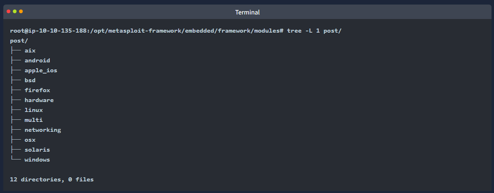

- if you wish to familiarise yourself further with these modules 
- you can find them under the modules folder of your Metasploit installation
- for the AttackBox those are under /opt/metasploit-framework/embedded/framework/modules

What is the name of the code taking advantage of a flaw on the target system?
- exploit

What is the name of the code that runs on the target system to achieve the attacker's goal?
- payload

What are self-contained payloads called?
- singles

Is "windows/x64/pingback_reverse_tcp" among singles or staged payload?
- singles

Msfconsole
- as previously mentioned the console will be your main interface to the Metasploit Framework
- you can launch it using the msfconsole command on your AttackBox terminal or any system the Metasploit Framework is installed on

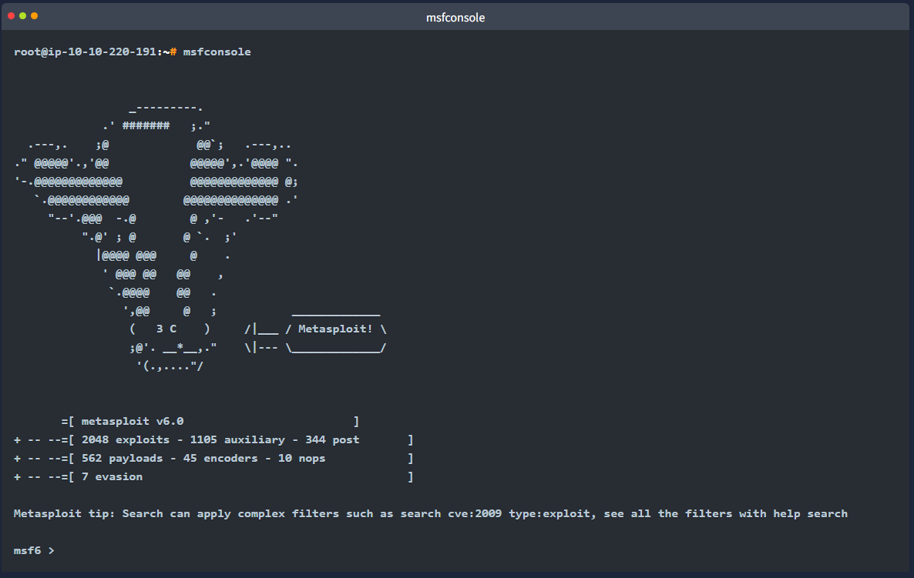

- once launched you will see the command line changes to msf6 
- (or msf5 depending on the installed version of Metasploit)
- the Metasploit Console (msfconsole) can be used just like a regular command-line shell as you can see below
- the first command ls which lists the content of the folder from which metasploit was launched using the msfconsole command

- it is followed by a ping sent to Google's DNS IP addr (8.8.8.8) 
- as we operate from the AttackBox which is linux we had to add the -c 1 option 
- so only a single ping was sent
- otherwise the ping process would continue until it is stopped using CTRL+C

- it will support most Linux commands including clear (to clear the terminal screen)
- but will not allow you to use some features of a regular command line e.g. does not support output redirection as seen below

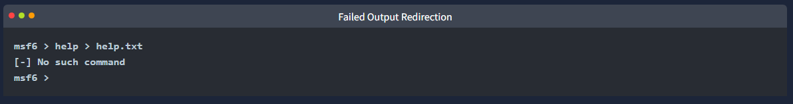

- while on the subject, the help command can be used on its own or for a specific command
- below is the help menu for the set command we will cover soon

- you can use the history command to see commands you have typed earlier

- an important feature of msfconsole is the support of tab completion
- this will come in handy later when using Metasploit commands or dealing with modules
- for example if you start typing he and press the tab key, you will see it auto-completes to help

- msfconsole is managed by context...
- this means that unless set as a global variable, all param settings will be lost if you change the module you have decided to use
- in the example below we have used the ms17_010_eternalblue exploit...
- and we have set the parameters such as RHOSTS
- if we were to switch to another module (e.g. a port scanner) we would need to set the RHOSTS value again...
- as all changes we have made remained in the context of the ms17_010_eternalblue exploit

- let us look at the example below to have a better understanding of this feature
- we will use the MS17-010 "EternalBlue" exploit for illustration purposes

- once you type the use exploit/windows/smb/ms17_010_eternalblue command 
- you will see the command line prompt change from msf6 to "msf6 exploit(windows/smb/ms17_010_eternalblue)"
- the "EternalBlue" is an exploit allegedly developed by the U.S National Security Agency (N.S.A.) 
- for a vulnerability affecting the SMBv1 server on numerous Windows systems
- the SMB (Server Message Block) is widely used in Windows networks for file sharing and even for sending files to printers
- EternalBlue was leaked by the cybercriminal group "Shadow Brokers" in April 2017
- in May 2017 this vulnerability was exploited worldwide in the WannaCry ransomware attack

- the module to be used can also be selected with the use command followed by the number at the beginning of the search result line

- while the prompt has changed you will notice that we can still run the commands previously mentioned
- this means we did not "enter" a folder as you would typically expect in an operating systems command line

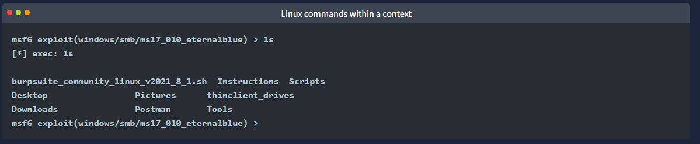

- the prompt tells us we now have a context set in which we will work
- you can see this by typing the show options command

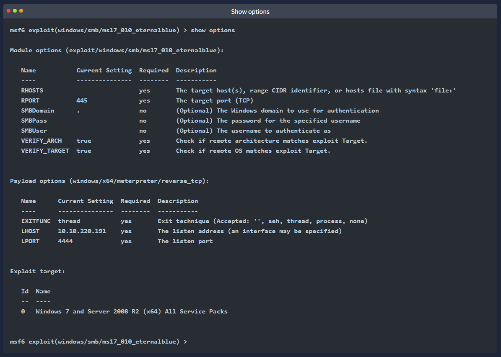

- this will print options related to the exploit we have chosen earlier
- the show options command will have different outputs depending on the context it is used in
- the example above shows that this exploit will require we set variables like RHOSTS and RPORT
- on the other hand a post-exploitation module may only need us to set a SESSION ID (see the scrnshot below)
- a session is an existing connection to the target system that the post-exploitation module will use

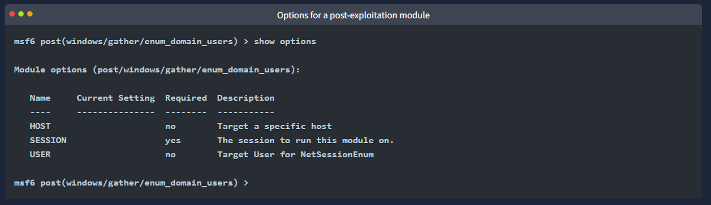

- the show command can be used in any context followed by a module type (auxiliary, payload, exploit etc) to list available modules
- the example below lists payloads that can be used with the ms17_010 EternalBlue exploit

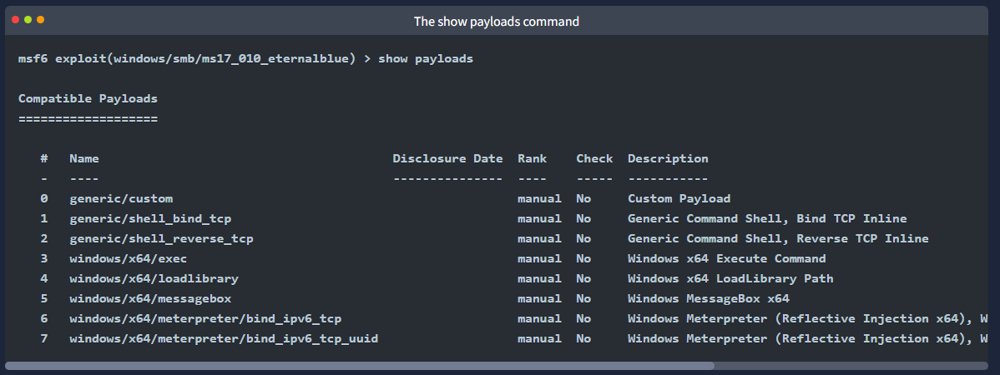

- if used from the msfconsole prompt the show command will list all modules
- the use and show options commands we have seen so far are identical for all modules in Metasploit
- you can leave the context using the back command

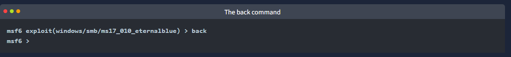

- further information on any module can be obtained by typing the info command within its context

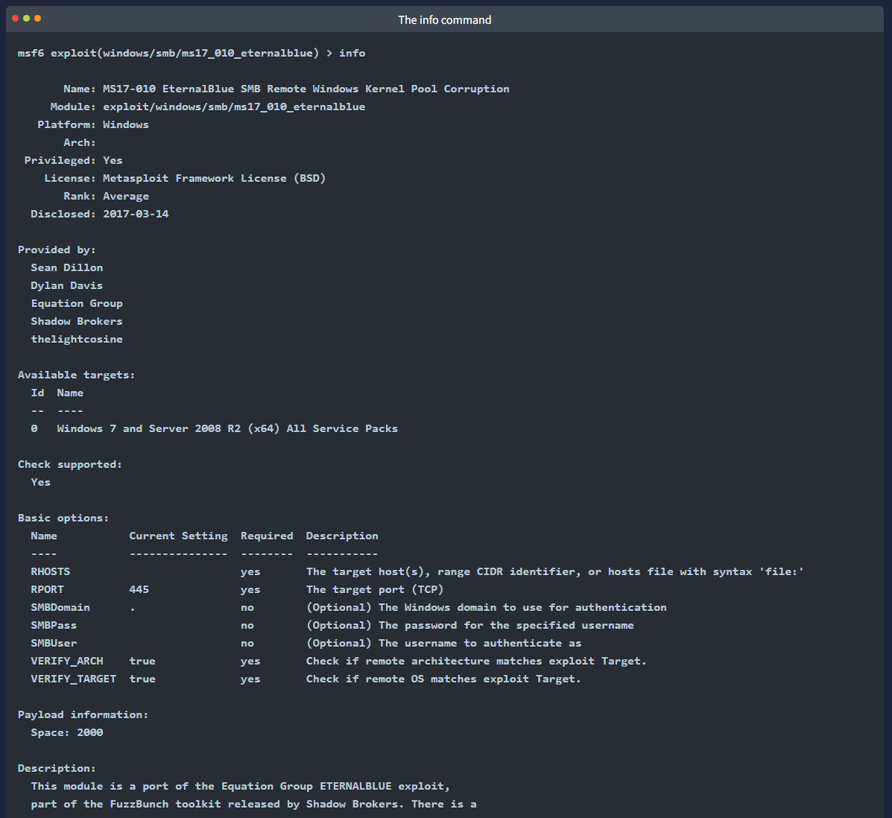

- alternatively you can use the info command followed by the modules path from the msfconsole prompt (e.g. info exploit/windows/smb/ms17_010_eternalblue)
- info is not a help menu; it will display detailed information on the module such as its author, relevant sources etc

Search
- one of the most useful commands in msfcsonsole is search
- this command will search the Metasploit Framewrok db for modules relevant to the given search param
- you can conduct searches online using CVE numbers, exploit names (eternalblue, heartbleed etc) or target system

- the output of the search aommdn provides an overview of each returned module
- you may notice the "name" column already gives more information than just the module name
- you can see the type of module (auxiliary, exploit, etc) and the category of the module (scanner, admin, windows, Unix etc)
- you can use any module returned in a search result with the command use followed by the number at the beginning of the result line
- e.g. (use 0 instead of use auxiliary/admin/smb/ms17_010_command)

- another essential piece of information returened is in the "rank" column
- exploits are rated based on their reliability
- the table below provides their respective descriptions

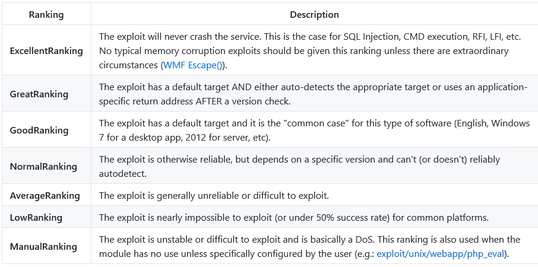

- source: https://github.com/rapid7/metasploit-framework/wiki/Exploit-Ranking

- you can direct the search function using keywords such as type and platform

- for example if we wanted our search results to only include auxiliary modules, we could set the type to auxiliary
- the scrnshot below shows the output of the search type:auxiliary telnet command

- please remember that exploits take advantage of a vulnerability on the target system and may always show unexpected behavior
- a low-ranking exploit may work perfectly and an excellent ranked exploit may not, or worse, crash the target system

How would you search for a module related to Apache?
- search Apache

Who provided the auxiliary/scanner/ssh/ssh_login module?
- todb (info auxiliary/scanner/ssh/ssh_login)

Working with Modules
- you can launch the target machine attached to this room to replicate the examples shown below
- any Metasploit version 5 or 6 will have menus and screens similar to those shown here so you can use the AttackBox or any OS installed on your local computer

- once you have entered the context of a module using the use command followed by the module name, as seen earlier, you will need to set params
- the most common params you will use are listed below
- remember, based on the module you use, additional or different params may need to be set
- it is good practice to use the show options command to list the required params

- all params are set using the same command syntax:
- set PARAMETER_NAME VALUE

- before we proceeed, remember always to check the msfconsole prompt to ensure you are in the right context
- when dealing with Metasploit ytou may see 5 different prompts

The regular command prompt:
- you cannot use Metasploit commands here

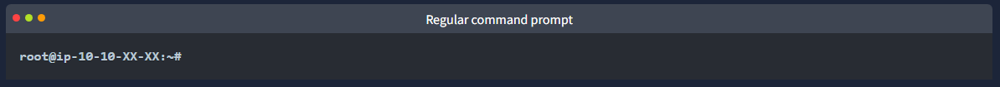

The msfconsole prompt:
- msf6 (or msf5 depending on your installed version) is the msfconsole prompt
- as you can see, no context is set here, so context-specific commands to set params and run modules can not be used here

A context prompt:
- once you have decided to use a module and used the set command to choose it, the msfconsole will show the context
- you can use context-specific commands (e.g. set RHOSTS 10.10.x.x) here

The Meterpreter prompt:
- Meterpreter is an important payload we will see in detail later in this module
- this means a Meterpreter agent was loaded to the target system and connected back to you
- you can use Meterpreter specific commands here

A shell on the target system:
- once the exploit is completed you may have access to a command shell on the target system
- this is a regular command line, and all commands typed here run on the target system

- as mentioned earlier the show options command will list all available params

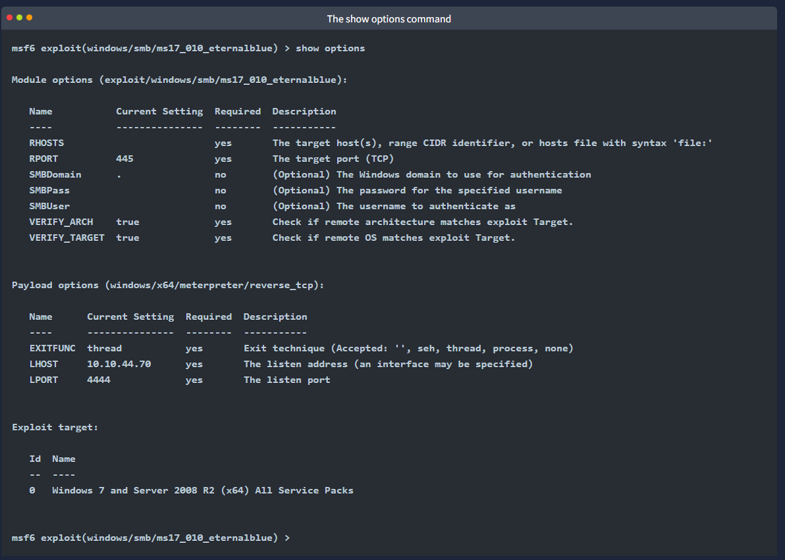

- as you can see in the scrnshot above some of these params require a value for the exploit to work
- some required param values will be pre-populated
- make sure you check if these should remain the same for your target
- for example a web exploit could have an RPORT (remote port: the port on the target system Metasploit will try to connect to and run the exploit) value preset to 80
- but your target web application could be using port 8080

- in this example we will set the RHOSTS param to the IP addr of our target system using the set command

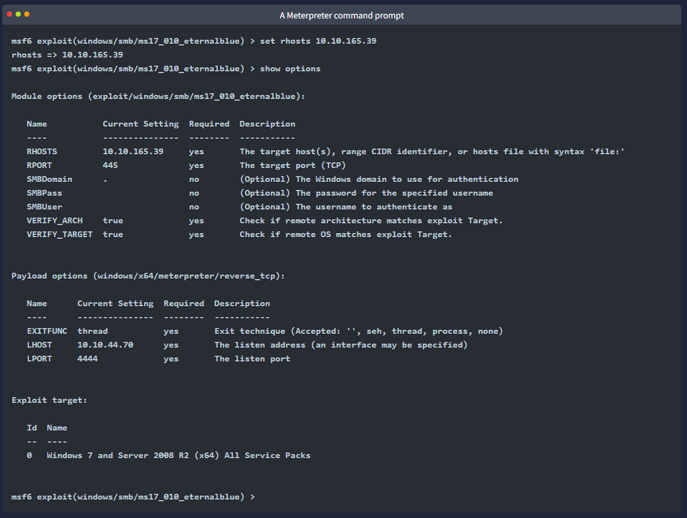

- once you have set a param you can use the show options command to check the value was set correctly

- parameters you will often use are:

RHOSTS
- "remote host" the IP addr of the target system
- a single IP addr or a network range can be set
- this will support the CIDR (Classless Inter-Domain Routing) notation (/24, /16 etc)
- or a network range (10.10.10.x - 10.10.10.y)
- you can also use a file where targets are listed, one target per line using file:/path/of/the/target_file.txt, as you can see below

RPORT
- "remote port" the port on the target system the vulnerable application is running on

PAYLOAD
- the payload you will use with the exploit

LHOST 
- "Localhost" the attacking machine (your AttackBox or Kali Linux) IP addr

LPORT
- "Local port" the port you will use for the reverse shell to connect back to
- this is a port on your attacking machine, and you can set it to any port not used by any other application

SESSION
- each connection established to the target system using Metasploit will have a session ID
- you will use this with post-exploitation modules that will connect to the target system using an existing connection

- you can override any set param using the set command again with a different value
- you can also clear any param value using the unset command or clear all set params with the unset all command

- you can use the setg command to set values that will be used for all modules
- the setg command is used like the set command
- the difference is that if you use the set command to set a value using a module and you switch to another module you will need to set the value again
- the setg command allows you to set the value so it can be used by default across different modules
- you can clear any value set with setg using unsetg

- the example below uses the following flow:

1. We use the ms17_010_eternalblue exploitable

2. We set the RHOSTS variable using the setg command instead of the set command

3. We use the back command to leave the exploit context

4. We use an auxiliary (this module is a scanner to discover MS17-010 vulnerabilities)

5. The show options command shows the RHOSTS param is already populated with the IP addr of the target system

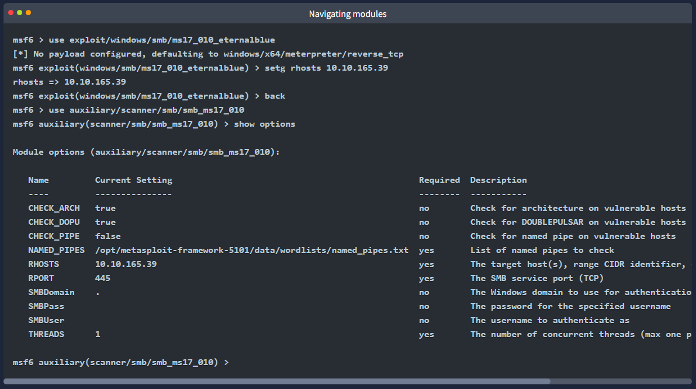

- the setg command sets a global value that will be used until you exit Metasploit or clear it using the unsetg command

Using Modules
- once all module params are set you can launch the module using the exploit command
- Metasploit also supports the run command, which is an alias created for the exploit command as the word exploit did not make sense when using modules that were not exploits (port scanners, vulnerability scanners etc)

- the exploit command can be used without any parameters or using the '-z' param
- the exploit -z command will run the exploit and background the session as soon as it opens

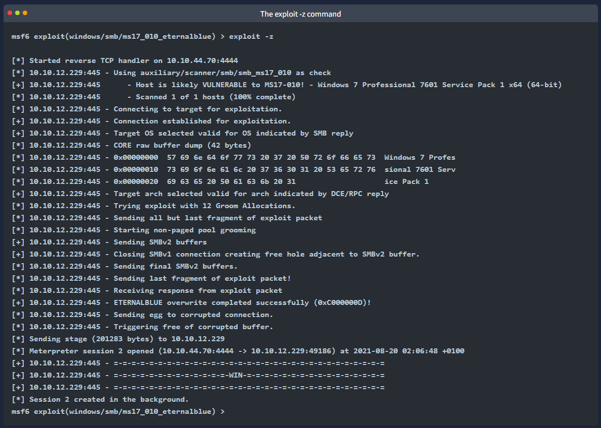

- this will return you the context prompt from which you have run the exploit
- some modules support the check option
- this will check if the target system is vulnerable without exploiting it

Sessions
- once a vulnerability has been successfully exploited a session will be created
- this is the communication channel established betyween the target system and Metasploit

- you can use the background command to background the session prompt and go back to the msfconsole prompt

- alternatively CRTL+Z can be used to background sessions

- the sessions command can be used from the msfconsole prompt or any context to see the existing sessions

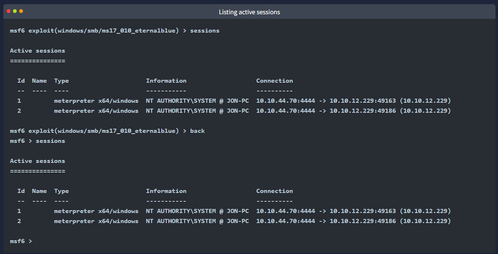

- to interact with any session, you can use the sessions -i command followed by the desired session number

How would you set the LPORT value to 6666?
- set LPORT 6666

How would you set the global value for RHOSTS  to 10.10.19.23 ?
- setg RHOSTS 10.10.19.23

What command would you use to clear a set payload?
- unset PAYLOAD

What command do you use to proceed with the exploitation phase?
- exploit

Summary
- Metasploit is a powerful tool that facilitates the exploitation process
- the exploitation process comprises three main steps

1. Finding the exploit

2. Customising the exploit

3. Exploiting the vulnerable service

- Metasploit provides many modules that you can use for each step of the exploitation process
- through this room we have seen the basic components of Metasploit and their respective use

- it would be best if you also had used the ms17_010_eternablue exploit to gain access to the target VM

- in the following rooms we will cover Metasploit and its components in more detail
- once completed, this module should give you an understanding of the capabilities of Metasploit