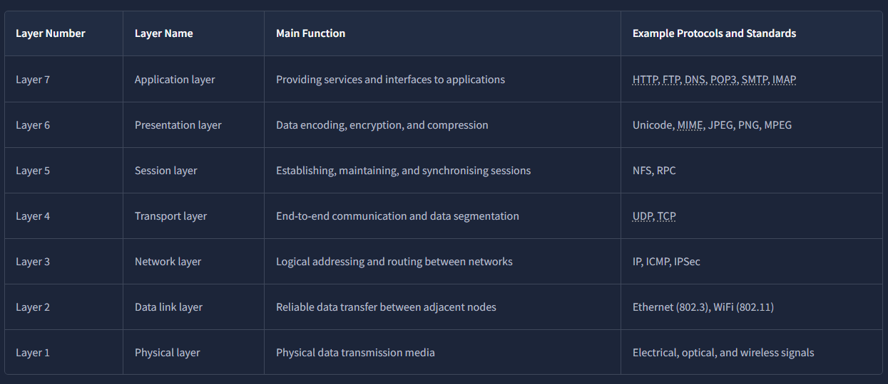
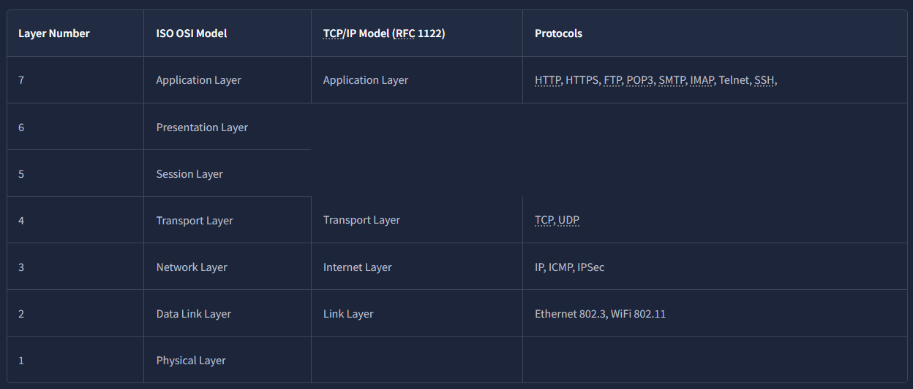
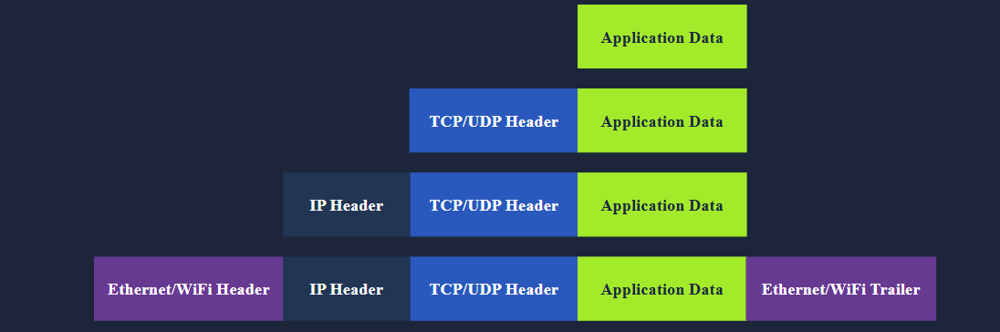
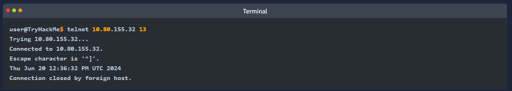

OSI Model
- OSI might initially seem complicated
- OSI (Open Systems Interconnection)
- a conceptual model developed by the International Organisation for Standardisation (ISO)
- describes how communications should occur in a computer network
- defines a framework for computer network communications
- although this model is theoretical, it is vital to learn and understand as it helps grasp networking concepts on a deeper level
- composed of 7 layers

1. Physical Layer
2. Data Link Layer
3. Network Layer
4. Transport Layer
5. Session Layer
6. Presentation Layer
7. Application Layer

- the numbering starts with the physical layer being layer 1
- while the top layer, the application layer, is layer 7
- to help remember the layers from bottom to top you can use a mnemonic
- "Please Do Not Throw Spinach Pizza Away"
- remembering the layers with their layer numbers is important, otherwise will struggle to understand terms like "layer 3 switch"

Layer 1 - Physical Layer
- deals with the physical connection between devices
- this includes the medium, such as a wire, and the definition of the binary digits 0 and 1
- data transmission can be via electrical, optical or wireless signal
- consequently we need data cables or antennas, depending on our phyiscal medium
- in addition to Ethernet cable, and optical fibre cable, examples of the physical layer medium include..
- the WiFi radio bands, the 2.4 GHz bandm the 5GHz band and the 6 GHz band

Layer 2 - Data Link Layer
- defines a medium to transmit our signal
- represents the protocol that enables data transfer between nodes on the same network segment
- in simpler terms..
- the data link layer describes an agreement between the different systems on the same network segment on how to communicate
- a network segement refers to a group of networked devices using a shared medium or channel for information transfer
- e.g. consider a company office with 10 computers connected to a network switch - thats a network segment
- examples of layer 2 include Ethernet, i.e. 802.3, and WiFi, i.e. 802.11
- Ethernet and WiFi addresses are six bytes
- their address is called a MAC address
- MAC (Media Access Control)
- usually expressed in hexadecimal format with a : seperating each 2 hexadecimal digits (one byte)
= the three leftmost bytes identify the vendor

- we expect to see 2 MAC addresses in each frame in real network communication over Ethernet or WiFI
- the packet in the screenshot below shows
- the destination data-link address (MAC address) highlighted in yellow
- the source data link address (MAC address) highlighted in blue
- the remaining bits shows the data being sent

Layer 3 - Network Layer
- focuses on sending data between two nodes on the same network segment
- concerned with sending data between different networks
- in more technical terms the network layer hands logical addressing and routing
- e.g. finding a path to transfer the network packets between the diverse networks

- in the data link layer we gave an example of one company office with 10 computers 
- where the data link layer is responsible for providing a connection between them
- lets say this company has multiple offices distributed across various cities, countries or even continents
- the network layer is repsonsible for connecting the different offices together

- the network below shows that computers A and B are connected, although on different networks
- you can also notice two paths connecting the two computers
- the network layer will route the network packets through the path it deems better

- examples of the network layer include Internet Protocol (IP), Internet Control Message Protocol (ICMP), and Virtual Private Network (VPN) protocols such as IPSec and SSL/TLS VPN

Layer 4 - Transport Layer
- enabled end-to-end communication between running applications on different hosts
- your web browser is connected to the TryHackMe web server over the transport layer
- which can support various functions like flow control, segmentation and error correction
- examples of layer 4 are Transmission Control Protocol (TCP) and User Datagram Protocol (UDP)

Layer 5 - Session Layer
- responsible for establishing, maintaining and synchronising communication between applications running on different hosts
- establishing a session means communication between applications and negotiating the necessary parameters for the sesssion
- data synchronisation ensures that data is transmitted in the correct order and provides mechanisms for recovery in case of transmission failures
- examples of the session layer are Network File System (NFS) and Remote Procedure Call (RPC)

Layer 6 - Presentation Layer
- ensures that data is delivered in a form the application layer can understand
- consider the scenario where we want to send an image via email
- first we use JPEG, GIF, and PNG to save our images
- furthermore although hidden from the user by the email client
- we use MIME (Mulitpurpose Internet Mail Extensions) to attach the file to our email
- MIME encodes a binary file using 7-bit ASCII SMTP and IMAP
- don't worry if you are not faimilar with all of them

Summary
- reading about the ISO OSI model for the first time can be intimidating
- however it becomes easier as you progress in your study of networking protocols
- to help with your studies here is a table of the summary of the ISO OSI layers

Which layer is responsible for end-to-end communication between running applications?
- 4 Transport Layer

Which layer is responsible for routing packets to the proper network?
- 3 Network Layer

In the OSI model, which layer is responsible for encoding the application data?
- 6 Presentation Layer

Which layer is responsible for transferring data between hosts on the same network segment?
- 2 Data-Link Layer

TCP/IP Model
- an implemented model
- TCP/IP stands for Transmission Control Protocol/Internet Protocl
- was developed in the 1970s by the Department of Defense (DoD)
- why DoD would create such a model?
- one of the strengths of this model is that it allows a network to continue to function as parts of it are out of service
- for instance due to a military attack
- this capabiity is possible due to the design of the routing protocols to adapt as the network topology changes

- in our presentation of the ISO OSI model we went from bottom to top from layer 1 to layer 7
- in this task lets look at things from a different perspective, from top to bottom
- from top to bottom we have
- Application Layer - The OSI model application, presentation and session layers (5,6,7) are grouped into the application layer in the TCP/IP model
- Transport Layer - This is Layer 4
- Internet Layer - This is Layer 3. The OSI model's network layer is called the Internet Layer in the TCP/IP model
- Link Layer - this is layer 2.

- the table below shows how the TCP/IP model layers map to the ISO/OSI model layers

- many modern networking textbooks show the TCP/IP model as five layers instead of four
- for example in Computer Networking: A Top-Down Approach 8th Edition
- Kurose and Ross describe the following five-layer protocol stack by including the physical layer
- Application
- Transport
- Network
- Link
- Physical

- in the following tasks we will cover the IP protocol from the Internet layer and the UDP and TCP protocols from the Transport layer

To which layer does HTTP belong in the TCP/IP model?
- Application Layer

How many layers of the OSI model does the application layer in the TCP/IP model cover?
- 3

IP Addresses and Subnets
- when you hear the word IP address you might think of an address like 192.168.0.1
- or something less common such as 172.16.159.243
- in both cases you are right
- both of these are IP addresses; IPv4 (IP version 4) addresses to be specific

- every host on the network needs a unique identifier for other hosts to communicate with him
- without a unique idetneifier the host cannot be found without ambiguity
- when using the TCP/IP protocol suite, we need to assign an IP address for each device connected to the network

- one analogy of an IP address is your home postal address
- your postal addr allows you to receieve letters and parcels from all over the world
- furthermore it can identiy your home without ambiguity, otherwise you cannot shop online

- as you might already know we have IPv4 and IPv6 (version 6) 
- IPv4 is still the most common and whenever you come across a text mentioning IP withou the version we expect them to mean IPv4

- so what makes an IP addr?
- an IP addr comprises ofour octets i.e. 32 bits
- being 8 bits an octet allows us to represent a decimal number between 0 and 255
- an IP addr is shwon in the image below

- at the risk of oversimplifying things
- the 0 and 255 are reserved for the network and broadcast addresses respetively
- in other words 192.168.1.0 is the network addr
- while 192.168.1.255 is the broadcast addr
- sending the the broadcast addr targets all the hosts on the network
- with simple math you can conclude that we cannot have more than 4 billion unique IPv4 addresses
- if you are curious about the math it is ~2^32 because we have 32 bits
- this number is approximate because we didnt consider network and broadcast addresses

Looking Up Your Network Configuration
- you can look up your IP addr on the MS windows command line using the command 'ipconfig' 
- on Linux and UNIX-based systems you can issue the command 'ifconfig;' or 'ip address show'
- which can be typed as 'ip a s' 
- in the terminal below we show 'ifconfig'

- the terminal output above indicates the following
- the host (laptop) IP addr is 192.168.66.89
- the subnet mask is 255.255.255.0
- the broadcast addr is 192.168.66.255

- let's use 'ip a s' to compare how the network card IP addr is presented

- the terminal output above indicates the following
- the host (laptop) IP addr is 192.168.66.89/24
- the broadcast addr is 192.168.66.255

- if you are wondering a subnet mask of 255.255.255.0 can also be written as /24
- the /24 means that the leftmost 24 bits within the IP addr do not change across the network i.e. the subnet
- in other words the leftmost three octets are the same across the whole subnet; therefore we can expect to find addresses that range from
- 192.168.66.1 to 192.168.66.254
- similar to what was mentioned earlier 192.168.66.0 and 192.168.66.255 are the network and broadcast addresses respectively

Private Addresses
- as we are explaining IP addresses it is useful to mention that for most practical purposes there are two types of IP addr
- Public IP addr
- Private IP addr

- RFC 1918 defines the following three ranges of private IP addr
- 10.0.0.0 - 10.255.255.255 (10/8)
- 172.16.0.0 - 172.31.255.255 (172.16/12)
- 192.168.0.0 - 129.168.255.255 (192.168/16)

- we presented an analogy earlier stating that a public IP addr is like your home postal addr
- a private IP addr is different
- the original idea is that it cannot be reached from the outside world
- it is like an isolated city or a compound where all houses and apartments are numbered systematically and can easily exchange mail with each other
- but not with the outside world
- for a private IP addr to access the internet the router must have a public IP addr and must support Network Address Translation (NAT)
- at this stage lets not worry about understanding how NAT works

- before moving on i recommend memorising the private IP addr ragnes
- otherwise you might see an IP addr such as 10.1.33.7 or 172.31.33.7 
- and try to access it from a public IP addr

Routing
- a router is like your local post office, you hand them the mail parcel, and they would know how to deliver it
- if we dig deeper you might mail something to an addr in another city or country
- the post office will check the addr and decide where to send it next
- e.g. if it is to leave the country we expect one central office to handle all shipments abroad

- in technical terms a router forwards data packets to the proper network
- usually a data packet passes through multiple routers before it reaches its final destination
- the router functions at layer 3, inspecting the IP addr and forwarding the packets to the best network (router) so the packet gets closer to its destination

Which of the following IP addresses is not a private IP address?
- 192.168.250.125
- 10.20.141.132
- 49.69.147.197
- 172.23.182.251

- 49.69.147.197

Which of the following IP addresses is not a valid IP address?
- 192.168.250.15
- 192.168.254.17
- 192.168.305.19
- 192.168.199.13

- 192.168.305.19

UDP and TCP
- the IP protocol allows us to reach a destination host on the network
- the host is identified by its IP addr
- we need protocols that would enable processes on networked hosts to communicate with each other
- there are 2 transport protocols to achieve that; UDP and TCP

UDP
- UDP (User Datagram Protocol) 
- allows us to reach a specific process on this target host
- UDP is a simple connectionless protocol that operates at the transport layer (4) 
- being connectionless means that it does not need to establish a connection
- UDP does not provide a mechanism to know that the packet has been delivered

- an IP addr identifies the host
- we need a mechanism to determine the sending and receiving process
- this can be achieved using port numbers
- a port number uses two octets
- consequently it ranges between 1 and 65535
- port 0 is reserved
- (the number 65545 is calculated by the expression 2^16 - 1)

- a real life example similar to UDP is the standard mail service with no delivery confirmation
- in other words there is no guarantee that the UDP packet has been receieved successfully
- similar to the case of sending a parcel using standard mail with no confirmation of delivery
- in the case of standard mail it means a cheaper cost than the mail delivery options with confirmation
- in the case of UDP it means better speed than a transport protocol that provides "confirmation"

- but what if we want a transport protocol that acknowledges received packets?
- the answer lies in using TCP instead of UDP

TCP
- TCP (Transmission Control Protocol)
- connection-oriented transport protocol
- it uses various mechanisms to ensure reliable data delivery sent by the diffferent processes on the networked hosts
- like UPD it is a layer 4 protocol
- being connection-oriented it requires the establishment of a TCP connection before any data can be sent

- in TCP each data octet has a sequence number
- this makes it easy for the reciever to identify lost or duplicated packets
- the receiver on the other hand, acknowledges the reception of data with an acknowledgement number specifying the last receieved octet

- a TCP connection is established using what's called a three-way handshake
- two flags are used SYN (Synchronise) and ACK (Acknowledgement)
- the packets are sent as follows

1. SYN Packet - the client initiates the connection by sending a SYN packet to the server. This packet contains the clients randomly chosen initial sequence number
2. SYN-ACK Packet - the server responds to the SYN packet with a SYN-ACK packet, which adds the initial sequence number randomly chosen by the server
3. ACK Packet - the three way handshake is completed as the client sends an ACK packet to acknowledge the reception of the SYN-ACK packet

- similar to UDP, TCP identifies the process of initiating or waiting (listening) for a connection using port numbers
- as stated a valid port number ranges between 1 and 65535 because it uses 2 octets and port 0 is reserved

Which protocol requires a three-way handshake?
- TCP

What is the approximate number of port numbers (in thousands)?
- 65

Encapsulation
- before wrapping up it is crucial to explain another key concept. Encapsulation
- in this context encapsulation refers to the process of every layer adding a header (and sometimes a trailer) to the receieved unit of data 
- and sending the "encapsulated" unit to the layer below

- encapsulation is an essential concept as it allows each layer to focus on its intended function
- in the image below we have the following four steps

- Application data: it all starts when the user inputs the data they want to send into the application, e.g. you write an email or an instant message and hit the send button. The application formats this data and starts sending it according to the application protocol used, using the layer below it, the transport layer
- Transport Protocol segment or datagram: The transport layer such as TCP or UDP adds the proper header information and creates the TCP segment (or UDP datagram). This segment is sent to the layer below it, the network layer.
- Network packet: The network layer i.e. the internet layer, adds an IP header to the receieved TCP segment or UDP datgram. then this IP packet is sent to the layer below it, the data link layer
- Data link frame: The ethernet or WiFi receives the IP packet and adds the proper header and trailer, creating a frame

- we start with application data
- at the transport layer we add a TCP or UDP header to create a TCP segment or UDP datagram
- again at the network layer we add the proper IP header to get an IP packet that can be routed over the internet
- finally we add the appropriate header and trailer to get a WiFI or Ethernet frame at the link layer

- the process has to be reversed on the receiving end until the application data is extracted

The Life of a Packet
- based on what we have studied so far
- we can explain a  simplified version of the packet's life
- let's consider the scenario where you search for a room on TryHackMe

1. On the TryHackMe search page you enter your search query and press enter
2. Your web browser using HTTPS, prepares an HTTP request and pushes it to the layer below it, the transport layer
3. The TCP layer needs to establish a connection via a three-way handshake between your browser and the TryHackMe web server. After establishin the TCP connection, it can send the HTTP request containing the search query. Each TCP segment created is sent to the layer below it, the internet layer
4. The IP layer adds the source IP addr i.e. your computer and the destination IP addr i.e. the IP addr of the TryHackMe web server. For this packet to reach the router, your laptop delivers it to the layer below it, the link layer
5. Depending on the protocol, the link layer adds the proper link layer header and trailer and the packet is sent to the router
6. The router removes the link layer header and trailer, inspects the IP addr among other files, and routes the packet to the proper link. Each router repeates this process until it reaches the router of the target server

- the steps will then be reversed as the packet reaches the router of the destination network
- as we cover additional protocols, we will revist this exercice and greate a more in-depth version

On a WiFi, within what will an IP packet be encapsulated?
- frame

What do you call the UDP data unit that encapsulates the application data?
- Datagram

What do you call the data unit that encapsulates the application data sent over TCP?
- segment

Telnet
- TELNET (Teltype Network)
- is a network protocol for remote terminal connection
- in simpler words telnet, a TELNET client, allows you to connect to and communicate with a remote system and issue text commands
- although initially it was used for remote administration 
- we can use telenet to connect to any server listening on a TCP port number

- on the target VM different services are running
- we will experiment with 3 of them
- echo server: this server echoes everything you send it, by default it listens on port 7
- daytime server: this server listens on port 13 by default and replies with the current day and time
- web (http) serveR: this server listens on TCP port 80 by default and serves web pages

- before continuing we should mention that the echo and daytime servers are considered security risks and should not run
- however we started them explicitly to demonstrate communication with the server using telnet
- in the terminal below we connect to the target VM at the echos server's TCP port number 7
- to close a connection press the 'CTRL + ]' keys simultaneously

- in the terminal below we use telnet to connect to the daytime server listening at port 13
- we notice that the connection closes once the current date and time are returned

- finally lets requesta  web page using telnet
- after connecting to port 80 you need to issue the command 'GET / HTTP/1.1' abd identify the host where anything goes
- such as 'Host:telnet.thm' 
- next you need to press enter twice so your last input line is a blank like
- the outut belows shows the exchange (the page has been redacted)

** note ** you have to press enter after sending the information in case you dont get a response

Use telnet to connect to the web server on 10.80.155.32. What is the name and version of the HTTP server?

- lighttpd/1.4.63

What flag did you get when you viewed the page?
- THM{TELNET_MASTER}