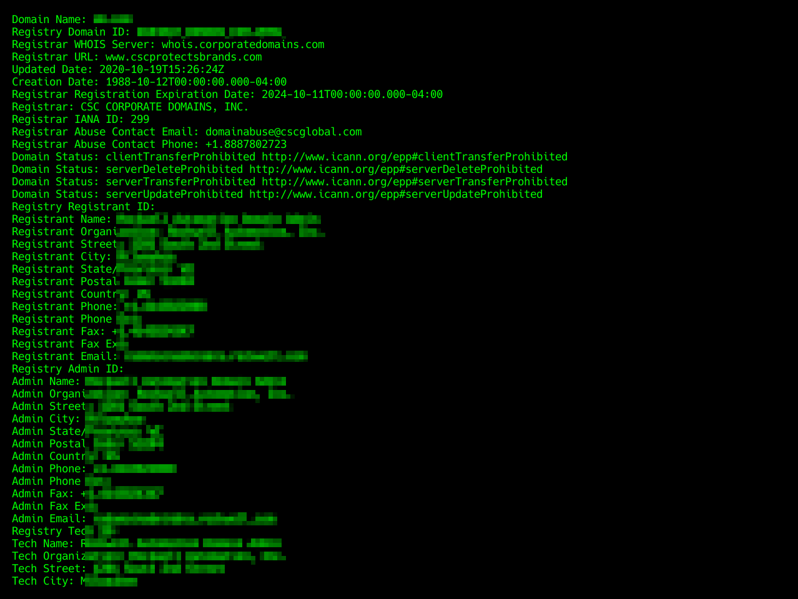
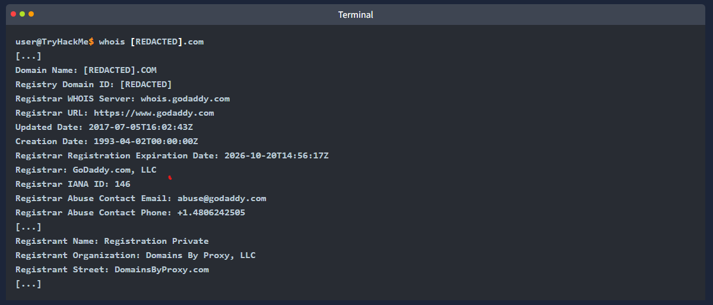
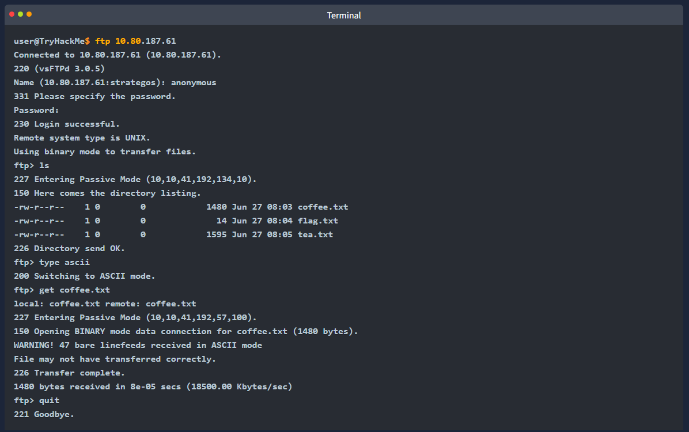
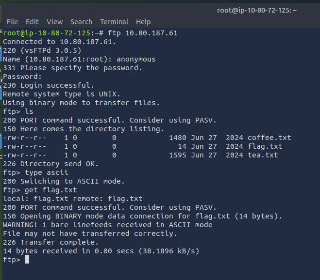
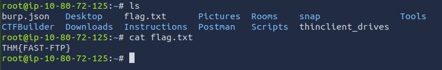
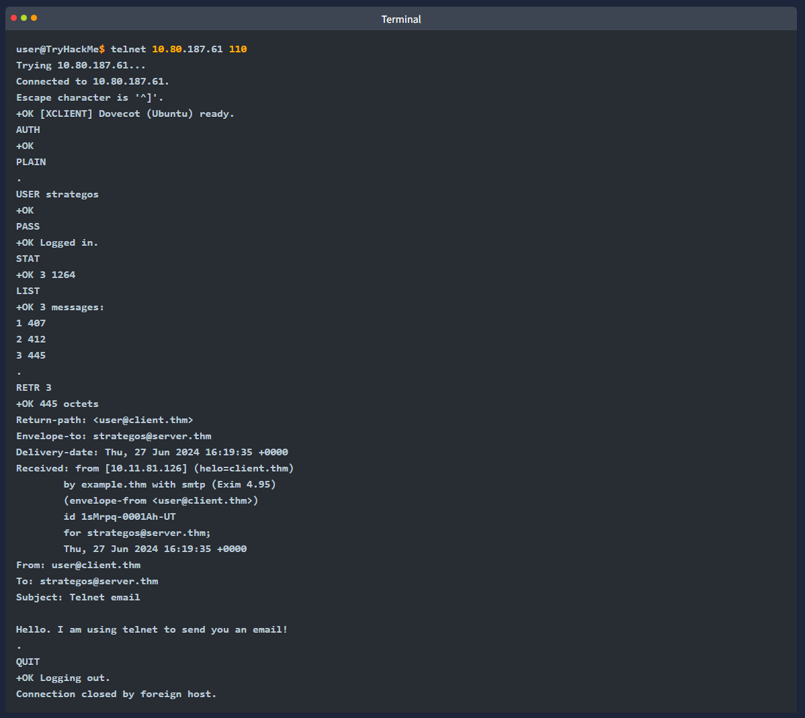
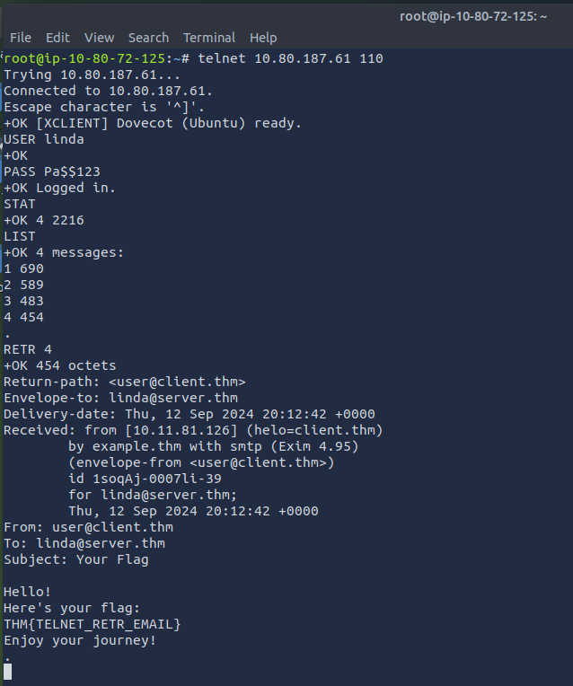

Learning Objectives
- learn about the following protocols:
- WHOIS
- DNS
- HTTP and FTP
- SMTP, POP3 and IMAP

DNS Remembering Addresses
- do you remember the IP addr of your favourite websites?
- unless its a private IP addr of a local device, no one needs to worry about memorising IP addresses
- this is part due to the Domain Name System (DNS)
- responsible for mapping a domain name to an IP addr

- DNS operates at the Application Layer (7) of the ISO OSI model
- DNS traffic uses UDP port 53 by default 
- and TCP port 53 as a default fallback
- there are many types of DNS records, however in this task, we will focus on these four:
- A record: The A (address) record maps a hostname to one or more IPv4 addresses e.g. you can set example.com to resolve to 172.17.2.172
- AAAA Record: similar to the A record, but it is for IPv6, remember that it is AAAA aa AA and AAA would refer to battery size, furthermore AAA refers to Authentication, Authorisation and Accounting, neither fall under DNS
- CNAME Record: (canonical name) record maps a domain name to another domain name e.g. www.example.com can be mapped to example.com or even to example.org
- MX Record: (mail exchange) record specifies the mail server responsible for handling email for a domain

- in other words when you type example.com in your browser
- your browser tries to resolve this domain name by querying the DNS server for the A record
- however when you try to send an email to test@example.com the mail server would query the DNS server to find the MX record

- if you want to look up the IP addr of a domain from the command line you can use a tool such as 'nslookup' 
- consider the example in the terminal below where we look up example.com

- the query above led to four packets 
- in the terminal below we can see that the first and third packets send DNS queries for the A and AAAA records respectively
- the second and fourth packets show the DNS query responses

Which DNS record type refers to IPv6?
- AAAA

Which DNS record type refers to the email server?
- MX

WHOIS
- in the previous task we covered how a domain name is resolved into an IP addr
- however for this to happen someone needs to have the authority to set the A, AAAA, and MX records, among the other DNS records for the domain
- whoever registers a domain name is granted this power
- therefore if you register example.com you can set any valid DNS records for example.com

- you can register any available domain name for one or more years
- you need to pay the annual fee and you are required to provide accurate contact information as the registrant
- https://www.icann.org/resources/pages/whois-data-accuracy-2017-06-20-en
- this information is part of the data available via WHOIS records and is available publicly
- althought written in uppercase WHOIS is not an acronym it is pronounced who is
- however dont worry, if you want to register a domain without revealing your contact info publicly
- you can use one of the privacy services that hide all your info from the WHOIS records

- you can look up the WHOIS records of any registered domain name using on of the online services
- or via the command-line tool 
- 'whois' is available on Linux systems among others
- as expected WHOIS record provides information about the entity that registered a domain name
- including name, phone number, email, and address
- in the scrnshot below you can see when the record was first created and when it was last updated
- moreover you can find the registrants name, address, phone and email

- in the terminal output below we have used the 'whois' command to look up a domain whose WHOIS record is protected by privacy protection

When was the x.com record created? Provide the answer in YYYY-MM-DD format.
- 1993-04-02

When was the twitter.com record created? Provide the answer in YYYY-MM-DD format.
- 2000-01-21

HTTP(S): Accessing the Web
- when you fire up your browser
- you mainly use HTTP and HTTPS protocols
- HTTP - Hypertext Transfer Protocol
- the S in HTTPS stands for secure
- this protocol relies on TCP and defines how your web browser communicates with the web servers

- some of the commands or methods that your web browser commonly issues on the web are:
- GET: retrieves data from a server, such as an HTML file or an image
- POST: allows us to submit new data to the server, such as submitting a form or uploading a file
- PUT: is used to create a new resource on the server and to update and overwrite existing info
- DELETE: as the name suggests, is used to delete a specific file or resource on the server

- HTTP and HTTPS commonly use TCP ports 80 and 443, respectively
- and less commonly other ports such as 8080 and 8443

- in the following example we use our firefox browser to access the web server on 10.80.187.61
- our browser fetches the web page and displays it perfectly
- however we are interested in what happens behind the scenes

- using Wireshark we can examine the exchange between the firefox browser and the web server more closely
- the scrnshot below from the Wireshark shows the text sent by our broweser in RED
- and the web server response in BLUE
- as you can tell, a lot of info is exchanged between the client and the server that does not get rendered to the user
- examples include the web server version and when the page was last modified

- as you remember from Networking Concepts 
- we used the 'telnet' client to connect to the web server running on 10.80.187.61 at port 80
- we had to send a couple of lines
- 'GET / HTTP/1.1' and 'Host: anything' to get the page we wanted
- on some servers you might get the file without sending 'Host: anything'
- you can use this method to access any page and not just the default page '/'
- to get file.html you would send 'GET /file.html HTTP/1.1' for instance
- 'GET /file.html' might work depending on the web server in use
- this approach is efficient for troubleshooting as you would be "talking HTTP" with the server

Use telnet to access the file flag.html on 10.80.187.61. What is the hidden flag?
- THM{TELNET-HTTP}

FTP: Transferring Files
- unlike HTTP, which is designed to retrieve web pages
- File Transfer Protocol (FTP) is designed to transfer files
- as a result FTP is very efficient for file transfer
- and when all conditions are equal it can achieve higher speeds than HTTP
- example commands defined by the FTP protocol are:
- USER: is used to input the username
- PASS: is used to enter the password
- RETR: (retrieve) is used to download a file from the FTP server to the client
- STOR: (store) is used to upload a file from the client to the FTP server

- FTP server listens on TCP port 21 by default
- data transfer is conducted via another connection from the client to the server

- in the terminal below we executed the command 'ftp 10.80.187.61' to connect to the remote FTP server using the local 'ftp' client
- then we went through the following steps:
- we used the username 'anonymous' to log in
- we didnt need to provide any password
- issuing 'ls' returned a list of files available for download
- 'type ascii' switched to ASCII mode as this is a text file
- 'get coffee.txt' allowed us to retrieve the file we want

- the command exchange via the FTP client is shown in the terminal below

- we used Wireshark to exmaine the exchanged messages more closely
- the clients messages are in RED
- while the servers responses are in BLUE
- notice how various commands differ between the client and the server
- for example when you type 'ls' on the client 
- the client sends 'LIST' to the server
- one last thing to note is that the directory listing and the file we downloaded are sent over a seperate connection each

Using the FTP client ftp on the AttackBox, access the FTP server at 10.80.187.61 and retrieve flag.txt. What is the flag found?
- THM{FAST-FTP}

SMTP: Sending Email
- as with browsing the web and downloading files
- sending email needs its own protocol
- Simple Mail Transfer Protocol (SMTP) defines how a mail client talks with a mail server
- and how a mail server talks with another

- the analogy of the SMTP protocol is
- when you go to the local post office to send a package
- you greet the employee, tell them where you want to send the package, and provide the senders info before handing them the package
- depending on the country you are in, you might be asked to show your ID
- this process is not very different from an SMTP session

- let's present some of the commands used by your mail client when it transfers an email to an SMTP server:
- HELO or EHLO: initiates an SMTP session
- MAIL FROM: specifies the senders email address
- RCPT TO: specifies the recipients email address
- DATA: indicates that the client will begin sending the content of the email message
- .: is sent on a line by itself to indicate the end of the email message

- the terminal below shows an example of an email being sent via 'telnet' 
- the SMTP server listens on TCP port 25 by default

- obviously sending an email using 'telnet' is quite cumbersome
- however it helps you better understand the commands that your email client issues under the hood
- the Wireshark capture shows the exchange in colours
- the clients messages in RED
- while the servers responses are in BLUE

- now that we have covered some basic HTTP, FTP and SMTP commands
- you should have gained a solid understanding of how protocols are designed and used
- it should be effortless to learn how other text-based protocols such as POP3 and IMAP work

Which SMTP command indicates that the client will start the contents of the email message?
- data

What does the email client send to indicate that the email message has been fully entered?
- .

POP3: Receiving Email
- you've received an email and want to download it to your local mail client
- the Post Office Protocol version 3 (POP3)
- is designed to allow the client to communicate with a mail server and retrieve email messages

- without going into in-depth tech details
- an email client sends its messages by relying on SMTP
- and retrieves them using POP3 
- SMTP is similar to handing your envelope or package to the post office
- and POP3 is similar to checking your local mailbox for new letters or packages

- some common POP3 commands are:
- USER `<username>`: identifies the user
- PASS `<password>`: provides the users password
- STAT: requests the number of messages and total size
- LIST: lists all messages and their sizes
- RETR `<message_number>`: retrives the specified message
- DELE `<message_number>`: marks a message for deletion
- QUIT: ends the POP3 session applying changes, such as deletions

- in the terminal below we can see a POP3 session over telent
- since the POP3 listens on port 110 by default
- the command to connect to the TELNET port is 'telnet 10.80.187.61 110'
- the exchange below retrieves the email message sent in the previous task

- someone capturing the network packets would be able to intercept the exchanged traffic
- as per previous Wireshark captures
- the commands in RED are sent by the client
- and the lines in BLUE are the servers
- it is also clear that someone capturing the traffic can read the passwords

- connecting to a POP3 server requires authentication
- use the following details when needed
- username: linda
- password: Pa$$123

Looking at the traffic exchange, what is the name of the POP3 server running on the remote server?
- dovecot

Use telnet to connect to 10.80.187.61’s POP3 server. What is the flag contained in the fourth message?
- 

IMAP: Synchronising Email
- POP3 is enough when working from one device e.g. your favourite email client on your desktop computer
- however what if you want to check your email from your office desktop computer and from your laptop or smartphone?
- in this scenario you need a protocol that allows synchronisation of messages instead of deleting a message after retrieving it
- one solution to maintaining a synchronised mailbox across mulitple devices is Internet Message Access Protocol (IMAP)

- the IMAP protocol allows synchronising read, moved and deleted messages
- IMAP is quite convenient when you check your email via multiple clients
- unlike POP3 which tends to minimise server storage as email is downloaded and deleted from the remote server
- IMAP tends to use more storage as email is kept on the server and synchronised across the email clients

- the IMAP protocol commands are more compicated than the POP3 protocol commands
- here are some examples:
- LOGIN `<username> <password>`: authenticates the user
- SELECT `<mailbox>`: selects the mailbox folder to work with
- FETCH `<mail_number> <data_item_name>`: e.g. 'fetch 3 body[]' to fetch message number 3, header and body
- MOVE `<sequence_set> <mailbox>`: moves the specified messages to another mailbox
- COPY `<sequence_set> <data_item_name>`: copies the specified messages to another mailbox
- LOGOUT: logs out

- knowing that IMAP server listens on TCP port 143 by default
- we will use 'telnet' to connect to 10.80.187.61's port 143 and fetch the message we sent in an earlier task

- the scrnshot below shoes the exchanged messages between the client and the server as seen from Wireshark
- the client only needed to send four commands shown in RED
- and the "long" server responses are shown in BLUE

What IMAP command retrieves the fourth email message?
- fetch 4 body[]

Conclusion
- in the prev room we discussed the TELNET protocol
- this room focused on other fundamental protocols
- DNS, HTTP, FTP, SMTP, POP3 and IMAP
- with the protocols covered we now have a better understanding of how domain names are resolved
- how web pages are served and how email is sent and received
- another primary purpose of this room is to give you an understanding of how a protocol functions behind the graphical interfaces

- the table below summarises the default port numbers of the protocols we have covered so far:

