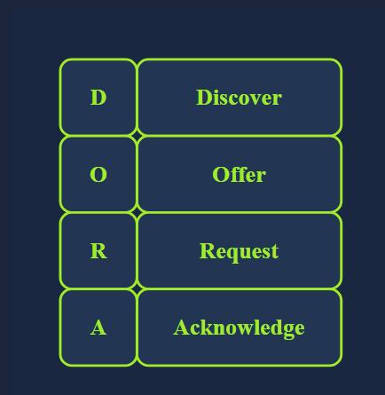
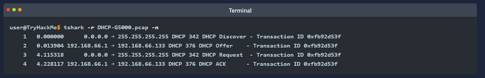
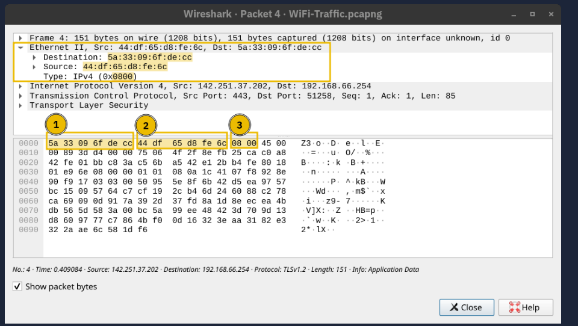
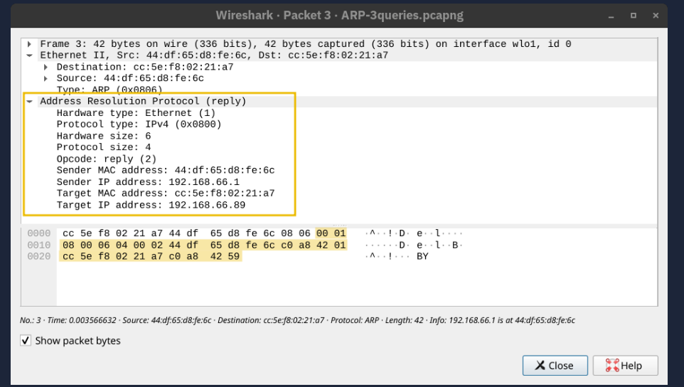
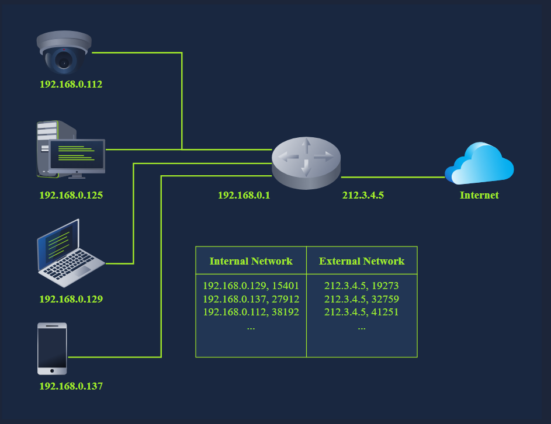

Learning Objectives
- objective of this room is to teach us about the various standard protocols and technologies that glue things together
- Dyanmic Host Configuration Protocol (DHCP)
- Address Resolution Protocol (ARP)
- Network Address Translation (NAT)
- Internet Control Message Protocol (ICMP) - ping, traceroute

DHCP: Give Me My Network Settings
- you went to your favourite coffee shop, grabbed your favourite drink and opened your laptop
- your laptop connected to the shops wifi and automatically configured the network
- so you could now work on a new TryHackMe room
- you didnt type a single IP address yet your device is still set up
- lets see how this happened

- whenever we want to access a network, at the very least, we need to configure the following:
- IP addr along with a subnet mask
- Router (or gateway)
- DNS server

- whenever we connect our device to a new network 
- the above configs must be set according to the new network
- manually configuring these settings is a good option
- especially for servers
- servers are not expected to switch networks, you dont carry your domain controller and connect it to the coffee shop Wifi
- moreover devices need to connect to the servers and expect to find them at specific IP addresses

- having an automated way to configure connected devices has many advantages
- first it would save us from manually configuring the network
- this is extremely important especially for mobile devices
- it saves us from address conflicts i.e. when 2 devices are configured with the same IP addr
- an IP addr conflict would prevent the involved hosts from using the network resources; this applies to local resources and the internet
- the solution lies in Dynamic Host Configuration Protocol (DHCP)
- DHCP is an application-level protocol that relies on UDP
- the server listens on UDP port 67 and the client sends from UDP port 68
- your smartphone and laptop are configured to use DHCP by default

- DHCP follows four steps: Discover, Offer, Request and Acknowledge (DORA)

1. DHCP Discover: the client broadcasts a DHCPDISCOVER message seeking the local DHCP server if one exists
2. DHCP Offer: the server responds with a DHCPOFFER message with an IP addr available for the client to accept
3. DHCP Request: the client responds with a DHCPREQUEST message to indicate that it has accepted the offered IP
4. DHCP Acknowledge: the server responds with a DHCPACK message to confirm that the offered IP addr is now assigned to the client

- the following packet capture shows the four steps explained above
- in this example the client gets the addr 192.168.66.133

- in the DHCP packet exchange we can notice the following:
- the client starts without any IP network config, it only has a MAC addr, in the first and third packets DHCP Discover and DHCP Request, the client searching for a DHCP server still has no IP network config and has not yet used the DHCP servers offered IP addr. Therefore it sends packet from the IP addr 0.0.0.0 to the broadcast IP addr 255.255.255.255
- as for the link layer, in the first and third packets, the client sends to the broadcast MAC addr ff:ff:ff:ff:ff:ff(not shown in output above) the DHCP server offers an available IP addr along with the network config in the DHCP offer. it uses the client's destination MAC addr (it used the proposed IP addr in this example system) 

- at the end of the DHCP process our device would have received all the config needed to acces the network or even the internet
- in particular we expect that the DHCP server has provided us with the following:
- the leased IP addr to access network resources
- the gateway to route our packets outside the local network
- a DNS server to resolve domain names (more on this later)

How many steps does DHCP use to provide network configuration?
- 4

What is the destination IP address that a client uses when it sends a DHCP Discover packet?
- 255.255.255.255

What is the source IP address a client uses when trying to get IP network configuration over DHCP?
- 0.0.0.0

ARP: Bridging Layer 3 Addressing to Layer 2 Addressing
- we have stated in the Networking Concepts room that as two hosts communicate over a network...
- an IP packet is encapsulated within a data link frame as it travels over layer 2
- remember that the two common data link layers we use are Ethernet (IEEE 802.3) and WiFi (IEEE 802.11)
- whenever one host needs to communicate with another host on the same Ethernet or WiFi
- it must send the IP packet within a data link layer frame
- although it knows the IP addr of the target host, it needs to look up the targets MAC addr so the proper data link header can be created

- as you would remember a MAC addr is a 48-bit number typically represented in hexadecimal notation e.g. 7C:DF:A1:D3:8C:5C

- however the devices on the same Ethernet network do not need to know each others MAC addresses all the time
- they only need to know each others MAC addresses while communicating
- everything revolves around IP addresses
- consider this scenario:
- you connect your device to a network
- if the network has a DHCP server
- your device is automatically configured to use a specific gateway (router) and DNS server
- consequently your device knows the IP addr of the DNS server to resolve any domain name
- moreover it knows the IP addr of the router when it needs to send packets over the internet
- in all this scenario no MAC addr are revealed
- however 2 devices on the same ethernet cannot communicate without knowing each others MAC addresses

- as a reminder in the scrnshot below we see an IP packet within an Ethernet frame
- the Ethernet frame header contains
- Destination MAC addresses
- Source MAC addr
- Type (IPv4 in this case)

- Address Resolution Protocol (ARP) makes it possible to find the MAC addr of another device on the Ethernet
- in the example below:
- a host with the IP addr 192.168.66.89 wants to communicate with another system with the IP addr 192.168.66.1
- it sends an ARP request asking the host with the IP addr 192.168.66.1 to respond
- the ARP request is sent from the MAC addr of the requester to the broadcast MAC addr ff:ff:ff:ff:ff:ff as shown in the first packet
- the ARP reply arrived shortly afterwards and the host with the IP addr 192.168.66.1 responded with its MAC addr
- from this point the two hosts can exchange data link layer frames

- if we use 'tcpdump' the packets will be displayed differently
- it uses the terms ARP request and ARP reply
- for you information the output is shown in the terminal below

- an ARP request or ARP reply is not encapsulated within a UDP or even IP packet
- it is encapsulated directly within an Ethernet frame
- the following ARP reply shows this

- ARP is considered layer 2 because it deals with MAC addresses
- others would argue that it is part of layer 3 because it supports IP operations
- what is essential to know is that ARP allows the translation from layer 3 addressing to layer 2 addressing

What is the destination MAC address used in an ARP Request?
- ff:ff:ff:ff:ff:ff

In the example above, what is the MAC address of 192.168.66.1?
- 44:df:65:d8:fe:6c

ICMP: Troubleshooting Networks
- Internet Control Message Protocol (ICMP)
- mainly used for network diagnostics and error reporting 
- two popular commands rely on ICMP and they are instrumental in network troubleshooting and network security
- the commands are:
- 'ping' - this command uses ICMP to test connectivity to a target system and measure the round-trip time (RTT) in other words it can be used to learn that the target is alive and that its reply can reach our system
- 'traceroute' - this command is called 'traceroute' on Linux and UNIX-like systems and 'tracert' on MS windows systems. it uses ICMP to discover the route from your host to the target

Ping
- you may have never played ping-pong however thanks to ICMP you can now play it with your computer
- the 'ping' command sends an ICMP Echo Request (ICMP Type 8)
- the scrnshot below shows the ICMP message within an IP packet

- the computer on the receiving end responds with an ICMP Echo Reply (ICMP Type 0)

- many things might prevent us from getting a reply
- in addition to the possibility of the target system being offline or shut down
- a firewall along the path might block the necessary packets for 'ping' to work
- in the example below we used '-c 4' to tell 'ping' command to stop after sending 4 packets

- the output shows no packet loss
- moreover it calculates the minimum, average and maximum and standard deviation (mdev) of the round-trip time (RTT)

Traceroute
- how can we make every router between our system and a target system reveal itself?

- the internet protocol has a field called Time-to-Live (TTL) that indicates the max number of routers a packet can travel through before it is dropped
- the router decrements the packets TTL by one before it sends it across
- when the TTL reaches zero the router drops the packet and sends an ICMP Time Exceeded Message (ICMP Type 11)
- in this context "time" is measured in the number of routers, not seconds

- the terminal output below shoes the result of running 'traceroute' to discover the routers between our system and example.com
- some routers dont respond
- in other words they drop the packet without sending any ICMP messages
- routers that belong to our ISP might respond, revealing their private IP addr
- moreover some routers respond and show their public IP addr
- this would let us look up their domain name and discover their geographic location
- finally there is always a possibility that an ICMP Time Encoded message gets blocked and never reaches us

- the traversed route might change as we rerun the command

Using the example images above, how many bytes were sent in the echo (ping) request?
- 40

Which IP header field does the traceroute command require to become zero?
- TTL

Routing
- consider the network diagram shown below
- it only has three networks
- however how can the internet figure out how to deliver a packet from Network 1 to Network 2 or Network 3?
- although this is an overly simplified diagram
- we need some algorithm to figure out how to connect Network 1 to Network 2 and Network 3 and vice versa

- lets consider a more detailed diagram
- the internet would be millions of routers and billions of devices
- the network below is a tiny subset of the internet
- the mobile user can reach the web server
- however for this to happen
- each router across the path needs to send the packets via the appropriate link
- obviously there is more than one path i.e. route 
- connecting the mobile user and the web server
- we need a routing algorithm for the router to figure out which link to use

- the routing algorithms are beyond the scope of this room 
- however we will briefly describe a few routing protocols so we become familiar with their names

- OSPF (Open Shortest Path First) - OSPF is a routing protocol that allows routers to share information about the network topology and calulcate the most efficient paths for data transmission. It does this by having routers exchange updates about the state of their connected links and networks. this way each router has a complete map of the network and can determine the best routes to reach any destination

- EIGRP (Enhanced Interior Gateway Routing Protocol) = EIGRP is a Cisco proprietary routing protocol that combines aspects of different routing algorithms. it allows routers to share information about the networks they can reach and the cost (like bandwidth or delay) associated with those routes. routers then use this info to choose the most efficient paths for data transmission

- BGP (Border Gateway Protocol) - BGP is the primary routing protocol used on the internet. It allows different networks (like those of Internet Service Providers) to exchange routing information and establish parts for data to travel between these networks. BGP helps ensure data can be routed efficiently across the internet even when traversing multiple networks
 
- RIP (Routing Information Protocol) - RIP is a simple routing protocol often used in small networks. Routers running RIP share information about the networks they can reach and the number of hops (routers) required to get there. As a result each router builds a routing table based on this information, choosing the routes with the fewest hops to reach each destination.

Which routing protocol discussed in this task is a Cisco proprietary protocol?
- EIGRP

NAT
- as discussed in the Networking Concepts room
- we calculated that IPv4 can support a maximum of 4 billion devices
- with the increase in the number of devices connected to the internet
- from computers and smartphones to security cameras and washing machines
- it was clear that IPv4 address space would be depleted quickly
- one solution to address depletion is Network Address Translation (NAT)

- the idea behind NAT lies in using one public IP addr to provide internet access to many private IP addresses
- in other words 
- if you are connecting a company with 20 computers, you can provide internet access to all 20 by using a single public IP addr instead of 20 public IP addresses

** note ** technically speaking the number of IP addresses is always expressed as a power of 2. to be technically accurate with NAT you reserve 2 public IP addresses instead of 32, consequently you would have saved 30 public IP addresses.

- unlike routing which is the natural way to route packets to the destination host
- routers that support NAT must find a way to track ongoing connections
- consequently NAT-supporting routers maintain a table translating network addresses between internal and external networks
- generally the internet network would use a private IP address range
- while the external network would use a public IP addr

- in the diagram below
- multiple devices access the internet via a router that supports NAT
- the router maintains a table that maps the internal IP addr and port number with its external IP addr and port numbers
- for instance the laptop might establish a connection with some web server
- from the laptops perspective the connection is initiatied from its IP addr 192.168.0.129 from TCP source port number 15401
- however the web server will see this same connection as being established from 212.3.4.5 and TCP port number 19273
- as shown in the translation table
- the router does this address translation seamlessly

In the network diagram above, what is the public IP that the phone will appear to use when accessing the Internet?
- 212.3.4.5

Assuming that the router has infinite processing power, approximately speaking, how many thousand simultaneous TCP connections can it maintain?
- 65

I want to find out the DNS server and default route on a network automatically. Which protocol should I use?
- DHCP

We need to give 25 devices Internet access; however, we only have one public IP address. What can we use to allow multiple private IP addresses to use a single public IP address?
- NAT

I want to find another host's hardware (MAC) address on the network. Which protocol lets me get this information?
- ARP

I want to obtain an IP address to use and communicate with the other hosts on the network. What should I use?
- DHCP

I am curious about tracing the route of packets as they travel to their destination server. What protocol would let me discover the path?
- ICMP