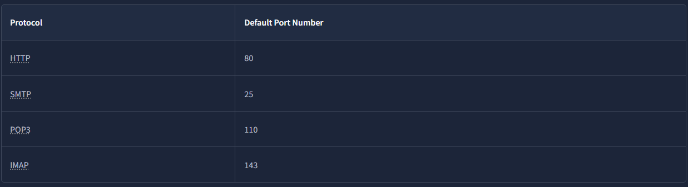
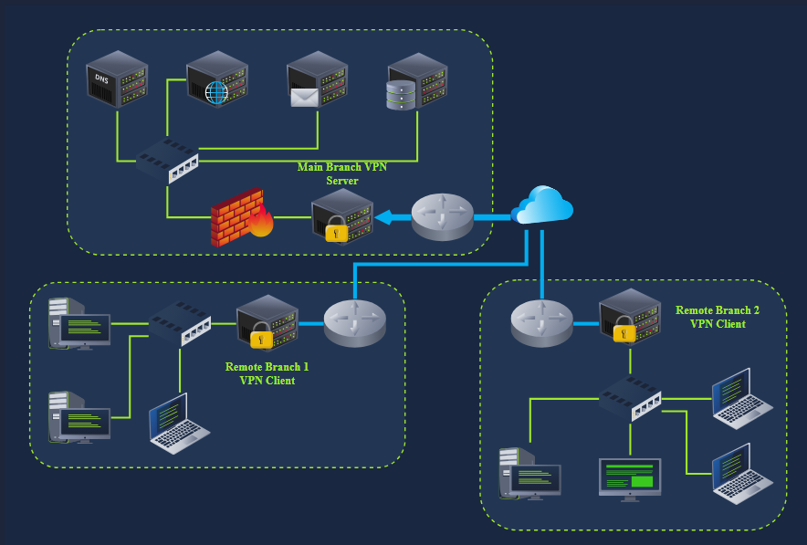
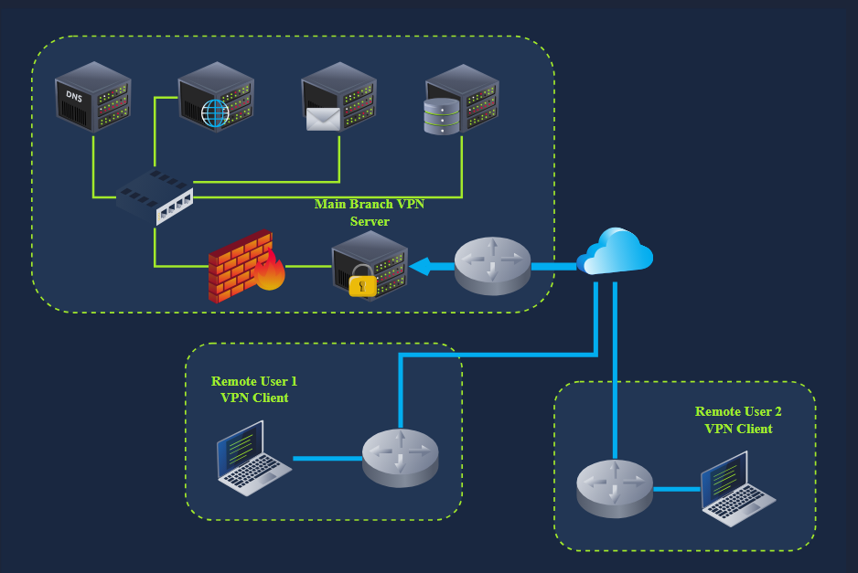
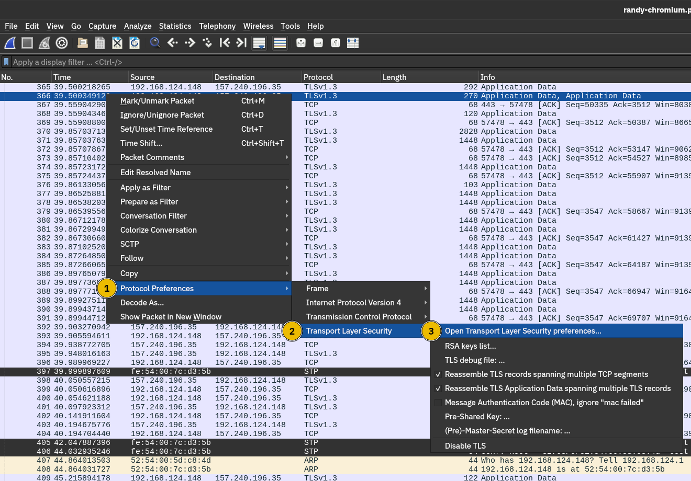
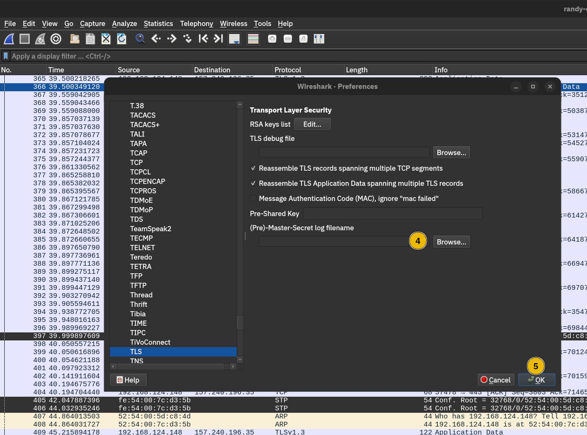

Introduction
- in the Networking Core Protocols room we learned about protocols used to browse the web and access email among others
- these protocols work great
- however they cannot protect the confidentiality, integrity or authenticity of the data transferred
- in simple terms when we say that confidentiality is not protected, it means that someone watching the packets can read your password or credit card information when sent over HTTP
- similarly they can access your private documents when sent via email
- as for not protecting the integrity of the data, it means than an adversary can change the contents of the transferred data...
- in other words if you auth the payment of £100 they can easily change it to another value such as £800
- authenticity means ensuring we are talking with the correct server, not a fake one
- important online transactions are risky without ensuring confidentiality, integrity and authenticity

- Transport Layer Security (TLS) is added to existing protocols to protect communication confidentiality, integrity and authenticity
- consequently HTTP, POP3, SMTP, and IMAP become
- HTTPS, POP3S, SMTPS, and IMPAS where the appended "s" stands for secure
- we will examing these protocols and the benefits reaped from TLS

- similarly it is deemed insecure to remotely access a system using the TELNET protocol
- Secure Shell (SSH) was created to provide a secure way to access remote systems
- furthermore SSH is an extensible protocol that offers added security features for other protocols

Learning Objectives
- upon finishing this room you will learn about
- SSL/TLS
- how to secure existing plaintext protocols:
- HTTP, SMTP, POP3, IMAP
- how SSH replaced the plaintext TELNET
- how VPN creates a secure network over an insecure one

TLS
- at one point you would only need a packet-capturing tool to read all chats, emails and passwords of the users on your network
- it was not uncommon for an attacker to set their network card in promiscuous mode e.g. to capture all packets including those not destined to it
- they would later go through all the packet captures and obtain the login crednetials of unsuspecting vitcims
- there was nothing a user could do to prevent their login password from being sent in cleartext
- nowadays it has become uncommon to come across a service that sends login credentials in cleartext

- in the early 1990s Netscape Communications recognised the need for secure communication on the WWW
- they eventually developed SSL (Secure Sockets Layer) and released SSL 2.0 in 1995 as the first public versiojn
- in 1999 the Internet Engineering Task Force (IETF) developed TLS (Transport Layer Security)
- although very similar, TLS 1.0 was an upgrade to SSL 3.0 and offered various improved security measures
- in 2018 TLS had a significant overhaul of its protocol and TLS 1.3 was released
- the purpose is not to remember the exact dates but to realise the amount of work and time put into developing the current version of TLS e.g. TLS 1.3 
- over more than 2 decades, there have been many things to learn form and improve with every version

- like SSL its predecessor TLS is a cryptographic protocol operating at the OSI models transport layer
- it allows secure communication between a client and a server over an insecure network
- by secure we refer to confidentiality and integrity
- TLS ensures that no one can read or modify the exchanged data
- please take a minute to think about what it would be like to do online shopping, banking or even messaging and email without being able to guarantee the confidentiality and integrity of the network packets.
- without TLS we would be unable to use the internet for many applications that are now part of our daily routine

- nowadays tens of protocols have received security upgrades with the simple addition of TLS
- examples include HTTP, DNS, MQTT and SIP
- which have become HTTPS, DoT (DNS over TLS), MQTTSm and SIPS
- where the appended "s" stands for secure due to the use of SSL/TLS
- in the following tasks we will visit HTTPS, SMTPS, POP3S and IMAPS

Technical Background
- we will not discuss the TLS handshake
- if you are curious you can check the Network Security Protocols room
- https://tryhackme.com/room/networksecurityprotocols
- we will give a general overview of how TLS is set up and used

- the first step for every server (or client) that needs to identify itself to get a signed TLS certificate
- generally the server admin creates a Certificate Signing Request (CSR) 
- and submits it to a certificate authority (CA)
- the CA verifies the CSR and issues a digital certificate
- once the (signed) certificate is received it can be used to identify the server (or the client) to others
- who can confirm the validity of the signature 
- for a host to confirm the validity of a signed cert, the certifcates of the signing authorities need to be installed on the host
- in the non-digital world this is similar to recognising the stamps of various authoritiies

- the scrnshot below shows the trusted authorities installed in a web browser

- generally speaking getting a cert signed requires paying an annual fee
- however 'Let's Encrypt' allows you to get your cert signed for free
- https://letsencrypt.org/

- finally we should mention that some users opt to create a self-signed cert
- a self-signed cert cannot prove the servers authenticity as no third party has confirmed it

What is the protocol name that TLS upgraded and built upon?
- SSL

Which type of certificates should not be used to confirm the authenticity of a server?
- self-signed certificate

HTTPS

HTTP
- as we studied in the Networking Core Protocols room
- HTTP relies on TCP and uses port 80 by default
- we also saw how all HTTP traffic was sent in cleartext for anyone to intercept and monitor
- the scrnshot below is from the prev room
- it gives a clear idea of how an adversary can easily read all the traffic exchanged between the client and the server

- lets take a min to review the most common steps before a web browser can request a page over HTTP
- after resolving the domain name to an IP addr the client will carry out the following 2 steps:

1. Establish a TCP three-way handshake with the target server
2. Communicate using the HTTP protocol e.g. issue HTTP requests such as 'GET / HTTP/1.1'

- the 2 step described above are shown in the window below
- the three packets for ther TCP handshake (marked with 1) precede the first HTTP packet with 'GET' in it
- the HTTP communication is marked with 2
- the last 3 displayed packets are for TCP connection termination and are marked with 3

HTTP Over TLS

- HTTPS stand for Hypertext Transfer Protocol Secure
- it is basically HTTP over TLS
- consequently requesting a page over HTTPS will reuiqre the following 3 steps (after resolving the domain name):

1. Establish a TCP three-way handshake with the target server
2. Establish a TLS session
3. Communicate using the HTTP protocol e.g. issue HTTP requests such as 'GET / HTTP/1.1'

- finally HTTP application data is exchanged, marked with 3
- looking at the Wireshark scrnshot we see that it says "Application Data" because there is no way to know what if it is indeed HTTP or some other protocol sent over port 443

- as expected if one tries to follow the stream of packets and combine all their contents they will only get gibberish as shown in the scrnshot below
- the exchanged traffic is encrypted
- the RED is sent by the client
- the BLUE is sent by the server
- there is no way to know without acquiring the encryption key

Getting the Encryption Key
- adding TLS to HTTP leads to all the packets being encrypted
- we can no longer see the contents of the exchanged packets unless we get access to the private key
- although it is improbable that we will have access to the keys used for encryption in a TLS session
- we repeated the above scrnshots after providing the decryption key to Wireshark
- the TCP and TLS handshakes dont change
- the main difference starts with the HTTP protocol marked 3
- for instance we can see when the client issues a 'GET'

- if you want to see the data exchanged now is your chance
- it is still regular HTTP traffic hidden from prying eyes

- the key takeaway is that TLS offered security for HTTP without requiring changes in the lower or higher layer protocols
- in other words TCP and IP were not modified while HTTP was sent over TLS the way it would be sent over TCP

How many packets did the TLS negotiation and establishment take in the Wireshark HTTPS screenshots above?
- 8

What is the number of the packet that contain the GET /login when accessing the website over HTTPS?
- 10

SMTPS, POP3S and IMAPS
- adding TLS to SMTP, POP3, and IMAP is no different than adding TLS to HTTP
- similar to how HTTP gets an appended S for secure and becomes HTTPS
- SMTP, POP3 and IMAP become SMTPS, POP3S, and IMAPS respectively
- using these protocols over TLS is no different than using HTTP over TLS
- therefore almost all the points from the HTTPS discussion apply to these protocols

- the insecure versions use the default TCP port numbers shown in the table below

- the secure versions e.g. over TLS use the following TCP port numbers by default

- TLS can be added to many other protocols, the reasoning and advantages would be similar

If you capture network traffic, in which of the following protocols can you extract login credentials: SMTPS, POP3S, or IMAP?
- IMAP

SSH
- we have used TELNET protocol in the Networking Concepts room
- although it is very convenient to log in and adminsiter remote systems
- it is risky when all the traffic is sent in cleartext
- it is easy for anyone monitoring the network traffic to get hold of your login credentials once you use 'telnet'
- this problem necessitated a solution
- Tatu Ylonen developed the Secure Shell (SSH) protocol and released SSH-1 in 1995 as freeware
- interestingly it was the same year that Netscape Communications released the SSL 2.0 protocol
- a more secure version SSH-2 was defined in 1996
- in 1999 the OpenBSD developers released OpenSSH, an open source implementation of SSH
- nowadays when you use an SSH client it is most likely based on OpenSSH libaries and source code

- OpenSSH offers several benefits
- we will list a few key points:
- Secure Authentication: besides password-based auth, SSH supoprts public key and 2fa
- Confidentiality: OpenSSH provides end-to-end encryption protecting against eavesdropping, furthermore it notifies you of new server keys to protect against man-in-the-middle attacks
- Integrity: In addition to protecting the confidentiality of the exchanged data, cryptography also protects the integrity of the traffic
- Tunneling: SSH can create a secure "tunnel" to route other protocols through SSH, this setup leads to a VPN-like connection
- X11 Forwarding: If you connect to a Unix-Like system with a GUI, SSH allows you to use the graphical application over the network

- you would issue the command 'ssh username@host' to connect to an SSH server
- if the username is the same as your logged-in username you only need 'ssh hostname'
- then you will be asked for a password
- however if public-key auth is used, you will be logged in immediately

- the scrnshot below shows an example of running Wireshark on a remote Kali Linux system
- the argument '-X' is required to support running graphical interfaces
- e.g. 'ssh 192.168.124.148 -X' 
- the local system needs to have a suitable graphical system installed

- while the TELNET server listens on port 23 
- the SSH port listens on port 22

What is the name of the open-source implementation of the SSH protocol?
- OpenSSH

SFTP and FTPS
- SFTP stands for SSH File Transfer Protocol 
- allows for secure file transfer
- it is part of the SSH protocol suite and shares the same port number 22
- if enabled in the openSSH server config, you can connect using a command such as 'sftp username@hostname'
- once logged in you can issue commands such as 'get filename' and 'put filename' to download and upload files respectively
- generally speaking SFTP commands are Unix-like and differ from FTP commands

- SFTP should not be confused with FTPS 
- you are right to think that FTPS stands for File Transfer Protocol Secure
- how is FTPS secured?
- yes you are correct to estimate that it is secured using TLS just like HTTPS
- while FTP uses port 21
- FTPS usually uses port 990
- it requires certificate setup and it can be tricky to allow over strict firewalls as it uses seperate connections for control and data transfer

- setting up an SFTP server is as easy as enabling an option within the OpenSSH server
- like HTTPS, SMTPS, POP3S, IMAPS and other protocols that rely on TLS for security
- FTOS requires a proper TLS certificate to run securely

Click on the View Site button to access the related site. Please follow the instructions on the site to obtain the flag.
- THM{Protocols_secur3d}

VPN
- consider a company with offices in different geographical locations
- can this company connect all its offices and sites to the main branch so that any device can access the shared resources as if physically located in the main branch?
- the answer is yes!
- furthermore the economical solution would be setting up a Virtual Private Network (VPN) using the Internet infrastructure 
- the focus here is on the V for Virtual in VPN

- when the internet was designed the TCP/IP protocol suite focused on delivering packets
- e.g. if a router gets out of service the routing protocols can adapt and pick a different route to send their packets
- if a packet was not acknowledged TCP has built-in mechanisms to detect this situation and resend
- however no mechanisms are in place to ensure that all data leaving or entering a computer is protected from disclosure and alteration
- a proper solution was the setup of a VPN connection
- the focus here is on the P for Private in VPN

- almost all companies require "private" information exchange in their virtual network
- so a VPN provides a very convenient and relatively inexpensive solution
- the main requirements are internet connectivity and a VPN server and client

- the network diagram below shows an example of a company with 2 remote branches connecting to the main branch
- a VPN client in the remote branches is expected to connect to the VPN server in the main branch
- in this case the VPN client will encrypt the traffic and pass it to the main branch via the established VPN tunnel (shown in BLUE)
- the VPN traffic is limited to the blue lines
- the green lines would carry the decrypted VPN traffic 

- in the network diagram below 
- we see two remote users using VPN clients to connect to the VPN server in the main branch
- in this case the VPN client connects to a single device

- once a VPN tunnel is established
- all our internet traffic will usually be routed over the VPN connection i.e. via the VPN tunnel
- consequently when we try to access an internet service or web application
- they will not see our public IP addr but the VPN servers
- this is why some internet users connect over VPN to circumvent geographical restrictions
- furthermore the local ISP will only see the encrypted traffic which limits its ability to censor internet access

- in other words if a user connects to a VPN server in Japan
- they will appear to the servers they accessed as if located in Japan
- these servers will customise their experience accordingly
- such as redirecting them to the Japanese version of the service
- the scrnshot below shows the google search page after connecting to a VPN server in Japan

- finally although in many scenarios one would establish a VPN connection to route all traffic over the VPN tunnel
- some VPN connections dont do this
- the VPN server may be configured to give you access to a private network but not to route your traffic
- furthermore some VPN servers leak your actual IP addr
- although they are expected to route all your traffic over the VPN
- depending on why you are using a VPN connection you might need to run a few more tests such as a DNS leak test

- finally some countries consider using a VPN illegal and even punishable
- please check the local laws and regulations before using VPNs especially when travelling

What would you use to connect the various company sites so that users at a remote office can access resources located within the main branch?
- VPN

Closing Notes
- in this room we covered 3 main approaches to secure network traffic

- first approach is to use TLS which provides a convenient way to secure many protocols such as HTTP, SMTP and POP3
- protocols secured with TLS usually get an S for Secure added to their names such as HTTPS, SMTPS and POP3s

- the second approach to secure network traffic is to use SSH
- although SSH is mainly used for remote access, it can also transfer files securely and establish secure tunnels
- creating an SSH tunnel is a solid choice if you want to pass the traffic of a plaintext protocol such as VNC

- the last approach we covered to secure network traffic is using VPN connections
- a VPN connection is usually the perfect option for connecting two company branches

Challenge
- the browser is set to log the sessions TLS keys so we can take a closer look at the traffic using Wireshark
- this logging was achieved by adding an extra option to the browser shortcut
- executing 'chromium --ssl-key-log-file=~/ssl-key.log' dumps the TLS keys to the 'ssl-key.log' file

- the packet capture file is called 'randy-chromium.pcapng' and is saved in the 'Documents' folder
- when you open the packet capture file in Wireshark
- you can configure Wireshark to use the 'ssl-key.log' file so that all the TLS traffic gets decrypted
- you can see the 5 steps to achieve this in the 2 scrnshots below

- first after right clicking anywhere choose 'Protocol Preferences'
- from the submenu select 'Transport Layer Security'
- thirdly click on 'Open Transport Layer Security preferences'

- clicking 'Open Transport Layer Security preferences' will show a dialog box
- you must click the 'browse' button marked with four to locate the 'ssl-key.log'
- you can find it in the 'Documents' directory
- finally click OK and Wireshark will show all the TLS decrypted
- one of these packets contains login credentials

One of the packets contains login credentials. What password did the user submit?
- THM{B8WM6P}

