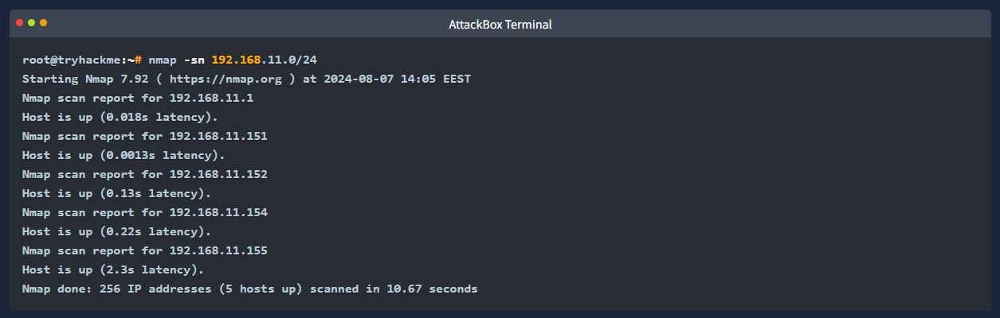
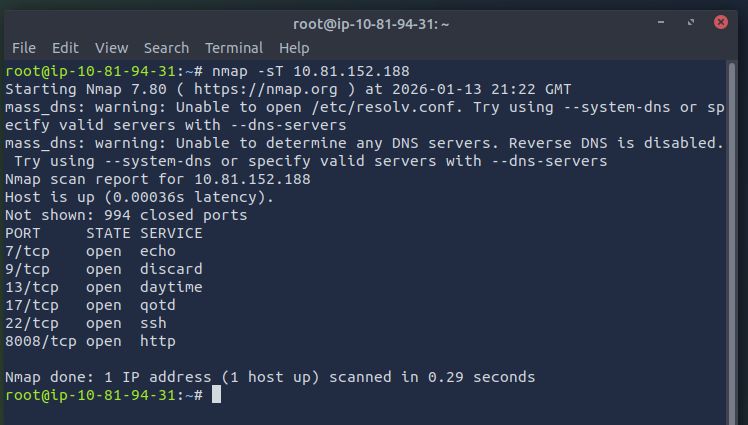
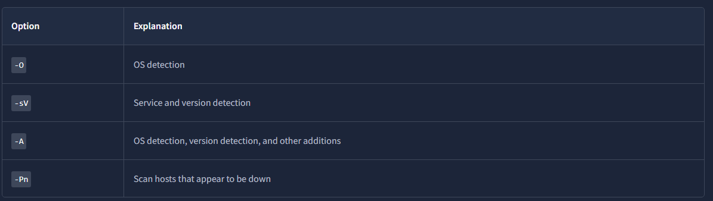
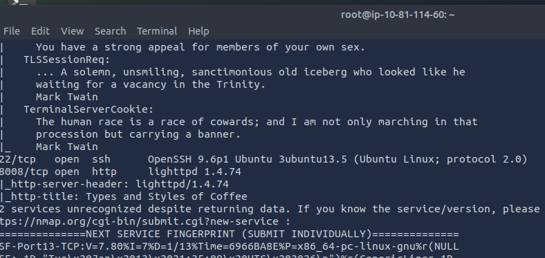
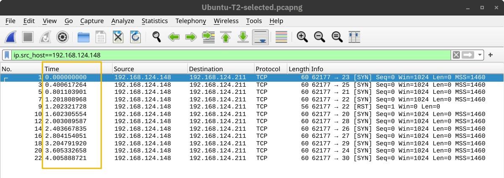
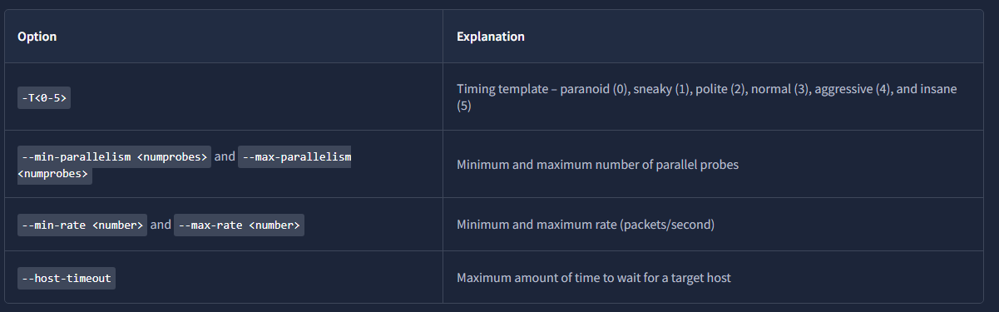

Introduction
- imagine the scenario where you are connected to a network using various network resources such as email and web browsing
- 2 questions arise
- the first is how can we discover other live devices on this network or on other networks
- the secon id how can we find out the network services running on these live devices, e.g. SSH and web servers

- one approach is to do it manually
- if asked to uncover which devices are live on the 192.168.0.1/24 network
- one can use basic tools such as 'ping', 'arp-scan' or some other tool to check the 254 IP addresses
- although this network has 256 IP addresses we counted 254 IP addresses because 2 are reserved
- each tool has its limitations 
- for example 'ping' wont give any info if the target systems firewall blocks ICMP traffic
- moreover 'arp-scan' only works if your device is connected to the same network e.g. over Ethernet or WiFi
- in brief this will be a significant waste of time without an advanced and reliable tool
- with the right tools and enough time
- one would have a list of the live hosts on a target network
- we need a flexible tool that can handle the various scenarios

- discovering the running services on a specific host is equally time-consuming if one relies on manual solutions or ineffcient scripts
- for instance on can use 'telnet' to try one port after the hover, however with 1000s of ports to scan, this can be a very time consuming task
- even if a script was created to automate the telenet connection attempts

- a very efficient solution that can solve the above 2 reqs and many more is the Nmap network scanner
- https://nmap.org/
- nmap is an open-source network scanner that was first published in 1997
- since then plenty of features and options have been added
- it is a powerful and flexible network scanner that can be adapted to various scenarios and setups

Learning Objectives
- this room aims to provide you with the basics necessary to use the nmap scanner or simply 'nmap'
- in particular you will learn how to:
- discover live hosts
- find running services on the live hosts
- distinguish the different types of port scans
- detect the versions of the running services
- control the timing
- format the output

Host Discovery: Who Is Online
- let's start with the first question: who is online?
- this ask aims to find out how to use nmap to discover the live hosts
- nmap uses various sophisticated ways to discover live hosts

- before we start we should mention that nmap uses multiple ways to specify its targets
- IP range using '-': if you want to scan all the IP addresses from 192.168.0.1 to 192.168.0.10 you can write '192.168.0.1-10'
- IP subnet using '/': if you want to scan a subnet you can express it as '192.168.0.1/24' and this would be equivalent to '192.168.0.0-255'
- Hostname: you can also specify your target hostname e.g. 'example.thm'

- lets say you want to discoer the online hosts on a network
- nmap offers the '-sn' option e.g. ping scan
- however dont expect this to be limited like 'ping'
- lets see this in action

- before we get started, we should not that throughout this room...
- we are either running nmap as root or using sudo because we dont want to restrict nmaps abilities with our acc privileges
- running nmap as local (non-root) user would limit us to fundamental types of scans such as ICMP echo and TCP connect scans (revisit this at end of room)

Scanning a "Local" Network
- in this context we use the term "local" to refer to the network we are directly connected to such as Ethernet or Wifi network
- in the first demonstration we will scan the WiFi network to which we are connected
- our IP addr is 192.168.66.89 and we are scanning the 192.168.66.0/24 network
- the 'nmap -sn 192.168.66.0/24' command and its output are shown in the terminal below 

- because we are scanning the local network where we are connected via Ethernet or WiFi
- we can look up the MAC addresses of the devices
- consequently we can figure out the network card vendors - beneficial info as it can help us guess the type of target device(s)

- when scanning a directly connected network nmap starts by sending ARP requests 
- when a device responds to the ARP request nmap labels it with "Host is up"

Scanning a "Remote" Network
- consider the case of a "remote" network
- in this context "remote" means that at least one router seperates our system from this network
- as a result all our traffic to target systems must go through one or more routers
- unlike scanning a local network we cannot send an ARP request to the target

- our system has the IP addr 192.168.66.89 and belongs to the 192.168.66.0/24 network
- in the terminal below we can scan the target network 192.168.11.0/24 where there are 2 or more routers (hops) to seperate our local system from the target hosts

- the nmap output shows that five hosts are up
- but how did nmap discover this?
- to learn more lets see some sample traffic generated by nmap
- in the scrnshot below we can see the responses from 2 hosts
- 192.168.11.1 is live and responded to the ICMP echo (ping) request
- 192.168.11.2 seems down...
- nmap sent 2 ICMP echo (ping) reqs, two ICMP timestamp reqs, 2 TCP packets to port 443 with the SYN flag set
- and 2 TCP packets to port 80 with the ACK flag set
- the target didnt response to any
- we observe several ICMP destination unreachable packets from the 192.168.11.151 router

- it is worth noting that we can have more control over how nmap discovers live hosts
- such as '-PS[portlist]', '-PA[portlist]', '-PU[portlist]' for TCP SYN, TCP ACK, and UDP discovery via the given ports
- however this is beyond the scope of this room

- as a final point nmap offers a list scan with the option '-sL'
- this scan only lists the targets to scan without actually scanning them
- e.g. 'nmap -sL 192.168.0.1/24' will list the 256 targets that will be scanned
- this option helps confirm the targets before running the actual scan

- as we mentioned earlier '-sn' aims to discover live hosts without attempting to discover the services running on them
- this scan might be helpful if you want to discover the devices on a network without causing much noise
- however this wont tell us which services are running
- if you want to learn more about the network services running on the live hosts
- we need a more "noisy" type of scan which we will explore in the next task

What is the last IP address that will be scanned when your scan target is 192.168.0.1/27?
- 192.168.0.31

Port Scanning: Who is Listening?
- earlier we used '-sn' to discover the live hosts
- in this task we want to discover the network services listening on these live hosts
- by network service we mean any process that is listening for incoming connections on a TCP or UDP port
- common network services include web servers, which usually listen on TCP ports 80 and 443
- also DNS servers which typically listen on UDP (and TCP) port 53

- by design TCP has 65535 ports and the same applies to UDP
- how can we determine which ports have a service bound to it? let's find out

Scanning TCP Ports
- the easiest way and most basic way to know whether a TCP port is open would be to attempt to 'telnet' to the port
- if you are inclined to scan with a telnet client, try to establish a TCP connection wtih every target port
- in other words -> you attempt to complete the three-way handhsake with every target port
- however only open TCP ports would respond approprietyl and allow a TCP connection to be established
- this procedure is not very different from nmap's connect sscan

Connect Scan
- the connect scan can be triggered using '-sT'
- it tries to complete the three-way handhsake with every target TCP port
- if the TCP port turns out to be open and nmap connects successfully -> nmap will tear down the established connection

- in the scrnshot below our scanning machine has the IP addr '192.168.124.148' and the target system has TCP port 22 open and port 23 closed
- in the part marked with '1' you can see how the TCP three-way handhsake was completed and later torn down with a TCP RST-ACK packet by nmap
- the part marked '2' shows a connection attempt to a closed port and the target system responded with a TCP RST-ACK packet

SYN Scan (Stealth)
- unlike the connect scan which tries to connect to the target TCP port i.e. complete three-way handshake
- the SYN scan only executes the first step: it sends a TCP SYN packet 
- consequently the TCP three-way handshake is never completed
- the advantage is that this is expected to lead to fewer logs as the connection is never established
- hence -> considered a relatively stealthy scan
- you can select the SYN scan using the '-sS' flag

- in the scrnshot below we scan the same system with port 22 open
- the part marked with '1' shows the listening service replying with a TCP SYN-ACK packet
- however nmap responded with a TCP RST packet instead of completing the TCP three-way handshake
- the part marked '2' shows a TCP connection attempt to a closed port
- in this case the packet exchange is the same as in the connect scan

Scanning UDP Ports
- although most services use TCP for communication many use UDP
- example include DNS, DHCP, NTP (Network Time Protocol), SNMP (Simple Network Management Protocol) and VoIP (Voice over IP)
- UDP does not require establishing a connection and tearing it down afterwards
- furthermore it is very suitable for real-time communication such as live broacasts
- all these are reasons to consider scanning for and discovering services listening on UDP ports

- nmap offers the option '-sU' to scan for UDP services
- because UDP is simpler than TCP we expect the traffic to differ
- the scrnshot below shows several ICMP destination unreachable (port unreachable) responses as nmap sends UDP packets to closed UDP ports

Limiting the Target Ports
- nmap scans the most common 1,000 ports by default
- however it might not be what you are looking for
- therefore nmap offers you a few more options
- '-F' is for Fast mode which scans the 100 most common ports (instead of the default 1000)
- '-p[ramge]' allows you to specify a range or ports to scan e.g. '-p10-1024' scans from port 10 to port 1024, while '-p-25' will scan all ports between 1 and 25

** note ** that '-p-' scans all the ports and is equivalent to '-p1-65535' and is the best option if you want to be as thorough as possible

Summary

How many TCP ports are open on the target system at MACHINE_IP?
- 6

Find the listening web server on 10.81.152.188 and access it with your browser. What is the flag that appears on its main page?
-  THM{SECRET_PAGE_38B9P6} 

Version Detection: Extract More Information

OS Detection
- you can enable OS detection by adding the '-O' option
- as the name implies the OS detection option triggers nmap to rely on various indicators to make an educated guess about the target OS
- in this case it is detecting that the target has Linux 4.x or 5.x running
- thats actually true however there is no perfectly accurate OS detector
- the statement that it is between 4.15 and 5.8 is very close as thr target hosts OS is 5.15

Service and Version Detection
- you discovered several open ports and want to know what services are listening on them
- '-sV' enables version detection
- this is very convenient for gathering more information about your target with fewer keystrokes
- the terminal output below shows an additional column called "VERSION" indicating the detected SSH server version

- what if you can have both '-O' and '-sV' and some more in one option?
- that would be '-A' this option enables OS detection, version scanning and traceroute among other things

Forcing the Scan
- when we run our port scan such as using the '-sS' there is a possibility that the target host does not reply during the host discovery phase
- e.g. (a host doesnt reply to ICMP requests)
- consequently nmap will mark this host as down and wont launch a port scan against it
- we can ask nmap to treat all hosts as online and port scan every host
- including those that didnt respond during the host discovery phase
- this choice can be triggered by adding the '-Pn' option

Summary

What is the name and detected version of the web server running on 10.81.152.188?
- lighttpd 1.4.74

 

Timing: How Fast is Fast
- nmap provides various options to control the scan speed and timing
- running your scan at its normal speed might trigger an IDS or other security solutions
- it is reasonable to control how fast a scan should go
- nmap gives you six timing temnplates
- and the names say it all...
- paranoid(0) 
- sneaky(1)
- polite(2)
- normal(3)
- aggressive(4)
- insane(5)
- you can pick the timing template by its name or number
- e.g. you can add '-T0' (or '-T 0') or '-T paranoid' to opt for the slowest timing

- in the nmap scans below we launch a SYN attack targeting the 100 most common TCP ports
- 'nmap -sS 10.81.152.188 -F' 
- we repeated the scan with different timings T0, T1, T2, T3, and T4
- in our lab setup nmap took different amounts of time to scan the 100 ports
- the table below should give you an idea
- but you will get different results depnding on the network setup and target system

- in the following scrnshots we can see the time when nmap sent the different packets
- in this scrnshot below, with the scan timing being T0 we can see that nmap waited 5 min before moving to the next port

- in the scrnshot below nmap waited 15 seconds between every two ports when we set the timing to T1

- then the waiting dropped to 0.4 seconds for T2 as shown below

- finally in the default case T3 
- nmap appeared to be running as fast as it could as shown below
- it is worth repeating that this would look different on a different lab setup
- however in this particular case nmap considered the connection to the target to be fast and reliable as no packet loss was incurred

- a second helpful option is the number of parallel service probes
- the number of parallel probes can be controlled with '--min-parallelism `<numprobes>`' and '--max-parallelism `<numprobes>`' 
- these options can be used to set a min and a max on the number of TCP and UDP port probes active simultaneously for a host group
- by defeault nmap will automatically control the number of parallel probes
- if the network is performing poorly i.e. dropping packets
- the number of parallel probes might fall to one; furthermore if the network performs flawlessly the number of parallel probes can reach several hundred

- a similar helpful option is the '--min-rate `<number>`' and '--max-rate `<number>`' 
- as the names indicate they can control the min and max rates at which nmap sends packets
- the rate is provided as the number of packets per second
- it is worth mentioning that the specified rate applies to the whole scan and not to a single host

- the last option we will cover in this task is '--host-timeout `<time>`' 
- this option specifies the max time you are willing to wait 
- it is suitable for slow hosts or hosts with slow network connections

What is the non-numeric equivalent of -T4?
- -T aggressive

Output: Controlling What You See
- this task focuses on two main features:
- showing additional information while a scan takes place
- choosing the file format to save the scan report

Verbosity and Debugging
- in some cases the scan takes a very long time to finish or to produce any output that will be displayed on the screen
- furthermore sometimes you might be interested in more real-time information about the scan progress
- the best way to get more updates about whats happening is to enable verbose output by adding '-v'
- consider the following terminal output showing the network scan repeated twice
- in the first case we opted for the deafult output verbosity

- then we repeated the same scan
- however the second time we used the '-v' option for verbosity
- the amount of detail present below can be very useful
- especially when you are learning about nmap and exploring the different options 
- in the terminal output below we can see how nmap is moving from one stage to another
- ARP ping scan, parallel DNS resolution, and finally, SYN stealth scan for every live host

- most likely the '-v' option is more than enough for verbose output
- however if you are still unsatisfied you can increase the verbosity level by adding another "v" such as '-vv' or even '-vvvv'
- you can also specify the verbosity level directly e.g. '-v2' and '-v4' 
- you can even increase the verbosity level by pressing "v" after the scan already started

- if all this verbosity does not satisfy your needs you must consider the '-d' for debugging level output
- similarly you can increase the debugging level by adding one or more "d" or by specifying the debugging level directly
- the maximum level is '-d9'; before choosing that make sure you are ready for thousands of info and debugging lines

Saving Scan Report
- in many cases we would need to save the scan results
- nmap gives us various formats
- the three most useful are normal (human-friendly) output, XML output and grepable output (in reference to the grep command)
- you can select the scan report format as follows

- 'oN `<filename>`' - normal output
- '-oX `<filename>`' - XML output
- '-oG `<filename>`' - grep-able output (useful for grep and awk)
- '-oA `<basename>`' - output in all major formats

- in the terminal below we can see en example of using the '-oA' option
- it resulted in three reports with the extensions, nmap, xml and gnmap for normal, XML, and grep-able output

What option must you add to your nmap command to enable debugging?

- -d

Conclusion & Summary
- in this room we learned how to use nmap to discover live hosts on any network
- we also explored the common types of port scans and how we can use nmap to find service version numbers
- we also learned how to control the timing of the scan
- finally we covered the different formats for saving nmap scan results

- it is worth noting that it is best to run nmap with sudo privileges so that we can make use of all its features
- running nmap with local user privileges will still work; however you should expect many features to be unavialable
- you get a minimal portion of nmaps power when running it as a local user
- for instance nmap would automatically use SYN scan if you ae running it with sudo privileges and will default to connect scan if run as a local user
- the reason is that crafting certain packets such as sending a TCP SYN packet requires root privileges

- nmap is a very rich tool and we only covered the most common and essential features in this room

What kind of scan will Nmap use if you run nmap 10.81.152.188 with local user privileges?
- connect scan
