Introduction
- the main challenge when studying networking protocols is that we dont get a chance to see the protcol "conversations" taking place
- all technical complexities are hidden behind friendly and elegant user interfaces
- you access resources on your local network without ever seeing an ARP query
- similarly you would access internet services for years without seeing a single three-way handshake till you check a networking book or inspect a network traffic capture
- the best study aid would be capturing network traffic and taking a closer look at the various protocols; this helps us better understand how networks work

- this room introduces some basic command-line args for using Tcpdump
- the Tcpdump tool and its 'libpcap' library are written in C and C++ and were released for Unix-like systems in the late 1980s or early 1990s
- consequently they are very stable and offer optimal speed
- the 'libpcap' library is the foundation for various other networking tools today
- moreover it was ported to MS Windows as 'winpcap'

Learning Objectives
- this room aims to provide you with the basics necessary to use 'tcpdump' 
- in particular you will learn how to:
- capture packets and save them to a file
- set filters on captured packets
- control how captured packets are displayed

What is the name of the library that is associated with tcpdump?
- libpcap

Basic Packet Capture
- you can run 'tcpdump' without providing any args
- however this is only useful to test that you have it installed
- in any real scenario we must be specific about what to listen to, where to write it and how to display the packets

Specify the Network Interface
- the first thing to decide is which network interface to listen to using '-i INTERFACE' 
- you can choose to listen on all available interfaces '-i any'
- alternatively you can specify and interface you want to listen on such as '-i eth0'

- a commdn such as 'ip address show' (or merely 'ip a s') would list the available network interfaces
- in the terminal below we see one network card 'ens5' in addition to the loopback address

Save the Captured Packets
- in many cases you should check the captured packets again later
- this can be achieved by saving to a file using '-w FILE'
- the file extension is most commonly set to '.pcap'
- the saved packets can be inspected later using another program, such as Wireshark
- you wont see the packets scrolling when you choose the '-w' option

Read Captured Packets from a File
- you can use tcpdump to read packets from a file by using '-r FILE' 
- this is very useful for learning about protocol behaviour 
- you can capture network traffic over a suitable time frame to inspect a specific protocol, then read the captured file while applying filters to display the packets you are interested in
- furthermore it might be a packet capture file that contains a network attack that took place, and you can inspect it to analyse the attack

Limit the Number of Captured Packets
- you can specify the number of packets to capture by specifying the count using '-c COUNT' 
- without specifying a count the packet capture will continue till you interrupt it e.g. pressing CTRL-C
- depending on your goal you only need a limited number of packets

Don't Resolve IP Addresses and Port Number
- tcpdump will resolve IP addresses and print friendly domain names where possible
- to avoid making such DNS lookups, you can use the '-n' arguments
- similarly if you dont want port numbers to be resolved such as 80 being resolved to http
- you can use the '-nn' to stop both DNS and port number lookups
- consider the following example shwon in the terminal below
- we captured 5 packets without resolving the IP addresses

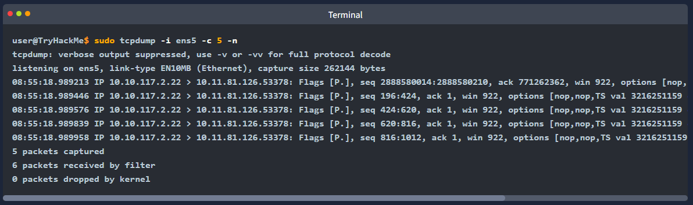

Produce (More) Verbose Output
- if you want to print more details about the packets you can use '-v' to produce a slightly more verbose output
- according to the tcpdump manual page (man tcpdump) the addition of '-v' will print "the time to live, identification, total length and options in an IP packet"
- the '-vv' will produce more verbose output; the '-vvv' will provide even more verbosity; check the manual page for details

Summary and Examples
- the table below provides a summary of the command line options that we covered

- consider the following examples:
- 'tcpdump -i eth0 -c 50 -v' captures and displays 50 packets by listening on the eth0 interface, which is a wired Ethernet and displays them verbosely
- 'tcpdump -i wlo1 -w data.pcap' captures packets by listening on the 'wlo1' interface (the WiFi interface) and writes packets to 'data.pcap' it will continue till the user interrupts the capture
- 'tcpdump -i any -nn' captures packets on all interfaces and displays them on screen without domain name or protocol resolution

What option can you add to your command to display addresses only in numeric format?
- '-n'

Filtering Expressions
- although you can run 'tcpdump' without providing any filtering expressions this wont be useful
- just like in a social gathering, you dont try to listen to everyone at the same time, you would rather give your attention to a specific person or conversation
- considering the number of packets seen by our network card, it is impossible to see everything at once; we need to be specific and capture what we are interested in inspecting

Filtering by Host
- lets say you are only interested in IP packets exchanged with your network printer or a specific game server 
- you can easily limit the captured packets to this host using 'host IP' or 'host HOSTNAME' 
- in the terminal below we capture all the packets exchanged with example.com and save them to http.pcap
- it is important to note that capturing packets requires you to be logged-in as root or to use sudo

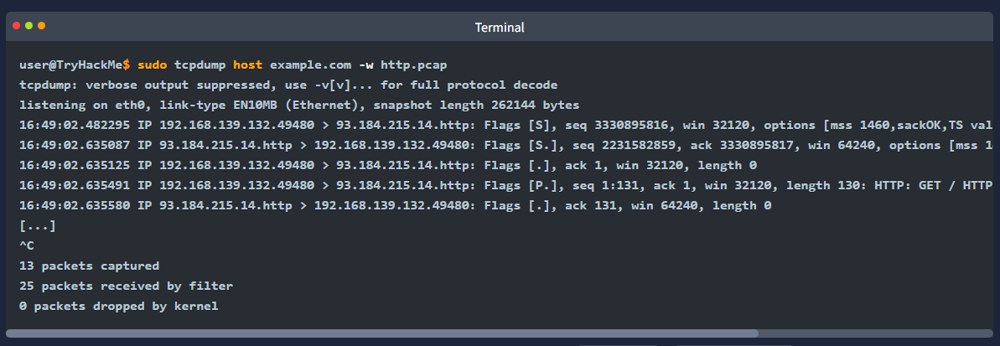

- if you want to limit the packets to those from a particular source IP address or hostname, you must use 'src host IP' or 'src host HOSTNAME'
- similarly you can limit packets to those sent to a specific destination using 'dst host IP' or 'dst host HOSTNAME'

Filtering by Port
- if you want to capture all DNS traffic you can limit the captured packets to those on port 53
- remember that DNS uses UDP and TCP ports 53 by default
- in the following example we can see all the DNS queries read by our network card
- the terminal below shows the two DNS queries
- the first query requests the IPv4 address used by example.com
- while the second requests the IPv6 address associated with example.org

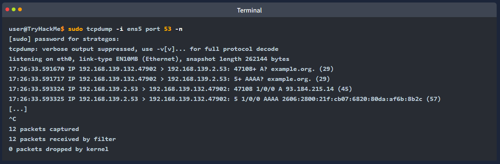

- in the above example we captured all the packets sent to or from a specific port number
- you can limit the packets to those from a particular source port number or to a particular destination port number using 'src port PORT_NUMBER' and 'dst port PORT_NUMBER' respectively

Filtering by Protocol
- the final type of filtering we will cover is filtering by protocol
- you can limit your packet capture to a specified protocol; examples include 'ip', 'ip6', 'udp', 'tcp' and 'icmp'
- in the example below we limit our packet capture to ICMP packets
- we can see an ICMP echo request and reply, which is a possible indication that someone is running the 'ping' command
- there is also an ICMP time exceeded; this might be due to running the 'traceroute' command 

Logical Operators
- three logical opertors that can be handy:
- 'and': captures packets where both conditions are true e.g. 'tcpdump host 1.1.1.1 and tcp' captures tcp traffic with host 1.1.1.1
- 'or': captures packets when either one of the conditions is true e.g. 'tcpdump udp or icmp' captures UDP or ICMP traffic
- 'not': captures packets when the condition is not true e.g. 'tcpdump not tcp' captures all packets except TCP segements; we expect to find UDP, ICMP and ARP packets among the results

Summary and Examples
- the table below offers a summary of the command line options that we covered

- consider the following examples:
- 'tcpdump -i any tcp port 22' listens on all interfaces and captures tcp packets to or from port 22 e.g. SSH traffic
- 'tcpdump -i wlo1 udp port 123' listens on the WiFI network card and filters udp traffic to port 123, the Network Time Protocol (NTP)
- 'tcpdump -i eth0 host example.com and tcp port 443 -w https.pcap' will listen on eth0 the wired Ethernet interface and filter traffic exchanged with example.com that uses tcp and port 443. in other words this command is filtering HTTPS traffic related to example.com

- for the questions from this task, we will read captured packets from the 'traffic.pcap' file
- as mentioned earlier we use '-r FILE' to read from a packet capture file
- to test this try 'tcpdump -r traffic.pcap -c 5 -n' it should display the first 5 packets in the file without looking up their IP addresses

- remember that you can count the lines by piping the output via the 'wc' command 
- in the terminal below we can see that we have 910 packets with the source IP addr set to 192.168.124.1
- please note that we add '-n' to avoid unnecessary delays in attempting to resolve IP addresses
- in the example below we didnt use 'sudo' as reading from a packet capture file does not require 'root' privileges

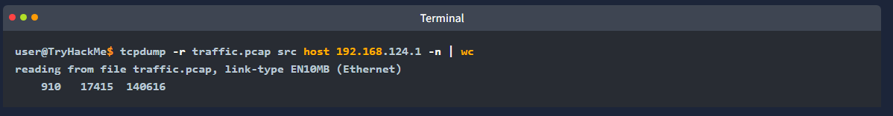

How many packets in traffic.pcap use the ICMP protocol?
- 26

What is the IP address of the host that asked for the MAC address of 192.168.124.137?
- 192.168.124.148

What hostname (subdomain) appears in the first DNS query?
- mirrors.rockylinux.org

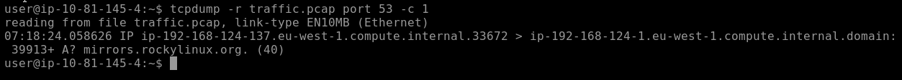

Advanced Filtering
- there are many more ways to filter packets
- after all in any real life situation we would need to filter through thousands or even millions of packets
- it is indispensable to be able to express packets to display
- for example we can limit the displayed packets to those smaller or larger than a certain length
- 'greater LENGTH': filters packets that have a length greater than or equal to the specified length
- 'less LEGNTH': filters packets that have a length less than or equal to the specified length

- we recommend you check the 'pcap-filter' manual page by issuing the comamnd 'man pcap-filter'
- however for the purpose of this room we will focus on one advanced option that allows you to filter packets based on the TCP flags
- understanding the TCP flags will make it easy to build on this knowledge and master more advanced filtering techniques

Binary Operations
- before proceeding it is worth visiting binary operations
- a binary operation works on bits i.e. zeroes and ones
- an operation takes one or two bits and returns one bit
- lets explain in more depth and consider the following three binary operations '&' '|' and '!'

- '&' (and) takes two bits and returns 0 unless both inputs are 1, as shown in the table below

- '|' (or) takes two bits and returns 1 unless both inputs are 0, this is shown in the table below

- '!' (not) takes one bit and inverts is, an input of 1 gives 0, and an input of 0 gives 1, as shown in the table below

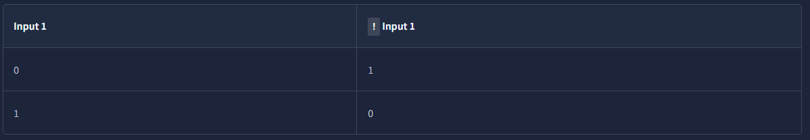

Header Bytes
- the purpose of this section is to be able to filter packets based on the contents of a header byte
- consider the following protocols: ARP, Ethernet, IP, TCP and UDP
- these are just a few networking protocols we have studied
- how can we tell tcpdump to filter packets based on the contents of protocol header bytes?
- (we will not go into details about the headers of each protocol as this is beyond the scope of this room, instead we will focus on TCP flags)

- using pcap-filter, tcpdump allows you to refer to the contents of any byte in the header using the following syntax 'proto[expr:size]' where:
- 'proto' refers to the protocol e.g. arp, ether, icmp, ip, ip6, tcp, and updrefer to ARP, Ethernet, ICMP, IPv4, IPv6, TCP and UDP respectively
- 'expr' indicates the byte offset, where 0 refers to the first byte
- 'size' indicates the number of bytes that interest us, which can be one, wo or four it is optional and is one by default

- to better understand this consider the following two examples from the pcap-filter manual page (dont worry if you find it difficult):

- 'ether[0] & 1 != 0' takes the first byte in the Ethernet header and the decimal number 1 (i.e. 0000 0001 in binary) and applies the &. it will return true if the result is not equal to number 0 (i.e. 0000 0000). the purpose of this filter is to show packets sent to a multicast address. a multicast ethernet address is a particular address that identifies a group of devices intended to receive the same data

- 'ip[0] & 0xf != 5' takes the first byte in the IP header and compares it with the hexadecimal number F (i.e. 0000  1111 in binary) it will return true if the result is not equal to the (decimal) number 5 (i.e. 0000 0101 in binary) the purpose of this filter is to catch all IP packets with options

- dont worry if you find the above two examples complex
- we included them so you know what you can achieve with this, however, fully understanding the above examples is not necessary to finish this task
- instead we will focus on filtering TCP packets based on the set TCP flags

- you can use 'tcp[tcpflags]' to refer to the TCP flags field
- the following TCP flags are available to compare with

- 'tcp-syn' TCP SYN (synchronise)
- 'tcp-ack' TCP ACK (acknowledge)
- 'tcp-fin' TCP FIN (finish)
- 'tcp-rst' TCP RST (reset)
- 'tcp-push' TCP PUSH

- based on the above we can write

- 'tcpdump "tcp[tcpflags] == tcp-syn"' to capture TCP packets with only the SYN flag set, while all other flags are unset
- 'tcpdump "tcp[tcpflags] & tcp-syn != 0"' to capture TCP packets with at least the SYN flag set
- 'tcpdump "tcp[tcpflags] & (tcp-syn|tcp-ack) != 0"' to capture TCP packets with at least the SYN or ACK flags set

- you can write your own filter depening on what you are looking for

How many packets have only the TCP Reset (RST) flag set?
- 57

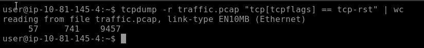

What is the IP address of the host that sent packets larger than 15000 bytes?
- 185.117.80.53

Displaying Packets
- tcpdump is a rich program with many options to customise how the packets are printed and displayed
- we have selected to cover the following 5 options:
- '-q': quick output, print brief packet informationm
- '-e': print the link-level header
- '-A': show packet data in ASCII
- '-xx': show packet data in hexadecimal format, referred to as hex
- '-x': show packet headers and data in hex and ASCII

- to demonstrate how the above options manipulate the output
- we will first display the two captured packets without using any addiitonal args

Brief Packet Information
- if you prefer shorter output lines, you can opt for "quick" output with '-q' 
- the following example shows the timestamp along with the source and destination IP addresses and source and destination port numbers

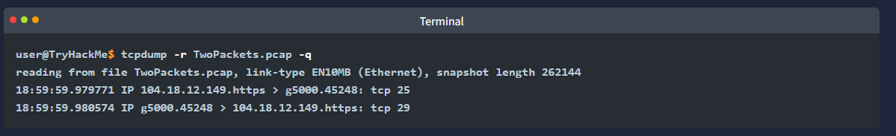

Displaying Link-Level Header
- if you are on an Ethernet or WiFi network and want to include the MAC addresses in tcpdump output
- all you need to do is add '-e' 
- this is convenient when you are learning how specific protocols such as ARP and DHCP function
- it can also help you track the source of any unusual packets on your network

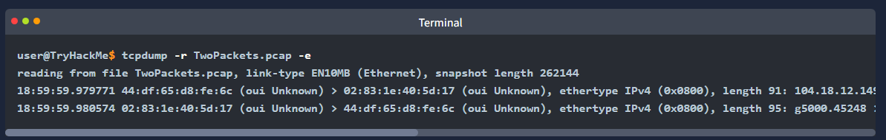

Displaying Packets as ASCII
- ASCII stands for American Standard Code for Information Interchange
- ASCII codes represent text
- in other words you can expect '-A' to display all the bytes mapped to english letters numbers and symbols

Displaying Packets in Hexadecimal Format
- ASCII format works well when the packet contents are plain-text english
- it wont work if the contents have undergone encryption or even compression
- furthermore it wont work for languages that dont use the english alphabet
- hence we need another way to display the packet content regardless of format
- being 8 bits, any octet can be displayed as two hexadecimal digits (each hexadecimal digit represents 4 bits)
- to display the packets in hexadecimal format we must add '-xx' as shown in the terminal below

- adding '-xx' lets use see the packet octet by octet
- in the example above we can closely inspect the IP and TCP headers in addition to the packet contents

Best of Both Worlds
- if you would like to display the captured packets in hexadecimal and ASCII formats
- tcpdump makes it easy with the '-X' option

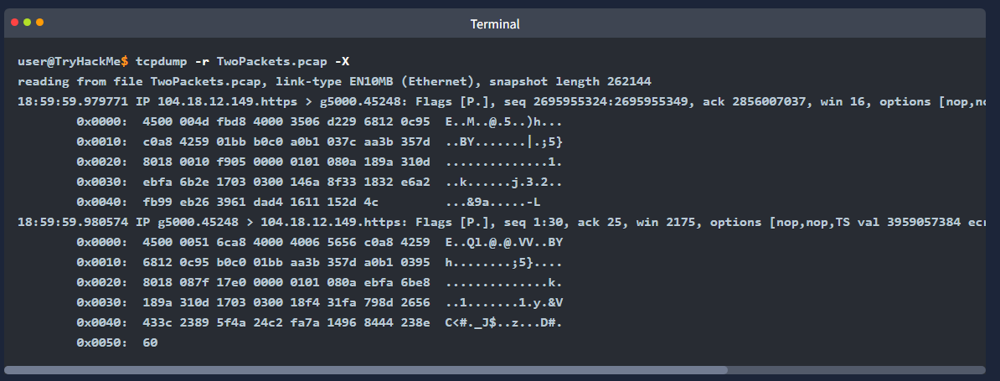

Summary and Examples
- the table below provides a summary of the command line options that we covered

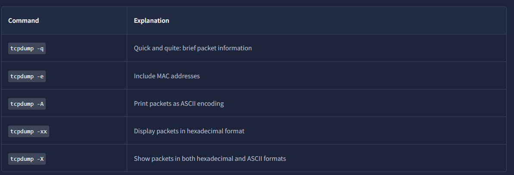

What is the MAC address of the host that sent an ARP request?
- 52:54:00:7c:d3:5b

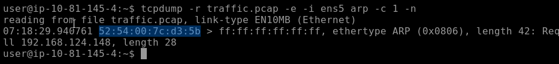