Introduction
- Wireshark is an open-source cross-platform network packet analyser tool capable of sniffing and investigating live traffic and inspecting packet captures (PCAP)
- it is commonly used as one of the best packet analysis tools 
- in this room we will look at the basics of Wireshark and use it to perform fundamenetal packet analysis

Learning Objectives
- navigate and configure Wireshark
- inspect packets and discover information from the different layers of TCP/IP
- apply display filters

- there are 2 capture files given in the VM
- 'http1.pcapng' file to simulate the actions shwon in the screenshots
- please note that you need to use the 'Exercise.pcapng' to answer the questions

Which file is used to simulate the screenshots?
- http1.pcapng

Which file is used to answer the questions?
Exercise.pcapng

Tool Overview
- Wireshark is one of the most potent traffic analyser tools available in the wild
- there are multiple purposes for its use:
- detecting and troubleshooting network problems such as network load failure points and cogestion
- detecting security anomalies such as rogue hosts, abnormal port usage and suspicious traffic
- investigating and learning protocol details such as response codes and payload data

** note ** Wireshark is not an Intrusion Detection System (IDS) it only allows analysts to discover and investigate the packets in depth, it also doesnt modify packets it reads them hence detecting any anomaly or network problem highly relies on the analysts knowledge and investigation skills

GUI and Data
- Wireshark GUI opens with a single all-in-one page which helps users investigate the traffic in multiple ways
- at first glance five sections stand out:

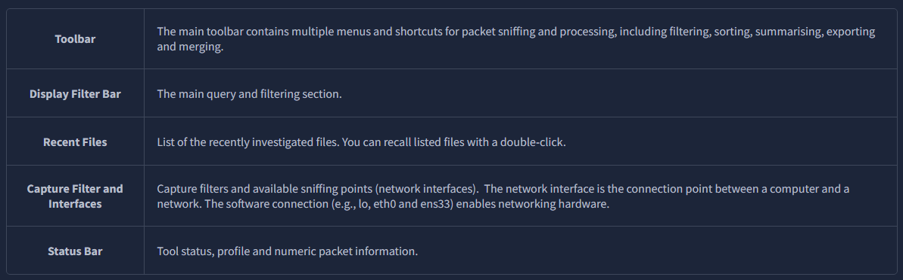

- the picture below shows the Wiresharks main window
- the sections explained in the table above are highlighted
- now open wireshark and follow along with the walkthrough

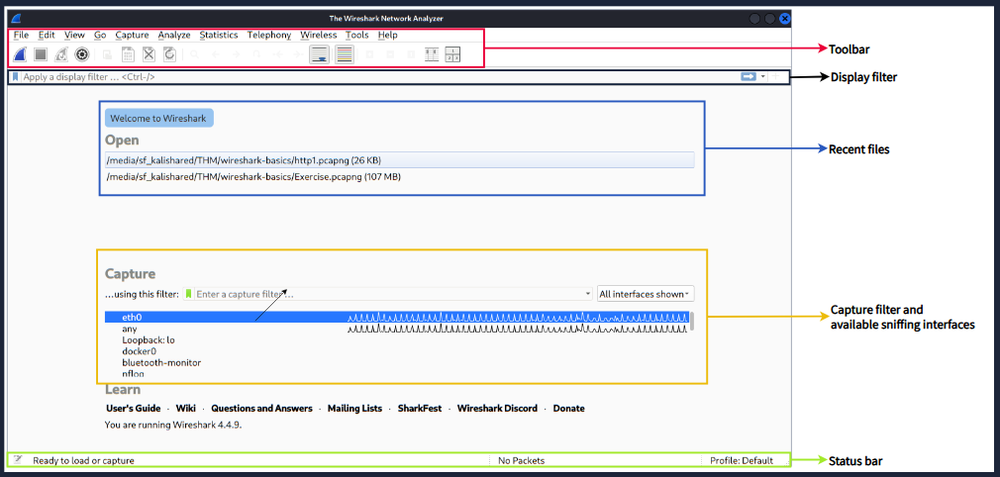

Loading PCAP Files
- the above picture shows Wiresharks empty interface
- the only available information is the recently processed 'http1.pcapng' file
- lets load that file and see Wiresharks detailed packet presentation
- you can also use the file menu, dragging and dropping the file or double clicking on the file to load a pcap

- now we can see the processed filename, detailed number of packets, and packet details
- packet details are shown in three different panes
- which allow us to discover them in different formats

Colouring Packets
- along with quick packet information
- Wireshark also colour packets in order of different conditions and the protocol to spot anomalies and protocols in captures quickly
- (this explains why almost everything is green in the given scrnshots)
- this glance at packet information can help track down exactly what you are looking for during analysis
- you can create custom colour rules to spot events of interest by using display filters
- we will cover them in the next room
- now lets focus on the defaults and understand how to view and use the represented data details

- Wireshark has two types of packet colouring methods
- temporary rules: that are only available during a program session 
- permanenet rules: that are saved under the preference file (profile) and available for the next program session
- you can use the "right-click menu" or "view -> colouring rules" menu to create permanent colouring rules
- the "colourise packet list" menu activates/deactivates the colouring rules
- temporary packet colouring is done with the "right-click menu" or "view -> conversation filter" menu which is covered in task 5

- the default permanent colouring is shown below

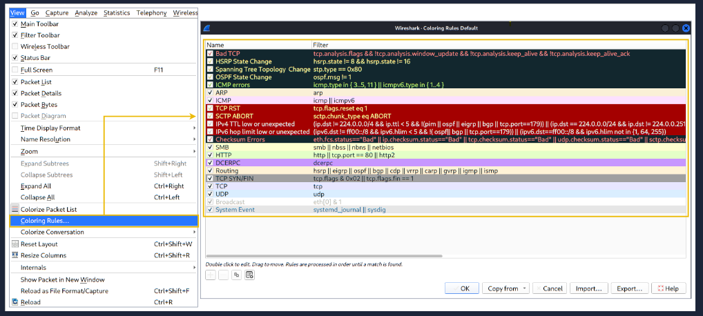

Traffic Sniffing
- you can use the blue "shark button" to start network sniffing (capturing traffic)
- the red button will stop the sniffing 
- the green button will restart the sniffing process
- the status bar will also provide the usewd sniffing interface and the number of collected packets

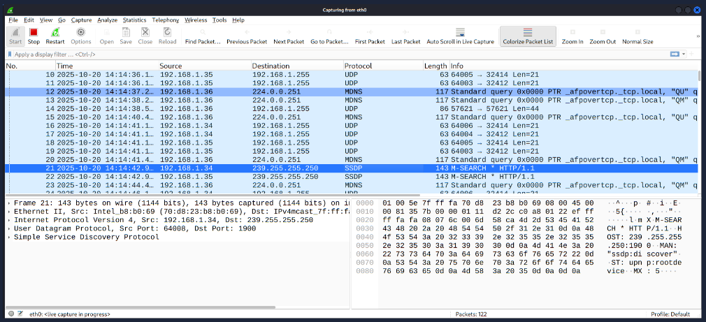

Merge PCAP Files
- Wireshark can combine two pcap files into one single file
- you can use the "File -> merge" menu path to merge a pcap with the processed one
- when you choose the second file...
- Wireshark will show the total number of packets in the selected file
- once you click "open" it will merge the existing pcap file with the chosen one and create a new pcap file

** note ** you need to save the "merged" pcap file before working on it

View File Details
- knowing the file details is helpful
- especially when working with multiple pcap files, sometimes you need to know and recall the file details
- (file hash, capture time, capture file comments, interface and statistics)
- to identify the file, classify and prioritise it
- you can view the details by following "Statistics -> Capture file properties" or by clickin the "pcap" icon located on the left bottom

Use the "Exercise.pcapng" file to answer the questions.
Read the "capture file comments". What is the flag?
- TryHackMe_Wireshark_Demo

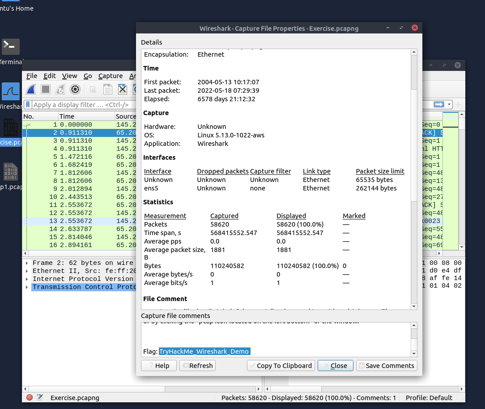

What is the total number of packets?
- 58620

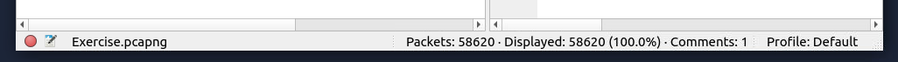

What is the SHA256 hash value of the capture file?
- f446de335565fb0b0ee5e5a3266703c778b2f3dfad7efeaeccb2da5641a6d6eb

Packet Dissection
- also known as protocol dissection
- which investigates packet details by decoding available protocols and fields
- Wireshark supports a long list of protocols for dissection 
- and you can also write your dissection scripts
- you can find more details on dissection:
- https://github.com/boundary/wireshark/blob/master/doc/README.dissector

** note ** this section covers how Wireshark uses OSI layers to break down its packets and how to use these layers for analysis. it is expected you laready have background knowledge of the OSI model and how it works

Packet Details
- you can click on a packet in the packet list pane to open its details (double-click will open details in new window)
- packets consist of 5 to 7 layers based on the OSI model
- we will go over all of them in a HTTP packet from a sample capture

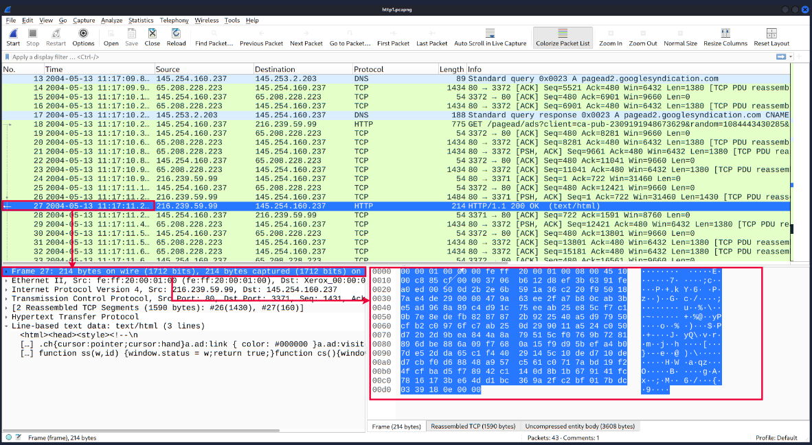

- each time you click a detail it will highlight the corresponding part in the packet bytes pane

- let's have a closer look view of the details pane

- we can see seven distinct layers to the packet:
- 'frame/packet'
- 'source [MAC]'
- 'source [IP]'
- 'protocol'
- 'protocol erros' 
- 'application protocol'
- 'application data'

- below we will go over the layers in more detail

- The Frame (Layer 1): This will show you what frame/packet you are looking at and details specific to the physical layer of the OSI model

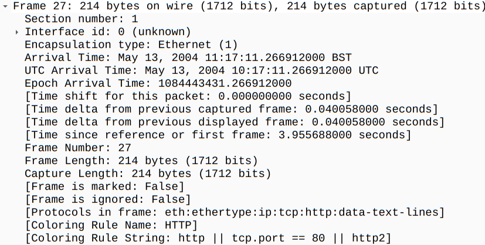

- Source [MAC] (Layer 2): This will show you the source and destination MAC addresses; from the data link layer of the OSI model

- Source [IP] (layer 3): This will show you the source and destination IPv4 addresses; from the network layer of the OSI model

- Protocol (Layer 4): This will show you details of the protocol used (UDP/TCP) and source and destination ports; from the transport layer of the OSI model

- Protocol errors: this continuation of the 4th layer shows specific segments from TCP that needed to be reassembled

- Application Protocol (Layer 5): This will show details specific to the protocol used such as HTTP, FTP and SMB; from the application layer of the OSI model

- Application Data: the extension of the 5th layer can show the application-specific data

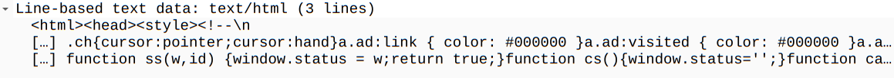

Use the "Exercise.pcapng" file to answer the questions. View packet number 38. Which markup language is used under the HTTP protocol?
- eXtensible Markup Language

What is the arrival date of the packet? (Answer format: Month/Day/Year)
- 05/13/2004

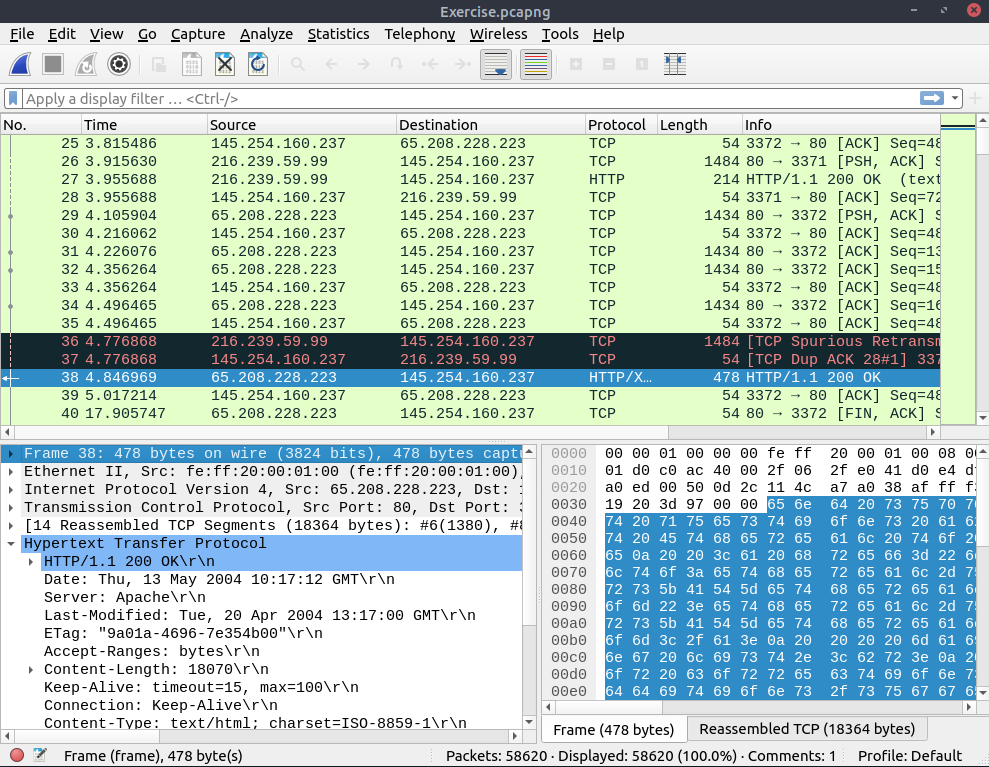

What is the TTL value?
- 47

What is the TCP payload size?
- 424

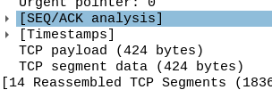

What is the e-tag value?
(For example: 82ecb-6321-9e904585)
- 9a01a-4696-7e354b00

Packet Numbers
- Wireshark calculates the number of investigated packets and assigns a unique number for each packet
- this helps the analysis process for big captures and makes it easy to go back to a specific point of an event

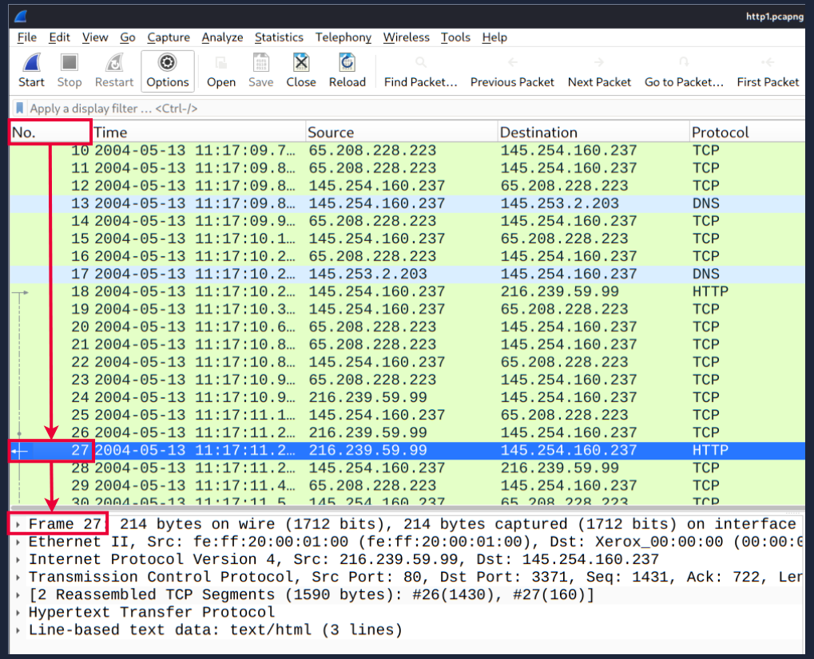

Go to Packet
- packet numbers do not only help to count the total number of packets or make it easier to find/investigate specific packets
- this feature not only navigates between packets up and down...
- it also provides in-frame packet tracking and finds the next packet in the particular part of the conversation
- you can use the "Go" menu and toolbar to view specific packets

Find Packets
- apart from packet number, Wireshark can find packets by packet content
- you can use the "Edit -> Find Packet" menu to make a search inside the packets for a particular event of interest
- this helps analysts and admins to find specific intrusion patterns or failure traces

- there are two crucial points in finding packets
- the first is knowing the input type
- this functionality accepts four types of inputs (Display filter, Hex, String and Regex)
- String and regex searches are the most commonly used search types
- searches are case insensitive but you can set the case sensitivity in your search by clicking the radio button

- the second point is choosing the search field
- you can conduct searches in three panes
- (packet list, packet details, and packet bytes)
- and it is important to know the available information in each pane to find the event of interest
- e.g. if you try to find the info available in the packet details pane and conduct a search in the packet list pane, Wireshark wont find it even if it exists

Mark Packets
- marking packets is another helpful functionality for analysts
- you can find/point to a specific packet for further investigation by marking it
- it helps analysts point to an event of interest or export particular packets from the capture
- you can use the "Edit" or the "right-click" menu to mark/unmark packets

- marked packets will be shown in black regardless of the original colour representing the connection type
- note that makred packet information is renewed every file session 
- so marked packets will be lost after closing the capture file

Packet Comments
- similar to packet marking, commenting is another helpful feature for analysts 
- you can add comments for particular packets that will help with the further investigation 
- or remind and point out important/suspicious points for other later analysts
- unlike packet marking the comments can stay within the capture file until the operator removes them

Export Packets
- capture files can contain thousands of packets in a single file
- as mentioned earlier Wireshark is not an IDS so sometimes it is necessary to seperate specific packages from the file and dig deeper to resolve an incident
- this functionality helps analsysts share the only suspicious packages (decided scope) 
- thus redundant info is not included in the analysis process
- you can use the "File" menu to export packets

Export Objects (Files)
- Wireshark can extract files through the wire
- for a security analyst it is vital to discover shared files and save them for further investigation
- exporting objects are available only for selected protocols streams (DICOM, HTTP, IMF, SMB and TFTP)

Time Display Format
- Wireshark lists the packets as they are captured
- so investigating the default flow is not always the best option
- by default Wireshark shows the time in "Seconds Since Beginning of Capture"
- the common usage is using the UTC Time Display Format for a better view
- you can use the "View -> Time Display Format" menu to change the time display format 

Expert Info
- Wireshark also detects specific states of protocols to help analysts easily spot possible anomalies and problems
- note that tese are only suggestions and there is always a chance of having false positives/negatives 
- expert info can provide a group of categories into three different severities 
- details are shown in the table below:

- frequently encountered information groups are listed in the table below
- you can refer to Wiresharks documentation for more info on the expert info entries
- https://www.wireshark.org/docs/

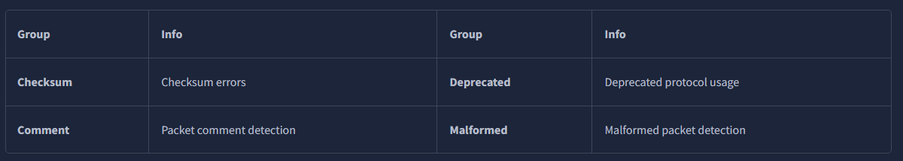

- you can use the "lower left bottom section" in the status bar or "Analyse -> Exper Information" menu to view all available info entries via a dialog box
- it will show the packet number, summary, group protocol and total occurence

Use the "Exercise.pcapng" file to answer the questions. Search the "r4w" string in packet details. What is the name of artist 1?
- r4w8173

Go to packet 12 and read the packet comments. What is the answer?
Note: use md5sum `<filename>` terminal command to get MD5 hash
- 911cd574a42865a956ccde2d04495ebf

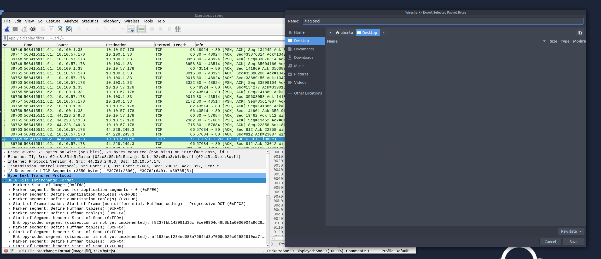

There is a ".txt" file inside the capture file. Find the file and read it; what is the alien's name?
- PACKETMASTER

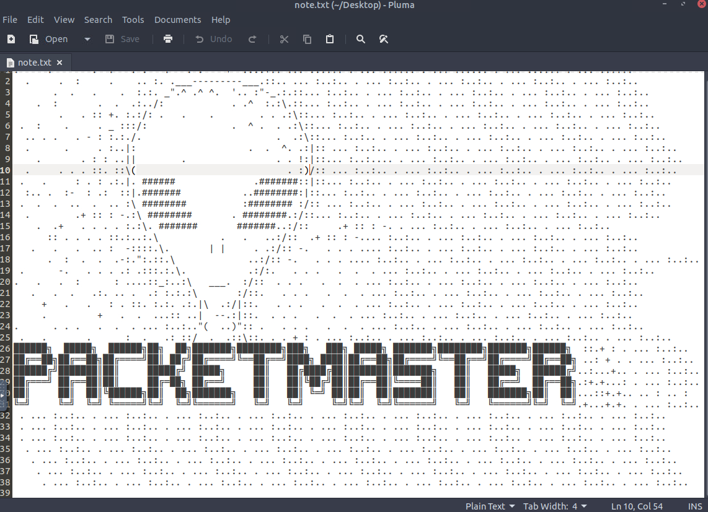

Look at the expert info section. What is the number of warnings?
- 1636

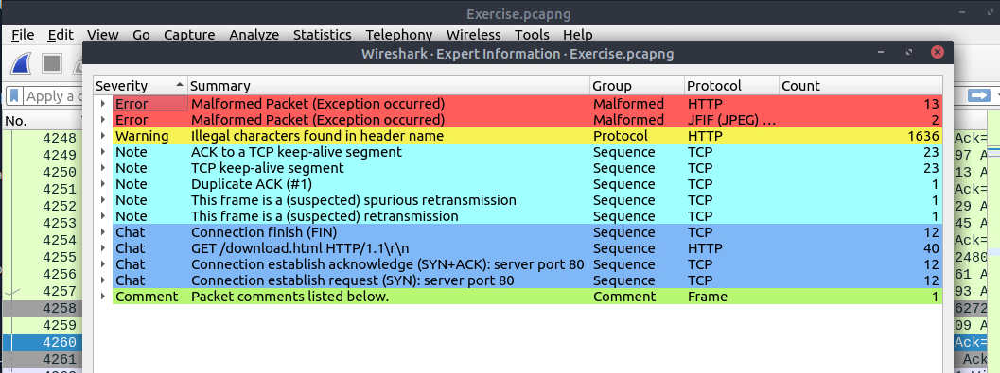

Packet Filtering
- Wireshark has a powerful filter engine that helps analysts to narrow down the traffic and focus on the even of interest
- Wireshark has twotypes of filtering approaches
- Capture and display filters
- Capture filters are used for "capturing" only the packets valid for the used filter
- Display filters are used for "viewing" the packets valid for the used filter
- we will discuss these filters differences and advanced usage in the next room
- now lets focus on the basic usage of the display filters which will help analysts in the first place

- filters are specific queries designed for protocols available in Wiresharks official protocol reference
- while the filters are only the to investigate the event of interest 
- there are 2 different ways to filter traffic and remove the noise from the capture file
- the first one uses queries, and the second uses the right-click menue
- Wireshark provides a powerful GUI and there is a golden rule for analysts who dont want to write queries for basic tasks
- "If you can click on it, you can filter and copy it"

Apply as Filter
- this is the most basic way of filtering traffic
- while investigating a capture file you can click on the field you want to filter and use the "right-click menu" or "Analyse -> Apply as Filter" menu to filter the specific value
- once you apply the filter, Wireshark will generate the required filter query, appliy it, show the packets according to your choice and hide the unselected packets from the packet list pane
- note that the number of total and displayed packets are always shown on the status bar

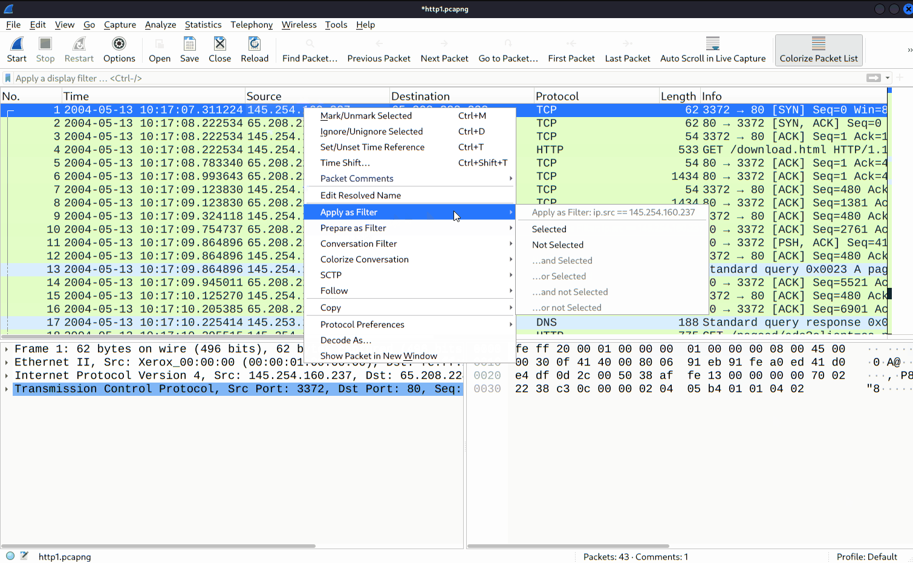

Conversation Filter
- when you use the "apply as filter" option you will filter only a single entity of the packet
- this option is a good way of investigating a particular value in packets
- however suppose you want to investigate a specific packet number and all linked packets by focusing on IP addresses and port numbers
- in that case the "Conversation Filter" option helps you view only the related packets and hides the rest of the packets easily
- you can use the "right-click menu" or "Analyse -> Conversation Filter" menu to filter conversations

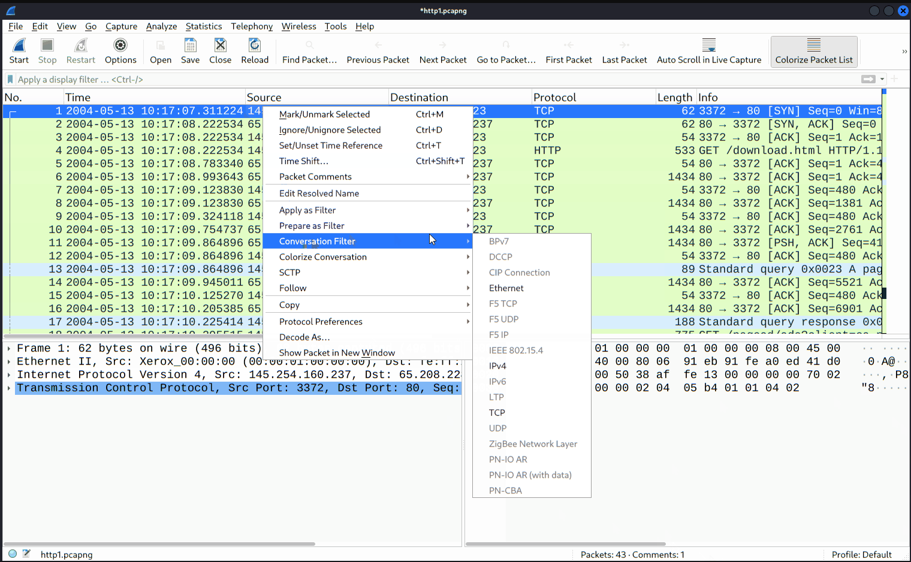

Colourise Conversation
- this option is similar to the "Conversation Filter" with one difference
- it highlights the linked packets without applying a filter and decreasing the number of viewed packets
- this option workks with the "colouring rules" option and changes the packet colours without considering the prev applied colour rule
- you can use the "right-click menu" or "View -> Colourise Conversation" menu to colourise a linked packet in a single click
- note that you can use the "View -> Colourise Conversation -> Reset Colourisation" menu to undo this operation

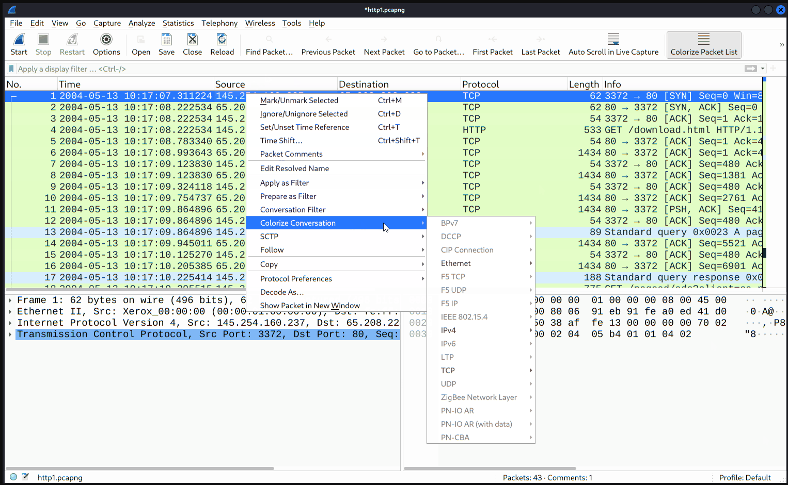

Prepare as Filter
- similar to "Apply as Filter" this option helps analysts create display filters using the "right-click" menu 
- however unlike the previous one, this model doesnt apply the filters after the choice
- it adds the required query to the pane and waits for the execution command (enter) or another chosen filtering option by using the ".. and/or.." from the "right-click menu"

Apply as Column
- by default the packet list pane provides info about each packet
- you can use the "right-click menu" or "Analyse -> Apply as Column" menu to add columns to the packet list pane
- once you click on a value and apply it as a column, it will be visible on the packet list pane
- this function helps analysts examine the appearance of a specific value/field acrsoss the available packets in the capture file
- you can enable/disable the columns shown in the packet list pane by clicking on top of the packet list pane

Follow Stream
- Wireshark displays everything in packet portion size
- however it is possible to reconstruct the streams and view the raw traffic as it is presented at the application level
- following this protocol streams help analysts recreate the application-level data and understand the event of interest
- it is also possible to view the unencrypted protocol data like usernames, passwords and other transferred data

- you can use the "right-click menu" or "Analyse -> Follow TCP/UDP/HTTP Stream" menu to follow traffic streams
- streams are shown in a seperate dialogue box; packets originating from the server are highlighted with BLUE, and those originating from the client are highlighted in RED

- once you follow a stream Wireshark automatically creates and applies the required filter to view the specific stream
- remember once a filter is applied, the number of viewed packets will change
- you will need to use the "X button" located on the right upper side of the display filter bar to remove the display filter and view all available packets in the capture file

Use the "Exercise.pcapng" file to answer the questions.
Go to packet number 4. Right-click on the "Hypertext Transfer Protocol" and apply it as a filter.
Now, look at the filter pane. What is the filter query?
- http

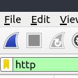

What is the number of displayed packets?
- 1089

Go to packet number 33790, follow the HTTP stream, and look carefully at the responses.
Looking at the web server's response, what is the total number of artists?
- 3

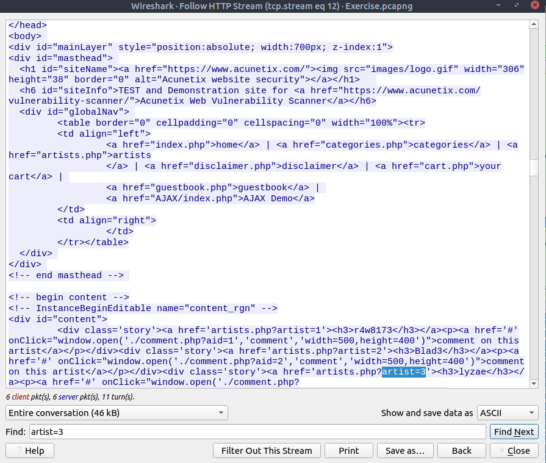

- there was no results for artist=4

What is the name of the second artist?
- blad3

