Introduction
- this particular room aims to understand the basics of the Burp Suite web application security testing framework
- our focus will revolve around the following key aspects:

1. A thorough introduction to Burp Suite

2. A comprehensive overview of the various tools available within the framework

3. Detailed guidance on the process of installing Burp Suite on your system

4. Navigating and configuring Burp Suite

- we will also introduce the core of the Burp Suite framework which is the Burp Proxy
- it is important to note that this room primarily serves as a foundational resource for acquiring knowledege about Burp Suite
- subsequent rooms in the Burp module will adopt a more practical approach
- thus this room will contain a greater emphasis on theoretical content
- if you have not yet utilised Burp Suite it is recommended to carefully read the provided info and actively engage with the tool
- experimentation is esseential for grasping the fundamentals of this framework
- combining the info presented here with hands-on exploration will establish a strong foundation for utlising the framework
- this will significantly assist you in future rooms

What is Burp Suite?
- in essence Burp Suite is a Java-based framework designed to serve as a comprehensive solution for conducting web application pen testing
- it has become the industry standard tool for hands-on security assessments of web and mobile applications, incuding those that rely on application programming interfaces (APIs)

- simply put Burp Suite captures and enables manipulation of all the HTTP/HTTPS traffic between a browser and a web server
- this fundamental capability forms the backbone of the framework
- by intercepting requests, users have the flexibility to route them to various components within the Burp Suite framework
- the ability to intercept, view and modify web requests before they reach the target server or even manipulate responses before they are received by our browser makes Burp Suite an invaluable tool for manual web app testing

- Burp Suite is avaialable in different editions
- for our purposes we will focus on the Burp Suite Community Edition which is freely accessible for non-commercial use within legal boundaries
- however its worth noting Burp Suite also offers Professional and Enterprise editions, which come with advanced features and require licensing

1. Burp Suite Professional is an unrestricted version of Burp Suite Community. It comes with features such as:
- an automated vulnerability scanner
- a fuzzer/brute-forccer that isnt rate limited
- saving projects for future use and report generation
- a built-in API to allow integration with other tools
- unrestricted access to add new extensions for greater functionality
- access to the Burp Suite Collaborator (effectively providing a unique request catcher self-hosted or running on a Portswigger-owned server)

- in short Burp Suite Professional is a highly potent tool, making it a preferred choice for professionals in the field

2. Burp Suite Enterprise -> in contrast to the community and professional editions, is primarily utilised for continous scanning
- it features an automated scanner that periodically scans web apps for vulnerabilities similar to how tools like Nessus perform automated infrastructure scanning
- unlike the other editions which allow manual attacks from a local machine, Enterprise resides on a server and constantly scans the target web apps for potential vulnerabilities

- due to requiring a license for the Professional and Enterprise editions, we will focus on the core feature set provided by the Burp Suite Community Edition

** Note ** The provided demsonstrations utilise Burp Suite for Windows, however the functionality remains consistent with the version installed on the attackbox

Which edition of Burp Suite runs on a server and provides constant scanning for target web apps?
- Burp Suite Enterprise

Burp Suite is frequently used when attacking web applications and ______ applications.
- mobile

Features of Burp Community
- although Burp Suite Community offers a more limited feature set compared to the Professional edition...
- it still provides an impressive array of tools that are highly valuable for web application testing
- here are some of the key features:

Proxy
- The Burp Proxy is the most renowned aspect of Burp Suite
- it enabled interception and modification of requests and responses while interacting with web applications

Repeater
- another well-known feature 
- repeater allows for capturing, modifying, and resending the same request multiple times
- this functionality is particularly useful when crafting payloads through trial and error (i.e. in SQLi - Structured Query Language Injection) or testing the functionality of an endpoint for vulnerabilities

Intruder
- despite rate limitations in Burp Suite Community, intruder allows for spraying endpoints with requests
- it is commonly utilised for brute-force attacks or fuzzing endpoints

Decoder
- decoder offers a valuable service for data transmission
- it can decode captured info or encode payloads before sending them to the target
- while alternative services exist for this purpose, leveraging decoder within Burp Suite and be highly efficient

Comparer
- as the name suggests, comparer enables the comparison of two pieces of data at either the word or byte level
- while not exclusive to Burp Suite, the ability to send potentially large data segments directly to a comparison tool with a single keybaord shortcut significantly accelerates the process

Sequencer
- sequencer is typically employed when assessing the randomness of tokens, such as session cookie values or other supposedly random generated data
- if the algorithm used for generating these values lacks secure randomness, it can expose avenues for devastating attacks

- beyond the built-in features, the Java codebase of Burp Suite facilitates the development of extensions to ehance the frameworks functionality
- these extensions can be written in Java, Python (using the Java Jython interpreter) or Ruby (using the Java JRuby interpreter)
- the Burp Suite Extender module allows for quick and easy loading of extensions into the framework, while the marketplace, known as the BApp Store enables downloading of third party modules
- while certrain extensions may require a professional license for integration, there are still a considerable number of extensions available for Burp Community
- for instance the Logger++ module can extend the built-in logging functionality of Burp Suite

Which Burp Suite feature allows us to intercept requests between ourselves and the target?
- Proxy

Which Burp tool would we use to brute-force a login form?
- Intruder

Installation
- Burp Suite is one of those tools that is very useful to have around, whether for web or mobile app assesments, pentesting, bug bounty hunting or even debugging features in web app dev
- heres a guide on installing Burp Suite on different platforms

Downloads
- https://portswigger.net/burp/releases
- Kali Linux -> pre-installed, if missing can easily install from Kali apt repos
- Linux, macOS, Windows -> dedicated installers from the website

The Dashboard
- once you launch and accept the terms and conditions you will be prompted to select a project type
- in Community the options are limited, and you can simply press next to proceed

- the next window allows you to choose the config for Burp Suite
- generally recommended to keep default settings, which are suitable for most situations

- upon opening Burp Suite for the first time you might encounter a screen with training options
- highly recommended to go through these when you have time

- otherwise you will be presented with the Burp Dashboard
- its divded into 4 quadrants, as labelled in counter-clockwise order setarting from the top left

1. Tasks -> the tasks menu allows you to define background tasks that Burp Suite will perform while you use the application. in Community the default "Live Passive Crawl" task, which automatically logs the pages visited, is sufficient for purposes of this module. Professional offers additional features like on-demand scans

2. Event log -> provides information about the actions performed by Burp Suite, such as starting the proxy, as well as details about connections made through Burp

3. Issue Activity -> section is specific to Professional, it displays the vulnerabilites identified by the automated scanner, ranked by severity and filterable based on the certainty of the vuln

4. Advisory -> provides more detailed info about the identified vulns inclduing references and suggested remediations, this info can be exported into a report, in Community this section may not show any vulns

- throughout the various tabs and windows of Burp Suite you will notice question mark icons

- clicking on these opens a new window with helpful info specific to that section
- these help icons are invaluable when you need assistance or clarification on a particular feature

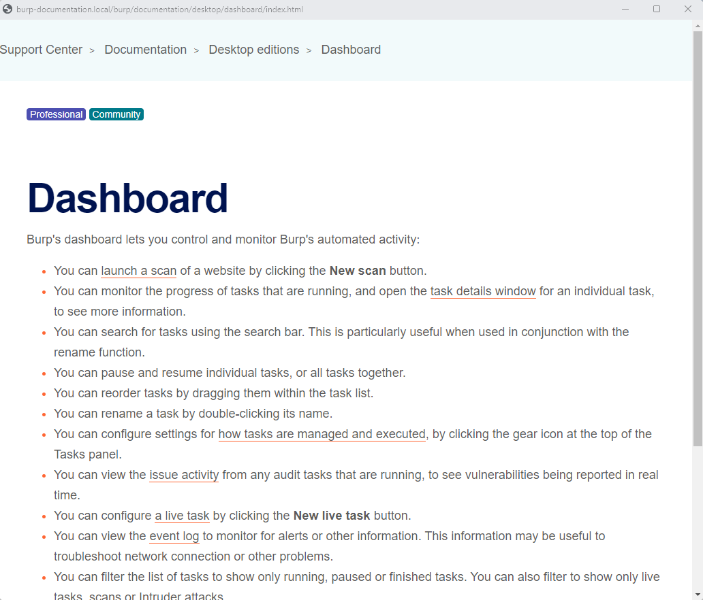

- by exploring the different tabs and functionalities of Burp Suite you will gradually become familiar with its capabilites

What menu provides information about the actions performed by Burp Suite, such as starting the proxy, and details about connections made through Burp?
- Event Log

Navigation
- in Burp Suite the default nav is primarily done through the top menu bars, which allow you to switch between modules and access various sub-tabs within each module
- the sub-tabs appear in a second menu bar directly below the main menu bar

- heres how navigation work:

1. Module Selection -> the top row of the menu bar displays the available modules in Burp Suite, you can click each module to switch between them e.g. the Burp Proxy module is selected in the img below

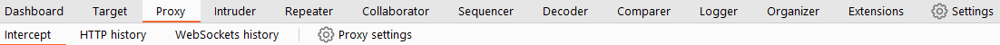

2. Sub-Tabs -> if a selected module has multiple sub-tabs they can be accessed through the second menu bar that appears directly below the main menu bar. these sub-tabs often contain module-specific settings and options e.g. in the img above the Proxy intercept sub-tab is selected within the Burp Proxy Module

3. Detaching Tabs -> if you pref to view multiple tabs seperately, you can detatch them into sperate windows. to do this go to the window option in the application menu above the Module Selection bar. from there choose the "detach" option, and the selected tab will open in a seperate window, the detached tabs can be reattached using the same method

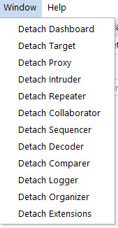

- Burp Suite also provides keyboard shortcuts for quick nav to key tabs
- by default the following shortucts are available

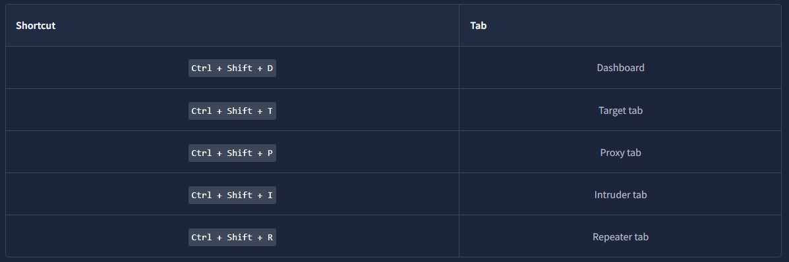

Which tab Ctrl + Shift + P will switch us to?
- Proxy Tab

Options
- before diving into the Burp Proxy, lets explore the available options for configuring Burp Suite
- there are 2 types of settings
- Global settings (also known as User settings)
- Project settings

Global Settings
- these settings affect the entire Burp Suite installation and are applied every time you start the app
- they provide a baseline config for your environment

Project Settings
- these settings are specific to the current project and apply only during the session
- note in Community you cant save projects, so any project-specific options will be lose when you close Burp

- to access the settings click on the settings button in the top nav bar
- this will open a seperate settings window

- below is the image showing the seperate settings window

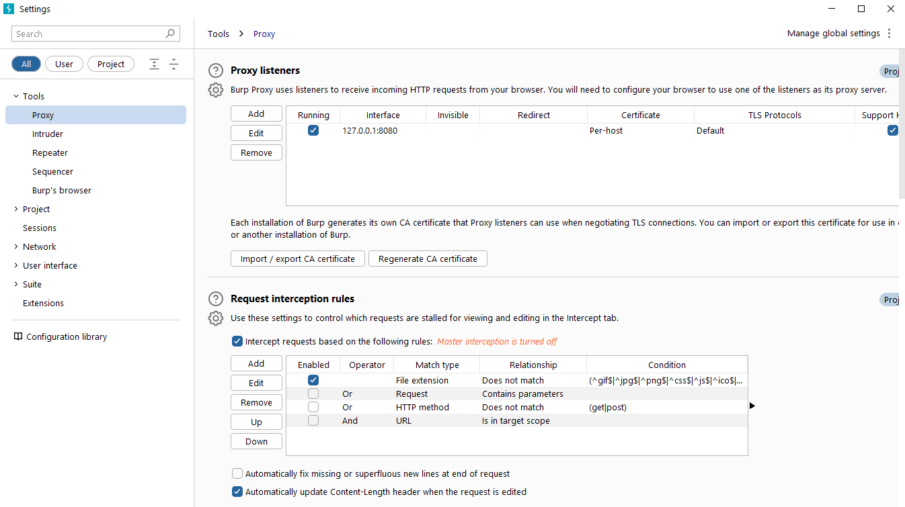

- in the settings window you will find a menu on the left hand side
- this menu allows you to switch between different types of settings including...

1. Search -> enables searching for specific settings using keywords

2. Type Filter -> filters the settings for user and project options

3. Categories -> allows selecting settings by category

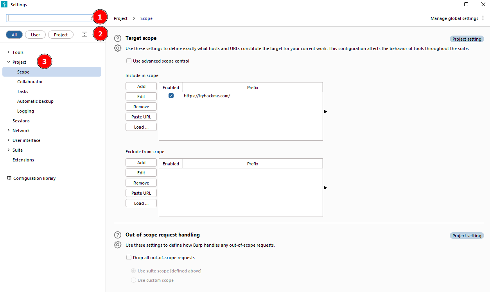

- its worth noting that many tools within Burp Suite provide shortcuts to specific categories of settings
- for example the Proxy module includes a Proxy setting button that opens the settings window directly to the relevant proxy section

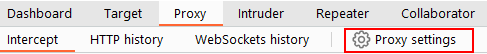

- the search feature on the settings page is a valuable addition, allowing you to quickly search for settings using keywords
- take some time to familiarise yourself with the range of configurable options in Burp Suite
- once you are comfortable you can proceed with the exercises related to configuring Burp Suite Settings

In which category can you find a reference to a "Cookie jar"?
- Sessions

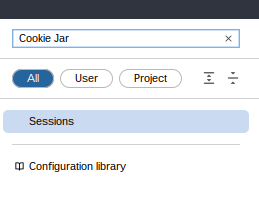

In which base category can you find the "Updates" sub-category, which controls the Burp Suite update behaviour?
- Suite

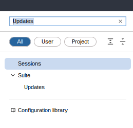

What is the name of the sub-category which allows you to change the keybindings for shortcuts in Burp Suite?
- Hotkeys

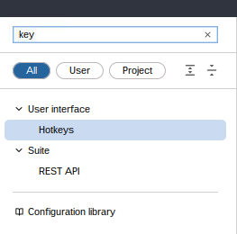

If we have uploaded Client-Side TLS certificates, can we override these on a per-project basis (yea/nay)?
- yea

Introduction to the Burp Proxy
- is a fundamental and crucial tool within Burp Suite
- it enables the capture of requests and responses between the user and the target web server
- this intercepted traffic can be manipulated, sent to other tools for further processing, or explicitly allowed to continue to its destination

Key Points to Understand About the Burp Proxy

Intercepting Requests
- when reqs are made through the Burp Proxy, they are intercepted and held back from reaching the target server
- the reqs appear in the Proxy tab, allowing for fruther actions such as forwarding, dropping, editing or sending them to other Burp modules
- to disable the intercept and allow reqs to pass through the proxy without interruption click the "Intercept is on" button

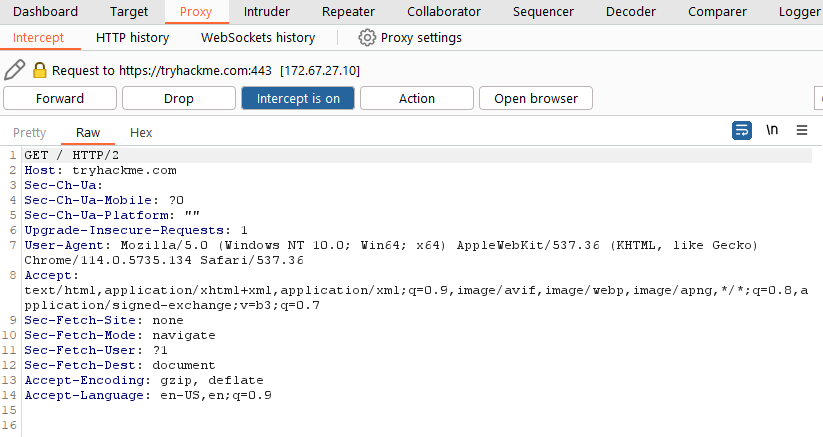

Taking Control
- the ability to intercept reqs empowers testers to gain complete control over web traffic
- making it invaluable for testing web apps

Capture and Loggin
- Burp Suite captures and logs reqs made through the proxy by default, even when the interception is turned off
- this logging functionality can be helpful for later analysis and review of prior reqs

WebSocket Support
- Burp Suite also captures and logs WebSocket communication, providing additional assistnace when analysing web apps

Logs and History
- the captured reqs can be view in the HTTP history and WebSockets hisotry sub-tabs
- allowing for retrospective analysis and sending the reqs to other Burp modules as needed

- proxy specific options can be accessed by clicking the Proxy settings button
- these options provide extensive control over the proxys behaviour and functionality
- familiarise yourself with these options to optimise your burp proxy usage

Some Notable Features in the Proxy Settings

Response Interception
- by default the proxy does not intercept server responses unless explicitly requested on a per-request basis
- the "Intercept responses based on the following rules " checkbox, along with the defined rules, allows for a more flexible response interception

Match and Replace
- enables the use of regex to modify incoming and outgoing reqs
- this feature allows for dynamic changes, such as modifying the user agent or manipulating cookies

Connecting through the Proxy (FoxyProxy)
- to use the Burp Suite Proxy we need to configure our local web server to redirect traffic through Burp Suite
- in this task we will focus on configuring the proxy using the FoxyProxy extension in Firefox

- here are the steps to config the Burp Suite Proxy with FoxyProxy

1. Install FoxyProxy (https://addons.mozilla.org/en-US/firefox/addon/foxyproxy-basic/)

2. Access FoxyProxy Options -> once installed a button will appear at the top-right of firefox, click on it to access the options pop-up

3. Create Burp Proxy Configuration -> in the pop up click the options button, this opens a new tab with the FoxyProxy config, click the add button to create a new proxy config

4. Add Proxy Details -> on the add proxy page fill in the following values -> Title: Burp (or any pref name) Proxy IP: 127.0.0.1 Port: 8080

5. Save Configuration -> click save to save the Burp Proxy config

6. Activate Proxy Configuration -> click on the icon, select the Burp config, this will redirect your browser traffic through 127.0.0.1:8080 -> burp suite must be running for your browser to make reqs when this config is active

7. Enable Proxy Intercept in Burp Suite -> switch to burp suite and ensure that intercept is turned on in the Proxy tab

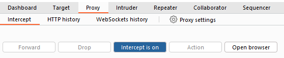

8. Test the Proxy -> open firefox and try accessing a website such as the homepage for http://10.81.187.67/ your browser will hang and the proxy will populate the HTTP req

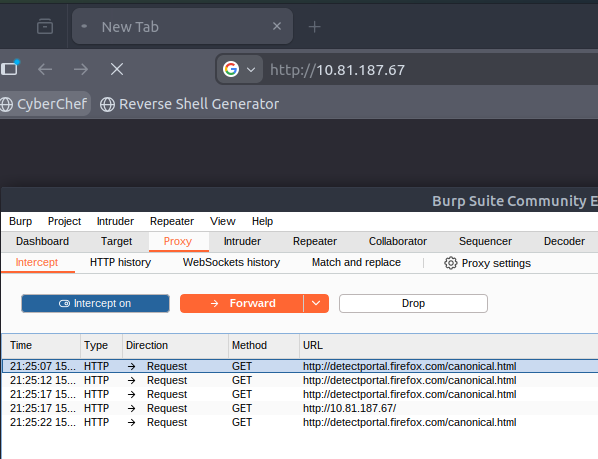

Remember the following:

- when the proxy config is active, and the intercept switch is on in burp suite, your browser will hang whenever you make a req
- be cautious not to leave the intercept switched on unintentionally as it can prevent your browser from making any reqs
- right-clicking on a req in burp suite allows you to perform various actions, such as forwarding, dropping, sending to other tools, or selecting options from the right-click menu

Site Map and Issue Definitions
- the Target tab in burp suite provides more than just control over the scope of our testing
- it consists of three sub-tabs

Site Map
- this sub-tab allows us to map out the web apps we are targeting in a tree struct
- every page we visit while the proxy is still active will be displayed on the site map
- this feature enables us to automatically generate a site map by simply browsing the web app
- in Professional we can also use the site map to perform automated crawling of the target, exploring links between pages and mapping out as much of the site as possible
- even with Community we can still utilise the site map to accumulate data during our initial enumeration steps
- it is particularly useful for mapping out APIs as any API endpoints accessed by the web app will be captured in the site map

Issue Definition
- although Community doesnt include the full vuln scanning functionality avaialable in Professional, we still have access to a list of all the vulns that the scanner looks for
- the issue definitions section provides an extensive list of web vulns, complete with descriptions and references
- this resource can be valuable for referencing vulns in reports or assisting in describing a particular vuln that may have been identified during manual testing

Scope Settings
- this setting allows us to control the target scope in burp suite
- it enables us to include or exclude specific domains/IPs to define the scope of our testing
- by managing the scope we can focus on the web apps we are specifically targeting and avoid capturing unnecessary traffic

- overall the target tab offeres features beyond scoping, allowing us to map out web apps, fine-tune our target scope, and access a comprehensive list of web vulns for reference purposes

Challenge
- take a look around the site on http://10.81.187.67/
- we will be using this a lot throughout this module
- visit every other page that is linked on the homepage, then check your sitemap
- one endpoint should stand out as being very unsuaul

- view this in your browser (or use the "response" section of the site map entry for that endpoint)

What is the flag you receive after visiting the unusual endpoint?
- THM{NmNlZTliNGE1MWU1ZTQzMzgzNmFiNWVk}

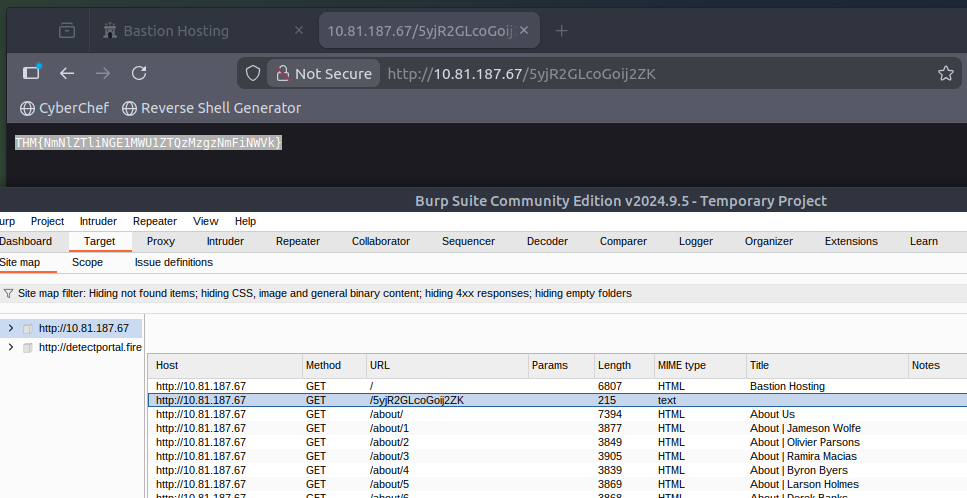

The Burp Suite Browser
- in addition to modifying our regular web browser to work with the proxy
- burp suite also includes a built-in chromium browser that is pre-configured to use the proxy without any of the modifications we just had to do

- to start the burp browser click the Open Browser button in the proxy tab
- a chromium window will pop up and any reqs made in this browser will go through the proxy

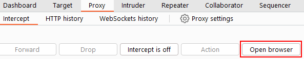

** Note ** there are many settings related to the burp browser in the project options and user options settings, make sure to explore and customise them as needed

- if you are running burp suite on Linux as the root user you may encounter an error preventing the burp browser from starting due to the inability to create a sandbox environment
- there are 2 simple solutions for this:

Smart Option
- create a new user and run burp suite under a low-privilege account to allow the burp browser to run without issues

Easy Option
- go to settings -> tools -> burps browser and check the "Allow burps browser to run without a sandbox" option
- enabling this option will allow the browser to start without a sandbox 
- however please be aware that this option is disabled by default for security reasons
- if you choose to enable it, exercise caution as comprimising the browser could grant attackers access to your entire machine
- in the training env of the attackbox this is unlikely to be a significant issue, but use it responsibly

Scoping and Targeting
- capturing and logging all of the traffic can quickly become overwhelming and inconvenient
- especially when we only want to focus on specific web apps
- this is where scoping comes in

- by setting a scope for the project we can define what gets proxied and logged in burp suite
- we can restrict bupr suite to target only specific web apps we want to test
- the easiest way to do this is by switching to the target tab -> right-clicking on your target from the list on the left and selecting add to scope
- burp will then prompt us to choose whether we want to stop logging anything that is not in scope, in most cases we want to select yes

- to check our scope we can switch to the Scope Settings sub-tab within the Target ab
- the scope settings window allows us to control our target scope by including or excluding domains/IPs
- this section is powerful and worth spending time getting familiar with

- however even if we disabled loggin for out-of-scope traffic, the proxy will still intercept everything
- to prevent this we need to go to the Proxy Settings sub-tab and select -> And URL Is in target scope from the "Intercept Client Requests" section

- enabling this option ensures that the proxy completely ignores any traffic that is not within the defined scope
- resulting in a cleaner traffic view in burp suite

Add http://10.81.187.67/ to your scope and change the proxy settings to only intercept traffic to in-scope targets.
See the difference between the amount of traffic getting caught by the proxy before and after limiting the scope.

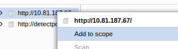

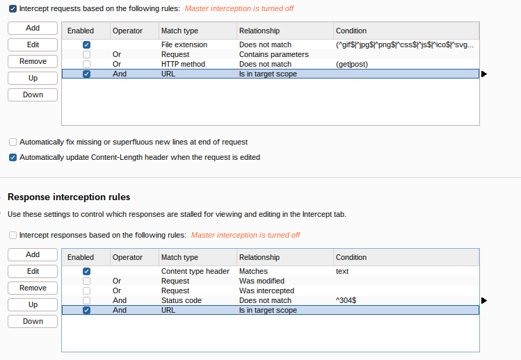

Proxying HTTPS
** Note ** the attackbox is already configed to solve the problem posed in this task

- when intercepting HTTP traffic, we may encounter an issue when navigating to sites with TLS enabled
- e.g. when accessing a site like https://google.com/ we may receieve an error indicating that the PortSwigger Certificate Authority (CA) is not authorised to secure the connection
- this happens because the browser does not trust the certificate presented by burp suite

- to overcome this issue we can manually add the PortSwigger CA cert to our browsers list of trusted certificate authorities
- heres how:

Download the CA Certificate
- with the burp proxy activated, navigate to http://burp/cert 
- this will download a file called cacert.der 
- save this file somewhere 

Access Firefox Certificate Settings
- type about:preferences into the URL
- this will open the settings page
- search for certificates and click onthe view certificates button

Import the CA Certificate
- in the cert manager window click on the import button
- select the cacert.der file that you downloaded

Set Trust for the CA Certificate
- in the subsequent window that appears
- check the box that says "Trust this CA to identify websites" and click OK

- by completing these steps we have added the PortSwigger CA cert to our list of trusted cert authorities
- now we should be able to visit any TLS-enabled site without encountering the cert error

Example Attack
- we will start by taking a look at the support form at http://10.81.187.61/ticket/

- in a real-world web app pentest, we would test this for a variety of things one of which would be XSS 
- if you have not yet encountered XSS it can be thought of as injecting a client-side script (usually in JS) into a webpage in such a way that it executes
- there are various kinds of XSS - the type that we are using here is referred to as "Reflected" XSS as it only affects the person making the web req

Walkthrough
- try typing `` into the "Contact Email" field
- you should find that there is a client-side filter in place which prevents you from adding any special chars that arent allowed in email addresses

- fortunately for us client-side filters are absurdly easy to bypass
- there are a variety of ways we could disable the script or just prevent it from loading in the first place

- lets focus on simply bypassing the filter for now

- first make sure that your burp proxy is active and that intercept is on
- now enter some legitimate data into the support form
- e.g. pentester@example.thm as email and "test attack" as query
- submit the form -> the req should be intercepted by the proxy

- with the req captured in the proxy we can now change the email field to be our very simple payload from above
- after pasting the payload we need to select it then URL encode it with CTRL+U to make it safe to send

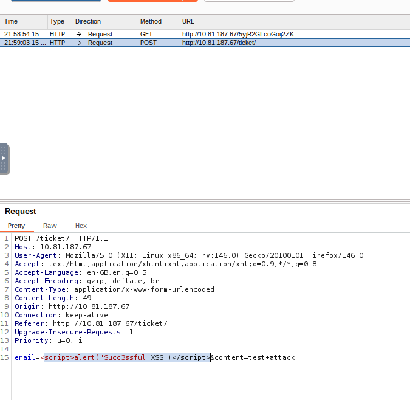

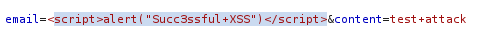

- finally press the forward button to send the req
- you should find an alert box from the site indicating a successful XSS attack

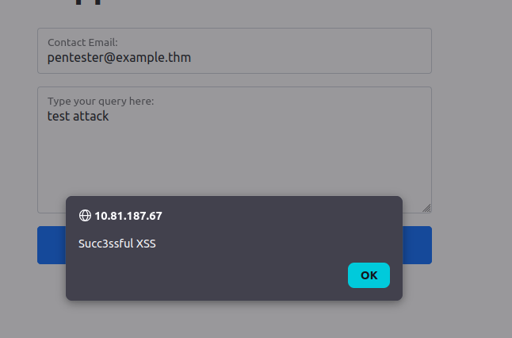

Conclusion
- we now have a solid understanding of the burp suite interface, config options and the burp proxy
- these skills will be essential as we continue the journey in web and mobile app pentesting

- to further enhance our skills, we should practice and experiment with burp suite
- explore features, try different configs, familiarise ourselves

- the more we learn and practice the more proficient we will become in identifying and exploiting vulns in web apps