Introduction
- JavaScript (JS) is a popular scripting language that allows web developers to add interactive featurs to websites containing HTML and CSS (styling)
- once the HTML elements are created, you can add interactiveness like validation, onCLick actions, animations, etc through JS
- learning the language is equally important as that of HTML and CSS
- the JS scripts are used primarily with HTML

- this room is designed as an introductory overview of JS, specifically tailored for beginners with limited JS experience
- the primary focus is on teaching the fundamentals of JS from a cyber perspective and how hackers utlise legitimate functionalities to achieve malicious results

Learning Objectives:
- Understand the basics of JS
- Integrating JS in HTML
- Abusing Dialogue Function
- Bypassing Control Flow Statements
- Exploring Minified Files

Essential Concepts

Variables
- variables are containers that allow you to store data values in them
- like any other language, variables in JS are similar to containers to store data
- when you are store something in a bucket, you also need a label so that it can be referenced later on easily
- similarly in JS each variable has a name; when we store a certain value in a variable, we assign a name to it to reference it later
- there are 3 ways to declare variables in JS:
- var
- let
- const
- while var is function-scoped, both let and const are block-scoped offering better control over variable visibility within specific code blocks

Data Types
- in JS, data types define the type of value a variable can hold
- examples include:
- string (text)
- number
- boolean (true/false)
- null
- undefined
- object (for more complex data like arrays or objects)

Functions
- a function represents a block of code designed to perform a specific task
- inside a function you group code that needs to perform a similar task
- for example you are developing a web application in which you need to print students results on the web page
- the ideal case would be to create a function PrintResults(rollNum) that would accept the roll number of the users as an arugment

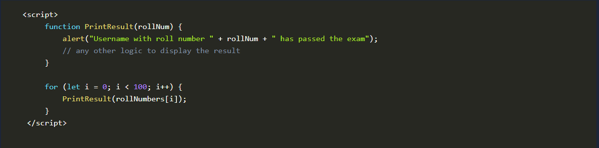

- so instead of writing the same print code for all the students, we will use a simple function to print the result

Loops
- loops allow you to run a code block multiple times as long as a condition is true
- common loops in JS are:
- for
- while
- do...while
- which are used to repeat tasks like going through a list of items
- for example if we want to print the results of 100 students, we can call the PrintResult(rollNum) function 100 times by writing it 100 times
- or we can create a loop that will be iterated through 1 to 100 and will call the PrintResult(rollNum) function as shown below

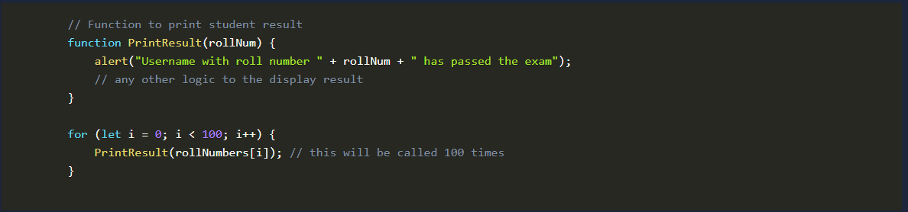

Request-Response Cycle
- in web dev, the request-response cycle is when a users browser (the client) sends a request to a web server and the server responds with the requested info
- this could be a webpage, data or other resource
- you can laern more about it here (https://tryhackme.com/room/howwebsiteswork)

What term allows you to run a code block multiple times as long as it is a condition?
- Loop

JavaScript Overview
- in this task we will use JS to create our first program
- JS is an interpreted language
- meaning the code is executed directly in the browser without prior compilation
- below is a sample JS code demonstrating key concepts such as defining a variable, understanding data types, using control flow statements, and writing simple functions
- these essential building blocks help create more dynamic and interactive web apps
- dont worry if it looks a bit new now - we will discuss each of these concepts in detail later on

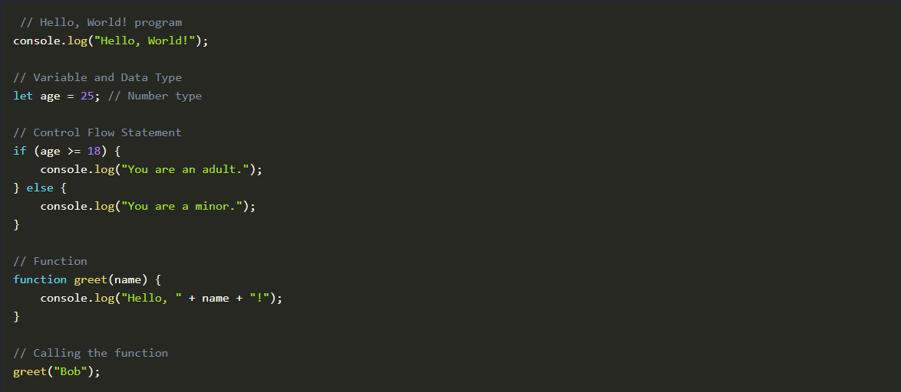

- JS is primarily executed on the client side which makes it easy to inspect and interact with HTML directly within the browser
- well use Google Chrome Console feature to run our first JS program...
- allowing us to write and execute JS code easily without additional tools
- follow these steps to get started:

- open google chrome 
- once its open press CTRL+SHIFT+I to open the console (or right-click anywhere and select Inspect)
- then click on the console tab
- the console allows you to run JS code directly in the browser without installing additional software

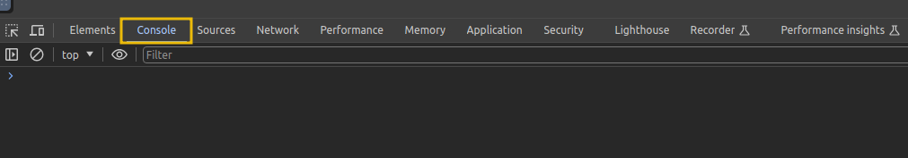

- lets create a simple JS program that adds two numbers and displays the result
- below is the code:

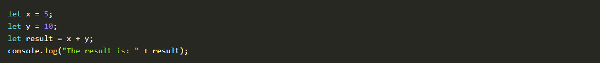

- in the code above x and y are variables holding the numbers
- x + y is an expression that adds the two numbers together
- whereas console.log is a function used to print the result to the console
- copy the code above and paste it into the console then press enter
- you should see the result displayed as:

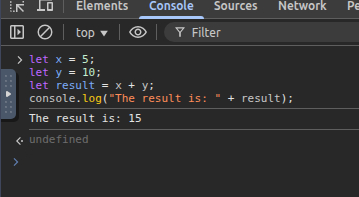

- congrats, youve successfuly created your first program in JS
- this is just the beginning and theres much more to explore as we dive deeper into JS in this room

What is the code output if the value of x is changed to 10?
- The result is: 20

Is JavaScript a compiled or interpreted language?
- Interpreted

Integrating JavaScript in HTML
- this task assumes you have a basic understanding of HTML and its strcuture
- this section will explore how JS can be integrated into HTML
- usually JS is not used to render content; it works with HTML and CSS to create dynamic and interactive web pages
- if youre unfamiliar with HTML reviewing it here (https://tryhackme.com/room/howwebsiteswork) is recommended
- there are two main ways to integrate JS into HTML; internally and externally

Internal JavaScript
- internal JS refers to embedding the JS code directly within an HTML document
- this method is preferable for beginners because it allows them to see how the script interacts with the HTML
- the script is inserted between `<script>` tags
- these tags can be placed inside the `<head>` section, typically used for scripts that need to be loaded before the page content is rendered
- or inside the `<body>` section, where the script can be utlised to interact with elements as they are loaded on the web page

Example:
- to create an HTML document with internal JS, create an empty file on the Deskop named internal.html
- right click an open it with Pluma

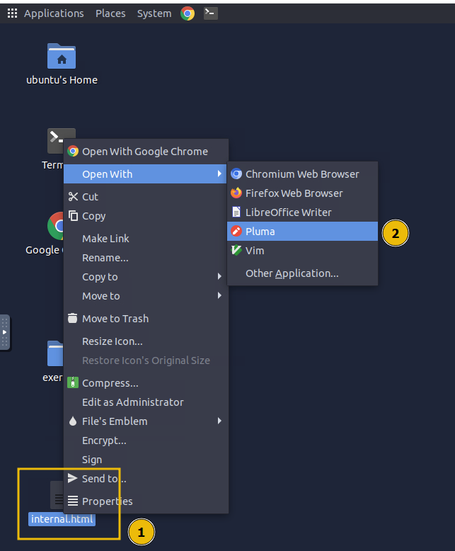

- once the editor is open paste the following code:

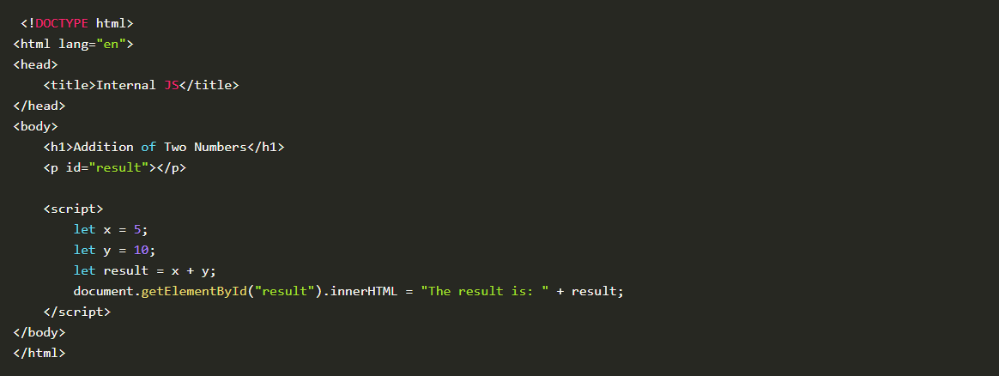

- after pasting the code save it
- double click the file ot open it in Chrome where we see the following output:

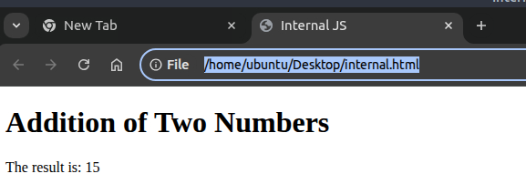

- in this HTML document we are using internal JS, meaning the code is placed directly inside the HTML file within the `<script>` tag
- the script performs a simple task; it adds two numbers (x and y) and then displays the result on the web page
- the JS interacts with the HTML by selecting an element (`
 with id="result"`) and updating its content using...
- `document.getElementById("result").innerHTML`
- this internal JS is executed when the browser loads the HTML file

External JavaScript
- external JS involves creating and storing JS code in a seperate file ending with a .js extension
- this method helps developers keep the HTML document clean and organised
- the external JS file can be stored or hosted on the same web server as the HTML document or stored on an external web server such as the cloud

- we will use the same example for external JS but seperate the JS code into a different file

- first create a new file named script.js and save it on the desktop with the following code:

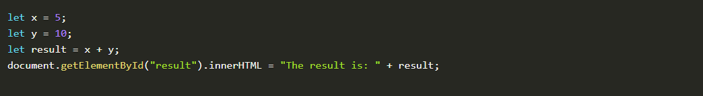

- next create a new file called external.html and paste the following code (notice that the HTML code is the same as that of the prev example)

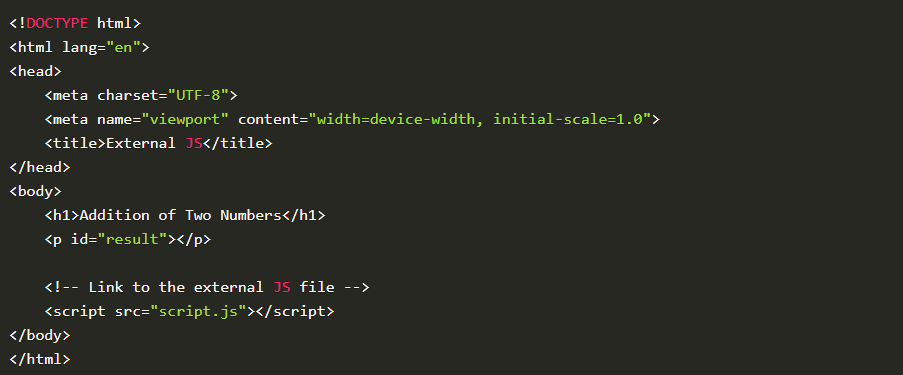

- now double-click the external.html file and check the results
- do you see any difference? no
- the output remains the same as the previous example

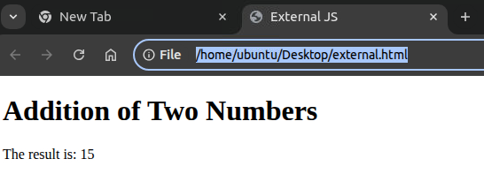

- what we did differently is use the src attribute in the `<script>` tag to load the JS from an external file
- when the browser loads the page it looks for the script.js file and loads its content into the HTML document
- this approach allows us to keep the JS code seperate from the HTML, making the code more organised and easier to maintain, especially when working with larger projects

Verifying Internal or External JS
- when pen-testing a web application, it is important to check whether the website uses internal or external JS
- this can be easily verified by viewing the pages source code
- to do this open the page external_test.html in the exercise folder in Chrome
- right click anywhere and select View Page Source

- this will display the HTML code of the rendered page
- inside the source code any JS written directly on the page will appear between `<script>` tags without the src attribute
- if you see a `<script>` tag with an attribute it indicates the page is loading external JS from a seperate file

- for a practical example visit https://tryhackme.com in your browser
- and inspect the source code to identify how the website loads the JS internally and from external sources

Which type of JavaScript integration places the code directly within the HTML document?
- internal

Which method is better for reusing JS across multiple web pages?
- external

What is the name of the external JS file that is being called by external_test.html?
- thm_external.js

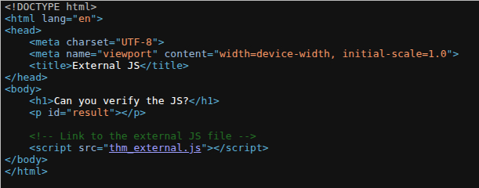

What attribute links an external JS file in the `<script>` tag?
- src

Abusing Dialogue Functions
- one of the main objectives of JS is to provide dialogue boxes for interaction with users and dynamically update context on web pages
- JS provides built-in functions like
- alert
- prompt
- confirm
- to faciliate this interaction
- these functions allow devs to display messages, gather input and obtain user confirmation
- however if not implemented securely, attackers may exploit these features to execute attacks like XSS which we will cover later in this module

- we will be using the Chrome Console in the upcoming exercises

Alert
- the alert function displays a message in a dialogue box with an "OK" button
- typically used to convey information or warnings to users
- for example if we want to display "Hello THM" to the user we would use an `alert("HelloTHM");`
- to try it out open the chrome console type `alert("HelloTHM");` and press enter
- a dialogue box with the message will appear on the screen

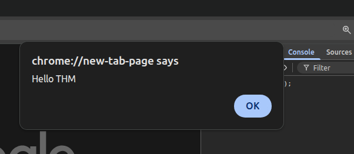

Prompt
- the prompt function displays a dialogue box that asks the user for input
- it returns the entered value when the user clicks "OK" or null if the user clicks "Cancel"
- for example to ask the user for their name we would use `prompt("What is your name?");`

- to test this open the Chrome console and paste the following that asks for a username and then greets him

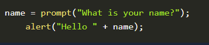

- once youve pasted the code and hit enter a dialogue box will appear and the value entered by the user will be returned to the console

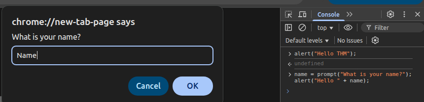

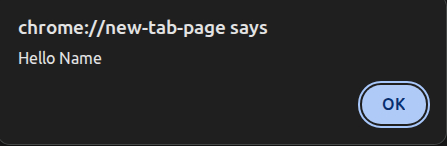

Confirm
- the confirm function displays a dialogue box with a message and two buttons "OK" and "Cancel"
- it returns true if the user clicks "OK" and false if the user clicks "Cancel"
- for example to ask the user for confirmation we would use `confirm("Are you sure?");`
- to try this out open the Chrome Console and type `confirm("Do you want to proceeed?");` and press enter

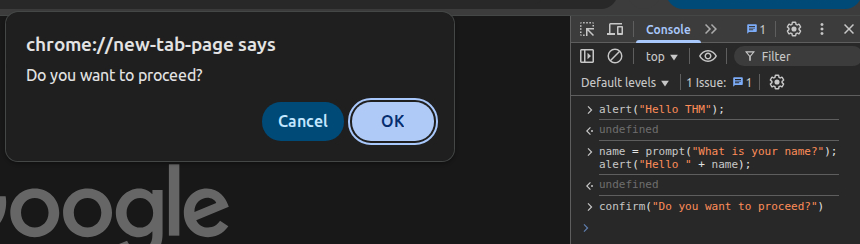

- a dialogue box will appear, and depending on whether the user clicks "OK" or "Cancel" the value true or false will be returned to the console

How Hackers Exploit the Functionality
- imagine receiving an email from a stranger with an attached HTML file
- the file looks harmless but when you open it, it contains JS that distrupts your browsing experience
- for example the following code will show an alert box with the message "Hacked" three times

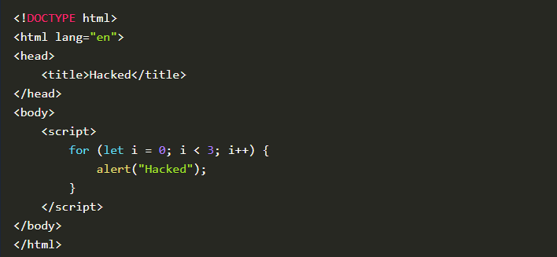

- one the desktop of the attached VM create a file called invoice.html and paste the above code
- open it and the alert message will pop up three times causing an undesired experience

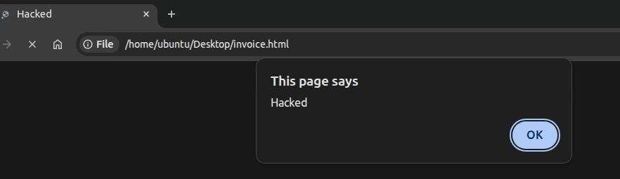

- imagine if a bad actor sent you a familiar file but instead of displaying the alert three times the number is set to 500
- you would be forced to keep closing the alert boxes one after another
- this is a simple example of how malicious JS can be used to create an inconvenience or worse
- therefore ensuring you only execute JS files from trusted sources is crucial to avoid such an undesired experience

In the file invoice.html, how many times does the code show the alert Hacked?
- 5

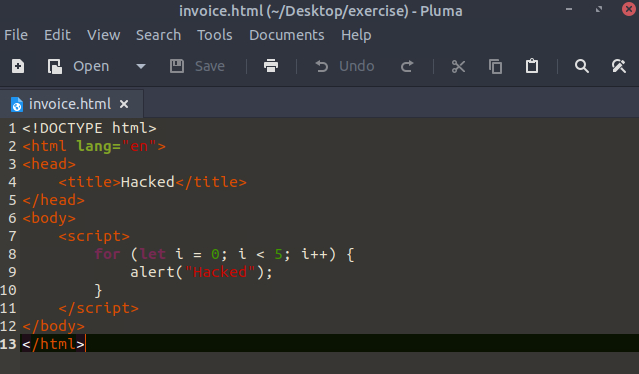

Which of the JS interactive elements should be used to display a dialogue box that asks the user for input?
- Prompt

If the user enters Tesla, what value is stored in the carName= prompt("What is your car name?")? in the carName variable?
- Tesla

Bypassing Control Flow Statements
- Control flow in JS refers to the order in which statements and code block are executed based on certain conditions
- JS provides several control flow structures such as if-else, switch, statements to make decisions and loops like for, while, do...while to repeat actions
- proper use of control flow ensures that a program can handle various conditions effectively

Conditional Statements in Action
- one of the most used conditional statements is the if-else statements, which allows you to execute different blocks of code depending on whether a condition evaluates to true or false

- to test this practically lets create a file called age.html on the desktop

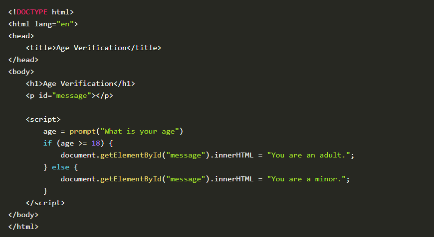

- double click it to open it in Chrome

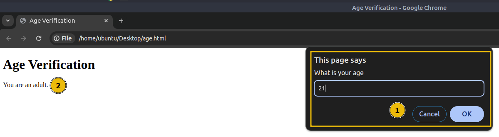

- in the above code a prompt will ask for your age
- if your age is greater than or equal to 18 it will display a message saying "You are an adult."
- otherwise it will show a different message
- this behaviour is controlled by the if-else statement, which checks the value of the age variable and displays the appropriate message based on the condition

Bypassing Login Forms
- suppose a developer has implemented authentication functionality in JS
- where only users with the username "admin" and passwords matching a specific value are allowed to log in
- to see this in action open the login.html file
- opening it in Chrome it will prompt you for a username and password
- if the credentials are correctly entered it will display a message confirming that you are logged in as shown below

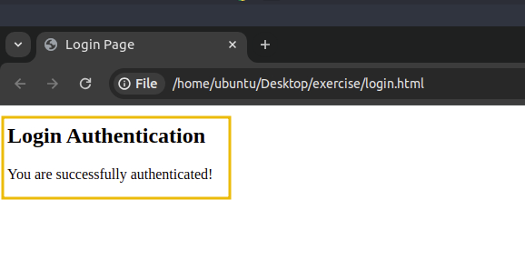

What is the message displayed if you enter the age less than 18?
- You are a minor.

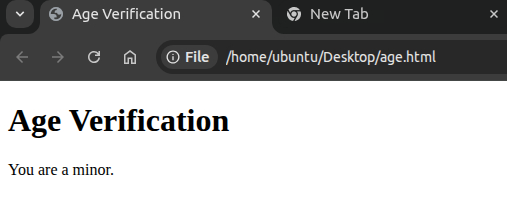

What is the password for the user admin?
- ComplexPassword

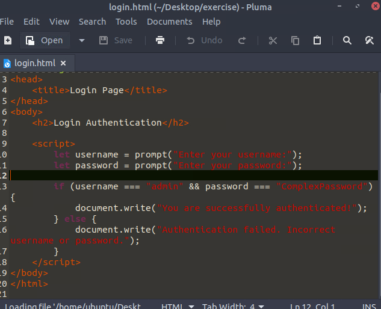

Exploring Minified Files
- we have understood how JS works and how we can read it until now
- but what if the file is not human-readable and has been minified?

- Minification in JS is the process of compressing JS files by removing all unnecessary characters such as spaces, line breaks, comments and even shortening var names
- this helps reduce the file size and improves the loading time of web pages, especially in production environments
- Minified files make the code more compact and harder to read for humans, but they still function exactly the same

- similarly obfusaction is often used to make JS harder to understand by adding undesired code, renaming variables and functions to meaningless names, and even inserting dummy code

Practical Example
- create a file on the desktop with the name hello.html with this code

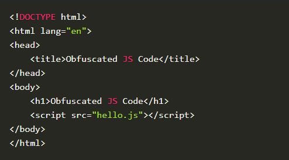

- then create another file with the name hello.js and add the following code

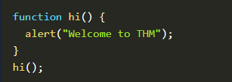

- now open the hello.html file in chrome 
- you will see an alert greeting you with "Welcome to THM"

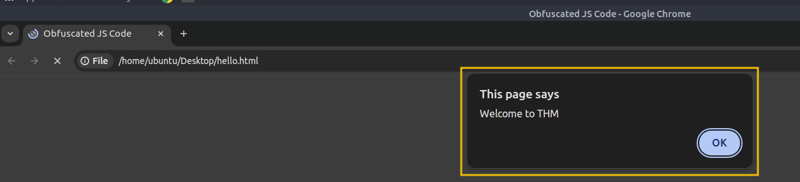

- click "OK" to close the alert dialogue box
- right click anywhere on the page and click on Inspect 
- navigate to the Sources tab and click on the hello.js to view the source code
- you will see that the JS code is easily accessible and viewable

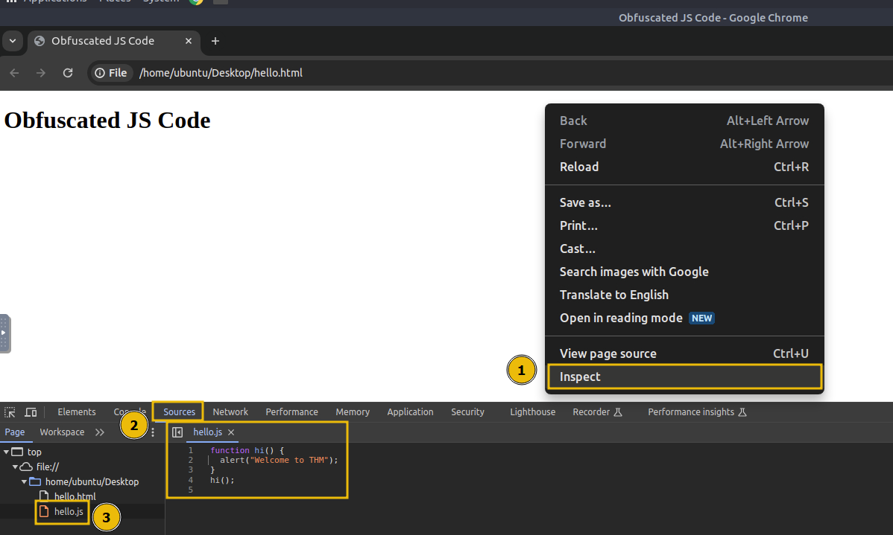

Obfuscation in Action
- now we will try to minify and obfuscate the JS code using an online tool
- visit (https://codebeautify.org/javascript-obfuscator) and copy the contents of hello.js and paste it into the website
- the tool will minify and obfuscate the code, turning it into a string of gibberish characters shown below

- but what if we tell you that these gibberish characters are still fully functional code?
- the only difference is that they are not human-readable, but the browser can still execute them correctly
- the website converted out JS code to this one:

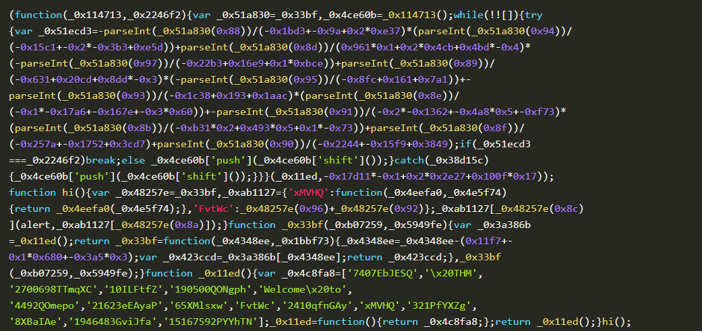

- replace the contents of hello.js with this obfuscated content
- reload the hello.html file in chrome and inspect the source code again under the Sources tab
- you will notice now that the code is now obfuscated but still functions exactly the same as before

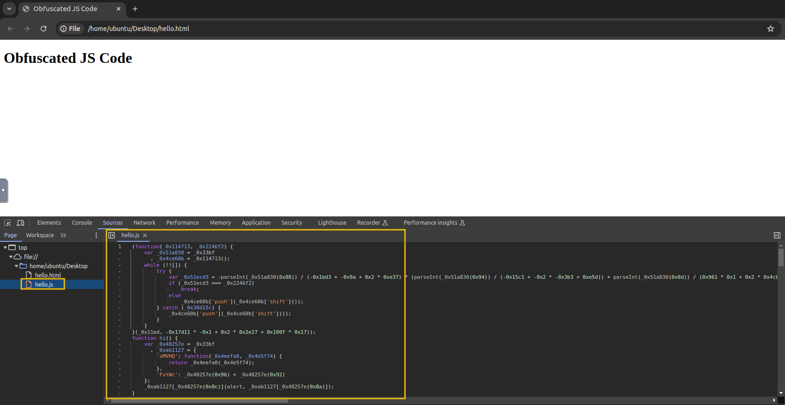

Deobfuscating a Code
- we can also deobfuscate an obfuscated code using an online tool
- visit the website (https://obf-io.deobfuscate.io/) then paste the obfuscated code into the page
- the website will generate the equivalent, human-readable JS code for you making it easier to understand and analyse the original script

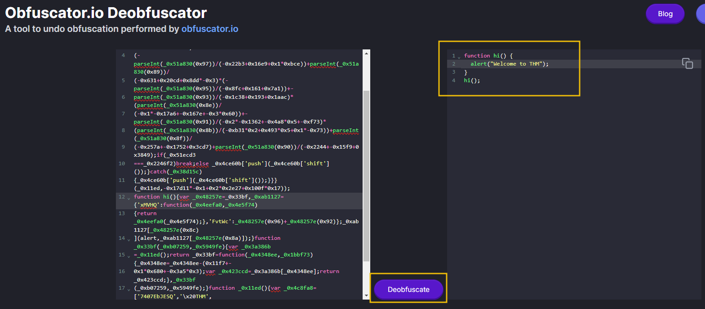

- you have seen how easily we deobfuscated and retrieved our original code

What is the alert message shown after running the file hello.html?
- Welcome to THM

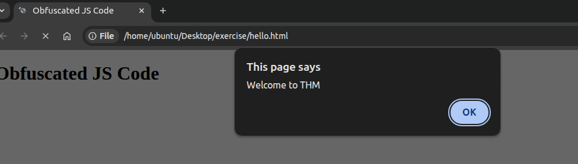

What is the value of the age variable in the following obfuscated code snippet?
`age=0x1*0x247e+0x35*-0x2e+-0x1ae3;`
- 21

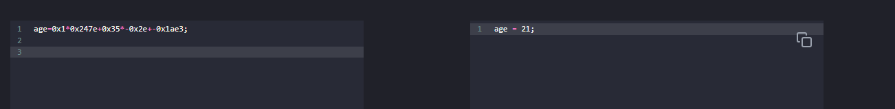

Best Practices
- this task outlines the best practices for evaluating a website or writing code for a website
- if you are developing a web app you will likely end up using JS on your website
- the practices below will assist you in reducing the attack surface and minimising the chances of attack

Avoid Relying on Client-Side Validation Only
- one of JS's primary functions is performing client-side validation
- devs sometimes use it for validating forms and rely entirely on it, which is not good practice
- since a user can disable/manipulate JS on the client side, performing validation on the server-side is also essential

Refrain from Adding Untrusted Libraries
- as discussed in earlier tasks JS allows you to include any other JS scripts using the src attribute inside a script tag
- but have you considered whether the library we include is from a trusted source?
- bad actors have uploaded a bundle of libraries on the internet with names that resemble legitimate ones
- so if you blindly include a malicious library you will expose your web app to threats

Avoid Hardcoded Secrets
- never Hardcore sensitive data like API keys, access tokens, or credentials into your JS code
- as the user can easily check the source code and get the password

Minify and Obfuscate Your JavaScript Code
- minifying and obfuscating JS code reduces its size, improves load time and makes it harder for attackers to understand thew logic of the code
- therefore always minify and obfuscate the code when using code in production
- the attacker can eventually reverse engineer it but getting the original code will take at least some effort

Is it a good practice to blindly include JS in your code from any source (yea/nay)?
- nay

Conclusion
- weve covered important topics like the basics of JS, creating our first JS code, integrating JS in HTML
- moving forward we discussed other interactive elements of JS like prompts and how attackers can abuse them
- the room highlighted the usage of control flow statements and how they can be bypassed in JS

- we then explored how to use minify and obfuscate a JS file and learned the other way around
- lastly we touched upon some best practices that you can follow to keep your web app safe from cyber threats