Introduction
- cyber security is a broad topic that covers a wide range of subjects, but few of those are as ubiquitous as datbases
- whether youre working on securing a web application, working in SOC or using a SIEM (Security Information and Event Management system)...
- configuring user authentication/access control or using malware analysis/threat detection tools etc...
- you will in some way be relying on databases
- for example on the offensive side of security it can help us better understand SQL vulnerabilities such as SQL injections and create queries that help us tamper or retrieve data within a compromised service
- on the other hand, on the defensive side, it can help us navigate through databases and find suspicious activity or relevant info
- it can also help us better protect a service by implementing restrictions when needed

- because databases are ubiquitous it is important to understand them, this room will be your first step in that direction
- well go through the basics of dbs covering key terms, concepts and different types of getting to grips with SQL

Learning Objectives:
- Understand what databases are, as well as key terms and concepts
- Understand the different types of databases
- Understand what SQL is
- Understand and be able to use SQL CRUD operations
- Understand and be able to use Clauses operations
- Understand and be able to use SQL operations
- Understand and be able to use SQL operators
- Understand and be able to use SQL functions 

Databases 101

Introducing Databases
- databases are so ubiquitous that you are very likely to interact with systems that are using them
- databases are an organised collection of structured info or data that is easily accessible and can be manipulated or analysed
- that data can take many forms such as user auth data (such as usernames and passwords) which are stored and checked against when authenticating into an application or site
- user-generated data on social media where data such as user posts, comments, likes etc are collected and stored
- as well as information such as watch history which is stored by streaming services such as Netflix and used to generate recommendations

- im sure you get the point: databases are used extensively and can contain many different things
- its not just massive-scale businesses that uses dbs
- smaller-scale businesses when setting up will almost certainly have to configure a database to store their data
- speaking of kinds of databases, lets take a look now at what those are

Different Types of Databases
- now it makes sense that something is used by so many and for (relatively) so long that there would be multiple types of implementation
- there are quite a few different types of dbs that can be built
- for this introductory room we are going to focus on the 2 primary types
- relational databases (aka SQL)
- non-relational databases (aka NOSQL)

Relational Databases:
- store structured data, meaning the data inserted into this database follows a structure
- for example the data collected on a user consists of first_name, last_name, email_address, username and password
- when a new user joins an entry is made into the db following this structure
- this structured data is stored in rows and columns in a table (all of which will be covered shortly)
- relationships can then be made between two or more tables (for example user and order_history) hence the term relational databases

Non-Relational Databases:
- instead of storing data the above way, store data in a non-tabular format
- for example if documents are being scanned which can contain varying types and quantities of data, and are stored in a db that calls for a non-tabular format
- here is an example of what that might look like

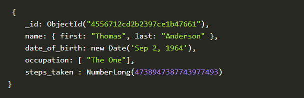

- in terms of what database should be chosen, it always comes down to the context in which the db is going to be used
- relational databases are often used when data being stored is reliably going to be recieved in a consistent format, where accuracy is important...
- such as when processing e-commerce transactions
- non-relational dbs on the other hand, are better used when the data being received can vary greatly in its format but needs to be collected and organised in the same place...
- such as social media platforms collecting user-generated content

Tables, Rows and Columns
- now that weve defined the two primary types of databases well focus on the relation databases
- well start by explaining tables, rows and columns
- all data stored in a relational db will be stored in a table; for example a collection of books in stock at a bookstore might be stored in a table named "Books"

- when creating this table you would need to define what pieces of information are needed to define a book record e.g. "id", "Name" and "Published_date"
- these would then be your columns; when the columns are being defined you would also define what data type this column should contain...
- if an attempt is made ot insert a record into a db where the data type does not match, it is rejected
- the data types that can be defined can vary depending on what db you are using but the core data types used by all include:
- Strings (a collection of words or characters)
- Integers (numbers)
- floats/decimals (numbers with a decimal point)
- Times/Dates

- once a table has been created with the columns defined, the first record would be inserted into the db 
- for example a book named "Android Security Internals" with and id of "1" and a publication date of "2014-10-14"
- once inserted this record would be represented as a row

Primary and Foreign Keys
- once a table has been defined and populated more data may need to be stored
- for instance we want to create a table named "Authors" that stores the authors of the books sold in the store
- here is a very clear example of a relationship
- a book (stored in the books table) is written by an author (stored in the authors table)
- if we wanted to query for a book in our story but also have the author of that book returned, our data would need to be related somehow; we do this with keys
- there are two types of keys

Primary Keys:
- a primary key is used to ensure that the data collected in a certain column is unique
- that is, there needs to be a way to identify each record stored in a table, a vlaue unique to that record and is not repeated by any other record in the table
- think about matriculation numbers in a university; these are numbers assigned to a student so they can be uniquely identified in records (as some students can have the same name)
- a column has to be chosen in each table as a primary key; in our example "id" would make the most sense as an id has been uniquely created for each book where...
- as books can have the same publication date or (in rarer cases) book title
- note that there can only be one primary key column in a table

Foreign Keys:
- a foreign key is a column (or columns) in a table that also exists in another table within the database
- and therefore provides a link between the two tables
- in our example think about adding an "author_id" field to our "Books" table; 
- this would then act as a foreign key because the author_id in our Books table corresponds to the "id" column in the author table
- foreign keys are what allow the relationships between different tables in a relational databases
- note that there can be more than one foreign key column in a table

What type of database should you consider using if the data you're going to be storing will vary greatly in its format?
- non-relational database

What type of database should you consider using if the data you're going to be storing will reliably be in the same structured format?
- relational database

In our example, once a record of a book is inserted into our "Books" table, it would be represented as a ___ in that table?
- row

Which type of key provides a link from one table to another?
- foreign key

which type of key ensures a record is unique within a table?
- primary key

SQL

What is SQL?
- now all of this theoretically sounds great, but in practice how to databases work?
- how would you go and make your first table and populate it with data?
- what would you use?
- databases are usually controlled using a Database Management System (DBMS)
- serving as an interface between the end user and the database
- a DBMS is a software program that allows users to retrieve, update and manage the data being stored
- some examples of DMBS are MySQL, MongoDB, Oracle Database and Maria DB

- the interaction between the end user and the database can be done using SQL (Structured Query Language)
- SQL is a programming language that can be used to query, define and manipulate the data stored in a relational database

The Benefits of SQL and Relational Databases
- SQL is almost as ubiquitous as databases themselves, and for good reason
- here are some of the benefits that come with learning and using SQL:

it's fast:
- relational databases (aka those that SQL is used for) can return massive batches of data almost instantaneously due to how little storage space is used and high processing speeds

easy to learn:
- unlike many programming languages SQL is written in plain english making it much easier to pick up
- the highly readable nature of the lang means users can concentrate on learning the functions and syntax

reliable:
- as mentioned before, relational dbs can guarantee a level of accuracy when it comes to data by defining a strict structure into which data sets must fall in order to be inserted

flexible:
- SQL provides all kinds of capabilities when it comes to querying a database; this allows users to perform vast data analysis tasks very efficiently

Getting Hands ON
- now that weve covered what SQL is, its time to get hands-on and start using it
- using the VM we can start using it

- reference below

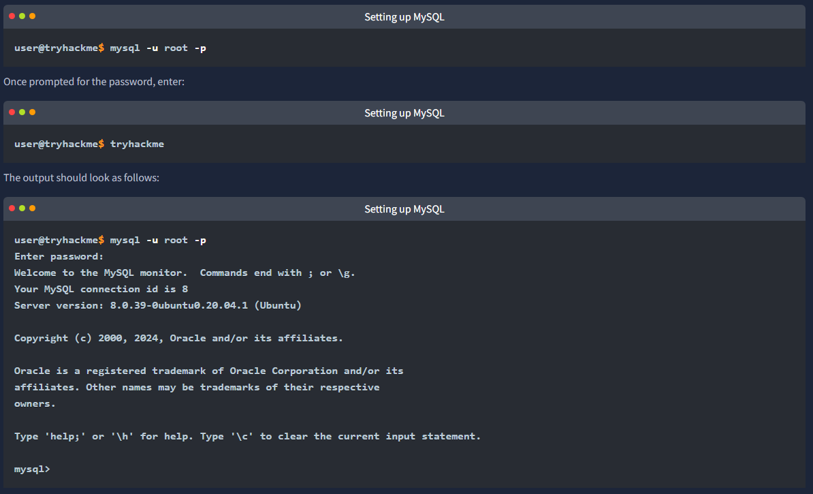

What serves as an interface between a database and an end user?
- DBMS

What query language can be used to interact with a relational database?
- SQL

Databases and Table Statements

Time to Learn
- its time to start learning SQL and how to use it to interact with dbs
- in this task we will start by learning to use dbs and table statements
- after all its these statements we need to initially create our databases/tables and get started

Database Statements

CREATE DATABASE
- if a new database is needed the first step you would take is to create it
- this can be done in SQL using the CREATE DATABASE statement
- this would be done using the following syntax

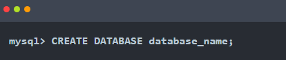

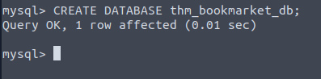

SHOW DATABASES
- now that weve created a db we can view it using the SHOW DATABASES statement
- the SHOW DATABASES statement will return a list of present databases

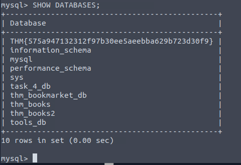

- in the returned list we see the db we just created and some dbs that are included by default (mysql, information_scheme, performance_scheme and sys)
- which are used for various purposes that enable mysql to function
- also present are various tables needed for this lesson

USE DATABASE
- once a db is created you may want to interact with it
- before we can interact with it we need to tell mysql which db we would like to interact with (so it knows which db to run subsequent queries against)
- to set the db we have just created as the active database we would run the USE statement as follows

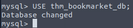

DROP DATABASE
- once a db is no longer needed (maybe it was created for test purposes, or is no longer required) it can be removed using the DROP statement
- to remove a db we would use the following statement syntax 

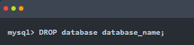

Table Statement
- now that you can create, list, use and remove dbs
- its time to examine how we would populate those dbs with tables and interact with those tables

CREATE TABLE
- following the logic of the db statements, creating tables also uses a CREATE statement
- once a db is active (you have used the USE statement on it)
- a table can be created within it using the following syntax

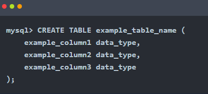

- as you can see there is a little more involved here
- in the Databases 101 task we covered how and when a table is created
- it must be decided what columns will make up a record in that table as well as what data type is expected to be contained within that column
- this is what is represented by this syntax here
- in the example there are 3 example columns but SQL supports many (over 1000) 
- let's try populating our thm_bookmarket_db with a table using the following statement

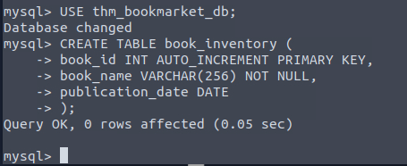

- this statement will create a table book_inventory with three columns book_id, book_name and publication_date
- book_id is an INT (integer) as it should ever only be a number
- AUTO_INCREMENT is present, meaning the first book would be assigned book_id 1, the second book inserted would be assigned a book_id of 2 and so on
- finally book_id is set as the PRIMARY_KEY as it will be the way we uniquely identify a book record in our table (and a primary must be present in a table)

- book_name has the data type VARCHAR(256) meaning it can use variable characters (text/numbers/punctuation) and a limit of 255 characters is set
- NOT_NULL meaning it cannot be empty (so if someone tries to insert a record into this table but the book_name was empty, it would be rejected)
- publication_date is set as the data type DATE

SHOW TABLES
- just as we can list dbs using a SHOW statement we can also list the tables in our currently active db 
- run the following command, we should see the table we just created

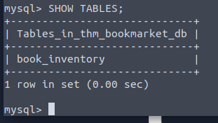

DESCRIBE
- if we want to know what columns are contained within a table (and their data type) we can describe them using the DESCRIBE command (which can also be abbreviated to DESC)
- describe the table we just created using the following command

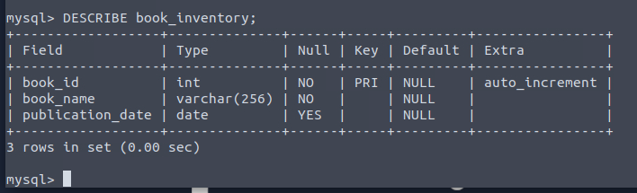

ALTER
- once you have created a table there may come a time when your need for the dataset changes, and you need to alter the table
- this can be done using the ALTER statement
- lets now imagine that we have decided that we actually want to have a column in our book inventory that has the page count for each book
- add this to our table using the following statement

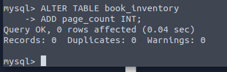

DROP
- similar to removing a db you can also remove tables using the DROP statement 
- the syntax you would use looks like this

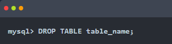

Using the statement you've learned to list all databases, it should reveal a database with a flag for a name; what is it?
- THM{575a947132312f97b30ee5aeebba629b723d30f9}

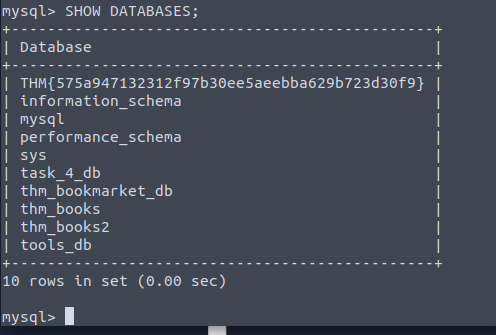

In the list of available databases, you should also see the  task_4_db database. Set this as your active database and list all tables in this database; what is the flag present here?
- THM{692aa7eaec2a2a827f4d1a8bed1f90e5e49d2410}

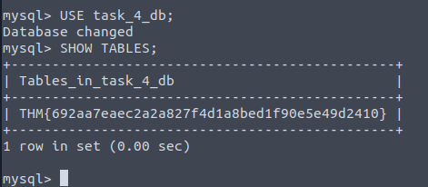

CRUD Operations
- CRUD stands for Create, Read, Update and Delete; which are considered the basic operations in any system that manages data

- lets explore all these different operations when working with MySQL
- in the next 2 tasks we will be using the books table that is part of the db thm_books

Create Operation (INSERT)
- the create operation will create new records in a table
- in MySQL this can be achieved by using the statement INSERT INTO as shown below

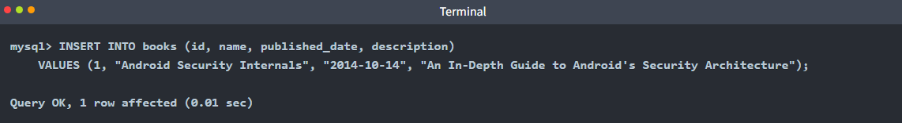

- as we can observe the INSERT INTO statement specifies a table, in this case books, where you can add a new record;
- the columns id, name, published_date, and description are the records in the table
- in this example, a new record with an id of 1, a name of "Android Security Internals", a published_date of "2014-10-14" and a description stating...
- "Android Security Internals provides a complete understanding of the security internals of Android devices" was added

** Note ** this operation already exists in the db so there is no need to run this

Read Operation (SELECT)
- the read operation as the name suggests, is used to read and retrieve info from a table
- we can fetch a column or all columns from a table with the SELECT statement as shown in this example

- the above output SELECT statement is followed by an * symbol indicating that all columns should be retrieved
- followed by the FROM clause and the table name, in this case books

- if we want to select a specific column like the name and description we should specify them instead of the * symbol as shown below

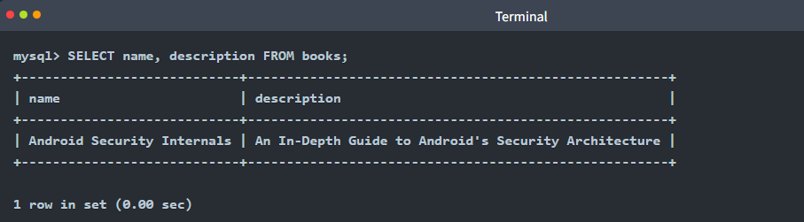

Update Operation (UPDATE)
- the update operation modifies an existing record within a table, and the same statement UPDATE can be used for this

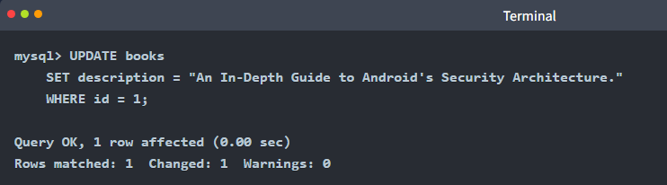

- the UPDATE statement specifies the table, in this case, books, and then we can use SET followed by the column name we will update
- the WHERE clause specifies which row to update when the clause is met, in this case, the one with id 1

Delete Operation (DELETE)
- the delete operation removes records from a table
- we can achieve this with the DELETE statement

** Note ** there is no need to run this query, deleting this entry will affect the rest of the examples in the upcoming tasks

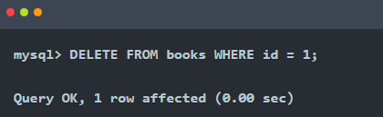

- above we can observe the DELETE statement followed by the FROM clause which allows us to specify the table where the record will be removed, in this case, books
- followed by the WHERE clause that indicates that it should be the one where the id is 1

Summary
- CRUD operations results are fundamental for data operations and when interacting with databases
- the statements associated with them are listed below:

- Create (INSERT statement) -> adds a new record to the table
- Read (SELECT statement) -> retrieves record from the table
- Update (UPDATE statement) -> modifies existing data in the table
- Delete (DELETE statement) -> removes record from the table

- these operations enable us to effectively manage and manipulate data within a database

Using the tools_db database, what is the name of the tool in the hacking_tools table that can be used to perform man-in-the-middle attacks on wireless networks?
- Wi-Fi Pineapple

Using the tools_db database, what is the shared category for both USB Rubber Ducky and Bash Bunny?
- USB attacks

- as seen in the above scrnshot
- and to confirm for fun

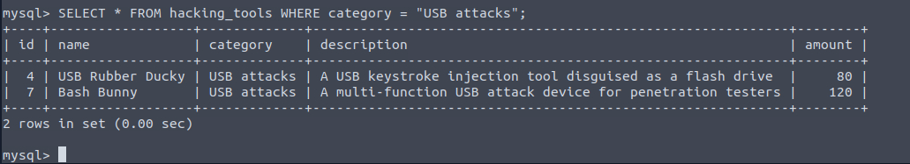

Clauses
- a clause is a part of a statement that specifies the criteria of the data being manipulated, usually by an initial statement
- clauses can help us define the type of data and how it should be retrieved or sorted

- in prev tasks we already have used some clauses such as FROM that is used to specify the table we are accessing with our statement
- and WHERE which specifies which records should be used

- this task will focus on other clauses:
- DISTINCT
- GROUP BY
- ORDER BY
- HAVING

- in this task we will continue to use the books table that is part of the db thm_books

DISTINCT Clause
- the DISTINCT clause is used to avoid duplicate records when doing a query, returning only unique values
- lets use a query SELECT * FROM books and observe the results below

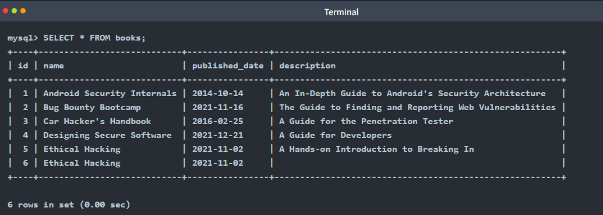

- the querys output displays all the content of the table books and the record Ethical Hacking is displayed twice
- lets perform this query again but this time using the DISTINCT clause

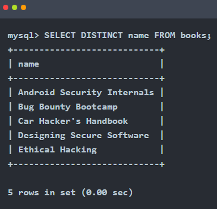

- the output shows that only five rows are returned, and just once instance of the Ethical Hacking record is displayed

GROUP BY Clause
- the GROUP BY clause aggregates data from multiple records and groups the query results in columns
- this can be helpful for aggregating functions

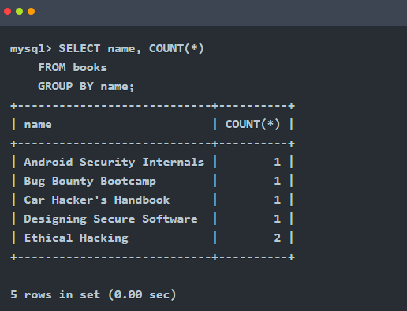

- in the example above the records on the book table are regrouped by the result of the COUNT function
- we already know that Ethical Hacking is listed twice so the total count is 2, placed at the end since its grouped by count

ORDER BY Clause
- the ORDER BY clause can be used to sort the records returned by a query in ascending or descending order
- using functions like ASC and DESC can help us accompish that as shwon below

ASCENDING ORDER

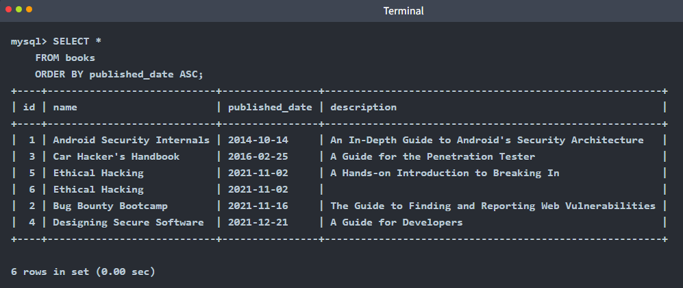

DESCENDING ORDER

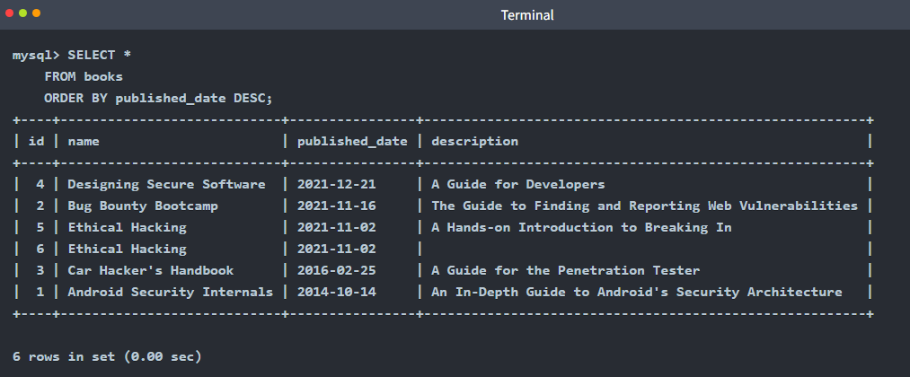

- we can observe the difference when sorting by ascending order using ASC
- and in descending order using DESC
- both using the published_date as reference

HAVING Clause
- the HAVING clause is used with other clauses to filter groups or results of records based on a condition
- in the case of GROUP BY it evaluates the condition to TRUE or FALSE 
- unlike the WHERE clause, HAVING filters the results after the aggregation is performed

- in the above example we can observe that the query returns the books with the names that contain the word hack and the proper count, as we learned before

Using the tools_db database, what is the total number of distinct categories in the hacking_tools table?
- 6

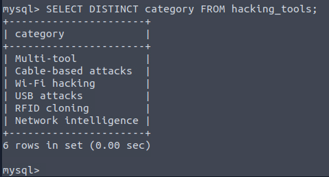

Using the tools_db database, what is the first tool (by name) in ascending order from the hacking_tools table?
- Bash Bunny

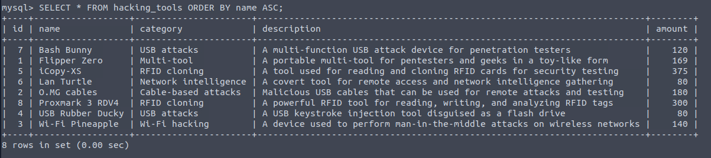

Using the tools_db database, what is the first tool (by name) in descending order from the hacking_tools table?
- Wi-Fi Pineapple

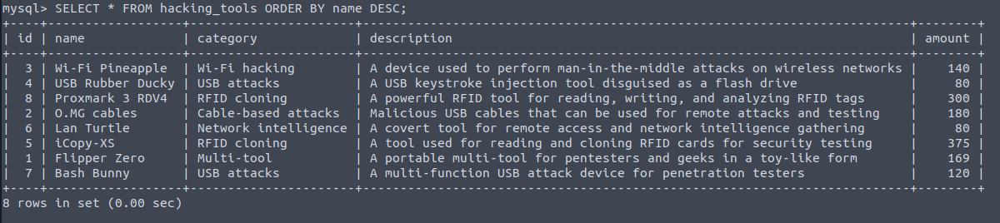

Operators
- when working with SQL and dealing with logic and comparisons
- operators are our way to filter and manipulate data effectively
- understanding these operators will help us to create more precise and powerful queries
- in the next 2 tasks we will be using the books table tthat is part of the db thm_books2

Logical Operators
- these operators test the truth of a condition and return a boolean value of TRUE or FALSE

LIKE Operator
- the LIKE operator is commonly used in conjunction with clauses like WHERE in order to filter for specific patterns within a column
- lets continue using our db to query an example of its usage

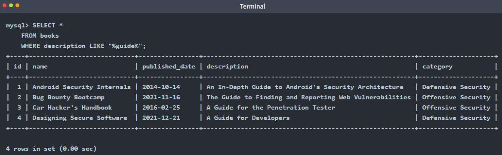

- the query above returns a list of records from the books filtered
- but the ones using the WHERE clause that contains the word guide by using the LIKE operator

AND Operator
- the AND operator uses multiple conditions within a query and returns TRUE if all of them are true

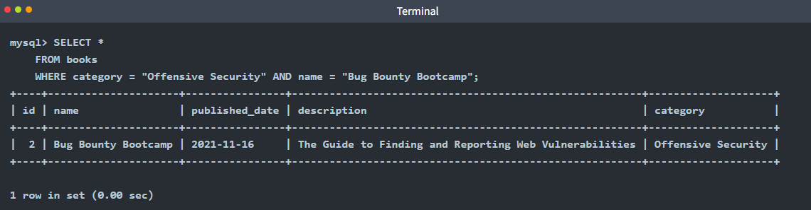

- the query above returns the book with the name Bug Bounty Bootcamp, which is under the category of Offensive Security

OR Operator
- the OR operator combines multiple conditions within queries and returns TRUE if at least one of these conditions is true

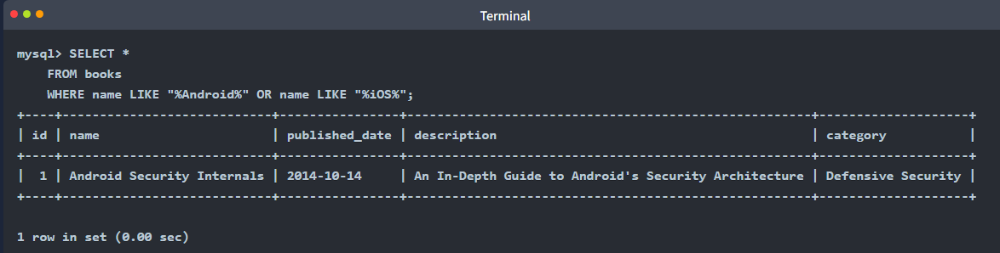

- the query above returns books whose names include either Android or iOS

NOT Operator
- the NOT operator reverses the value of a boolean operator, allowing us to exclude a specific condition

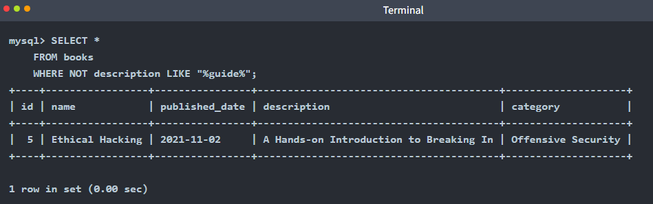

- the query above returns results where the description does not contain the word guide

BETWEEN Operator
- the BETWEEN operator allows us to test if a value exists within a defined range

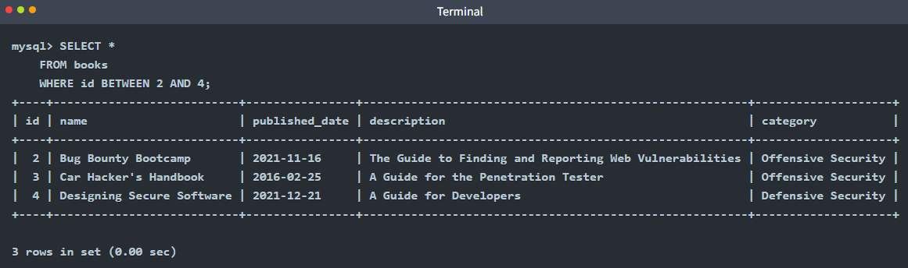

- the query above returns books whose id is between 2 and 4

Comparison Operators
- the comparison operators are used to compare values and check if they meet specified criteria

Equal To Operator
- the = (equal) operator compares 2 expressions and determines if they are equal
- or it can check if a value matches another one in a specific column

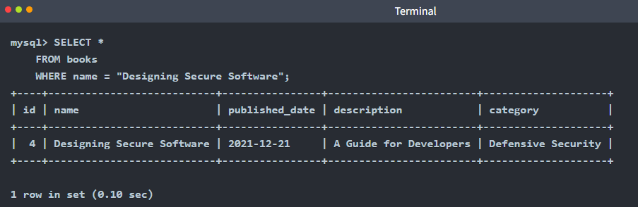

- the query above returns the book with the exact name "Designing Secure Software"

Not Equal To Operator
- the != (not equal) operator compares expressions and tests if they are not equal
- it also checks if a value differs from the one within a column

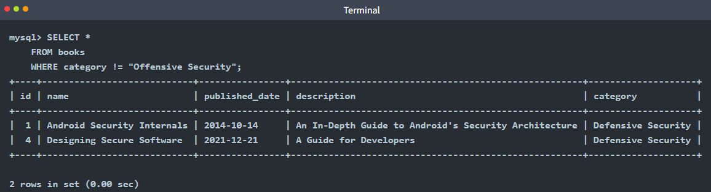

- the query above returns books except those whose category is "Offensive Security"

Less Than Operator
- the < (less than) operator compares if the expression with a given value is lesser than the provided one

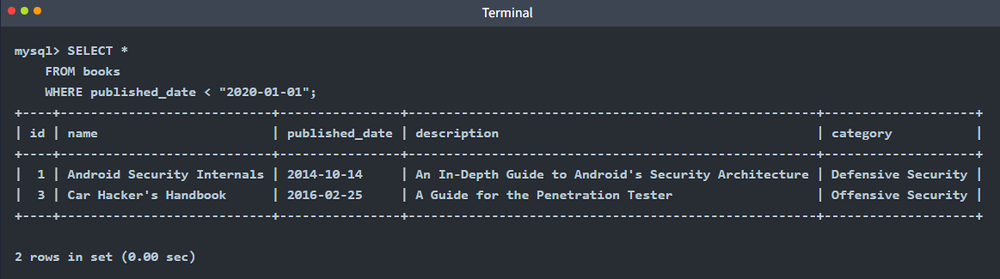

- the query above returns books that were published before January 1, 2020

Greater Than Operator
- the > (greater than) operator compares if the expression with a given value is greater than the provided one

- the query above returns books published after January 1, 2020

Less Than or Equal To and Greater Than or Equal To Operators
- the <= (less than or equal to) operator compares if the expression with a given value is less than or equal to the provided one
- on the other hand >= (greather than or equal to) operator compares if the expression with a given value is greater than or equal to the provided one
- lets observe some examples of both below

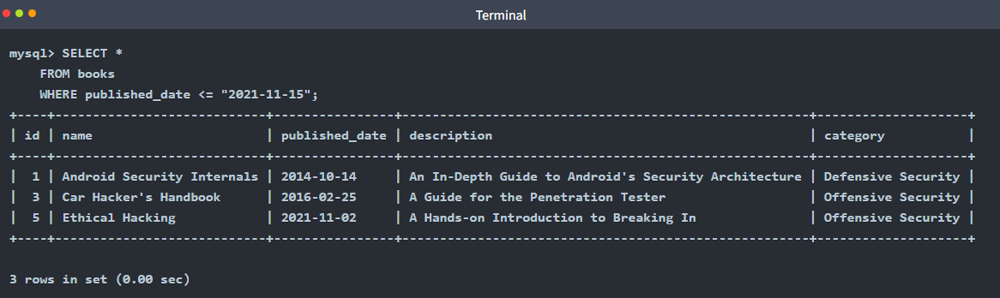

- the query above returns books published on or before November 15, 2021

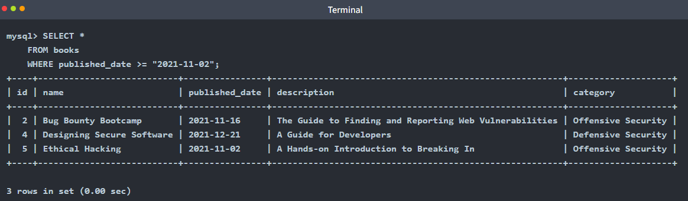

- the query above returns books that were published on or after November 2, 2021

Using the tools_db database, which tool falls under the Multi-tool category and is useful for pentesters and geeks?
- Flipper Zero

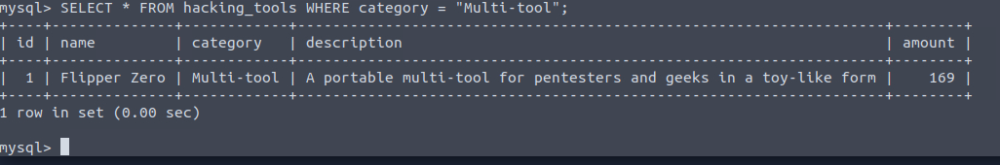

Using the tools_db database, what is the category of tools with an amount greater than or equal to 300?
- RFID Cloning

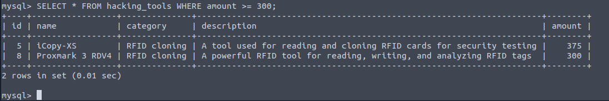

Using the tools_db database, which tool falls under the Network intelligence category with an amount less than 100?
- Lan Turtle

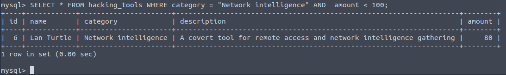

Functions
- when working with data, functions can help us streamline queries and operations and manipulate data
- lets explore some of these functions next

String Functions
- string functions perform operations on a string, returning a value associated with it

CONCAT() Function
- this function is used to add two or more strings together
- it is useful to combine text from different columns

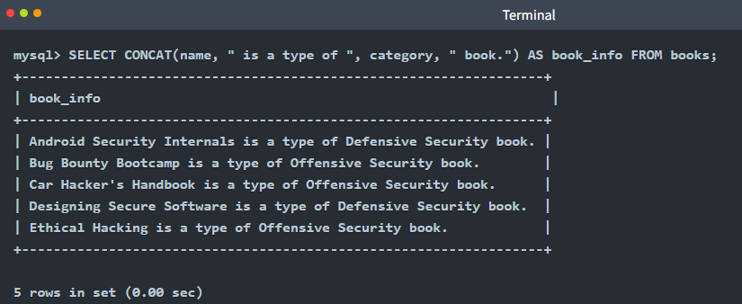

- this query concatenates the name and category columns from the books table into a single one named book_info

GROUP_CONCAT() Function
- this function can help us to concatenate data from multiple rows into one field
- lets explore an example of its usage

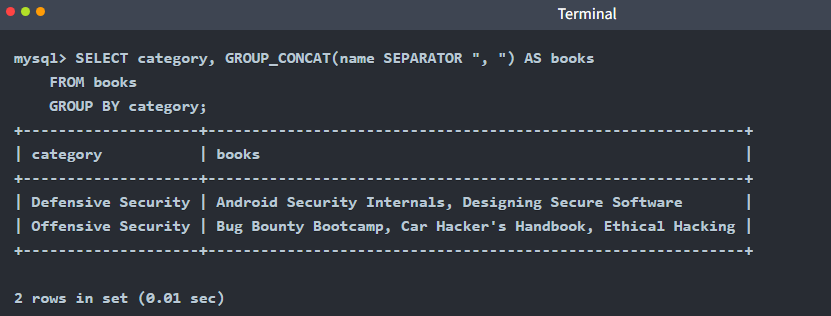

- the query above groups the books by category and concatenates the titles of the books within each category into a single string

SUBSTRING() Function
- this function will retrieve a substring from a string within a query, starting at a determined position
- the length of this substring can also be specified

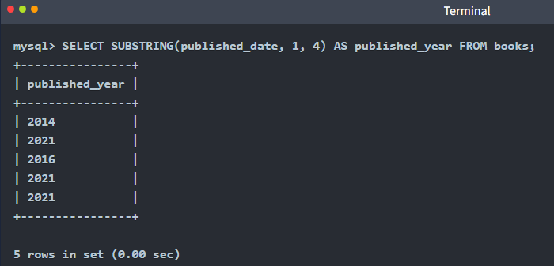

- in the query above we can observe how it extracts the first four characters from the published_date column and stored them in the published_year column

LENGTH() Function
- this function returns the number of characters in a string
- this includes spaces and punctuation
- we can find an example below

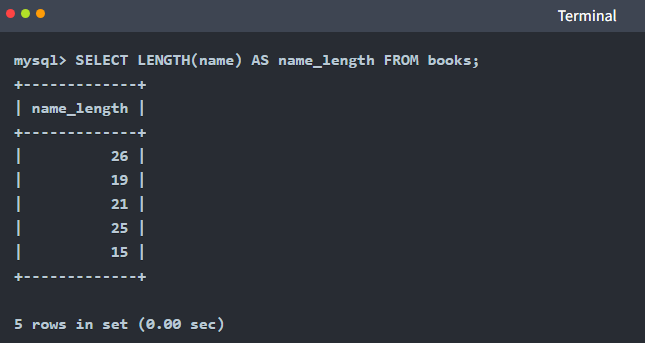

- as we can observe above, the query calculates the legnth of the string within the name column and stores it in a column named name_length

Aggregate Functions
- these functions aggregate the value of multiple rows within one specified criteria in the query
- it can combine multiple values into one result

COUNT() Function
- this function returns the number of records within an expression, as the example below shows

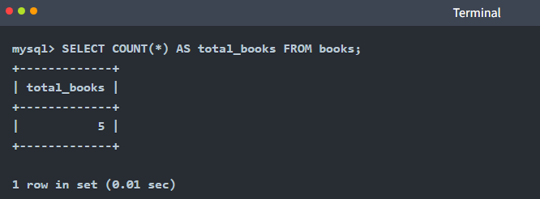

- this query above counts the total number of rows in the books table
- the result is 5 as there are 5 books in the table, and its stored in the total_books column

SUM() Function
- this function sums all values (not NULL) of a determined column
- an example below:

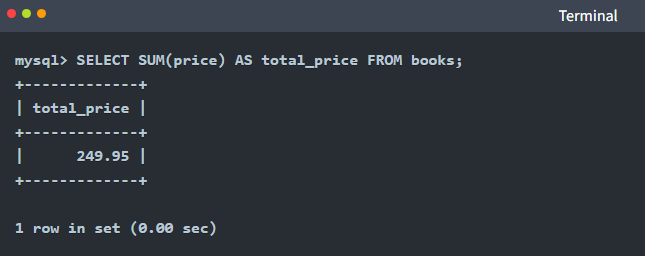

- the query above calculates the total sum  of the proce column
- the result provides the aggregate price of all books in the column total_price

MAX() Function
- this function calculates the max value within a provided column in an expression

- the query above retrieves the latest publication (max value) date from the books table
- the result is 2021-12-21 and is stored in the column latest_book

MIN() Function
- this function calculates the min value within a provided column in an expression

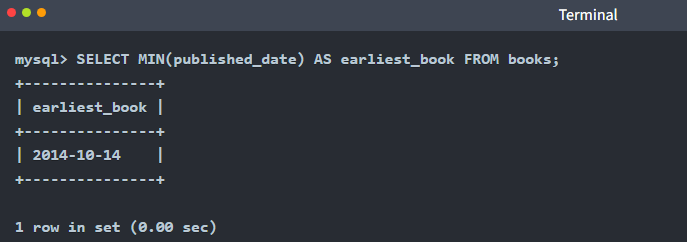

- the query above retrieves the earliest publication (min value) date from the books table
- the result is 2014-10-14 and is stored in the earliest_book column

Using the tools_db database, what is the tool with the longest name based on character length?
- USB Rubber Ducky

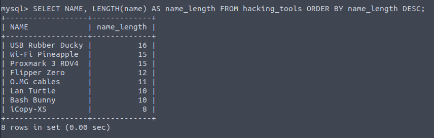

Using the tools_db database, what is the total sum of all tools?
- 1444

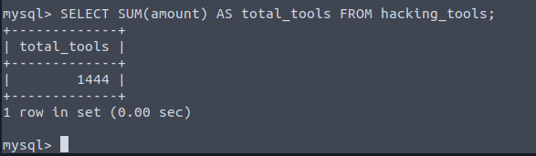

Using the tools_db database, what are the tool names where the amount does not end in 0, and group the tool names concatenated by " & ".
- Flipper Zero & iCopy-XS
- i had to google how to work out where the amount does not end in 0

Conclusion
- summary of what was covered in the room

- Databases are collections of organised data or information that are easily accessible and can be manipulated or analysed
- The two primary types of databases are relational databases (used to store structured data) and non-relational databases (used to store data in a non-tabular format)
- relational databases are made up tables, columns and rows. Primary keys can ensure a record is unique within a table, and foreign keys can allow for a relationship/connection to be made between 2 (or more) tables
- SQL is an easy-to-learn programming language that can be used to interact with relational databases
- Database and Table statements can be used to create/manipulate databses and tables
- CRUD Operations (INSERT, SELECT, UPDATE and DELETE) can be used to manage daa in a db
- In SQL we can use clauses to define how data should be retrieved, filtered, sorted or grouped
- The efficient use of operators and functions can help us filter and manipulate data in SQL