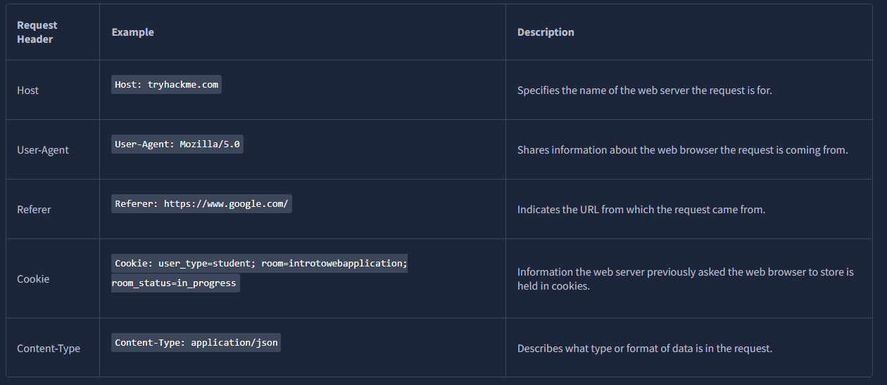
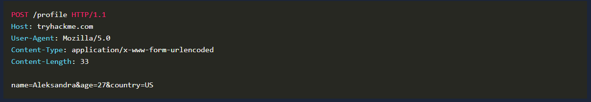
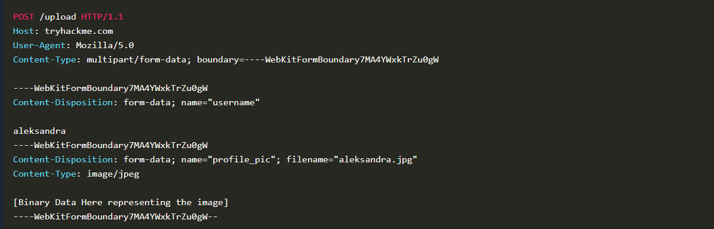
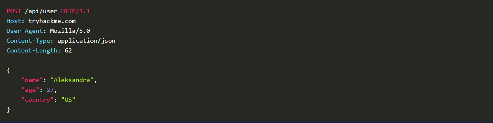
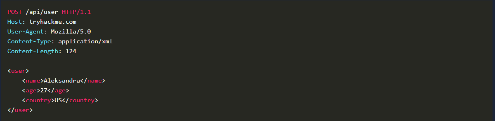
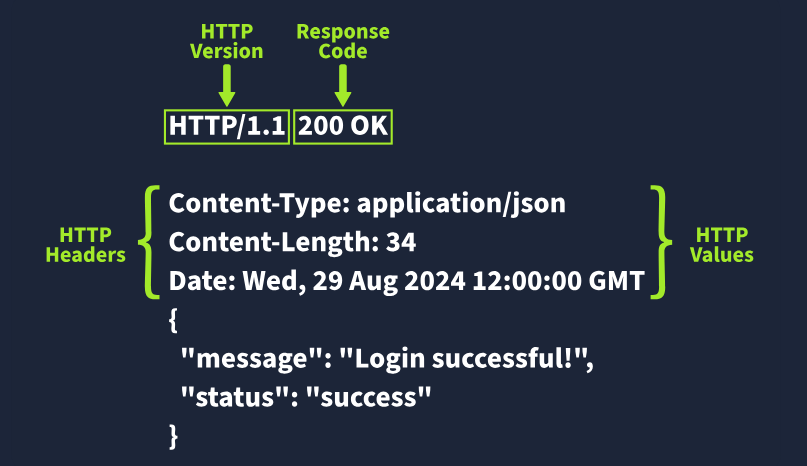
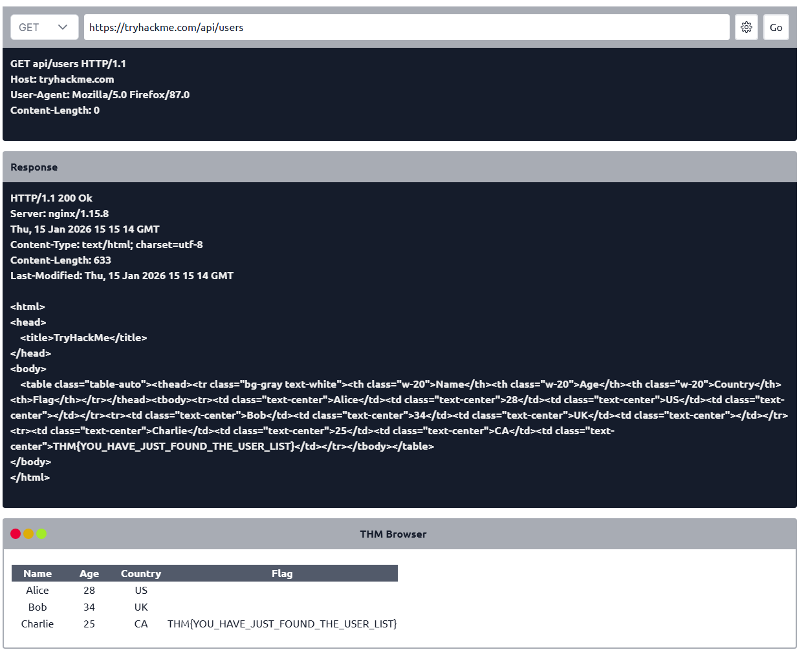
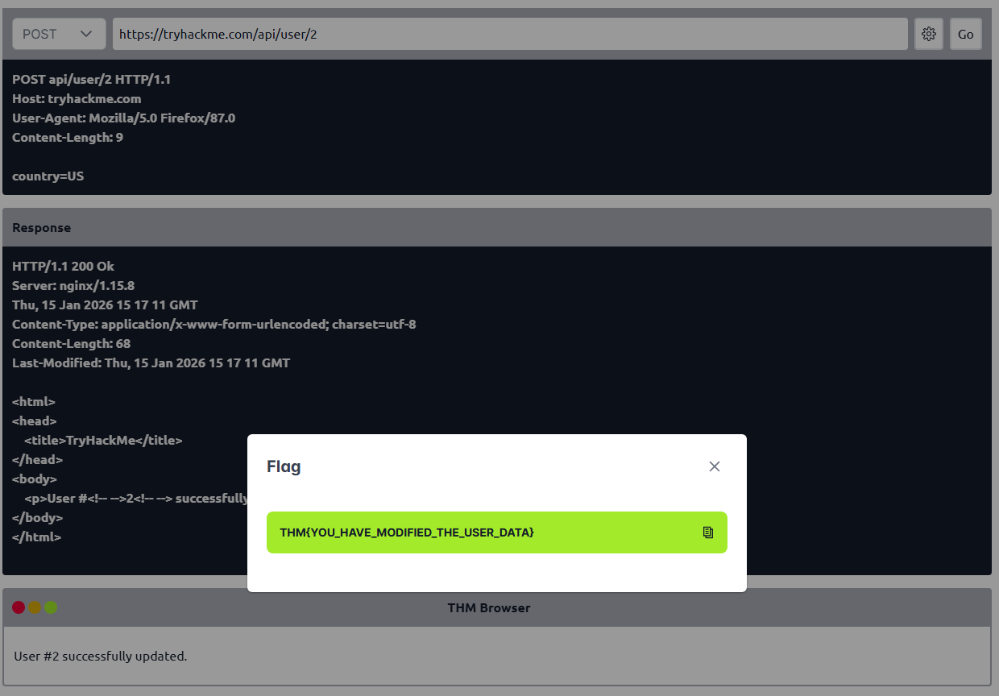
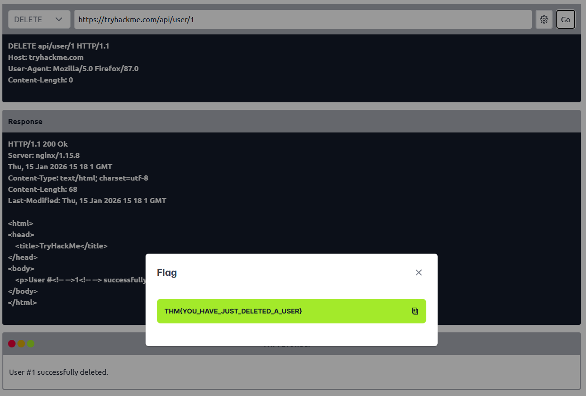

Introduction
- in this room we will walk through the key elements of a web application such as URLs, HTTP requests and responses
- this is perfect if youre starting and want to get a handle on the essentials to build or work with web apps

Learning Objectives
- Understand what a web application is and how it runs in a web browser
- Break down the components of a URL and see how it helps access web resources
- Learn how HTTP requests and responses work
- Get familiar with the different types of HTTP request methods
- Understand what different HTTP response codes mean
- Check out how HTTP headers work and why they matter for security

Web Application Overview
- consider an analogy of a web application as a planet
- astronauts travel to the planet to explore its surface, similar to how someone uses a web browser to explore or browse a web application
- although we only see the surface of the planet, a lot is going on under the surface
- you can imagine the whole planet as a web server with many things going on under the surface of the web server...
- yet all we can usually see is the surface of web pages or apps
- we will now explore the various components that make up a web application

Front End
- the front end can be considererd similar to the surface of the planet, the parts that an astronaut can see and interact with based on the laws of nature
- a web application would have a user interact with it and use a number of technologies such as HTML, CSS and JavaScript to do this

HTML
- HTML (Hypertext Markup Language) is a foundational aspect of web applications
- it is a set of instructions or code that instructs a web browser on what to display and how to display it
- it could be compared to simple organisms living on the planet; these organisms have DNA, which is the instructions for how simple organisms are put together

CSS
- CSS (Cascading Style Sheets) in web applications describes a standard appearance, such as certain colours, types of text and layouts
- continuing the analogy with DNA, these could compare to the parts of DNA that describe the colour, shape, size and texture of the simple organism

JS
- JS (JavaScript) is part of a web application front end that enables more complex activity in the web browser
- Whereas HTML can be considered a simple set of instructions on what to display...
- JS is a more advanced set of instructions that allows choices and decisions to be made on what to display
- in the planet analogy, JS can be considered the brain of an advanced organism, which allows decisions to be made based on what and how something interacts with it

Back End
- the back end of a web application is things you dont see within a web browser but are important for the web app to work
- on a planet, these are the non-visual things - the structures that keep a building standing, the air, and the gravity that keeps feet on the ground

Database
- a database is where information can be stored, modified and retrieved
- a web application may want to store and retrieve information about a visitors preferences on what to show or not; this would be stored in a database
- a planet may have more advanced inhabitants who store information about locations in maps, write notes in a diary or put books in a library and files in a filing cabinet

Infrastucture
- there are many other infrastructure components underpinning web apps such as web servers, application servers, storage, various networking devices and other software that supports the web app
- on a planet there are the roads that are present, the cars that run on those roads, the fuel that powers the cars

WAF
- WAF (Web Application Firewall) is an optional component for web apps
- it helps filter out dangerous requests from the web server and provides an element of protection
- this could be considered similart to how a planets atmosphere can protect inhabitants from harmful UV rays

Summary
- many components involved in delivering a web app
- front end components like HTML, CSS and JavaScript focus on the experience inside the browser
- back end components such as the web server, database, or WAF are the engine under the surface that enable the web application to function
- this simple intro will be built upon in the upcoming tasks

Which component on a computer is responsible for hosting and delivering content for web applications?
- web server

Which tool is used to access and interact with web applications?
- web browser

Which component acts as a protective layer, filtering incoming traffic to block malicious attacks, and ensuring the security of the the web application?
- web application firewall

Uniform Resource Locator
- a Uniform Resource Locator (URL) is a web address that lets you access all kinds of online content...
- whether its a webpage, a video, a photo or other media
- it guides your browser to the right place of the internet

Anatomy of a URL

- think of a URL as being made up of several parts, each playing a different role in helping you find the right resource
- understanding how these parts fit together is important for browsing the web, developing web applications and even troubleshooting problems

- heres a breakdown of the key components:

Scheme
- the scheme is the protocol used to access the website
- the most common are HTTP and HTTPS
- HTTPS is more secure because it encrypts the connection which is why browsers and cyber security experts recommend it
- websites often enforce HTTPS for added protection

User
- some URLs can incldude a users login details (usually a username) for sites that require authentication
- this happens mostly in URLs that need credentials to access certain reousrces
- however its rare nowadays because putting login details in the URL isnt very safe - it can expose sensitive information, which is a security risk

Host/Domain
- the host or domain is the most important part of the URL because it tells you which website youre accessing
- every domain name has to be unique and its registered through domain registrars
- from a securty standpoint, look for domain names that appear almost like real ones but have small differences (this is called typosquatting)
- these fake domains are often used in phishing attacks to trick people into giving up sensitive info

Port
- the port number helps direct your browser to the right service on the web server
- its like telling the server which doorway to use for communication
- port numbers range from 1 to 65535 but the most common are 80 for HTTP and 443 for HTTPS

Path
- the path points to a specific file or page on the server that youre trying to access
- its like a roadmap that shows the browser where to go 
- websites need to secure these paths to make sure only authorised users can access sensitive resources

Query String
- the query string is the part of the URL that starts with a question mark
- its often used for things like search names or form inputs
- since users can modify these query strings its important to handle them securely to prevent attacks like injection, where malicious code could be added

Fragment
- the fragment starts with a hash symbol, and helps point to a specific section of a webpage - like jumping directly to a particular heading or table
- users can modify this too, so like with query strings, its important to check and clean up any data here to avoid issues like injection attacks

Which protocol provides encrypted communication to ensure secure data transmission between a web browser and a web server?
- HTTPS

What term describes the practice of registering domain names that are misspelt variations of popular websites to exploit user errors and potentially engage in fraudulent activities?
- typosquatting

What part of a URL is used to pass additional information, such as search terms or form inputs, to the web server?
- query string

HTTP Messages
- HTTP messages are packets of data exchanged between a user (the client) and the web server
- these messages are very important for understanding how web applications work because they show the users requests and the servers responses are communicated

- imagine an example of an HTTP request and an HTTP response, where you can see key parts like the method, URL, headers and status codes
- these are what make the client-server interaction possible

- there are two types of HTTP messages:

- HTTP Requests: Sent by the user to trigger actions on the web application
- HTTP Response: Sent by the server in response to the users request

- each message follows a specific format that helps both the user and the server communicate smoothly

Start Line
- the start line is like the introduction of the message
- it tells you what kind of message is being sent - whether its a request from the user or a response from the server
- this line also gives important details about how the message should be handled

Headers
- headers are made up of key-value pairs that provide extra information about the HTTP message
- they give instructions to both the client and the server handling the request or response
- these headers cover all sorts of things, like security, content types, and more, making sure everything goes smoothly in communication

Empty Line
- the empty line is a little divider that seperates the header from the body
- its essential because it shows where the headers stop and where the actual content of the message begins
- without this empty line, the message might get messed up, and the client or server could misinterpret it, causing errors

Body
- the body is where the actual data is stored
- in a request the body might include data the user wants to send to the server (like form data)
- in a response, its where the server puts the content that the user requested (like a webpage or API data)

Why Understanding HTTP Messages Matters
- these messages are the foundation of how web applications communicate. if theyre structured properly, everything works smoothly
- knowing how they work will help you diagnose issues in web communication, which means better performance and reliability for your web application
- its also crucial for security. Understanding HTTP messages helps you implement strong security measures to protect data during transmission

Which HTTP message is returned by the web server after processing a client's request?
- HTTP response

What follows the headers in an HTTP message?
- empty line

HTTP Request: Request Line and Methods
- an HTTP request is what a user sends to a web server to interact with a web application and make something happen
- since these requess are often the first point of contact between the user and the web server...
- knowing how they work is super important - especially if youre into cyber security

- imagine an HTTP request showing the key parts like the method (e.g. GET or POST), path (e.g. /login) and version (e.g. HTTP/1.1)
- these elements make up the basics of how a client (user) communicates with a server

Request Line
- the request line (or start line) is the first part of an HTTP rquest and tells the server what kind of request its dealing with
- it has three main parts:
- the HTTP method
- the URL pth
- the HTTP version

Example: 
- METHOD /path HTTP/version

HTTP Methods
- the HTTP method tells the server what action the user wants to perform on the resource identified by the URL path
- here ae some of the most common methods and their possible security issue:

GET
- used to fetch data from the server without making any changes
- reminder -> make sure youre only exposing data that the user is allowed to see
- avoid putting sensitive info like tokens or passwords in GET requests since they can show up as plaintext

POST
- sends data to the server
- usually to create or update something
- reminder -> always validate and clean the input to avoid attacks like SQL inection or XSS

PUT
- replaces or updates something on the server
- reminder -> make sure the user is authorised to make changes before accepting the request

DELETE
- removes something from the server
- reminder -> just like with PUT, make sure only authorised users can delete resources

- besides these common methods, there are a few others used in specific cases:

PATCH
- updates part of a resource
- its useful for making small changes without replacing the whole thing
- but always validate the data to avoid inconsistencies

HEAD
- works like GET but only retrieves headers, not the full content
- its handy for checking metadata without downloading the full response

OPTIONS
- tells you what methods are available for a specific resource
- helping clients understand what they can do with the server

TRACE
- similar to OPTIONS, it shows which methods are allowed, often for debugging
- many servers disable it for security reasons

CONNECT
- used to create a secure connection like for HTTPS
- its not as common but its critical for encrypted communication

- each of these methods has its own set of security rules
- for example PATCH requests should be validated to avoid inconsistencies
- and OPTIONS and TRACE should be turned off if not needed to avoid possible security risks

URL Path
- the URL path tells the server where to find the resource the user is asking for
- for instance in the URL https://tryhackme.com/api/users/123 
- the path /api/users/123 identifies a specific user

- attackers often try to manipulate the URL path to exploit vulnerabilities so its crucial to:
- Validate the URL path to prevent unauthorised acces
- Sanitise the path to avoid injection attacks
- Protect sensitive data by conducting privacy and risk assessments

- following these practices helps protect your web app from common attacks

HTTP Version
- the HTTP version shows the protocol version used to communicate between the client and server
- heres a quick rundown of the most common ones:

HTTP/0.9 (1991)
- the first version, only supports GET requests

HTTP/1.0 (1996)
- added headers and better support for different types of content, improving caching

HTTP/1.1 (1997)
- brought persistent connections, chunked transfer encoding, and better caching
- its still widely used today

HTTP/2 (2015)
- introduced features like multiplexing, header compression and prioritisation for faster performance

HTTP/3 (2022)
- built on HTTP/2 but uses a new protocol (QUIC) for quicker and more secure connections

- although HTTP/2 and HTTP/3 offer better speed and security...
- many systems still use HTTP/1.1 because its well supported and works with most existing setups
- however upgrading to HTTP/2 or HTTP/3 can provide a significant performance and security improvements as more systems adopt them

Which HTTP protocol version became widely adopted and remains the most commonly used version for web communication, known for introducing features like persistent connections and chunked transfer encoding?
- HTTP/1.1

Which HTTP request method describes the communication options for the target resource, allowing clients to determine which HTTP methods are supported by the web server?
- OPTIONS

In an HTTP request, which component specifies the specific resource or endpoint on the web server that the client is requesting, typically appearing after the domain name in the URL?
- URL PATH

HTTP Request: Headers and Body
- request headers allow extra info to be conveyed to the web server about the request
- some common headers are as follows

Common Request Headers

Request Body
- in HTTP requests such as POST and PUT, where data is sent to the web server as opposed to requested from the web server, the data is located in inside the HTTP req body
- the formatting of the data can take many forms, but some common ones are:
- URL Encoded
- Form Data
- JSON
- XML

URL Encoded (application/x-www-form-urlencoded)
- a format where data is structured in pairs of key and value where (key=value)
- multiple pairs are seperated by an & symbol such as key1=value%key2=value2
- special characters are precent-encoded

Example:

Form Data (multipart/form-data)
- allows multiple data blocks to be sent where each block is seperated by a boundary string
- the boundary string is the defined header of the req itself
- this type of formatting can be used to send binary data, such as when uploading files or images to a web server

Example:

JSON (application/json)
- in this format the data can be sent using a JSON (JavaScript Object Notation) structure
- data is formatted in pairs of name : value
- multiple pairs are seperated by commas, all contained within curly braces {}

Example:

XML (application/xml)
- in XML formatting, data is structured inside labels called tags, which have an opening and closing
- these labels can be nested within each other
- you can see in the example below the opening and closing of the tags to send details about a user called Aleksandra

Example:

Which HTTP request header specifies the domain name of the web server to which the request is being sent?
- Host

What is the default content type for form submissions in an HTTP request where the data is encoded as key=value pairs in a query string format?
- application/x-www-form-urlencoded

Which part of an HTTP request contains additional information like host, user agent, and content type, guiding how the web server should process the request?
- request headers

HTTP Response: Status Line & Status Codes
- when you interact with a web application the server send back an HTTP response to let you know whether your req was successful or something went wrong
- these responses include a status code and a short explanation (called the Reason Phrase) that gives insight into how the server handled your req

Status Line
- the first line in every HTTP response is called the status line
- it gives you three key pieces of info:

1. HTTP Version: this tells you which version of HTTP is being used

2. Status Code: a three digit number showing the outcome of your req

3. Reason Phrase: a short message explaining the status code in human-readable terms

- since we already covered HTTP versions in task 5, lets focus on the Status Code and Reason Phrases here

Status Codes and Reason Phrases
- the Status Code is the number that tells you if the req succeeded of failed
- while the Reason Phrase explains what happened
- these codes fall into 5 main categories:

Informational Responses (100-199)
- these codes mean the server has receieved part of the request and is waiting for the rest
- it's a "keep going" signal

Successful Responses (200-299)
- these codes mean everything worked as expected
- the server processed the request and sent back the requested data

Redirection Messages (300-399)
- these codes tell you that the resource you requested has moved to a different location
- usually providing the new URL

Client Error Responses (400-499)
- these codes indicate a problem with the request
- maybe the URL is wrong, or youre missing some required info, like authentication

Server Error Responses (500-599)
- these codes mean the server encountered an error while trying to fulfil the req
- these are usually server-side issues and not the clients fault

Common Status Codes
- here are some of the most frequently seen status codes:

100 (Continue)
- the server got the first part of the req and is ready for the rest

200 (OK)
- the req was successful, and the server is sneding back the requested resource

301 (Moved Permanently)
- the resource youre requesting has been permanently moved to a new URL
- use the new URL from now on

404 (Not Found)
- the server couldnt find the resource at the given URL
- double-check that youve got the right address

500 (Internal Server Error)
- something went wrong on the servers end and it couldnt process your req

What part of an HTTP response provides the HTTP version, status code, and a brief explanation of the response's outcome?
- Status Line

Which category of HTTP response codes indicates that the web server encountered an internal issue or is unable to fulfil the client's request?
- Server Error Responses

Which HTTP status code indicates that the requested resource could not be found on the web server?
- 404

HTTP Response: Headers and Body
- when a web server responds to a HTTP req, it includes HTTP response headers, which are basically key-value pairs
- these headers provide important info about the response and tell the client (usually the browser) how to handle it

- picture an example of an HTTP response with the headers highlighted
- key headers like Content-Type, Content-Length, and Data give us important details about the response the server sends back

Required Response Headers
- some response headers are crucial for making sure the HTTP response works properly
- they provide essential info that both the client and server need to process everything correctly
- here are a few important ones:

Data
- example: Date: Fri, 23 Aug 2024 10:42:21 GMT
- this header shows the exact date and time when the response was generated by the server

Content-Type
- example: Content-Type: text/html; charset=utf-8
- it tells the client what kind of content its getting like whether its HTML, JSON or something else
- it also includes character sets (like UTF-8) to help the browser display it properly

Server
- example: Server: nginx
- this header shows what kind of server software is handling the request
- its good for debugging but it can also reveal server info that might be useful for attackers
- so many people remove or obscure this one

Other Common Response Headers
- besides the essential ones, there are other common headers that give additional instructions to the client or browser and help control how the response should be handled

Set-Cookie:
- example: Set-Cookie: sessionId=38af1337es7a8
- this one sends cookies fromt the server to the client, which the client then stores and sends back with future reqs
- to keep things secure, make sure cookies are set with the HttpOnly flag (so they cant be accessed by JavaScript)
- and the Secure flag (so theyre only sent over HTTPS)

Cache-Control:
- example: Cache-Control: max-age=600
- this header tells the client how long it can cache the response before checking with the server again
- it can also prevent sensitive info from being cached if needed (using no-cache)

Location:
- example: Location: /index.html
- this ones used in redirection (3xx) responses
- it tells the client where to go next if the resource has moved
- if users can modify this header during reqs be careful to validate and sanitise it
- otherwise you could end up with open redirect vulnerabilities, where attackers can redirect users to harmful sites

Response Body
- the HTTP response body is where the actual data lives - things like HTML, JSON, images etc that the server sends back to the client
- to prevent injection attacks like Cross-Site Scripting (XSS)...
- always sanitise and escape any data (especially user-generated content) before including it in the response

Which HTTP response header can reveal information about the web server's software and version, potentially exposing it to security risks if not removed?
- server

Which flag should be added to cookies in the Set-Cookie HTTP response header to ensure they are only transmitted over HTTPS, protecting them from being exposed during unencrypted transmissions?
- Secure

Which flag should be added to cookies in the Set-Cookie HTTP response header to prevent them from being accessed via JavaScript, thereby enhancing security against XSS attacks?
- HttpOnly

Security Headers
- HTTP security headers help improve the overall security of the web application by providing mitigations against attacks like Cross-Site scripting (XSS), clickjacking and others
- we will now dig deeper into the following security headers:

- Content-Security-Policy (CSP)
- Strict-Transport-Security (HSTS)
- X-Content-Type-Options 
- Referrer-Policy

- you can use a site like (https://securityheaders.com/) to analyse the security headers of any website
- after the discussion in this task, you will hopefully have a better understanding of what it is reporting on

Content-Security-Policy (CSP)
- a CSP heaer is an additional security layer that can help mitigate against common attacks like XSS
- malicious code could be hosted on a seperate website or domain and injected into a vulnerable website
- a CSP provides a way for administrators to say what domains or sources are considered safe and provides a layer of mitigation to such attacks

- within the header itself you may see properties such as default-src or script-src defined any many more
- each of these gives an option to an administrator to define at various levels of granularity, what domains are allowed for what type of content
- the use of self is a special keyword that reflects the same domain on which the website is hosted

- looking at an example CSP header:

- Content-Security-Policy: default-src 'self'; script-src 'self' https://cdn.tryhackme.com; style-src 'self'

- we see the use of:

default-src:
- which specifies the default policy of self
- which means only the current website

script-src:
- which specifies the policy for where scripts can be loaded from
- which is self along with scripts hosted on https://cdn.tryhackme.com

style-src:
- which specifies the policy for where style CSS style sheets can be loaded from the current website (self)

Strict-Transport-Security (HSTS)
- the HSTS header ensures that web browsers will always connect over HTTPS
- lets look at an example of HSTS:

- Strict-Transport-Security: max-age=63072000; includeSubDomains; preload

- heres a breakdown of the example HSTS header by directive:

max-age:
- this is the expiry time in seconds for this setting

includeSubDomains:
- an optional setting that instructs the browser to also apply this setting to all subdomains

preload:
- this optional setting allows the website to be included in preload lists
- browsers can use preload lists to enforce HSTS before even having their first visit to a website

X-Content-Type-Options
- the X-Content-Type-Options header can be used to instruct browsers not to guess the MIME type of a reousrce but only use the Content-Type header
- heres an example:

- X-Content-Type-Options: nosniff

- heres a breakdown of the X-Content-Type-Options header by directives:

nosniff:
- this directive instructs the browser not to sniff or guess the MIME (Multipurpose Internet Mail Extensions) type

Referrer-Policy
- this header controlt the amount of info sent to the destination web serer when a user is redirected from the source web server such as when they click a hyperlink
- the header is available to alllow a web admin to control what info is shared
- here are some example of Referrer-Policy:

- Referrer-Policy: no-referrer
- Referrer-Policy: same-origin
- Referrer-Policy: strict-origin
- Referrer-Policy: strict-origin-when-cross-origin

- heres a breakdown of the Referrer-Policy header by directives:

no-referrer:
- this completely disables any info being sent about the referrer

same-origin:
- this policy will only send referrer info when the destination is part of the same origin
- this is helpful when you want referrer information passed when hyperlinks are within the same website but not outside to external websites

strict-origin:
- this policy only sends the referrer as the origin when the protocol stays the same
- so a referrer is sent when an HTTPS connection goes to another HTTPS connection

strict-origin-when-cross-origin:
- this is similar to strict-origin except for same-origin requests
- where it sends the ful URL path in the origin header

In a Content Security Policy (CSP) configuration, which property can be set to define where scripts can be loaded from?
- script-src

When configuring the Strict-Transport-Security (HSTS) header to ensure that all subdomains of a site also use HTTPS, which directive should be included to apply the security policy to both the main domain and its subdomains?
- includeSubDomains

Which HTTP header directive is used to prevent browsers from interpreting files as a different MIME type than what is specified by the server, thereby mitigating content type sniffing attacks?
- nosniff

Practical Task: Making HTTP Requests
- in the room use the view site button
- we will see an emulator for making demo HTTP reqs
- using what weve learned so far complete these questions:

Make a GET request to /api/users. What is the flag?
- THM{YOU_HAVE_JUST_FOUND_THE_USER_LIST}

Make a POST request to /api/user/2 and update the country of Bob from UK to US. What is the flag?
- THM{YOU_HAVE_MODIFIED_THE_USER_DATA}

Make a DELETE request to /api/user/1 to delete the user. What is the flag?
- THM{YOU_HAVE_JUST_DELETED_A_USER}

Conclusion
- hopefully we learned a bit more about:

- What components are involved in web applications
- The structure of the Uniform Resource Locator (URL)
- What are HTTP messages, requests, headers and responses
- The importnace of Security headers