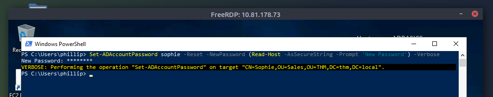
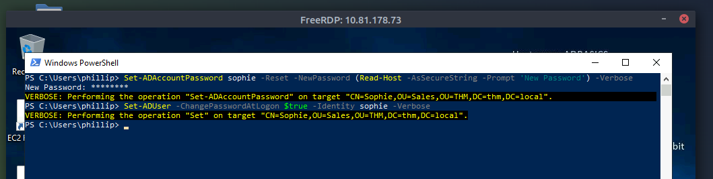
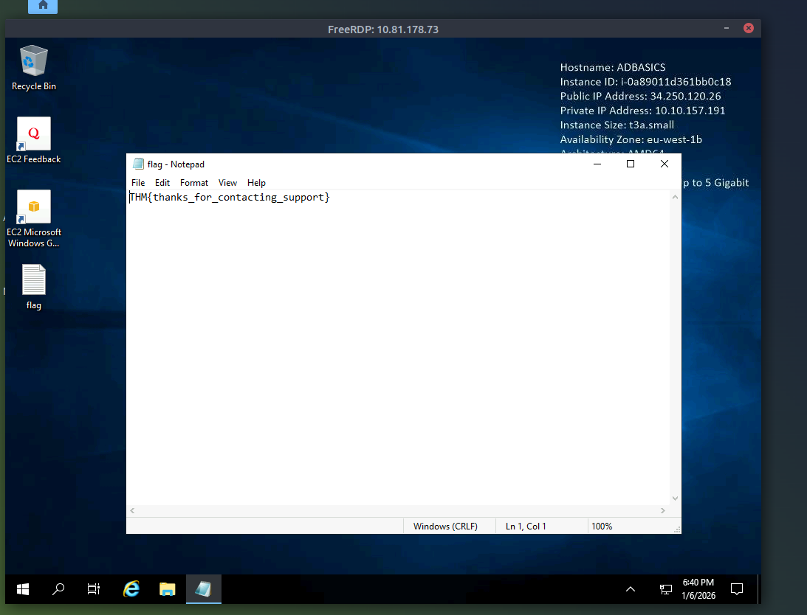
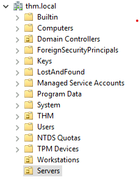
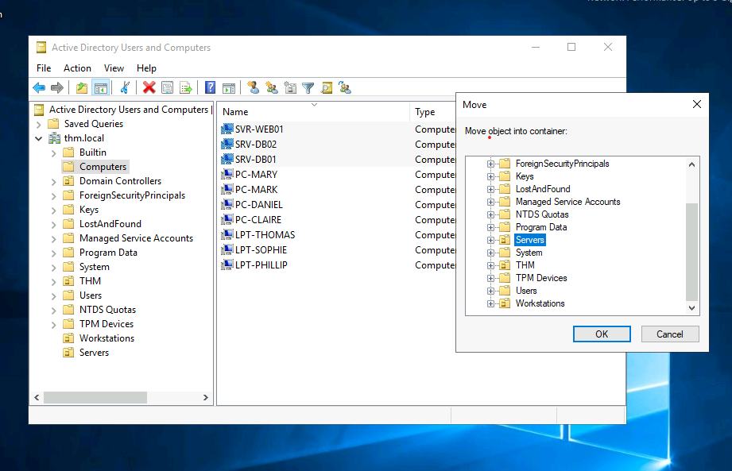
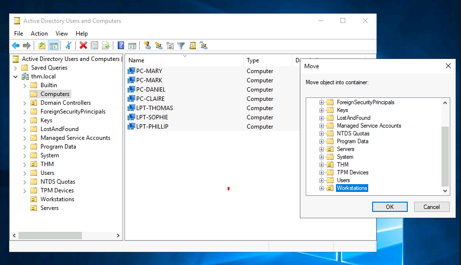
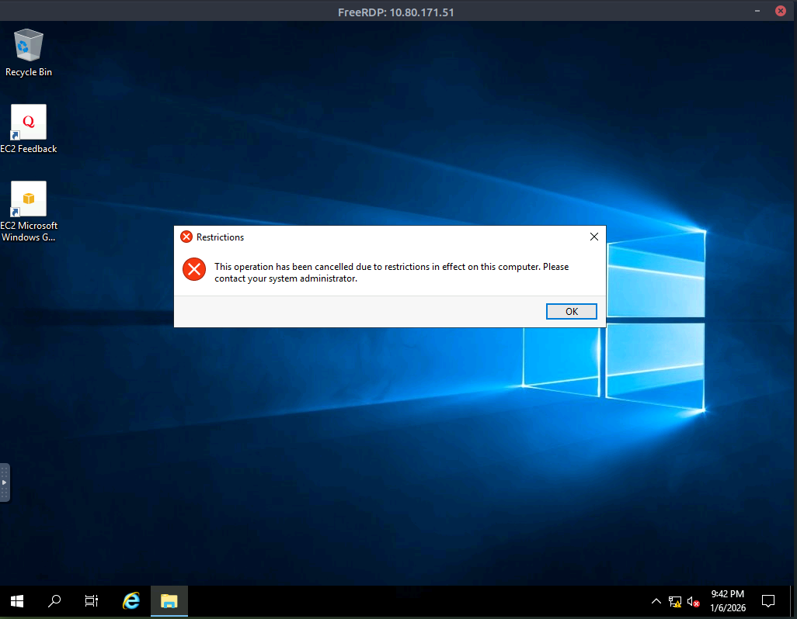

Active Directory Basics
- microsoft's active directory is the backbone of the corporate world
- it simplifies the management of devices and users within a corporate environment
- in this room we will take a deep dive into the essential components of active directory

Windows Domains
- picture yourself administering a small business network with only five computers and five employees
- in such a tiny network you will probably be able to configure each computer seperately without a problem
- you will manually log into each computer, create users for whoever will use them, and make specific configurations for each employee's accounts
- if a user's computer stops working, you will probably go to their place and fix the computer on-site

- while this sounds like a very relaxed lifestyle, let's suppose your business suddenly grows and now have 157 computers and 320 different users located across 4 different offices.
- would you still be able to manage each computer as a seperate entity, manually configure policies for each of the users across the network and provide on-site support for everyone?
- the answer is likely no.

- to overcome these limitations, we can use a windows domain
- simply put windows domain -> a group of users and computers under the administration of a given business
- the main idea behind a domain is to centralise the administration of common components of a windows computer network in a single repo called Active Directory (AD)
- the server that runs the AD is known as a Domain Controller (DC)

- the main advantages of having a configured windows domain are:
- centralised identity management: all users across the network can be configured from AD with minimum effort
- managing security policies: you can configure security policies directly from AD and apply them to users and computers across the network as needed

A Real-World Example
- if its all a bit confusing, chances are you have already interacted with a windows domain at some point in school, university or work

- in school/university networks you will often be provided with a username and password that you can use on any of the computers available on campus
- your credentials are valid for all machines because whenever you input them on a machine -> forwards the auth process back to the Active Directory -> where credentials will be checked
- thanks to AD your credentials dont need to exist in each machine and are available throughout the network

- AD is also the component that allows your school/university to restrict you from accessing the control panel on your school/university machines
- policies will usually be deployed throughout the network so that you don't have admin privileges over those computers

In a Windows domain, credentials are stored in a centralised repository called...
- active directory

The server in charge of running the Active Directory services is called...
- domain controller

Active Directory
- the core of any windows domain is the Active Directory Domain Service (AD DS) 
- this service acts as a catalogue that holds the information of all the "objects" that exist on your network
- many objects supported by AD -> users, groups, machines, printers, shares and many more

Users
- one of the most common object types in AD
- one of the objects known as security principals
- meaning they can be authenticated by the domain and assigned privileges over resources like files or printers
- you could say a security principal is an object that can act upon resources in the network
- users can be used to represent 2 types of entities:
- people: users will generallyy represent persons in your org that need to access the network, like employees
- services: you can also define users to be used by services like IIS or MSSQL. every single service requires a user to run, but service users are different from regular users as they will only have the privilges needed to run their specific service

Machines
- another type of object within AD
- for every computer that joins the AD domain, a machine object will be created
- also considered "security principals"
- are assigned an account just as any regular user
- this account has somewhat limited rights within the domain itself

- machine accounts themselves are local admins on the assigned computer
- generally not supposed to be accessed by anyone except the computer itself
- but like with any other account, if you have the password, you can use it to log in

** note ** machine account passwords are automatically rotated out and are generally comprised of 120 random characters

- identifying machine accounts is relatively easy
- they follow a specific naming scheme
- the machine acc name is the computers name followed by a $
- e.g. a machine name DC01 will have a machine acc called DC01$

Security Groups
- if familiar with windows you probably know that you can define user groups to assign access rights to files or other resources to entire groups instead of single users
- this allows for better manageability as you can add users to an existing group
- they will automatically inherit all of the groups privileges
- security groups are considered "security principals" -> therefore can have privileges over resources on the network

- groups can have both users and machines as members
- if needed groups can include other groups as well

- several groups are created by default in a domain that can be used to grant specific privileges to users
- here are some of the most important groups in a domain:

security group -> description
domain admins -> users of this group have admin privileges over the entire domain. by default they can administer any computer on the domain, including the DCs
server operators -> users in this group can adminster Domain Controllers. they cannot change any administrative group memberships
backup operators -> users in this group are allowed to access any file, ignoring their permissions. they are used to perform backups of data on computers
account operators -> users in this group can create or modify other accounts in the domain
domain users -> includes all existing user accounts in the domain
domain computers -> includes all existing computers in the domain
domain controllers - includes all existing DCs on the domain

- complete list of default security groups:
- https://learn.microsoft.com/en-us/windows-server/identity/ad-ds/manage/understand-security-groups

Active Directory Users and Computers
- to config users, groups or machines in Active Directory, need to log in to the Domain Controller and run "Active Directory Users and Computers" from the start menu
- this will open up a window where you can see the hierarchy of users, computers and groups that exist in the domain.
- these objects are organised in Organisational Units (OUs) which are container objects that allow you to classify users and machines
- OUs are mainly used to define sets of users with similar policing requirements
- the people in the sales depart of your org are likely to have a different set of policies than the people in IT as an example
- keep in mind -> a user can only be a part of a single OU at a time

- in the VM we can see there is already an OU called THM with 5 child OUs for:
- IT, Management, Marketing, R&D and Sales departments
- very typical to see the OUs mimic the business' structure -> allows for efficiently deploying baseline policies that apply to entire departments
- remember -> while this would be the expected model most of the time, you can define OUs arbitrarily
- in the VM can right click the THM OU and create a new OU under it called Students as a test
- open any of the OUs in the VM and we can see the users they contain 
- can also perform simple tasks like creating, deleting or modifying them as needed
- you can also reset passwords if needed (pretty helpful for the helpdesk)

- you probably noticed -> there are other default containers apart from the THM OU
- these containers are created by Windows automatically and contain the following:

- Builtin: contains default groups available to any windows host
- Computers: any machine joining the network will be put here by default. you can move them if needed
- Domain Controllers: default OU that contains the DCs in your network
- Users: default users and groups that apply to a domain-wide context
- Managed Service Accounts: holds accounts used by services in your Windows domain

Security Groups vs OUs
- you might be wondering why we have both groups and OUs?
- while both are used to classify users and computers, their purposes are entirely different!

- OUs are handy for applying policies to users and computers, which include specific configurations that pertain to sets of users depending on their particular role in the enterprise. Remember a user can only be a member of a single OU at a time, as it would not make sense to try to apply 2 different sets of policies to a single user

- Security Groups on the other hand, are used to grant permissions over resources. e.g. you will use groups if you want to allow some users to access a shared folder or network printer. A user can be part of many groups, which is needed to grant access to multiple resources

Which group normally administrates all computers and resources in a domain?
- domain admins

What would be the name of the machine account associated with a machine named TOM-PC?
- TOM-PC$

Suppose our company creates a new department for Quality Assurance. What type of containers should we use to group all Quality Assurance users so that policies can be applied consistently to them?
- organisational units 

Managing Users in AD
- our first task as the new domain admin is to check the existing AD OUs and users,
- as there have been some changes that have happened to the business
- we must follow this organisational chart and make changes to the AD to match it

Deleting extra OUs and users
- the first thing we should notice is that there is an additional department OU in the current AD config that doesn't appear in the chart
- we are told it has been closed to budget cuts and should be removed from the domain
- if we try to right-click delete the OU we get this error

- by default OUs are protected against accidental deletion
- to delete the OU we need to enable the Advanced Features in the view menu!

- this will show some additional containers and enable us to disable the accidental deletion protection
- right click the OU and go to properties
- we will find a checkbox in the Object tab to disable the protection

- be sure to uncheck the box and try deleting the OU again
- we will be prompted to confirm that we want to delete the OU
- as a result any users, groups or OUs under it will also be deleted

- after deleting the extra OU, you should notice that for some of the departments..
- the users in the AD dont match the ones in the organisational chart
- create and delete users as needed to match them
- go into each of the OUs and delete the users who are no longer needed in there

Delegeation
- one of the nice things you can do in AD is to give specific users some control over some OUs
- this process is known as delegation and allows you to grant users specific privileges to perform advanced tasks on OUs without needed a Domain Admin to step in
- one of the most common use cases for this is granting IT support the privileges to reset other low-priv users' passwords
- from our chart we see Philip is in charge of IT support so we probably want to delegate the control of reseeting passwords over the Sales, Marketing and Management OUs to him.

- to delegate control over an OU you can right click it and select Delegate Control

- this should open a new window where first we will be asked for the users to whom you want to delegate control

** note ** to avoid mistyping the user's name, write (in this case) "phillip" and click the check names button -> windows will autocomplete the user

- click OK and on the next step select the following:

- click next a couple of times and now Phillip should be able to reset passwords for any user in the sales dept
- while youd probably want to repeat these steps to delegate the passwords resets of Marketing and Management depts we will leave it here for this task

- let's use Phillip's account to try and reset Sophie's password
- we are given the credentials for Phillip to log in via RDP

** note ** in this task when connecting via RDP use THM\phillip as the username to specify you want to login using the user phillip on the THM domain

- to login via RDP i did it through the linux machine
- xfreerdp [ip]
- then entered phillip's credentials in the session

- while you may be tempted to go to Active Directory Users and COmputers to try and test Phillip's new powers
- he doesn't really have the privileges to open it
- so we have to use another method to do password resets
- in this case we wil be using powershell to do so
- Set-ADAccountPassword sophie -Reset -NewPassword (Read-Host -AsSecureString -Prompt 'New password') -Verbose
- entere the new password
- VERBOSE: Peforming the operation "Set-ADAccountPassword" on target "CN=Sophie,OU=Sales,OU=THM,DC=thm,DC=local".

- since we wouldn't want Sophie to keep on using a password we know, we can also force a password reset at the next logon with the following command
- Set-ADUser -ChangePasswordAtLogon $true -Identity sophie -Verbose
- VERBOSE: Performing the operation "Set" on target "CN=Sophie,OU=Sales,OU=THM,DC=thm,DC=local".

- log in to sophies account with new password and retrieve the flag from desktop

** note ** when connecting via RDP use THM\sophie as the username to specify we want to log in using the user sophie on the THM domain

What was the flag found on Sophie's desktop?
- THM{thanks_for_contacting_support}

The process of granting privileges to a user over some OU or other AD Object is called...
- delegation

Managing Computers in AD
- by default all machines that join a domain except for the DCs will be put in the container called "Computers" 
- if we check our DC we will see some devices are already there

- we can see some servers, some laptops and some PCs corresponding to the users in our network
- having all our devices there is not the best idea -> very likely that you want different policies for your servers and the machines that regular users use on a daily basis

- there is no golden rule on how to organise your machines
- an excellent starting point is segregating devices according to their use
- in general you'd expect these devices divdede into at leat the 3 following categories:

1. Workstations
- one of the most common devices within an Active Directory domain
- each user in the domain will likely be logging into a workstation
- this is the device they will do their work or normal browsing activities
- these devices should never have a privileged user signed to them

2. Servers
- second most common device within an AD domain
- servers are generally used to provide services to users or other servers

3. Domain Controllers
- the third most common device within an AD domain
- Domain controllers allow you to manage the AD domain
- these devices are often deemed the most sensitive devices within the network
- as they contain hashed passwords for all user accounts within the environment

- since we are tidying up our AD
- let's create 2 seperate OUs for Workstations and Servers (Domain Controllers are already in an OU created by windows)
- we will be creating them directly under thm.local domain container

- as you can see we added Workstations and Servers under thm.local
- now we move the personal computers and laptops to the workstations OU 
- and move the servers to the servers OU from the Computers container
- doing so will allow us to configure policies for each OU later

- in the above image you can see we moved the SVR (servers) from Computers container to the Servers OU

- in the above image you can see we moved the workstations from the Computers container to the workstations OU

After organising the available computers, how many ended up in the Workstations OU?
- 7

Is it recommendable to create separate OUs for Servers and Workstations? (yay/nay)
- yay

Group Policies
- so far we have organised users and computers in OUs just for the sake of it
- the main idea behind this is to be able to deploy different policies for each OU indivdually
- that way we can push different configurations and security baselines to users depending on their department

- windows manages such policies through Group Policy Objects (GPO)
- GPOs are simply a collection of settings that can be applied to OUs 
- GPOs can contain policies aimed at either users or computers, allowing you to set a baseline on specific machines and identities
- to configure GPOs, you can use the Group Policy Management tool from the start menu

- the first thing you will see when opening it is your complete OU hierarchy as defined before
- to configure group policies..
- you first create a GPO under Group Policy Objects
- then link it to the OU where you want the policies to apply
- example...

- in the image above we can see that 3 GPOs have been created
- from those the Default Domain Policy and the RDP Policy are linked to thm.local as a whole
- and the Default Domain Controllers Policy is linked to the Domain Controllers OU only
- something important to have in mind is that any GPO will apply to the linked OU and any sub-OUs under it
- e.g. the sales OU will still be affected by the Default Domain Policy

- examining the Default Domain Policy to see what's insisde a GPO
- the first tab you see when selecting a GPO shows its scope
- which is where the GPO is linked in the AD
- for the current policy we can see that it has only been linked to the thm.local domain

- you can also apply Security Filtering to GPOs so that they are only applied to specific users/computers under an OU
- by default they will apply to the Authenticated Users group, which includes all users/PCs

- the Settings tab includes the actual contents of the GPO and lets us know what specific configuration it applies
- as stated before -> each GPO has configs that apply to computers only and configs that apply to users only
- in this case the Default Domain Policy only contains computer configs

- in this case the Default Domain Policy indicates really basic configs that should apply to most domains including password and account lockout policies

- since this gpo applies to the whole domain any change to it would affect all computers
- let's change the minimum password length policy to require users to have at least 10 characters in their passwords
- rightclick the GPO and select edit

- this will open up a new window where we can nav and edit all of the available configs
- to change the min password length...
- go to Computer Configurations -> Policies -> Windows Setting -> Security Settings -> Account Policies -> Password Policy 
- change the required policy value

- as you can see plenty of policies can be established in a GPO
- there are a lot of different policies
- you can double click on a policy and read the explain tab for more info

GPO Distribution
- distributed to the network via a network share called SYSVOL which is stored in the DC
- all users in a  domain should typically have access to this share over the network to sync their GPOs periodically
- the SYSVOL share points by default to the C:\Windows\SYSVOL\sysvol\ directory on each of the DCs in our network

- once a change has been made to any GPOs it might take up to 2 hours for computers to catch up
- if you want to force any particular computer to sync its GPOs immediately you can run the following command on the desired computer:
- PS C:\> gpupdate /force

Creating some GPOs for THM inc Task
- as part of our new job we have been tasked with implementing some GPOs to allows us to
1. Block non-IT users from accessing the Control Panel
2. Make workstations and servers lock their screen automatically after 5 minutes of user inactivity to avoid people leaving their sessions exposed

- let's focus on each of those and define what policies we should enable in each GPO and where they should be linked

Restrict Access to Control Panel

- we want to restrict access to the control panel across all machine to only users that are part of the IT dept
- users of other depts shouldnt be able to change the systems preferences
- lets create a new GPO called Restrict Control Panel Access
- since we want this GPO to apply to specific users we will look under User Configuration for the following policy

- notice we have enabled the Prohibit Access to Control Panel and PC Settings policy

- once the GPO is configured we will need to link to all of the OUs corresponding user's who should not have access to the Control Panel of their PCs
- in this case we will link Marketing, Management and Sales OUs by dragging the GPO to each of them

Auto Lock Screen GPO
- for the first GPO, regarding screen locking for workstations and servers, we could directly apply it over the Workstations, Servers and Domain Controllers OUs we created previously
- while this solution should work..
- an alternative consists of simply applying the GPO to the root domain, as we want the GPO to affect all of our computers
- since the Workstations, Servers and Domain Controllers OUs are all child OUs of the root domain, they will inherit its policies

** note ** you might notice that if our GPO is applied to the root domain, it will also be inherited by other OUs like Sales or Marketing, since those OUs contain user only, any Computer Configuration in our GPO will be ignored by them

- let's create a new GPO call it Auto Lock Screen and edit it
- the policy to achieve what we want is located in this route:

- we will set the inactivity limit to 5 min so that computers get locked automatically if any user leaves their session open
- after closing the GPO editor we will link the GPO to the root domain by dragging the GPO to it

- once the GPOs have been applied to the correct OUs we can log in as any users in either Marketing, Sales or Management for verification
- in the VM lets connect via RDPP using marks credentials

** note ** when connecting via RDP use THM\Mark as the username to specify you want to log in using the user Mark on the THM domain

- if we try to open the Control Panel we should get a message indiacting this operation is denied by the admin
- can also wait 5 min to see if the screen is auto locked

What is the name of the network share used to distribute GPOs to domain machines?
- SYSVOL

Can a GPO be used to apply settings to users and computers? (yay/nay)
- yay

Authentication Methods
- when using windows domains all credentials are stored in the Domain Controllers
- whenever a user tries to authenticate to a service using domain credentials -> the servicec will need to ask the Domain Controller to verify if they are correct
- two protocols can be used for network authentication in windows domains

1. Kerberos: used by any recent version of Windows. this is the default protocol in any recent domain
2. NetNTLM: legacy authentication protocol kept for compatability purposes

- while NetNTLM should be considered obsolete most networks will have both protocols enabled

Kerberos Authentication
- the default auth protocl for any recent version of windows
- users who log into a service using Kerberos will be assigned tickets
- think of tickets as a proof of a previous auth
- users with tickets can present them to a service to demonstrate they have already been authed into the network before and therefore enabled to use it
- when Kerberos is used for auth the following process happens

1. user sends their username and a timestamp encrypted using a key derived from their password to the Key Distribution Center (KDC) a service usually installed on the Domain Controller in charge of creating Kerberos tickets on the network

the KDC will create and send back a Ticket Granting Ticket (TGT) which will allow the user to req additional tickets to access specific services. the need for a ticket to get more tickets may sound a bit weird -> but it allows users to req service tickets without passing their credentials every time they want to connect to a service.
Along with the TGT, a Session Key is given to the user, which they will need to generate the following requests

Notice the TGT is encrypted using the krbtgt account's password hash, and therefore the user cant access its content
It is essential to know that the encrypted TGT includes a copy of the Session Key as part of its contents and the KDC has no need to store the Session Key as it can recover a copy by decrypting the TGT if needed

1. When a user wants to connect to a service on the network like a share, website, or database, they will use their TGT to ask the KDC for a Ticket Granting Service (TGS). TGS are tickets that allow connection only to the specified service they were created for. to request a TGS the user will send their username and a timestamp encrypted using the Session Key, along with the TGT and a Service Principal Name (SPN) which indicates the service and server name we intend to access.

as a result the KDC will send us a TGS along with a Service Session Key, which we will need to auth the service we want to access. The TGS is encrypted using a key derived from the Service Owner Hash. the Service Owner is the user or machine account that the service runs under. the TGS contains a copy of the Service Session Key on its encrypted contents so that the Service Owner can access it by decrypting the TGS.

1. the TGS can then be sent to the desired service to authenticate and establish a connection. the service will use its configured account's password hash to decrypt the TGS and validate the Service Session Key.

NetNTLM Authentication

- works using a challenge-response mechanism
- the entire process is as follows:

1. the client sends an auth request to the server they want to access
2. the server generates a random number and sends it as a challenge to the client
3. the client combines their NTLM password hash with the challenge (and other known data) to generate a response to the challenge and sends back to the server for verification
4. the server forwards the challenge and the response to the Domain Controller for verification
5. the Domain Controller uses the challenge to recalculate the response and compares it to the original response sent by the client. if they both match the client is authenticated, otherwise, access is denied. the auth is result is sent back to the server
6. the server forwards the auth result to the client

** note ** that the user's password (or hash) is never transmitted through the network for security

** note ** the described process applies when using a domain account. if a local account is used, the server can verify the response to the challenge itself without requiring interaction with the domain controller since it has the password hash stored locally on its SAM.

Will a current version of Windows use NetNTLM as the preferred authentication protocol by default? (yay/nay)
- nay

When referring to Kerberos, what type of ticket allows us to request further tickets known as TGS?
- ticket granting ticket

When using NetNTLM, is a user's password transmitted over the network at any point? (yay/nay)
- nay

Trees, Forests and Trusts
- so far we have discussed how to manage a single domain, the role of a Domain Controller and how it joins computers, servers and users

- as companies grow so do their networks
- having a single domain for a company is a good enough start
- in time some additional needs might push you into having more than one

Trees
- imagine for example that suddenly your company expands to a new country
- the new country has different laws and regulations that require you to update your GPOs to comply
- in addition you now have IT people in both countries
- each IT team needs to manage the resources that correspond to each country without interfering with the other team
- while you could create a complex OU structure and use delegations to achieve this...
- having a huge AD structure might be hard to manage and prone to human errors

- luckily AD supports integrating multiple domains so that you can partition your network into units that can be managed independently
- if you have 2 domains that share the same namespace (thm.local in the example) those domains can be joined into a Tree

- if our thm.local domain was split into 2 subdomains for UK and US branches
- you could build a tree with a root domain of thm.local and 2 subdomains called uk.thm.local and us.thm.local each with its AD, computers and users

- this partitioned structre gives us better control over who can access what in the domain
- the IT people from the UK will have their own DC that manages the UK resources only
- e.g. a UK user would not be able to manage US users
- in that way the Domain Admins of each branch will have complete control over their respective DCs,
- but not other branches' DCs
- policies can also be configured independently for each domain in the tree

- a new security group needs to be introduced when talking about trees and forests
- the Enterprise Admins group will grant a user admin privileges over all of an enterprise's domains
- each domain would still have its Domain Admins with admin privileges over their single domains
- and the Enterprise Admins who can control everything in the enterprise

Forests
- the domains you can manage can also be configured in different namespaces
- suppose your company continues growing and eventually acquires another company called MHT Inc 
- when both companies merge, you will probably have different domain trees for each company, each managed by its own IT dept
- the union of several trees with different namespaces into the same network is known as a forest

Trust Relationships
- having multiple domains organised in tress and forest allows you to have a nice compartmentalised network in terms of management and resources
- at a certain point, a user at THM UK might need to access a shared file in one of MHT ASIA servers
- for this to happen domains arranged in trees and forests are joined together by Trust Relationships

- in simple terms having a trust relationship between domains allows you to authorise a user from domain THM UK to access resources from domain MHT EU

- the simplest trust relationship that can be established is a one-way trust relationship
- in a one-way trust if Domain AAA trusts Domain BBB this means that a user on BBB can be authorised to access resources on AAA

- the direction of the one-way trust relationship is contrary to that of the access direction

- Two-way trust relationships can also be made to allow both domains to mutually authorise users from the other
- by default joining several domains under a tree or a forest will form a two-way trust relationship

- it is important to note that having a trust relationship between domains doesn't automatically grant access to all resources on other domains
- once a trust relationship is established, you have the chance to authorise users across different domains
- but its up to you what is actually authorised or not

What is a group of Windows domains that share the same namespace called?
- tree

What should be configured between two domains for a user in Domain A to access a resource in Domain B?
- a trust relationship