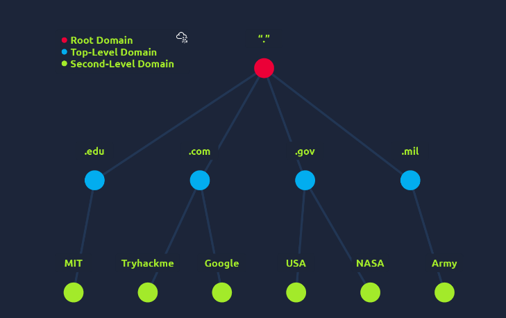

DNS - Domain Name System
- simple way for us to communicate with devices on internet without remembering complex numbers
- every computer has its own unique address to communicate with it called an IP address

What does DNS stand for?
- Domain Name System

Domain Hierarchy

TLD (top-level domain)
- most righthand part of a domain name
- tryhackme.com -> TLD is .com
- two types of TLD

gTLD (generic top level)
ccTLD (country code top level domain)

gTLD
- historically tell the user the domain names purpose
- e.g. .com commericial, .org organisation

ccTLD
- geographical purposes
- e.g. .co.uk for united kingdom

second level domain
- tryhackme.com -> Second-Level domain is tryhackme
- limited to 63 characters
- can only use a-z 0-9 and hyphens 
- cannot start or end with hyphens
- cannot have consecutive hyphens

subdomain
- sits on the left-hand side of the second level domain
- admin.tryhackme.com -> subdomain is admin
- same creation restrictions as second level domain
- you can use multiple subdomains split with . to create longer names
- e.g. jupiter.servers.tryhackme.com
- length must be kept to 253 chars or less
- no limit to how many subdomains you can create for your domain name

What is the maximum length of a subdomain?
- 63

Which of the following characters cannot be used in a subdomain ( 3 b _ - )?
- _

What is the maximum length of a domain name?
- 253

What type of TLD is .co.uk?
- ccTLD

DNS record types

A record
- resolve to IPv4 addresses
- e.g. 104.26.10.229

AAAA record
- resolve to IPv6 addresses
- e.g. 2606:4700:20::681a:be5

MX record
- resolve to the address of the servers that handle the email for the domain you are querying
- e.g. MX record response for tryhackme.com -> alt1.aspmx.l.google.com
- these records come with a priority flag -> tells client in which order to try the servers
- perfect for if the main server goes down and email needs to be sent to a backup server

TXT record
- free text fields 
- any text-based data can be stored
- multiple uses
- common one can be to list servers that have the auth to send an email on behalf of the domain (helps against spam and spoofed email)
- can be used to verify ownership of the domain name when signing up for 3rd party services

What type of record would be used to advise where to send email?
- MX

What type of record handles IPv6 addresses?
- AAAA

Making a Request

What happens when you make a DNS request?
1. computer first checks local cache to see if you've previously looked up the address recently
   if not a request to your recursive DNS server will be made

2. a recursive DNS server is usually provided by your ISP, can also be your own.
   server also has a local cache of recently looked up domain names.
   if a result is found locally, this is sent back to your computer and req ends here (common for popular and heavily req services like google)
   if not found locally, journey begins to find the correct answer
   starting with ther internet's root DNS server

3. the root servers act as the DNS backbone of the internet
   their job is to redirect you to the correct Top Level domain server, depending on your req
   if you req www.tryhackme.com -> root server will recognise the TLD of .com and refer you to the corrrect TLD server that deals with .com addr

4. the TLD server holds records for where to find the authoritative server to answer the DNS req
   authoritative server also known as the nameserver for the domain
   e.g. the name server for tryhackme.com is kip.ns.cloudflare.com and uma.ns.cloudflare.com
   you will often find multiple nameservers for a domain name to act as a backup in case one goes down

5. an authoritative DNS server is the server that is responsible for storing tthe DNS records for a particular domain name
   and where any updates to your domain name DNS records would be made
   depending on the record type, the DNS record is then sent back to the recursive DNS server
   where a local copy will be cached for future reqs then relayed back to the original client that made the req
   DNS records all come with a TTL (time to live) vakue.
   this value is a number represented  in seconds that the response should be saved for locally until you have to look it up again
   caching saves on having to make a DNS req every time you communicate with a server

What field specifies how long a DNS record should be cached for?
- TTL

What type of DNS Server is usually provided by your ISP?
- recursive

What type of server holds all the records for a domain?
- authoritative

DNS Type
nslookup website.thm

A
nslookup --type=A website.thm

CNAME
nslookup --type=CNAME website.thm

MX
nslookup --type=MX website.thm

TXT
nslookup --type=TXT website.thm

What is the CNAME of shop.website.thm?
- shops.myshopify.com

What is the value of the TXT record of website.thm?
- THM{7012BBA60997F35A9516C2E16D2944FF}

What is the numerical priority value for the MX record?
- 30

What is the IP address for the A record of www.website.thm?
- 10.10.10.10