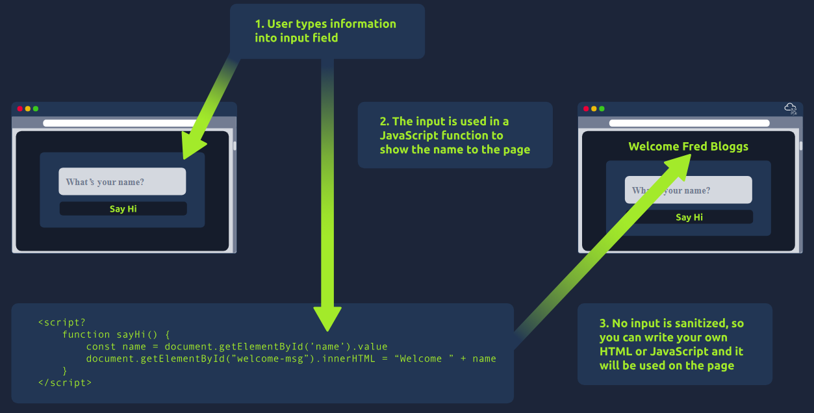

- when you visit a website, your browser makes a request to a web server asking for info about the page youre visiting
- it will respond with data that your browser uses to show you the page
- a web server is just a dedicated computer somewhere else in the world that handles your requests

- there are 2 major components that make up a website
1. Fornt End (Client-Side) - the way your browser renders a website
2. Back End (Server-Side) - a server that processes your request and returns a response

- many othere processes involved in your browser making a request to a web server
- just need to understand that you make a req to a server, it responds with data your browser uses to render information to you

What term best describes the component of a web application rendered by your browser?
- Front End

HTML
- websites are primarly created using
- html - to build websites and define their structure
- css - to make websites look pretty by adding styling options
- javascript - implement complex features on pages using interactivity

HyperText Markup Language (HTML)
- language websites are written in
- elements known as tags are the building blocks of HTML pages -> tells browser how to display content

- `<!DOCTYPE html>` defines that the page is a HTML5 document, this helps with standardisation across different browsers and tells the browser to use HTML5 to interpret the page
- `<html>` element is the root element of the HTML page - all other elements come after this element
- `<head>` element contains information about the page such as the title
- `<body>` element defines the HTML documents body -> only content inside is shown in the browser
- `<h1>` defines a large heading
- `
` defines a paragprah
- many other elements used for diff purposes
- elements (tags) cam contain attributes such as the class attribute which can be used to style an element
- or the src attribute which is used on images to specify the location of an imaage
- an element can have multiple attributes each with iths own purpose
- elements can also have an id attribute which is unique to the element
- unlike the class attribute, where multiple elements can use the same class
- an element must have different id's to identify them uniquely
- element ids are used for styling and to identify it by javascript

One of the images on the cat website is broken - fix it, and the image will reveal the hidden text answer!
- HTMLHERO

Add a dog image to the page by adding another img tag (``) on line 11. The dog image location is img/dog-1.png. What is the text in the dog image?
- DOGHTML

JavaScript
- is one of the most popular coding languages in the world and allows pages to become interactive
- html is used to create the website structure and content
- js is used to control the functionality of web pages
- without js a page would not have interactive elements and would always be static
- js can dynamically update the page in real time
- giving functionality to change the style of a button when a particular even on the page occurs, or display moving animations
- js is added within the page source code and can either be loaded within ``
- the following js finds a HTML element on the page with id of "demo" and changes the content to "Hack the Planet"
- : document.getElementById("demo").innerHTML = "Hack the Planet";
- HTML elements can also have events such as onclick or onhover that execute js when the even occurs
- the following code changes the text of the lement with the demo id to button clicked
-  `<button onclick='document.getElementById("demo").innerHTML = "Button Clicked";'>Click Me!</button>`
- onclick events can also be defined inside the js script tags, and not on elements directly

Click the "View Site" button on this task. On the right-hand side, add JavaScript that changes the demo element's content to "Hack the Planet"
- JSISFUN

Sensitive Data Exposure
- occurs when a website doesn't properly protect (or remove) senstiive clear-text information to the end-user -> typically found in frontend source code
- dev may have forgotten to remove login credentials, hidden links to private parts of the web or other sensitive data shown in HTML or js
- sensitive info can be potentially leveraged to further an attackes access within different parts of a web application
- e.g. HTML comments with a temp login credntials, if you view page source coude you could find this and use it to login slesewhere on the application (or worse used to access other backend components of the site)
- whenever assessing a web application for security issues, one of the first things you should do is review the page source code to see if you can find any exposed login credntials or hidden links.

HTML injection
- vulnerability that occurs when unfiltered user inpout is displayed on the page
- if a website fails to sanitise user input (filter any malicious text that a user inputs into a website) and that input is used on the page an attacker can inject HTML code into a vulnerable website
- input sanitisation is very important in keeping a website secure -> as info a user inputs into a website is often found in other frontend and backend functionality
- a vuln explored later is database injection, where you can manipulate a database lookup query to login as another user by controlling the input that's directly used in the query
- html injection (client-side)
- when a user has control of how their input is displayed, they can submit HTML or js code and the browser will use it on the page -> allowing the user to control ithe pages appearence and functionality
- general rule is to never trust user input
- to prevent malicious input the web dev should sanitise everything the user enters before using it in the js function

