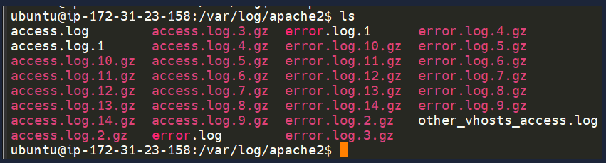

Terminal Text Editors
- few options we can use
- nano, vim

Nano
- easy to get started
- to create or edit a file simple use nano filename
- use the features by pressing the ctrl and then a corresponding letter

Vim
- much more advanced
- customisable
- syntax highlighting
- vim works on all terminals where nano might not be installed

General/Useful Utilities

Downloading files (Wget)
- pretty fundamental feature of computing is the ability to transfer files
- this command allows us to download files from the web via HTTP
- simply need to provide the address of the resource we wish to download
- e.g. if you wanted to download a file name myfile.txt assuming you know the web addr
- wget https://assets.tryhackme.com/additional/linux-fundamentals/part3/myfile.txt

Transferring Files From Your Host - SCP (SSH)
- secure copy or SSP -> a means of securely copying files
- unlike the regular cp command -> this command allows you to transfer files between 2 computers using the SSH protocol
- provides both auth and encryption
- working on a model of SOURCE and DESTINATION, SCP allows to
- copy files & directories from your current system to a remote system
- copy files & directories from a remote system to your current system

- provided that we know usernames and passwords for a user on your current system and a user on the remote system
- e.g. lets copy an example file from our machine to a remote machine, laid out below

variable -> value
The IP address of the remote system -> 192.168.1.30
User on the remote system -> ubuntu
Name of the file on the local system -> important.txt
Name that we wish to store the file as on the remote system -> transferred.txt

- scp important.txt ubuntu@192.168.1.30:/home/ubuntu/transferred.txt

- lets now reverse this and layout syntax for using scp to copy a file from a remote computer that we're not logged into

variable -> value
IP address of the remote system -> 192.168.1.30
User on the remote system -> ubuntu
Name of the file on the remote system -> documents.txt
Name that we wish to store the file as on our system -> notes.txt
- scp ubuntu@192.168.1.30:/home/ubuntu/documents.txt notes.txt

Serving Files From Your Host - WEB
- ubuntu machines come pre-packaged with python3
- python helpfully provides a lightweight and easy-to use module called "HTTPServer"
- this module turns your computer into a quick and easy web server that you can use to serve your own files
- where they can be downloaded by another computer using commands such as curl and wget

- python3s HTTPServer will serve the files in the directory where you run the command
- this can be changed by providing options that can be found within the manual pages
- simply run python3 -m http.server in the terminal to start the module
- e.g. serving from a directory called webserver
- tryhackme@linux3:/webserver# python3 -m http.server
- Serving HTTP on 0.0.0.0 port 8000 (http://0.0.0.0:8000/) ...

- now lets use wget to download the file using thr 10.81.129.142 addr and the name of the file
- remember because python3 server is running on port 8000 you need to specify this within your weget command

- tryhackme@mymachine:~# wget http://10.81.129.142:8000/myfile

- note that you will need to open a new terminal to use wget and leave the one that you have started the python3 web server in
- this is because once you start the python3 web server it will run in that terminal until you cancel it

- one flaw with this module is that you have no way of indexing
- so you must know the exact name and location of the file you wish to use 
- updog is a more advanced yet lightweight web server

Processes 101
- processes are programs that are running on your machine
- they are managed by the kernel
- where each process will have an ID associated with it -> known as its PID
- the PID increments for the order in which the process started e.g. the 60th process will have a PID of 60

Viewing Processes
- we can use the friendly ps command to provide a list of the running processes as our user's session
- and some additional information such as its status code
- the session that is running it
- how much usage time of the CPU its using
- the name of the actual program or command that is being executed

- to see the processes run by other users and those that don't run from a session (e.g. system processes)
- we need to provide aux to the ps command -> ps aux

- another very useful command is the top command
- top gives you real-time statistics about the processes running on your system instead of a one time view
- these statistics will refresh evvery 10 seconds 
- will also refresh when you use the arrow keys to browse the various rows
- another great command to gain insight into your system is via the top command

Managing Processes
- you can send signals that terminate processes
- these are a variety of types of signals that correlate to exactly how "cleanly" the process is dealt with by the kernel
- to kill a command we can use the appropriately named kill command
- and the associated PID that we wish to kill
- e.g. to kill PID 1337 -> kill 1337
- below are some signals that we can send to a process when it is killed
- SIGTERM -> kill the porcess, but allow it to do some cleanup tasks beforehand
- SIGKILL -> kill the process, doesnt do any cleanup after the fact
- SIGSTOP -> stop/suspend a process

How do processes start?
- lets start by talking about namespaces
- the os uses namespaces to ultimately split up the resources available on the computer to (such as CPU, RAM and priority) proceses
- think of it as splitting up your computer into slices - similar to cake
- processes within that slice will have access to certain amount of computing power
- however it will be a small portion of what is actually available to every process overall

- namespaces are great for security as it is a way of isolating processes from another -> only those that are in the same namepsace will be able to see each other

- we previously mentioned about how PID works, and this is how it comes into play
- the process with an ID of 0 is a process that is started when the system boots
- this process is the systems init on ubuntu such as systemd which is used to provide a way of managing a user's processes and sits in between the os and the user
- e.g. once a system boots and initialises, systemd is one of the first processes that started
- any program or piece of software that we want to start owill start as what's known as a child process of systemd
- this means that it is controlled by systemd but will run as its own process (although sharing resources from systemd)
- making it easier for us to identify and the likes

Getting Processes/Services to Start on Boot
- some applications can be started on the boot of the system that we own
- e.g. web servers, database servers, or file transfer servers
- this software is often critical and is often told to start during the boot-up of the system by administrators

- in this example we are going to be telling the apache web servers to be starting apache manually and then telling the system to launch apache2 on boot

- enter the usew of systemctl -> this command allows us to interact with the systemd process/daemon
- continuing with the example systemctl is an easy to use command that takes the following formatting
- systemctl [option] [service]

- e.g. to tell apache to start up, well use systemctl start apache2
- seems simple enough right? same if we wanted to stop apache
- we'd replace [option] with stop

- we can do 4 options with systemctl
- start
- stop
- enable
- disable

An Introduction to Backgrounding & Foregrounding in Linux
- processes can run in 2 states
- in the background and in the foreground
- command that you run in your terminal such as echo or things of that sort will run in the foreground of your terminal as its the only command providede that hasnt been told to run in the background
- echo is a great example as the output of echo will return to you in the foreground but wouldnt in the background

- root@linux3:~# echo "Hi THM"
- Hi THM
- root@linux3:~# echo "Hi THM" &
- [1] 16889
- root@linux3:~# Hi THM

- here we are running echo "Hi THM" where we expect the output to be returned to us like it is at the start
- but after adding the & operator to the command we're instead given the ID ofhte echo process rather than the actual output -- as its running in the background

- this is great for cmds such as copying files because it means we can run the cmd in the background and continue on with whatever further commands we wish to execute (without having to wait for the file copy to finish first)

- we can do the exact same thing when executing things like scripts
- rather than relying on the & operator we can use ctrl + z on our keyboard to background a process
- it is also an effective way of pausing the execution of a script or command like in the example bleow:
- This will keep on looping until I stop it!
- This will keep on looping until I stop it!
- This will keep on looping until I stop it!
- This will keep on looping until I stop it!
- This will keep on looping until I stop it!
- T^Z
- [1]+ Stopped ./background.sh
- root@linux3:/var/opt# 

- this script will keep on repeating "This will keep on looping until I stop it!" until i stop or suspend the process
- by pressing ctrl + z (indicated by T^Z) 
- now our terminal is no longer filled up with messages -- until we foreground it

Foregrounding a process
- now that we have a process running in the background e.g. our script background.sh which can be confirmed using the ps aux command
- we can back-pedal and bring the process back to the foreground to interact with
- with our process backgrounded by using either ctrl + z or & operator we can use fg to bring this back into focus
- root@linux3:/var/opt# fg
- This will keep on looping until I stop it!
- This will keep on looping until I stop it!
- This will keep on looping until I stop it!
- This will keep on looping until I stop it!
- This will keep on looping until I stop it!

If we were to launch a process where the previous ID was "300", what would the ID of this new process be?
- 301

If we wanted to cleanly kill a process, what signal would we send it?
- SIGTERM

Locate the process that is running on the deployed instance (MACHINE_IP). What flag is given?
- THM{PROCESSES}

What command would we use to stop the service "myservice"?
- systemctl stop myservice

What command would we use to start the same service on the boot-up of the system?
- systemctl enable myservice

What command would we use to bring a previously backgrounded process back to the foreground?
- fg

Maintaining Your System: Automation
- users may want to schedule a certain action or task to take place after system has booted
- e.g. running commands, backing up files, launching favourite programs
- cron process, but more specifically how we can interact with it via the use of crontabs
- crontab is one of the processes that is started during boot which is responsible for facilitating and managing cron jobs
- a crontab is simply a special file with formatatting recognised by the cron process to execute each line step-by-step
- crontab requires 6 specific values

value -> description
MIN -> what minute to execute at
HOUR -> what hour to execute at
DOM -> what day of the month to execute at
MON -> what month of the year to execute at
DOW -> what day of the week to execute at
CMD -> the actual command that will be executed

- let's use the example of bnacking up files
- you may wish to backup "cmnatic's" "documents" every 12 hours:
- 0 */12 * * * cp -R /home/cmnatic/Documents /var/backups/

- an interesting feature of crontabs is that they support the wildcard * 
- if we do not wish to provide a value for that specific field e.g. we dont care what month, day or year it is executed
- only that it is executed every 12 hours we simply place a *

- this can be confusing to begin with
- contrabs can be edited by using crontab -e where you can seelect an editor to edit your crontab

When will the crontab on the deployed instance (MACHINE_IP) run?
- @reboot

Maintaining Your System: Package Management

Introducing Packages & Software Repos
- when devs wish to submit software to the community they will submit it to an "apt" repo
- if approvied their programs and tools will be released into the wild
- two of the most redeeming features of linux shine to light here:
- user accessibility 
- merit of open source tools

- when using ls command on a Ubuntu 20.04 linux machine these files serve as the gateway/registry
- ubuntu@ip-10-10-29-121:/etc/apt$ ls
- apt.conf.d auth.conf.d preferences.d sources.list sources.list.d trusted.gpg.d

- whilst os vendors will maintain their own repositories you can also add community repos to your list
- allows you to extend the capabilities of your os
- additional repos can be added by using the add-apt-repository command or by listing another provider
- some vendors will have a repo that is closer to their geographical location

Managing Your Repositories (Adding & Removing)
- normally we use the apt command to install software onto our Ubuntu system
- apt command is part opf the package managment software also named apt
- apt contains a whole suite of tools that allows us to manage packages and sources to our software and to install software at the same time

- one method of adding repos is to use the add-apt-repository command 
- we will walk through adding and removing a repo manuall
- whilst you can install software through the use of package installers such as dpkg the benefits of apt means that whenever we update our system
- the repo that contains the piece of software that we add also gets checked for updates

- in this example we will add the text editor Sublime Text to our Ubuntu machine as a repo as its not part of the default ubuntu repos
- when adding the software, the integrity of what we download is guaranteeed by the use of what is called GPG (Gnu Privacy Guard) keys
- these keys are essentially a safety check from the devs saying "heres our software" 
- if the keys do not match up to what your system trusts and what the devs used then the software will not be downloaded

- so to start we need to add the GPG key for the devs of Sublime Text 3

1. let's download the GPG key and use apt-key to trust it -> wget -qO - https://download.sublimetext.com/sublimehq-pub.gpg | sudo apt-key add -
2. now that we have added this key to our trusted list, we can now add Sublime Text 3s repo to our apt sources list. 
   a good practice is to have a sperate file for every different community/3rd party repo that we add
2.1 lets create a file named sublime-text.list in /etc/apt/sources.list.d and enter the repo info like so:
    root@linux3:/etc/apt/sources.list.d# touch sublime-text.list
    root@linux3:/etc/apt/sources.list.d# ls
    sublime-text.list
    root@linux3:/etc/apt/sources.list.d#

2.2 and now use nano or a text editor of your choice to add & save the Sublime Text 3 repo into the newly created file
    deb https://download.sublimetext.com/ apt/stable/

2.3 after we have added this entry we need to update apt to recognise this new entry -- this is done using the apt update cmd

2.4 once successfully updated, we can now. This process is done by using the add-apt-repository --remove ppa:PPA_NAME/ppa command or by manually deleting the file that we previously added to. Once removed we can just use apt remove [software-name-here] e.g. apt remove sublime-text

Maintaining Your System: Logs
- we briefly touched upon log files before and where they can be found
- located in the /var/log direcotry 
- these files and folders contain logging information for applications and services running on your system
- the os has become pretty good at automatically managing these logs in a process that is known as "rotating"

- the image above highlights some logs from three services running on a Ubuntu machine
- an apache2 web server
- logs for the fail2ban service which is used to monitor attempted brute forces for example
- the UFW service which is used as a firewall

- these services and lots are a great way in monitoring the health of your system and protecting it
- not only that but lots for services such as a web server containing info about every single request
- allowing devs or admins to diagnose performance issues or investigate an intruder's activity
- e.g. the two types of log files below that are of interest
- access log & error log

- these are of course logs that store information about how the os is running itself and actions that are performed by users, such as auth attempts

What is the IP address of the user who visited the site?
- 10.9.232.111

What file did they access?
- catsanddogs.jpg