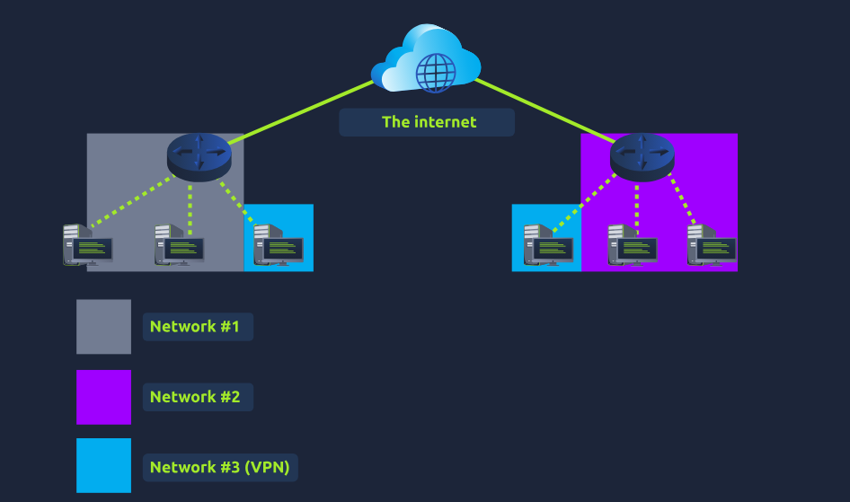

Port Forwarding
- essential component in connecting applications and services to the internet
- without port forwarding applications and services such as web servers are only available to devices within the same direct network
- easy to confuse with firewall behaviours
- configured at the router of a network

Firewalls 101
- a device within a network responsible for determining what traffic is allowed to enter and exit
- think of it as border security for a network
- admin can configure a firewall to permit or deny traffic from entering or exiting a network based on numerous factors:

- where the traffic is coming from? (has the firewall been told to accept/deny traffic from a specific network)
- where is the traffic going to? (has the firewall been told to accept/deny traffic destined for a specific network)
- what port is the traffic for? (has the firewall been told to accept/deny traffic destined for port 80 only)
- what protocol is the traffic using? (has the firewall been told to accept/deny traffic this is UDP, TCP or both)

- firewalls perform packet inspection to determine the answers to these questions
- come in all shapes and sizes
- dedicated pieces of hadware
- software such as SNORT

- can be categorised into 2 to 5 categories

Primary Categories

Stateful - uses the entire information from a connection -> rather than inspecting an individual packet -> determines the behaviour of a device based upon the entire connection
            consumes many resources in comparison to stateless firewalls as the decision making is dynamic e.g. a firewall could allow the first parts of a TCP handshake that would later fail.
            if a connection from a host is bad it will block the entire device

Stateless - uses a static set of rules to determine whether or not individual packets are acceptable or not e.g. a device sending a bad packet will not necessarily mean that the entire
            device is then blocked
            whilst these firewalls use much fewer resources than alternatives, they are much dumber e.g. these firewalls are only effective as the rues that are defined within them, if a rule is not exactly matched it is effectively useless
            these firewalls are great when receiving large amounts of traffic from a set of hosts (such as a Distributed Denial-of-Service attack)

What layers of the OSI model do firewalls operate at?
For this answer, just provide the numbers in ascending order, separated by an ampersand (&) I.e: 4 & 5
- 3 & 4

What category of firewall inspects the entire connection?
- stateful

What category of firewall inspects individual packets?
- stateless

VPN Basics
- VPN (Virutal Private Network)
- a technology that allows devices on seperate networks to communicate securely by creating a dedicated path between each other over the internet (known as a tunnel) 
- devices connected within this tunnel form their own private network

- e.g. only devices within a same network can directly communicate
- however a VPN allows two offices to be connected

Benefit -> Description
Allows networks in a different geographical locations to be connected -> e.g. a business with multiple offices will find VPNs beneficial as it means that resources like servers/infrastructure can be accessed from another office

Offers Privacy -> VPN tech uses encryption to protect data, meaning that it can only be understood between the devices it was being sent from and is destined for, meaning the data isn't vulnerable to sniffing. This encryption is useful in places with public WiFI where no encryption is provided by the network. You can use a VPN to protect your traffic from being viewed by other people.

Offers anonymity -> journalists/activists depend on VPNs to safely report on global issues in countries where freedom of speech is controlled. Usually your traffic can be viewed by your IPS and other intermediaries and, therefore, tracked. The level of anonymity a VPN provides is only as much as how other devices on the network respect privacy. e.g. a VPN that logs all your data/hisotry is essentially the same as not using a VPN in this regard.

- VPN tech has improved over the years

VPN Technology -> Description

PPP -> used by PPTP to allow for authentication and provide encryption of data. VPNs work by using a private key and public certificate (similar to SSH). a private key & cert must match for you to connect. this tech is not capable of leaving a network by itself (non-routable)

PPTP - Point-to-Point Tunneling Protocol, tech that allows the data from PPP to travel and leave a network. very easy to setup and is support by most devices, it is, however, weakly ecnryoted in comparison to alternatives.

IPSec - Internet Protocl Security (IPSec) encrypts data using the existying IP framework. difficult to setup in comparison to alternatives, however, if successful it boasts strong encryption and is also supported on many devices.

What VPN technology only encrypts & provides the authentication of data?
- PPP

What VPN technology uses the IP framework?
- IPSec

LAN Networking Devices

What is a router?
- routers job to connect networks and pass data between them
- does it by routing
- routing is the label given to the process of data travelling across networks
- involves creating a new path between networks so that this data can be successfuly delivered
- operate at layer 3 in the OSI model 
- often feature an interactive interface (such as website/console) that allows an administrator to configure various rules such as port forwarding or firewalling
- usesful when devices are connected by many paths, where the optimal path is taken
- routers are dedicated devicves and do not perform the same functions as switches
- different protocls decide which path should be taken.. factors:
- what path is the shortest?
- what path is the most reliable?
- what path ahas the faster medium? (e.g. copper or fibre)

What is a switch?
- dedicated networking device responsible for providing a means of connecting to multiple devices
- can facilitate many devices (from 3 to 62) using ethernet cables
- can operate at both layer 2 and layer 3 of the osi model
- these are exclusive in a sense that layer 2 switches can not operate at layer 3

- a layer 2 switch in this diagram will forward frames (remember that the origianl IP packets are encapsulated within frames) onto the connected devices using their MAC addr

- these switches are solely responsible for sending frames to the correct device

- a layer 3 switch is more sophisticated
- they can perform some of the responsibilites of a router
- namely these switches will send frames to devices (as layer 2 does) and route packets to other devices using the IP protocol

- the diagram below is a layer 3 switch in action
- 2 IP addresses -> 192.168.1.1 & 192.168.2.1

- a technology called VLAN (Virtual Local Area Network) allows specific devices within a network to virtually be split up
- this split means that they can all benefit from things such as an internet connection but are treated seperately
- the seperation provides security because it means that rules in place determine how specific devices communicate with each other
- in the context of the diagram, sales dep and accounting dep will be able to access the internet but not be able to communicate with eacher other despite being connected to the same switch

What is the verb for the action that a router does?
- routing

What are the two different layers of switches? Separate these by a comma I.e.: Layer X,Layer Y
- Layer 2, Layer 3

What is the flag from the network simulator?
- THM{YOU'VE_GOT_DATA}

How many HANDSHAKE entries are there in the Network Log?
- 5