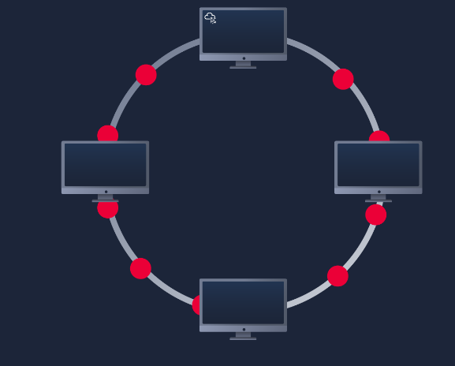
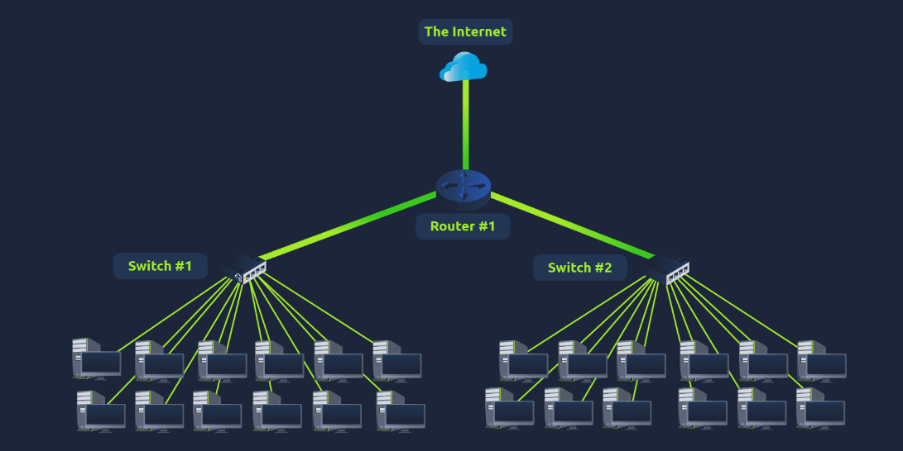

LAN (Local area network) topologies
- topology -> refers to the design or look of the network at hand

Star topology
- devices are individually connected via a central networking device such as a switch or hub
- commonly found today because of reliability and scale - despite cost
- any info sent to a device in this topology is sent via the central device to which it connects
- more cabling + purchase of dedicaed networking equipment = more expensive
- more scalable in nature, very easy to add more devices as the demand for the network increases
- more the network scales = more maintenance required
- increased dependance on maintenance can make troubleshooting harder
- still prone to failure -> if centralised hardware that connects devices fails -> devices can no longer send or receive data
- often robust

Bus topology
- relies upon a single connection known as a backbone cable
- all data destined for each device travels along the same cable
- meaning it can quickly become slow and bottlenecked if devices within the topology are simultaneoulsy requesting data
- bottleneck = very difficult troubleshooting because difficult to identify which device is experiencing issues -> data travelling along the same route
- one of the easier and more cost-efficient topologies 
- little redundancy in place in case of failures -> single point of failure along the backbone cable
- if that cable were to break -> devices can no longer receive or transmit data along the bus

Ring topology
- also known as token topology
- devices are connected directly to each other to forma  loop -> less cabling and less dependance on dedicated hardware
- works by sending data across the loop until it reaches the destined device, using other devices along the loop to forward the data
- a device will only send received data from another device in this topology if it doesnt not have anything to send itself
- if the device has data to send, it will send its own first before sending data from another device
- only one direction for data to ravel across this topology -> fairly easy to troubleshoot
- not an efficient way of data travelling across a network -> may have to visit multiple devices before reaching intended device
- less prone to bottlenecks -> large amounts of traffic are not travelling across the network at any one time
- a fault such as a cable cut or broken device -> entire network breaks

What is a switch?
- dedicated devices within a network that are designed to aggregate multiple other devices (computers, printers, any other networking-capable device using ethernet)
- various devices plug into a swtich's port 
- usually found in larger networks such as businesses -> where many devices to connect to the network
- can connect a large number of devices by having ports of 4, 8, 16, 24, 32 & 64 for devices to plug into
- much more efficient than their lesser counterpart(hubs/repeaters)
- keep track of what device is connected to which port -> when they receive a packet instead of reapting the packet to every port like a hub -> just sends it to intended target -> reducing network traffic
- both switches and routers can be connected to one another -> increases the redundancy (the reliability) of a network by adding multiple paths for data to take
- if one path goes down -> another can be used
- whilst this may reduce overall performance of a network because packets have to take longer to travel -> there is no downtime

What is a router?
- router's job to connect networks and pass data between them
- done using routing
- routing -> process of data travelling across netowkrs
- routing involves creating a path between networks so that this data can be successfuly delivered
- usesful when devices are connected by many paths

What does LAN stand for?
- Local Area Network

What is the verb given to the job that Routers perform?
- Routing

What device is used to centrally connect multiple devices on the local network and transmit data to the correct location?
- Switch

What topology is cost-efficient to set up?
- Bus Topology

What topology is expensive to set up and maintain?
- Star Topology

Complete the interactive lab attached to this task. What is the flag given at the end?
- THM{TOPOLOGY_FLAWS}

Primer on subnetting
- term given to splitting up a network into smaller, miniature networks within itself
- "There's only a certain amount of cake to go around, but everybody wants a piece. Subnetting is you deciding who gets what slice & reserving such a slice of this metaphorical cake."
- network admins use subnetting to categorise and assign specific parts of a network
- achieved by splitting up the number of hosts that can fit within the network -> represented by a number called a subnet mask
- as we recall an IP is made of four octets -> same goes for a subnet mask which is also represented as a number of 4 bytes (32 bits) 0-255
- subnets use ip addresses in 3 different ways:
1. identify the network address
2. identify the host address
3. identify the default gateway

Network address
Purpose - identifies the start of the actual network and is used to identify a network's existence
Explanation - e.g. a device with the IP 192.168.1.1 will be on the network identified by 192.168.1.0
Example - 192.168.1.0

Host address
Purpose - an IP address here is used to identify a device on the subnet
Explanation - e.g. a device will have the network address of 192.168.1.1
Example: 192.168.1.100

Default Gateway
Purpose - a special address assigned to a device on the network that is capable of sending info to another network
Explanation - any data that needs to go to a device no on the same netwwork (e.g. no on 192.168.1.0) will be sent to this device
              these devices can use any host address but usually use either the first or last host addr in a network (.1 or .254)
Example - 192.168.1.254

- in small networks such as at home -> you will likely be on one subnet as its unlikely you will need more than 254 devices connected at one time
- places such as businesses will often have much more devices where subnetting takes place

- subnetting provides a range of benefits including -> efficiency, security, full control

Typical example:

cafe on the street likely has 2 networks
1. one for employees, cash registers, other devices for the facility
2. one for the general public to use as a hotspot

- subnetting allows you to create these two use cases from each other whilst having the benefits of a connection to larger networks such as the internet

What is the technical term for dividing a network up into smaller pieces?
- Subnetting

How many bits are in a subnet mask?
- 32

What is the range of a section (octet) of a subnet mask?
- 0-255

What address is used to identify the start of a network?
- Network Address

What address is used to identify devices within a network?
- Host Address

What is the name used to identify the device responsible for sending data to another network?
- Default Gateway

ARP (address resolution protocol)
- devices can  have 2 identifiers a MAC addr and an IP addr
- ARP is the technology that is responsible for allowing devices to identify themselves on a network
- ARP -> allows a device to associate its MAC addr with an IP addr on the network
- each device on a network will keep a log of the MAC addr associated with other devices
- when devices wish to communicate with each other -> they will send a broadcast to the entire networking searching for a specific device
- devices can use ARP to find the MAC addr (and therefore the physical identifier) of a device for communication

How does ARP work?
- each device within a network has a ledger to store information on -> called a cahce
- in context of ARP this cache stores the identifiers of other devices on the network
- in order to map theses 2 identifiers (IP & MAC addr) together ARP sends 2 types of messages
1. ARP Request
2. ARP Reply
- when an ARP Request is sent -> message is broadcast on the network to other devices saying "what is the MAC addr that owns this IP addr"
- when the other devices receive that message -> only respond if they own that IP addr and will send an ARP Reply with its MAC addr
- the requesting device can now remember this mapping and store it in its ARP Cache for future use

What does ARP stand for?
- Address Resolution Protocol

What category of ARP Packet asks a device whether or not it has a specific IP address?
- Request

What address is used as a physical identifier for a device on a network?
- MAC address

What address is used as a logical identifier for a device on a network?
- IP address

DHCP (Dynamic Host Configuration Protocol)
- IP addr can be assigned either manually (by entering them physically into a device)
- or they can be stored automatically and most commonly by using a DHCP
- when a device connects to a network -> if not already manually assigned an IP addr -> sends out a request (DHCP Discover) to see if any DHCP servers are on the network
- DHCP server then replies back with an IP addr the device could use (DHCP Offer)
- device then sends a reply confirming it wants the offered IP addr (DHCP Request)
- lastly the DHCP server sends a reply acknowledging this has been completed -> device can start using the IP addr (DHCP ACK)

What type of DHCP packet is used by a device to retrieve an IP address?
- DHCP Discover

What type of DHCP packet does a device send once it has been offered an IP address by the DHCP server?
- DHCP Request

Finally, what is the last DHCP packet that is sent to a device from a DHCP server?
- DHCP ACK