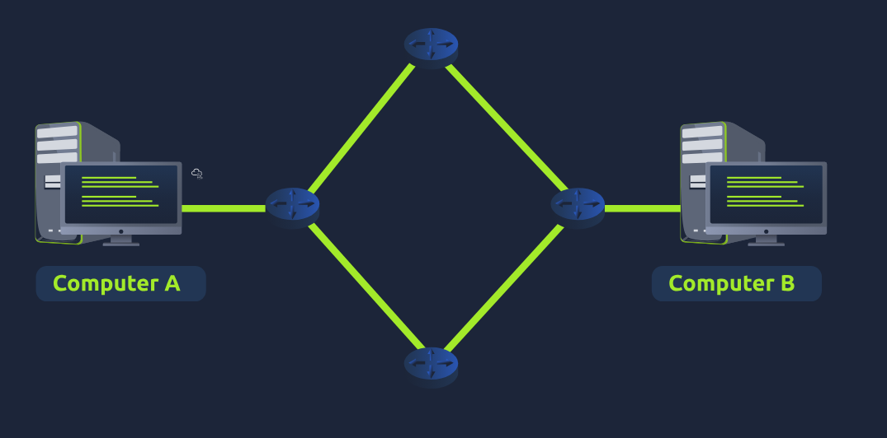
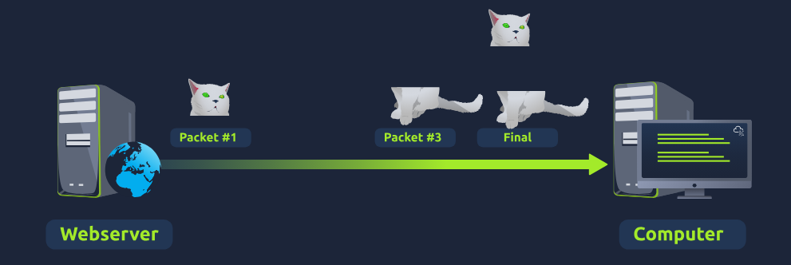

OSI Model (Open Systems Interconnection Model)
- essential model used in networking
- provides a framework dictating how all networked devices will send, receive and interpret data
- main benefits of the OSI model is that devices can have different functrions and designs on a network while commuinicating with other devices
- data sent across a networks that follows the uniformity of the model can be understood by other devices 

7. Application
6. Presentation
5. Session
4. Transport
3. Network
2. Data link
1. Physical

- at every layer the data travels through specific processes take place and pieces of info are added to this data. -> process is called ENCAPSULATION

What does the "OSI" in "OSI Model" stand for?
- Open Systems Interconnection

How many layers (in digits) does the OSI model have?
- 7

What is the key term for when pieces of information get added to data?
- encapsulation

Layer 1 - Physical
- references the physical components of the hardware used in networking
- lowest layer you will find
- devices use electrical signals to transfer data between each other in a binary number system

What is the name of this Layer?
- Physical

What is the name of the numbering system that is both 0's and 1's?
- Binary

What is the name of the cables that are used to connect devices?
- Ethernet Cables

Layer 2 - Data link
- focuses on the physical addressing of the transmission
- receieves a packet from the network layer (including the IP addr for the remote computer)
- adds in the physical MAC addr of the receiving endpoint
- inside every network enabled computer is a NIC (Network Interface Card) which comes with a unique MAC to identify it
- job of layer is to present the data in a format suitable for transmission

What is the name of this Layer?
- Data Link

What is the name of the piece of hardware that all networked devices come with?
- Network Interface Card

Layer 3 - Network
- where magic of routing & re-assembbly of data takes place (from small chunks to the larger chunk)
- routing simply determines the most optimal path in which these chunks of data should be sent
- whilst some protcols here determine what is the "optimal" path the data should take to reach a device -> currently should only know about their existence at this current learning stage
- these protocls include OSPS (Open Shortest Path First) and RIP (Routing Information Protocol)
- the factors that decide what route is taken is decided by:
- what path is the shorted? e.g. has the least amount of devices that the packet needs to travel across
- what path is the most reliable? e.g. have packets been lost on that path before?
- which path has the faster physical connection? e.g. is one path using a copper connection (slower) or a fibre (considerably faster)
- at this layer everything is dealt with via IP addresses 
- devices such as routers capable of delivering packets using IP addr are known as Layer 3 Devices - because they can work in this 3rd layer

What is the name of this Layer?
- Network

Will packets take the most optimal route across a network? (Y/N)
- Y

What does the acronym "OSPF" stand for?
- Open Shortest Path First

What does the acronym "RIP" stand for?
- Routing Information Protocol

What type of addresses are dealt with at this layer?
- IP Addresses

Layer 4 - Transport
- plays a vital part in transmitting data across a network and can be a bit difficult to grasp
- when data is sent between devices it follows on of two different protocls which are decided on different factors
- TCP & UDP

TCP (Transmission Control Protocol)
- designed with reliability and guarantee in mind
- reserves a constant connection between the 2 devices for the amount of time it takes for the data to be sent and received
- incorporates error checking into its desing -> how TCP can guarantee that data sent from the small chunks in the session layer (5) has then been received and reassembled in the same order

Advantages
- guarantees the accuary of data
- capable of synchronising 2 devices to prevent each other from being flooded with data
- performs a lot more processes for reliability

Disadvantages
- requires a reliable connection between the 2 devices, if one small chunk of data is not received then the whole entire chunk of data cannot be used
- a slow connection can bottleneck another device as the connection will be reserved on the receiving computer the whole time
- TCP is significantly slower than UDP because more work has to be done by the devices using this protocol

- TCP is used for situations such as -> file sharing, internet browsing or sending an email
- this usage is because these services require the data to be accurate and complete

UDP (User Datagram Protocol)
- not nearly as advanced as TCP
- doesnt have error checking and reliability
- any data that gets sent via UDP is sent to the computer whether it gets there or not
- no synchronisation between the 2 devices or guarantee -> hopes for the best

Advantages
- UDP is much faster than TCP
- UDP leaves the application layer (user software) decide if there is any control over how quickly the packets are sent
- UDP does not reserve a continuous connection on a device as TCP does

Disadvantages
- does not care if the data is received
- quite flexible to software developers in this sense
- means that unstable connections result in a terrible experience for the user

- UDP is useful in situations where there are small pieces of data being sent
- e.g. protocols used for discovering devices (ARP, DHCP) or larger files such as video streaming (where its okay if some parts of the video are pixelated, pixels are just lost pieces of data)

What is the name of this Layer?
- Transport

What does TCP stand for?
- Transmission Control Protocol

What does UDP stand for?
- User Datagram Protocol

What protocol guarantees the accuracy of data?
- TCP

What protocol doesn't care if data is received or not by the other device?
- UDP

What protocol would an application such as an email client use?
- UDP

What protocol would an application that downloads files use?
- TCP

What protocol would an application that streams video use?
- UDP

Layer 5 - Session
- once data has been correctly transmitted or formatted from the presentation layer (6), the session layer (5) will begin to create and maintain the connection to other computer for which the data is destined.
- when a connection is established, a session is creating
- whilst this connection is active -> so is the session
- responsible for closing the conection if it hasnt been used in a while or if its lost
- session can contain "checkpoints" where if the data is lost -> only the newest pieces of data are required to be sent -> saving bandwidth
- sessions are unique -> meaning that data cannot travel over different sessions -> only acrosss each sesssion instead

What is the name of this layer?
- Session

What is the technical term for when a connection is succesfully established?
- Session

Layer 6 - Presentation
- stanardisation starts to take place
- software developers can develop any software such as an email client differently -> the data still needs to be handled in the same way - no matter how the software works
- acts as a translator for data to and from the application layer (7) 
- receiving computer will also understand data sent to a computer in one format destined for in another format
- e.g. when you send an email -> the other user may have another email client to you -> contents of the email will still need to display the same
- security features such as data encryption (like HTTPS when visiting a secure site) occur at this layer

What is the name of this Layer?
- Presentation

What is the main purpose that this Layer acts as?
- Translator

Layer 7 - Application
- layer in which protocols and rules are in place to determine how the user should interact with data sent or received
- everyday applications such as email clients, browsers, or file browsing software provide a GUI (Graphical User Interface) for users to interact with data sent or received.
- other protocls include DNS (Domain Name System) which is how websites are translated into IP addresses

What is the name of this Layer?
- Application

What is the technical term that is given to the name of the software that users interact with?
- Graphical User Interface