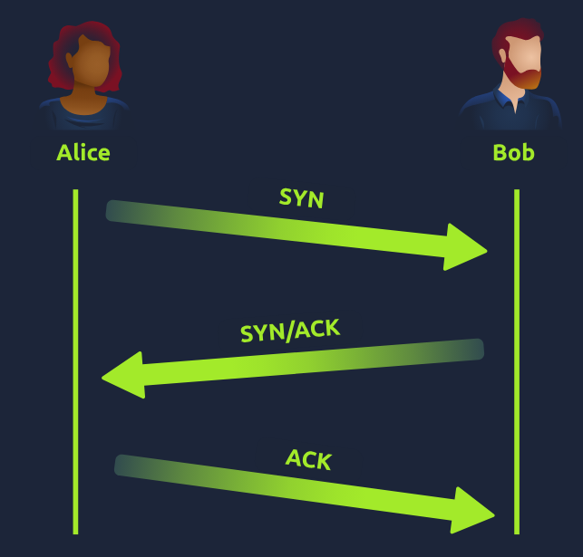
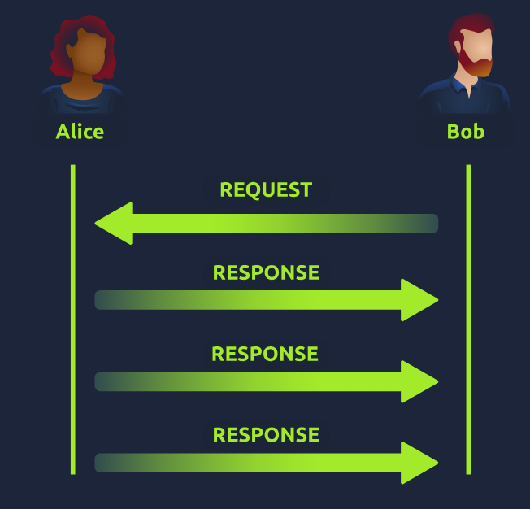

What are packets and frames?
- packets and frames are small pieces of data that,  when forming together, make a larger piece of info or message. 
- they are 2 different things in the OSI model
- a PACKET is a piece of data from Layer 3 (network layer) containing information such as an IP header and payload
- a FRAME however is used at Layer 2 (data link) which encapsulates the packet and adds additional info such as MAC addresses

- you can think of this process as similar to mailing a letter through the post
- envelope is a frame -> used to move the contents (in this analogy, the pakcket) of the envelope to another place
- once the recepient opens the envelope (frame) they will know how to forward the letter (packet) itself

- this process is called encapsulation
- safe to assume that when we are talking about IP addr we are talking about packets
- when the encapsulating information is stripped away we are talking about the frame itself

- packets are an efficient way of communicating data across networked devices 
- because this data is exchanged in small pieces -> less chance of bottlenecking occuring across a network than large messages being sent at once

- packets have different structures that are dependant upon the type of packet that is being sent
- networking is full of standards and protocols that act as a set of rules for how the packet is handled on a device

- with the example of Internet Protocol -> a packet using this protocol will have a set of headers that contain additional pieces of information to the data that is being sent across a network

Notable headers:
Time to Live - this field sets an expiry timer for the packet to not clog up your network if it never manages to reach a host or escape
Checksum - this field provides integrity checking protocols such as TCP/IP. if any data is changed, this value will be different from what was expected and therefore corrup
Source addr - the IP addr of the device that the packet is being sent FROM so that data knows where to RETURN TO
Destination addr - the device's IP addr the packet is being sent to so that data knows where to travel next

What is the name for a piece of data when it does have IP addressing information?
- Packet

What is the name for a piece of data when it does not have IP addressing information?
- Frame

TCP/IP (the three-way handshake)
- TCP (Transmission Control Protocol) is another on e of these rules used in networking
- protocol is very similar to the OSI model previously mentioned
- TCP/IP protocol consists of 4 layers and is arguably a summarised version of the OSI model
- the layers are: Application, Transport, Internet, Network Interface

- very similar to how the OSI model works
- info is added to each layer of the TCP model as the piece of data (or packet) traverses it
- this process is known as encapsulation - where the reverse is decapsulation

- one defining feature of TCP is that it is connection-based -> TCP must establish a connection between both a client and device acting as a server before data is sent
- becuase of this TCP guarantees that any data sent will be received on the other end
- this process is named the three-way handhsake

TCP Advantages
- guarantees the integrity of data
- capable of synchronising 2 devices to prevent each other from being flooded with data in the wrong order
- performs a lot more processes for reliability

TCP Disadvantages
- requires a reliable connection between the 2 devices. If one small chunk of data is not receieved then the entire chunk of data cannot be used and must be re-sent
- a slow connection can bottleneck another device as the connection will be reserved on the other device the whole time
- TCP is significantly slower than UDP befcause more work (computing) has to be done by the devices using this protocol

- TCP packets contain various sections of info known as headers that are added from encapsulation

Headers
Source Port - the value is the port opened by the sender to send the TCP packet from. Value is chosen randomly (out of the ports from 0 - 65535 that arent already in use at the time)
Destination Port - the value is the port number that an application or service is running on the remote host (the one receiving the data) e.g. a webserver running on port 80, this value is not chosen at random
Source IP - the IP addr of the device that is sending the packet
Destination IP - the IP addr of the device that the packet is destined for
Sequence Number - when a connection occurs -> the first piece of data transmitted is given a random number
Acknowledgement Number - after a piece of data has been given a sequence number, the number for the next piece of data will have the sequence number + 1
Checksum - this value is what gives TCP integrity. a mathematical calculation is made where the output is remembered -> when the receiving device performs the mathematical calculation, the data must be corrupt if the output is different from what was sent
Data - this header is where the data e.g. the bytes of a file that is being transmitted, is stored
Flag - this header determines how the packet should be handled by either the device during the handshake process. specific flags will determine specific behaviours

- three-way handshake -> the term given for the process used to establish a connection between two devices
- communicates using a few special messages:

1. SYN - the initial packet sent by a client during the handshake. this packet is used to initiate a connection and synch the 2 devices together
2. SYN/ACK - this packet is sent by the receiving device (server) to acknowledge the synch attempt from the client
3. ACK - the ackknowledgement packet can be used by either the client or server to ackknowledge that a series of messages/packets have been successfully received
4. DATA - once a connection has been established, data (such as bytes of a file) is sent via the "DATA" message
5. FIN - this packet is used to cleanly (properly) close the connection after it has been complete
#. RST - this packet abruptly ends all communication, this is the last resort and indicates there was some problem during the process e.g. if the service or application is not working correctlty, or the system has faults such as low resources

- any sent data is given a random number sequence and is reconstructed using this number sequence and incrementing by 1
- both computers must agree on the same numnber sequence for data to be sent in the correct order
- order is agreed upon during three steps:

1. SYN - Client: Here is my initial sequence number (ISN) to SYNchronise with (0)
2. SYN/ACK - Server: heres my initial sequence number (ISN) to SYNchronise with (5,000) and i ACKnowledge your initial number sequence (0)
3. ACK - Client: I ACKnowledge your initial sequence number (ISN) of (5,000) here is some data that is my ISN+1 (0 + 1)

Device -> ISN > Final number sequence
Client (Sender) -> ISN = 0 -> 0 + 1 = 1
Client (Sender) -> 1 -> 1 + 1 = 2
Client (sender) -> 2 -> 2 + 1 = 3

TCP closing a connection
- TCP will close a connection once a device has determined that the other device has successfully received all of the data
- because TCP reserves system resources on a device, it is best practice to close TCP connections as soon as possible
- to initiate the closure of a TCP connection, the device will send a "FIN" packet to the ther device
- of course with TCP the other device will also have to acknowledge this packet

What is the header in a TCP packet that ensures the integrity of data?
- checksum

Provide the order of a normal Three-way handshake (with each step separated by a comma)
- SYN, SYN/ACK, ACK

UDP/IP
- UDP (User Datagram Protocol) is another protocol that is used to communicate data between 2 devices
- unlike TCP, UDP is stateless protcol that doesnt require a constant connection between 2 devices for data to be sent
- three-way handshake does not occur, there is no synchronisation between the 2 devices
- UDP used where in situations where applications can tolerate data being lost, or in scenarios where an unstable connection is not the end-all

Advantages of UDP
- much faster than TCP
- leaves the application (user software) to decide if there is any control over how quickly the packets are sent
- does not reserve a continuous connection on a device

Disadvantages of UDP
- doesnt care if the data is received or not
- quite flexible to software developers in this sense
- means that unstable connections result in a terrible experience for the user

- no process takes place in setting up a connection between 2 devices
- no regard for whether or not data is received -> no safeguards such as those offered by TCP such as data integrity

- UDP packets are much simpler than TCP packets and have fewer headers
- both protocols share some standard headers

Headers
Time to Live (TTL) - this field sets an expiry timer for the packet, so it doesnt clog up your network if it never manges to reach a host or escape
Source addr - the IP addr of the device that the packet is being sent from ,so the data knows where to return to
Destination addr - the device's IP addr the packet is being sent to so that data knows where to travel next
Source port - this value is the port opened by the sender to send the UDP packet from. the value is chosen randomly (from ports 0 - 65535 that arent already in use at this time)
Destination port - this value is the port number that an application or service is running on the remote host (the one receiving the data) e.g. a webserver running on port 80, unlike the source port its not chosen at random
Data - where data e.g. bytes of a file that is being transmitted is stored

- UDP is stateless
- no acknowledgement is sent during a connection

What does the term "UDP" stand for?
- User Datagram Protocol

What type of connection is "UDP"?
- Stateless

What protocol would you use to transfer a file?
- TCP

What protocol would you use to have a video call?
- UDP

Ports 101
- ports are an essential point in which data can be exchanged
- enforce strict rules when communicating with one another
- when a connection has been established any data sent or received by a device will be sent through these ports
- in computing ports are a numerical value 0 - 65535
- because of this range -> quickly runs the risk of losing track of what application is using which port
- applications, software and behaviours associated with a standard set of rules
- any port within 0 - 1024 is known as a common port

Protocol -> Port Number -> Description

File Transfer Protocol (FTP) -> 21 -> used by a file-sharing application built on a client-server model, meaning you can download files from a central location
Secure Shell (SSH) -> 22 -> used to securely login to systems via a text-based interface for management 
HyperText Transfer Protocol -> 80 -> powers the WWW, browser needs this to download text, images and videos of web pages
HyperText Transfer Protocol Secure -> 443 -> does the exact same as above but securely with encryption
Server Message Block (SMB) -> 445 -> similar to the FTP but as well as files SMB allows you to share devices such as printers
Remote Desktop Protocol (RDP) -> 3389 -> secure means of logging in to a system using a visual desktop interface

- these protocols only follow the standards e.g. you can adminsiter applications that interact with these protocols on a different port other than what is standard (running a web server on 8080 instead of 80 standard port) -> however applications will presume the standard is being followed so you will have to provide a : along with port number

What is the flag received from the challenge?
- THM{YOU_CONNECTED_TO_A_PORT}