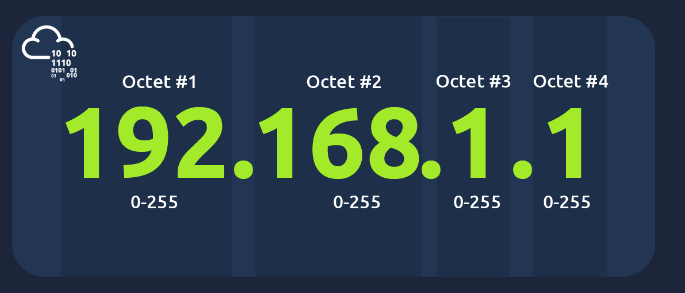

- Networks are simply things that are connected
- can be formed by anywhere between 2 devices to billions

What is the key term for devices that are connected together?
- Network

- internet is one giant network that consits of many small networks within itself
- first iteration of internet was within the ARPANET project in late 1960s
- 1989 internet was invented by Tim Berners-Lee

- small networks within the internet are called private networks
- networks connecting these small networks are called public networks or the internet

Who invented the World Wide Web?
- Tim Berners-Lee

- devices have two ways of being identified
- an IP address
- Media Access Control (MAC) address

IP addresses
- IP Internet Protocol
- identifying a host on a network for a period of time
- IP address can then be associated with another device without the IP address changing

192.168.1.1
octet #1 - 192 (0-255)
octet #2 - 168 (0-255)
octet #3 - 1 (0-255)
octet #4 - 1 (0-255)

- a set of numbers that are divded into four octets
- the value of each octet will summarise to be the IP address of the device on the network
- the num is calculated through a technique called IP addressing & subnetting

- follow a set of standards known as protocols
- protocols are the backbone of networking and force devices to communicate in the same language
- private/public networks depends on where the device is will have a public or private IP address

- two devices can use their private IP addr to communicate with each other
- any data sent to the internet from one of those devices will be identified with the same public ip address
- public ip addr are given by your ISP (Internet Service Provider)

- IPv4 uses numbering system of 2^32 (4.29 bil ip addresses) - shortage
- IPv6 is new iteration of the IP addressing scheme
- IPv6 supports up to 2^128 (340 trillion+)
- IPv6 more efficient due to new methodologies

IPv6 - 2a00:22c4:a531:c500:425f:cce6:c36b:f64d
IPv4 - 86.157.52.21

MAC addresses
- devices on a network will all have a physical network interface
- which is a microchip found on the device's motherboard
- this network interface is assigned a unique addr at the factory it was buit at called a MAC (Media Access Control) address
- 12 character hexadecimal number
- the : are seperators
- first 6 chars represent the company that made the network interface and last 6 is a a unique number

a4:c3:f0:85:ac:2d

a4:c3:f0 -> vendor who built the network interface
85:ac:2d -> unique addr of the network interface

- MAC addresses can be faked or spoofed
- spoofing can often break poorly implemented security designs

What does the term "IP" stand for?
- Internet Protocol

What is each section of an IP address called?
- octet

How many sections (in digits) does an IPv4 address have? 
- 4

What does the term "MAC" stand for?
- Media Access Control

Deploy the interactive lab using the "View Site" button and spoof your MAC address to access the site.  What is the flag?
- THM{YOU_GOT_ON_TRYHACKME}

Ping (ICMP)

- one of the most fundamental network tools available to us
- ping uses ICMP (Internet Control Message Protocol) packets 
- those packets determine the performance of a connection between devices e.g. if the connection exists or is reliable
- the time taken for ICMP packets travelling between devices is measured by ping
- measuring is done using ICMP's echo packet and then the ICMP's echo reply from the target device

- pings can be perfomed against devices on a network

SYNTAX -> ping IP Address | website URL
       -> ping 192.168.1.254

What protocol does ping use?
- ICMP

What is the syntax to ping 10.10.10.10?
- ping 10.10.10.10

What flag do you get when you ping 8.8.8.8?
- THM{I_PINGED_THE_SERVER}